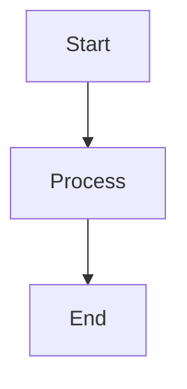

# [Module Name]: [Lesson Title]

## 1. Learning Objectives
By the end of this lesson, you will be able to:
*   Objective 1
*   Objective 2
*   Explain *why* [Concept X] is used in [Industry Context].

---

## 2. The "Why": Industry Context
*Briefly explain where this concept fits in the real world. Why should a Data Scientist care?*

> **Analogy:** [Insert a non-technical analogy here, e.g., "Think of an Index like the back of a textbook..."]

---

## 3. Core Concept A
### Definition
Explanation of the concept.

### Visual Architecture
*(Use Mermaid or reference an image in `assets/`)*

### Key Takeaway
*   Point 1
*   Point 2

---

## 4. Core Concept B (Comparison/Trade-off)
Contrast this concept with another (e.g., OLTP vs. OLAP).

| Feature | Concept A | Concept B |
| :--- | :--- | :--- |
| **Storage** | Row-based | Column-based |
| **Use Case** | Transactional | Analytical |

---

## 5. FAQ / Industry Reality
*Addressing common misconceptions.*

### "Question goes here?"
**Answer:** The industry perspective.

---

## 6. Summary & Next Steps
Recap the main points.

*   **Next:** Go to the Practical Lab `w00_l00_lab_title.md` to implement this in code.
