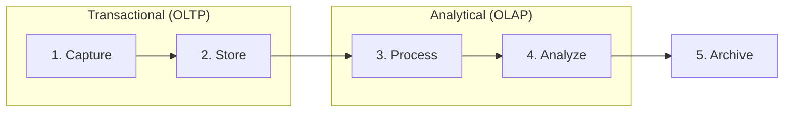

# Module 1: Foundations of Data Management

## 1. Learning Objectives
By the end of this lesson, you will be able to:
*   Map the 5 stages of the **Data Lifecycle** to specific tools in the Data Science stack.
*   Explain the "Why" behind this course: The shift from Database Administration to Data Architecture.
*   Define **ACID** properties and explain why they matter for data integrity, even for Data Scientists.
*   Visualize where OLTP (Transactional) and OLAP (Analytical) systems fit in the pipeline.

---

## 2. The "Why": Data Science Needs Architecture
In the past, Data Scientists were often handed a CSV file and told to "find insights." Today, you are expected to build the systems that *generate* those insights.

You are no longer just a **consumer** of data; you are an **architect** of data flows.

> **Analogy:** A Chef (Data Scientist) shouldn't just know how to cook (Model data); they need to know how the ingredients arrive, how they are stored to keep them fresh, and how to organize the kitchen for speed (Data Architecture).

This course moves you from "How do I write a query?" to "Which database should I use for this problem?"

---

## 3. The Data Lifecycle
Data is not static; it flows. We define this flow in five key stages.

### Visual Architecture

### The 5 Stages
1.  **Capture:** Data is born. User clicks, IoT sensors, API calls.
    *   *Tools:* Web APIs, Logs.
    *   *Goal:* Speed. Don't lose the data.
2.  **Store (Persist):** Writing data to a durable medium.
    *   *Tools:* **PostgreSQL** (Structured), **MongoDB** (Flexible).
    *   *Key Concept:* **ACID** ensures we don't write "half a record."
3.  **Process (Clean/Transform):** Turning raw data into usable signal. "ETL" (Extract, Transform, Load).
    *   *Tools:* Python, dbt, SQL Stored Procedures.
    *   *Goal:* Quality. Remove nulls, standardize formats.
4.  **Analyze (Query):** Aggregating and finding patterns.
    *   *Tools:* **DuckDB** (Local), Snowflake/BigQuery (Cloud).
    *   *Key Concept:* Columnar storage makes reading 10M rows fast.
5.  **Archive:** Long-term cold storage.
    *   *Tools:* Parquet files on S3/Blob Storage.
    *   *Goal:* Cost efficiency.

---

## 4. The "ACID" Test
Why do we still use "old" SQL databases like PostgreSQL? Because they guarantee **Integrity**.

Imagine transferring money between bank accounts. The system crashes halfway through. Money left Account A but never arrived in Account B. **ACID prevents this.**

*   **A - Atomicity:** All or nothing. The transaction happens completely or not at all.
*   **C - Consistency:** Data must follow the rules (constraints). No text in integer columns.
*   **I - Isolation:** Two people editing the same record don't see each other's half-finished work.
*   **D - Durability:** Once the system says "Saved," it is saved. Even if the power plug is pulled 1ms later.

> **Data Science Relevance:** If your training data comes from a non-ACID system, you might be training your model on corrupted, "half-written" records. Garbage In, Garbage Out.

---

## 5. Course Roadmap Alignment

| Lifecycle Stage | Course Module | Technology |
| :--- | :--- | :--- |
| **Store (Reliable)** | Module 1: Relational Foundations | **PostgreSQL** |
| **Analyze (Fast)** | Module 2: Analytical SQL | **DuckDB** |
| **Store (Flexible)** | Module 3: NoSQL | **MongoDB / Redis** |
| **Connect** | Module 4: Data Access | **Python DAL / ORM** |
| **Enrich (AI)** | Module 5: Modern Architectures | **ChromaDB (Vector)** |

---

## 6. FAQ / Industry Reality

### "Which is better: Pandas or SQL?"
In modern Data Science, the answer is rarely "one or the other." The industry standard is **"SQL for the Heavy Lifting, Pandas for the Fine Tuning."**

#### 1. When SQL is Favored (Server-Side)
SQL is the language of the **Database Engine**. Use it when data is too large for RAM or requires heavy filtering.
*   **Initial Retrieval:** Never `SELECT *` a 100GB table into Pandas. Use SQL to filter `WHERE date > '2024'`.
*   **Aggregations:** Engines like DuckDB/Postgres are 10x-100x faster at `GROUP BY` and `SUM` than Pandas because they don't have Python object overhead.

#### 2. When Pandas is Favored (Client-Side)
Pandas is the language of **Memory**. Use it once you have a manageable dataset (e.g., < 1GB).
*   **Complex Logic:** "If row A > 5 and row B < 3..." is painful in SQL but one line in Pandas.
*   **Plotting/ML:** You can't train a Scikit-Learn model inside a SQL query.

#### The Blur: Polars & Ibis
New tools like **Polars** (Python syntax, Rust speed) and **Ibis** (Python syntax that compiles to SQL) are bridging this gap, but knowing both SQL and Pandas remains essential.

---

## 7. Summary & Next Steps
*   Data flows through a lifecycle: Capture -> Store -> Process -> Analyze -> Archive.
*   We use different tools for different stages (Postgres for Store, DuckDB for Analyze).
*   **ACID** is the bedrock of trust in data systems.

*   **Next:** Go to `w01_l01_lab_colab_setup.md` to run your first "Micro-Lifecycle" simulation.
