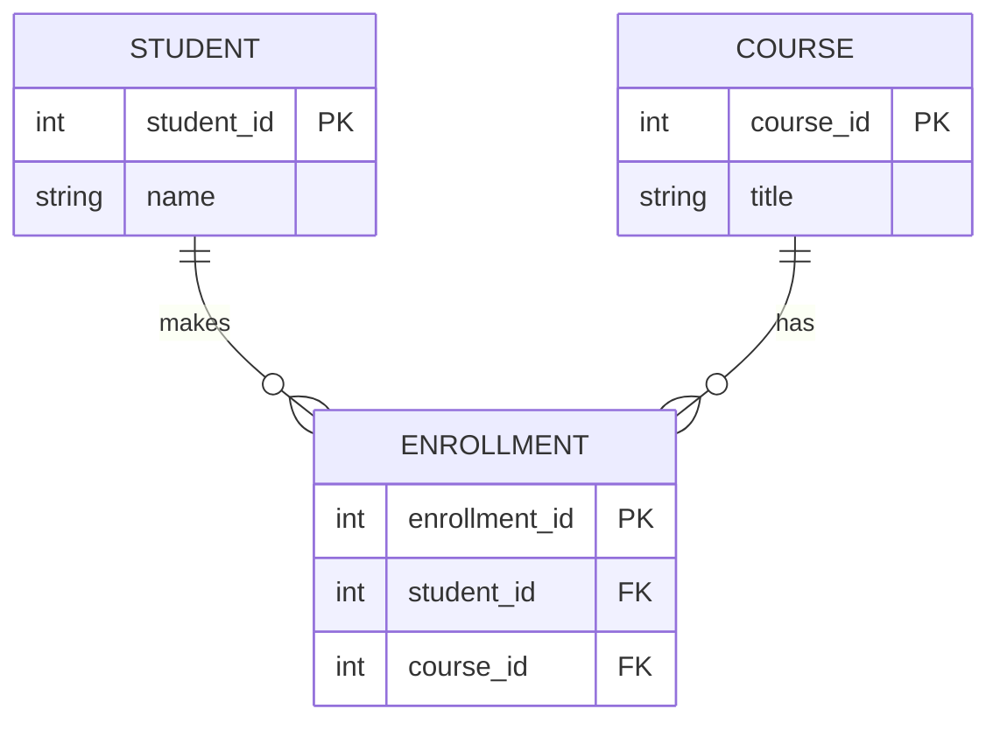

# Module 1: The Relational Model

## 1. Learning Objectives
By the end of this lesson, you will be able to:
*   Define the core components of the Relational Model: Relations, Tuples, and Attributes.
*   Distinguish between **Superkeys**, **Candidate Keys**, and **Primary Keys**.
*   Explain **Referential Integrity** and why "Cascading Deletes" can be dangerous.
*   Identify valid vs. invalid relationships between tables.

---

## 2. The "Why": Structure in Chaos
Data Science often deals with "messy" data (JSON, Text). But the *core* business logic (Users, Orders, Payments) almost always lives in a **Relational Database**.

Why? Because the Relational Model (Math) guarantees correctness.

> **Analogy:** Think of the Relational Model as a strict **Filing System**. You can't just throw a paper in the cabinet; it must have a Folder ID (Primary Key) and a reference to which Department it belongs to (Foreign Key). If the Department doesn't exist, the system rejects the file.

---

## 3. Anatomy of a Relation
In formal theory, we use specific terms. In practice, we use SQL terms. You need to know both.

| Formal Term | SQL Term | Description |
| :--- | :--- | :--- |
| **Relation** | Table | A set of tuples (rows). |
| **Tuple** | Row | A single record representing an entity. |
| **Attribute** | Column | A property of the entity (e.g., `age`, `name`). |
| **Domain** | Data Type | The set of allowed values (e.g., `Integer`, `Date`). |

### Rules of a Relation
1.  **Uniqueness:** No two rows can be identical.
2.  **Atomicity:** Each cell contains a single value (no lists inside a cell—*mostly*).
3.  **Order Irrelevance:** The order of rows and columns does not matter to the logic.

---

## 4. The Hierarchy of Keys
How do we uniquely identify a row?

### 1. Superkey
Any set of columns that *can* uniquely identify a row.
*   *Example:* `(Student_ID, Name, Email)` is a superkey. It's unique, but it's bloated.

### 2. Candidate Key
A "minimal" Superkey. If you remove any column, it's no longer unique.
*   *Example A:* `Student_ID` (Unique)
*   *Example B:* `Email` (Unique)
*   *Both are candidates to be the "Boss" key.*

### 3. Primary Key (PK)
The **chosen** Candidate Key.
*   The database engine physically organizes data around this key.
*   **Rule:** Cannot be `NULL`.

### 4. Foreign Key (FK)
A column that points to the **Primary Key** of *another* table. This creates the "Relation" in Relational Database.

---

## 5. Integrity Constraints
These are the "guard rails" that keep data clean.

### Entity Integrity
*   *Rule:* Every table must have a Primary Key, and it cannot be Null.
*   *Why:* If you can't identify a row, you can't update or delete it safely.

### Referential Integrity
*   *Rule:* A Foreign Key must strictly match an existing Primary Key in the parent table (or be Null).
*   *Why:* You can't have an Order for a User that doesn't exist. This leads to "Orphaned Records."

#### Visualizing Relationships

---

## 6. Summary & Next Steps
*   **Keys** are the DNA of the relational model.
*   **PKs** identify "Who I am."
*   **FKs** identify "Who I belong to."
*   **Integrity** ensures the links between tables never break.

*   **Next:** Go to the lab `w01_l02_lab_keys_integrity.md` to break some rules and see errors in action.
