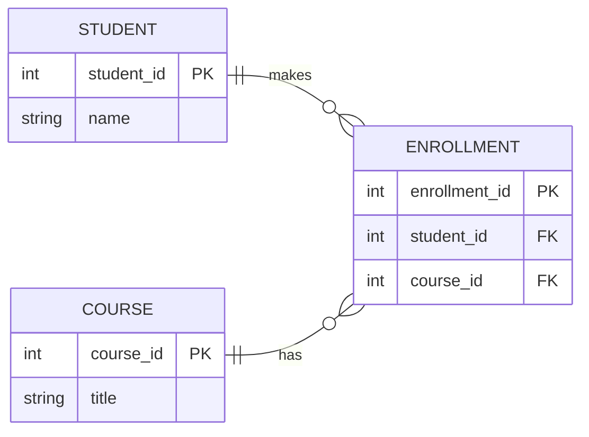
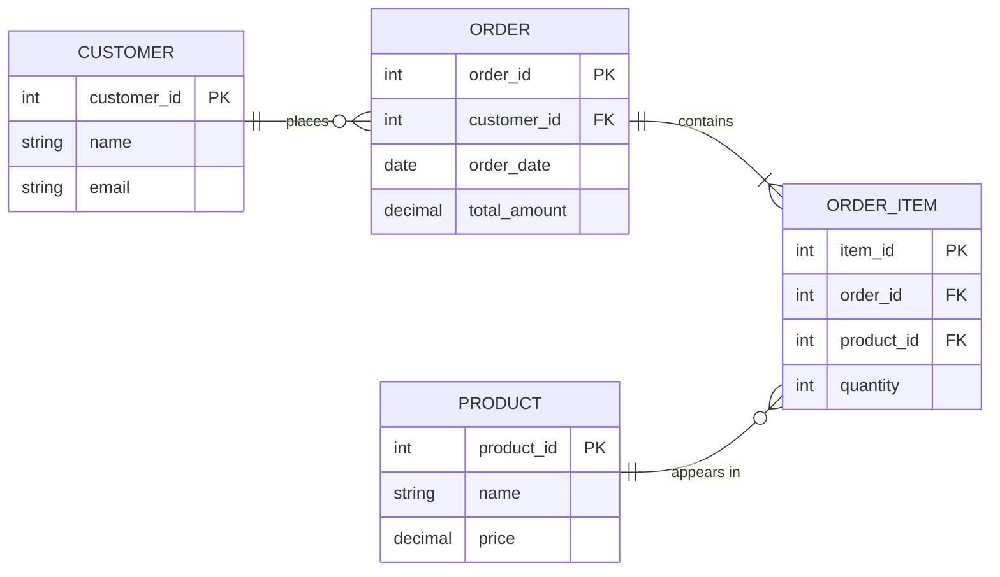
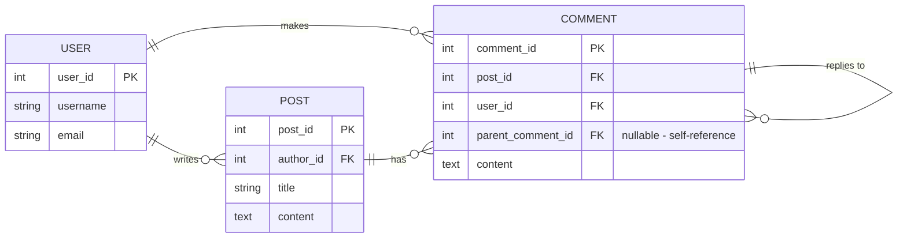

# Module 1: The Relational Model

## 1. Learning Objectives
By the end of this lesson, you will be able to:
*   Define the core components of the Relational Model: Relations, Tuples, and Attributes.
*   Distinguish between **Superkeys**, **Candidate Keys**, and **Primary Keys**.
*   Explain **Referential Integrity** and why "Cascading Deletes" can be dangerous.
*   Identify valid vs. invalid relationships between tables.

---

## 2. The "Why": Structure in Chaos
Data Science often deals with "messy" data (JSON, Text). But the *core* business logic (Users, Orders, Payments) almost always lives in a **Relational Database**.

Why? Because the Relational Model (Math) guarantees correctness.

> **Analogy:** Think of the Relational Model as a strict **Filing System**. You can't just throw a paper in the cabinet; it must have a Folder ID (Primary Key) and a reference to which Department it belongs to (Foreign Key). If the Department doesn't exist, the system rejects the file.

---

## 3. Anatomy of a Relation
In formal theory, we use specific terms. In practice, we use SQL terms. You need to know both.

| Formal Term | SQL Term | Description |
| :--- | :--- | :--- |
| **Relation** | Table | A set of tuples (rows). |
| **Tuple** | Row | A single record representing an entity. |
| **Attribute** | Column | A property of the entity (e.g., `age`, `name`). |
| **Domain** | Data Type | The set of allowed values (e.g., `Integer`, `Date`). |

### Rules of a Relation
1.  **Uniqueness:** No two rows can be identical.
2.  **Atomicity:** Each cell contains a single value (no lists inside a cell—*mostly*).
3.  **Order Irrelevance:** The order of rows and columns does not matter to the logic.

---

## 4. The Hierarchy of Keys
How do we uniquely identify a row?

### 1. Superkey
Any set of columns that *can* uniquely identify a row.
*   *Example:* `(Student_ID, Name, Email)` is a superkey. It's unique, but it's bloated.

### 2. Candidate Key
A "minimal" Superkey. If you remove any column, it's no longer unique.
*   *Example A:* `Student_ID` (Unique)
*   *Example B:* `Email` (Unique)
*   *Both are candidates to be the "Boss" key.*

### 3. Primary Key (PK)
The **chosen** Candidate Key.
*   The database engine physically organizes data around this key.
*   **Rule:** Cannot be `NULL`.

### 4. Foreign Key (FK)
A column that points to the **Primary Key** of *another* table. This creates the "Relation" in Relational Database.

---

## 5. Integrity Constraints
These are the "guard rails" that keep data clean.

### Entity Integrity
*   *Rule:* Every table must have a Primary Key, and it cannot be Null.
*   *Why:* If you can't identify a row, you can't update or delete it safely.

### Referential Integrity
*   *Rule:* A Foreign Key must strictly match an existing Primary Key in the parent table (or be Null).
*   *Why:* You can't have an Order for a User that doesn't exist. This leads to "Orphaned Records."

#### Visualizing Relationships

**Figure 1: Student-Course Enrollment Schema**
This entity-relationship diagram shows three tables: STUDENT (with attributes student_id as Primary Key and name), ENROLLMENT (with enrollment_id as Primary Key, plus student_id and course_id as Foreign Keys), and COURSE (with course_id as Primary Key and title). The relationships show that one student can make many enrollments (one-to-many), and one course can have many enrollments (one-to-many). The ENROLLMENT table acts as a junction table linking students to courses.



**Figure 2: E-Commerce Order System**
This diagram illustrates a typical e-commerce data model with cascading relationships. A CUSTOMER places multiple ORDERs (one-to-many). Each ORDER contains multiple ORDER_ITEMs (one-to-many), and each ORDER_ITEM references a PRODUCT. The ORDER_ITEM table acts as a junction table between ORDER and PRODUCT, allowing the same product to appear in multiple orders with different quantities.



**Figure 3: Blog Platform with Self-Referencing Comments**
This diagram demonstrates a content platform where USERs write POSTs and make COMMENTs. The COMMENT table includes a self-referencing foreign key (`parent_comment_id`) that allows comments to reply to other comments, creating a hierarchical thread structure. This is a common pattern for nested discussions.



---

## 6. FAQ / Industry Reality

### "Why can't I just use Excel for this?"
Excel is excellent for small, single-user datasets (< 10,000 rows). But it breaks down for Data Science work:

#### When Excel Fails
1.  **Scale:** Excel chokes on 1M+ rows. Databases handle billions.
2.  **Concurrency:** Two people editing the same Excel file = "Conflict.xlsx" chaos. Databases handle 1000s of simultaneous users with transaction isolation.
3.  **Integrity:** Nothing stops you from typing "abc" into a number column in Excel. Databases enforce `CHECK` constraints and data types.
4.  **Relationships:** Excel VLOOKUP breaks if you insert a row. Database Foreign Keys maintain referential integrity automatically.

#### The Real Pattern
- **Excel:** Quick prototypes, financial models, reports for managers (they want to "edit in Excel")
- **Databases:** Transactional systems (e-commerce orders), multi-user apps, production data pipelines

> **Pro Tip:** In Data Science, you often **export** database query results **to** Excel for the final report. But the source of truth lives in the database.

---

### "When do I need Foreign Keys vs. just merging in Pandas?"

This is the difference between **enforcing relationships** and **assuming relationships**.

#### Foreign Keys (Database-Side)
**Use when:**
- You need to **prevent** orphaned records (e.g., orders for deleted users)
- Multiple applications access the same data (web app + analytics pipeline)
- Data integrity is critical (financial, medical, legal data)

**Example:**
```sql
-- This INSERT will FAIL if user_id=999 doesn't exist
INSERT INTO orders (order_id, user_id, amount)
VALUES (101, 999, 50.00);  -- Database blocks this
```

#### Pandas Merge (Client-Side)
**Use when:**
- You're doing exploratory analysis on already-extracted data
- The relationship is "soft" (e.g., joining sales data with weather data—missing matches are OK)
- You want **flexibility** to handle mismatches (left join, filling nulls)

**Example:**
```python
# Pandas merge won't complain if user_id doesn't exist
orders.merge(users, on='user_id', how='left')  # Missing users become NaN
```

#### The Industry Pattern
1.  **Database Foreign Keys:** Enforce integrity at the **write** stage (when data enters the system)
2.  **Pandas Merges:** Handle flexibility at the **read** stage (when analyzing data)

**Analogy:** Foreign Keys are like a locked door (prevents bad data from entering). Pandas merges are like a filter (lets you choose what to look at).

---

## 7. Summary & Next Steps
*   **Keys** are the DNA of the relational model.
*   **PKs** identify "Who I am."
*   **FKs** identify "Who I belong to."
*   **Integrity** ensures the links between tables never break.
*   **Databases enforce constraints at write time; Pandas gives flexibility at read time.**
