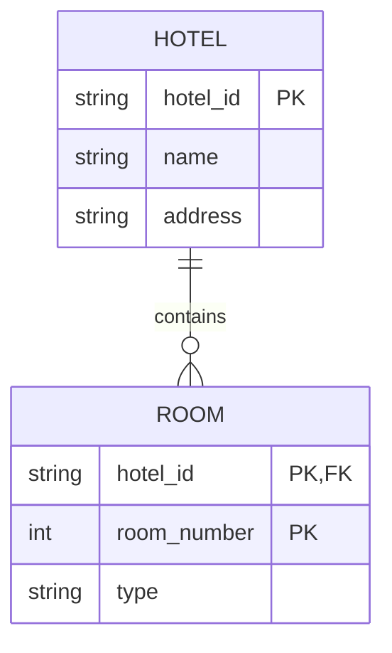
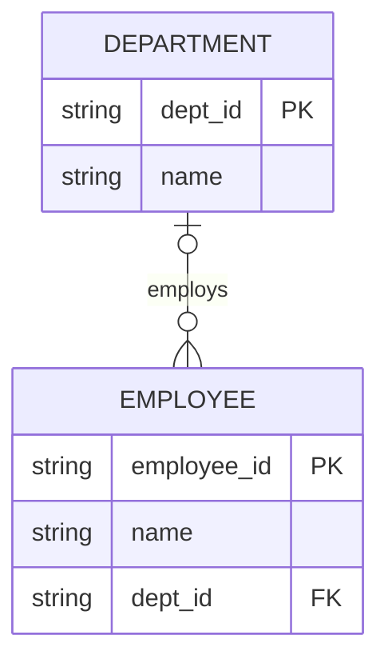
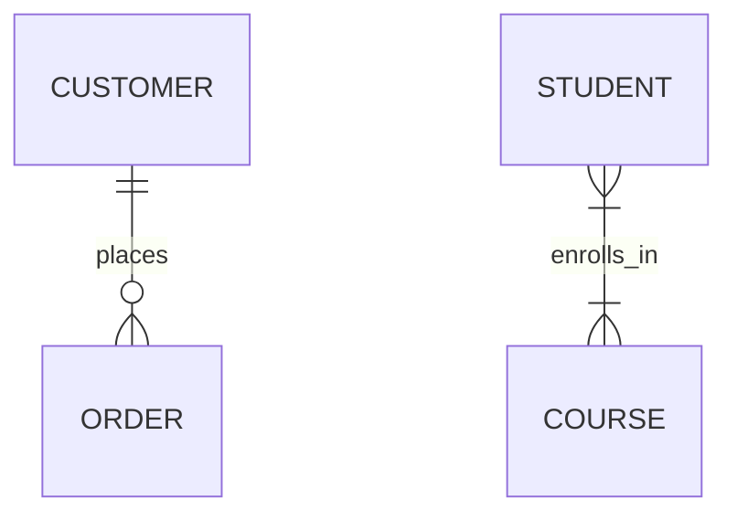

# Module 1: Entity-Relationship (ER) Modeling

## 1. Learning Objectives
By the end of this lesson, you will be able to:
*   Identify **Entities**, **Attributes**, and **Relationships** in a business requirement.
*   Distinguish between **Strong** and **Weak** entities.
*   Define **Cardinality** (1:1, 1:N, M:N) and understand its impact on data integrity.
*   Explain *why* we model data conceptually before writing code.

---

## 2. The "Why": Industry Context
*Why do we draw boxes and lines before writing SQL?*

In Data Science and Engineering, jumping straight to `CREATE TABLE` often leads to rigid, messy databases that break as soon as requirements change. ER Modeling is the "Architectural Blueprint" phase. Just as you wouldn't build a skyscraper without a blueprint, you shouldn't build a data warehouse without a model. It bridges the gap between **Business Logic** (what the stakeholders want) and **Database Schema** (how we store it).

> **Analogy:** Think of an **ER Diagram** like the **Architectural Blueprints** of a house. It shows where the rooms (Entities) are and how they connect (Relationships), but it doesn't specify which brand of bricks (Database Engine) to use.

### The Database Design Hierarchy

| Level | Model | Focus |
|-------|-------|-------|
| **Conceptual** | ER Model | Business concepts, entities, relationships |
| **Logical** | Relational Model | Tables, columns, keys, constraints |
| **Physical** | Implementation | Indexes, storage, partitioning |

---

## 3. Core Concept A: Entities & Attributes
### Definition
*   **Entity:** A distinct object or concept in the real world (e.g., `Student`, `Course`, `Transaction`). In a diagram, this is usually a rectangle.
*   **Attribute:** A property or characteristic of an entity (e.g., `Student Name`, `Course Price`).
    *   **Composite Attribute:** Can be subdivided (e.g., `Address` -> `Street`, `City`, `Zip`).
    *   **Multivalued Attribute:** Can have multiple values (e.g., `PhoneNumbers`, `Skills`).
    *   **Derived Attribute:** Can be calculated from other data (e.g., `Age` from `DateOfBirth`).

### Strong vs. Weak Entities
*   **Strong Entity:** Can exist independently. It has its own Primary Key. (e.g., `Employee`).
*   **Weak Entity:** Depends on a Strong Entity for existence. It cannot be uniquely identified without the owner.

> **Example:** Consider a **Hotel** and its **Rooms**.
> *   `Hotel` is a **Strong Entity** (It has a unique Name/ID).
> *   `Room` is a **Weak Entity**. "Room 101" is not unique in the world. It is only unique *within* a specific Hotel. If you tear down the Hotel, the Room ceases to exist conceptually.

### Visual Architecture


> **Example:** Now consider a **Department** and its **Employees**.
> *   `Department` is a **Strong Entity** (It has a unique ID).
> *   `Employee` is also a **Strong Entity**. An employee has their own unique ID and can exist independently (be transferred, exist before assignment).



**Key distinction:**

| Relationship Type | FK in Child Entity |
|-------------------|-------------------|
| Strong ↔ Strong | FK is a regular attribute |
| Strong ↔ Weak | FK is part of the composite PK |

### Key Takeaway
*   **Nouns** in your requirements usually become **Entities**.
*   **Adjectives** usually become **Attributes**.
*   Weak entities represent "parts" of a whole that don't make sense on their own.

> **Note on Diagrams:** The Mermaid diagrams in this lesson use **Crow's Foot notation**, which is practical for tool support but cannot represent composite or multivalued attributes visually. In true **Chen notation**, these would appear as branching ovals (composite) or double-lined ovals (multivalued). When these attributes are translated to the **relational model**, composite attributes become multiple columns, and multivalued attributes become separate tables. See [ERD Different Notations (OpenDSA)](https://opendsa.cs.vt.edu/ODSA/Books/Database/html/ERDNotations.html) for visual examples of Chen notation.

---

## 4. Core Concept B: Relationships & Cardinality
### Definition
Relationships describe how entities interact. **Cardinality** defines the numerical constraint of that relationship.

| Cardinality | Notation | Meaning | Example |
| :--- | :--- | :--- | :--- |
| **One-to-One** | `1:1` | One instance links to exactly one instance. | `User` <-> `Profile` |
| **One-to-Many** | `1:N` | One instance links to many instances. | `Customer` <-> `Orders` |
| **Many-to-Many** | `M:N` | Many instances link to many instances. | `Student` <-> `Courses` |

### The "Litmus Test" for Cardinality
Confused? Ask these two questions:
1.  **Left-to-Right:** Can a single [Entity A] have many [Entity B]s?
2.  **Right-to-Left:** Can a single [Entity B] have many [Entity A]s?

*   If (Yes, No) -> **1:N**
*   If (No, Yes) -> **N:1** (same as 1:N)
*   If (Yes, Yes) -> **M:N**
*   If (No, No) -> **1:1**

### Visual Architecture
The "Crow's Foot" notation is the industry standard for showing cardinality.



### Key Takeaway
*   **1:N** is the most common relationship.
*   **M:N** relationships exist conceptually but **cannot** be directly implemented in a Relational Database (we'll fix this in the next lesson).
*   Correct cardinality prevents "orphaned" data and ensures logical consistency.

---

## 5. Deep Dive: ER Notation Styles (Optional)

<details>
<summary>Click to expand: Chen Notation vs. Crow's Foot Notation</summary>

### Historical Context
ER Modeling was introduced by Peter Chen in 1976. His original notation (now called **Chen Notation**) uses:
- **Rectangles** for Entities
- **Diamonds** for Relationships
- **Ovals** for Attributes
- **Lines** connecting them with cardinality labels (1, N, M)

### Chen Notation Example
```
┌──────────┐         ┌─────────────┐         ┌──────────┐
│ STUDENT  │────────◇│  enrolls_in │◇────────│  COURSE  │
└──────────┘    M    └─────────────┘    N    └──────────┘
```

### Crow's Foot Notation
The **Crow's Foot** (or **IE Notation**) is now the industry standard. It's more compact and visually intuitive:
- Entities are rectangles (with attributes inside)
- Relationships are lines with symbols at the ends
- The "crow's foot" (three-pronged fork) indicates "many"

| Meaning | Visual Symbol | Mermaid Syntax |
| :--- | :---: | :---: |
| One (mandatory) | `\|` | `\|` |
| Zero (optional) | `○` | `o` |
| Many | $\pitchfork$ (crow's foot) | `{` or `}` |

### Why Crow's Foot Won
1. **Compactness:** Attributes inside the entity box saves space
2. **Readability:** The fork visually suggests "many" without needing labels
3. **Tool Support:** Most modern tools (ERDPlus, Lucidchart, Mermaid) default to Crow's Foot

### Extended ER (EER) Concepts
For complex domains, **Extended ER** adds:
- **Specialization/Generalization:** Inheritance hierarchies (e.g., `Person` → `Student`, `Professor`)
- **Categories (Union Types):** An entity that can be one of several types
- **Aggregation:** Treating a relationship as an entity

*These advanced concepts are covered in graduate-level database courses but are good to know exist.*

</details>

---

## 6. FAQ / Industry Reality

### "Do we really draw these for every project?"
**Answer:** In full-scale application development? **Yes.** In ad-hoc Data Science tasks? **Sometimes.** However, even if you don't draw it, you *must* think it. When you join two DataFrames in Pandas, you are implicitly relying on the relationships defined in an ER model. If you misunderstand the cardinality (e.g., assuming 1:1 when it's 1:N), your analysis (sums, counts) will be wrong due to row duplication.

### "What about NoSQL? Does this still apply?"
**Answer:** Absolutely. Even if you use MongoDB (Document Store), the *relationships* between your data points still exist. You might choose to *embed* data instead of linking it, but the conceptual relationship (1:N) dictates that decision.

### "Do I have to use Chen notation for ER diagrams?"
**Answer:** No, you can use either Chen or Crow's Foot notation. **Chen** is often preferred in academic settings because it can visually represent composite, multivalued, and derived attributes. **Crow's Foot** is more common in industry due to its compactness and better tool support (Mermaid, Lucidchart, most database tools). The trade-off: Crow's Foot cannot visually distinguish attribute types, so you'd document those separately. For this course, we use Crow's Foot via Mermaid for practicality — just remember that a multivalued attribute like `PhoneNumbers` implies "this becomes a separate table" even if the diagram doesn't show it.

---

## 7. Summary & Next Steps
*   **Entities** are the "Nouns", **Attributes** are the properties, **Relationships** are the "Verbs".
*   **Cardinality** dictates the rules of association.
*   **Next:** Go to the Practical Lab `w02_l03_lab_er_diagramming.md` to design the system for a University.

---

## 8. Further Reading
*Additional resources for deeper self-study.*

### Textbook
*   **Database Design - 2nd Edition** by Adrienne Watt
    *   [Chapter 8: The Entity Relationship Data Model](https://opentextbc.ca/dbdesign01/chapter/chapter-8-entity-relationship-model/)

### Documentation
*   [Mermaid.js ER Diagram Syntax](https://mermaid.js.org/syntax/entityRelationshipDiagram.html) — Official reference for creating ER diagrams in Mermaid.

### Articles & Tutorials
*   [Entity-Relationship Model (Wikipedia)](https://en.wikipedia.org/wiki/Entity%E2%80%93relationship_model) — Comprehensive overview including history and notation variants.
*   [Crow's Foot Notation (Vertabelo)](https://vertabelo.com/blog/crow-s-foot-notation/) — Visual guide to reading and writing Crow's Foot diagrams.