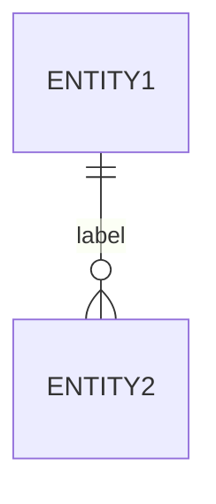
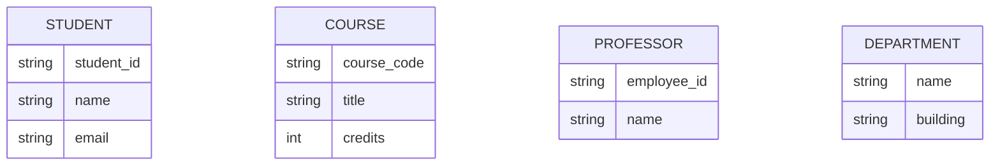
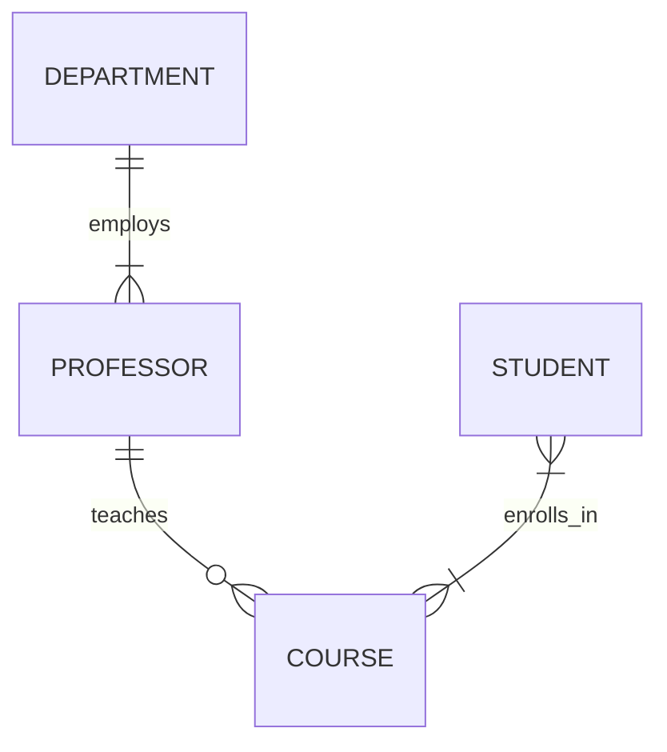

# Lab: ER Diagramming with Mermaid.js

## 1. Prerequisites & Setup
*   **Tool:** We will use **Mermaid.js**, a diagramming tool that renders text as diagrams.
*   **Environment:** You can write Mermaid code directly in Markdown cells in Jupyter/Colab or any Markdown editor.

### How to use Mermaid
In a Markdown file or cell, wrap your code like this:


---

## 2. Step 1: Identifying Entities
**Scenario:** We are designing a database for a **University Course Registration System**.

**Requirements:**
1.  The university has **Students**. We need to track their `Student ID`, `Name`, and `Email`.
2.  There are **Courses** offered. Each course has a `Course Code`, `Title`, and `Credits`.
3.  **Professors** teach these courses. We track their `Employee ID` and `Name`.
4.  **Departments** manage courses and professors. A department has a `Name` and `Building Location`.

### The "Naive" Approach (The Problem)
Why not just use Excel? Imagine trying to store this in one sheet:

| Student | Course | Professor | Dept | Dept_Building |
| :--- | :--- | :--- | :--- | :--- |
| Alice | Math 101 | Dr. Smith | Math | East Wing |
| Bob | Math 101 | Dr. Smith | Math | East Wing |
| Alice | Hist 200 | Dr. Jones | History | West Wing |

*   **Issue:** "Math" and "East Wing" are repeated. If Dr. Smith moves to the Physics department, we have to update multiple rows. This is **Redundancy**.

### The "Better" Approach (Entities)
Let's decouple these into distinct Entities.



---

## 3. Step 2: Defining Relationships
Now, let's connect the "Nouns" with "Verbs" based on the rules.

**Rules:**
1.  A **Department** can have many **Professors**, but a **Professor** belongs to only one **Department** (1:N).
2.  A **Professor** can teach many **Courses**, but a **Course** is taught by only one **Professor** (for simplicity) (1:N).
3.  A **Student** can enroll in many **Courses**, and a **Course** can have many **Students** (M:N).



### Combining it all
Now we have a high-level view of our system.

---

## 4. Your Turn! (Exercises)
Now it's your turn to refine this model.

### Exercise 1: Attributes & Keys
**Task:** Copy the entities above. Add the correct **PK** (Primary Key) label to the unique identifiers.
**Hint:** in Mermaid, write `type name PK`.

```mermaid
erDiagram
    %% TODO: Add PKs to Student, Course, Professor, Department
```

### Exercise 2: The "Phone Number" Problem
**Task:** A Student can have *multiple* phone numbers (Mobile, Home, Emergency).
**Question:** How do we model this?
1.  Add `phone1`, `phone2` to the Student entity? (Bad design - what if they have 3?)
2.  Create a new Entity `PHONE_NUMBER`?

**Action:** Create a `PHONE_NUMBER` entity.
*   It should have an `id` and a `number`.
*   Link it to `STUDENT` with the correct cardinality (One Student has Many Phones).

```mermaid
erDiagram
    %% TODO: Create PHONE_NUMBER entity
    %% TODO: Link STUDENT ||--o{ PHONE_NUMBER : has
```

### Exercise 3: The "Waitlist" Constraint
**Task:** We need to track *when* a student enrolled.
**Insight:** An M:N relationship (`enrolls_in`) cannot hold attributes itself in a simple line. We usually describe this attribute on the relationship.
**Action:** In the next lesson, we will turn this relationship into a table. For now, just note that the *relationship itself* needs an attribute: `enrollment_date`.

---

## 5. Summary
You have successfully:
1.  Parsed text requirements into **Entities**.
2.  Defined **Relationships** (1:N, M:N).
3.  modeled a complex attribute (Multivalued Phone Number) by creating a new Entity.

*Next:* In Lesson 4, we will convert this visual diagram into actual Tables.

```