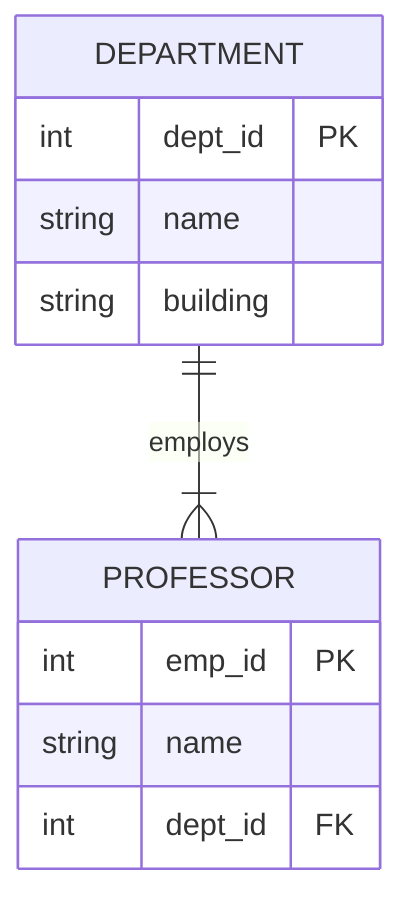
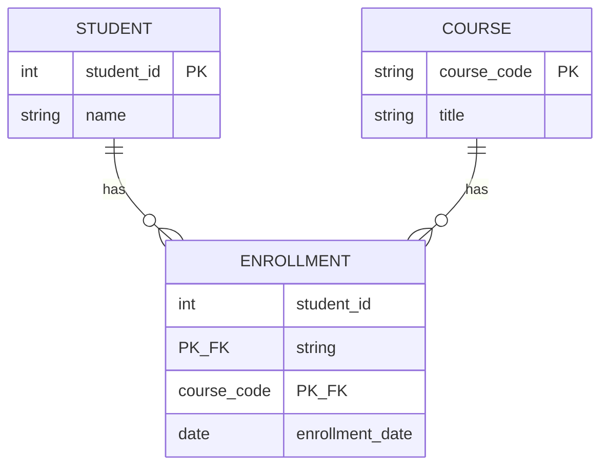
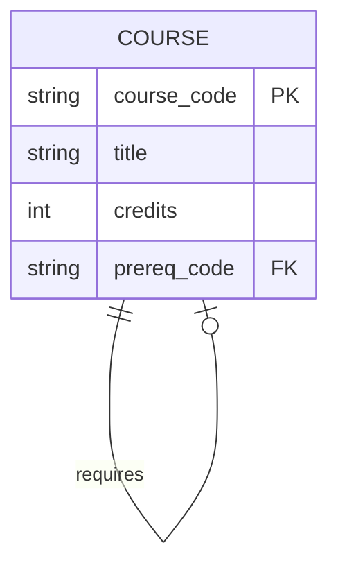

# Module 1: Logical Design (ER to Relational)

## 1. Learning Objectives
By the end of this lesson, you will be able to:
*   Apply the "mapping algorithm" to convert ER Diagrams into Relational Schemas (Tables).
*   Map **1:N Relationships** using **Foreign Keys**.
*   Map **M:N Relationships** using **Junction (Associative) Tables**.
*   Map **Weak Entities** effectively.
*   Adopt professional **Naming Conventions** for database objects.

---

## 2. The "Why": Industry Context
*How do we turn the drawing into a database?*

An ER Diagram is conceptual. PostgreSQL (or any relational DB) doesn't know what a "relationship line" is. It only knows **Tables**, **Columns**, and **Keys**. Logical Design is the translation layer. If this step is done poorly, you end up with circular dependencies, slow joins, or data anomalies.

> **Analogy:** ER Diagram = **Blueprint**. Logical Schema = **Assembly Instructions** (List of parts and how they bolt together).

---

## 3. Best Practice: Naming Conventions
Before we map, let's agree on how to name things.

| Concept | Convention | Example |
| :--- | :--- | :--- |
| **Table** | **Plural**, lowercase, snake_case | `students`, `order_items` |
| **Column** | Singular, lowercase, snake_case | `first_name`, `created_at` |
| **Primary Key** | `table_singular` + `_id` | `student_id` |
| **Foreign Key** | `target_table_singular` + `_id` | `dept_id` |

*Why?* Consistency makes writing SQL queries much easier later.

---

## 4. Core Concept A: Mapping Entities & 1:N Relationships
### The Rule
1.  **Strong Entity** -> Becomes a **Table**. Attributes become Columns.
2.  **1:N Relationship** -> The Primary Key (PK) of the "One" side becomes a **Foreign Key (FK)** in the "Many" side table.

### Visual Example
**ER Model:** `Department (1) ---- (N) Professor`

**Relational Schema:**

| Table | Columns |
| :--- | :--- |
| **departments** | `dept_id` (PK), `name`, `building` |
| **professors** | `emp_id` (PK), `name`, `dept_id` (FK) |

*Note:* The `dept_id` moved into the `professors` table because a Professor "belongs to" a Department. If we put `emp_id` in `departments`, a Department could only have one Professor!

### Key Takeaway
*   **"Foreign Keys go to the Many side."** Memorize this.

---

## 5. Core Concept B: Mapping M:N Relationships
### The Problem
Relational databases **cannot** store a list of IDs in a single cell (violates 1NF - Atomicity). You cannot have a column `course_ids` in the `Student` table containing `[101, 102, 103]`.

### The Solution: The Junction Table
We create a **new table** to represent the relationship. This table contains the PKs from *both* original entities.

**ER Model:** `Student (M) ---- (N) Course`

**Relational Schema:**

| Table | Columns |
| :--- | :--- |
| **students** | `student_id` (PK), `name` |
| **courses** | `course_code` (PK), `title` |
| **enrollments** | `student_id` (FK, PK), `course_code` (FK, PK), `enrollment_date` |

*   The `enrollments` table is the bridge.
*   The Primary Key of `enrollments` is usually a **Composite Key** (`student_id` + `course_code`).

---

## 6. Core Concept C: Mapping Weak Entities
A **Weak Entity** (like `Room` inside `Hotel`) cannot exist without its owner.

### The Rule
1.  Create a table for the Weak Entity.
2.  Include the Owner's Primary Key as a Foreign Key.
3.  The Weak Entity's Primary Key is often a **Composite Key**: `(owner_id, weak_entity_id)`.

**Example:**
*   Table `rooms`: `hotel_id` (FK, PK), `room_number` (PK), `type`.
*   Note: You need *both* `hotel_id` and `room_number` to uniquely identify a specific room in the database.

---

## 7. Core Concept D: Self-Referencing Relationships
Sometimes an entity relates to *itself*. This is common in hierarchical or recursive structures.

### The Pattern
A **Self-Referencing Relationship** uses a Foreign Key that points back to the same table's Primary Key.

**Example:** A Course can have a *Prerequisite* (which is also a Course).

**Relational Schema:**

| Table | Columns |
| :--- | :--- |
| **courses** | `course_code` (PK), `title`, `credits`, `prereq_code` (FK -> `courses.course_code`) |

*   "Advanced SQL" (`prereq_code` = 'SQL101') requires "Intro SQL" (`course_code` = 'SQL101').
*   Courses with no prerequisites have `prereq_code` = `NULL`.

### Key Takeaway
*   Self-referencing FKs enable hierarchical data (org charts, categories, prerequisites).
*   The FK column is usually **nullable** (root nodes have no parent).

---

## 8. Normalization Context
*How does proper mapping relate to normalization?*

When you follow the mapping rules correctly, you are already doing much of the work that **Normalization** (covered in Week 3) formalizes:

| Mapping Rule | Normalization Benefit |
| :--- | :--- |
| Each Entity → Separate Table | Eliminates redundancy (2NF) |
| M:N → Junction Table | Ensures atomic values (1NF) |
| FK in "Many" side | Removes transitive dependencies (3NF) |

> **Preview:** In Week 3, we will formalize these intuitions with **Functional Dependencies** and the **1NF → 2NF → 3NF** progression. Proper ER-to-Relational mapping gives you a head start.

---

## 9. FAQ / Industry Reality

### "Can't I just use an Array column in Postgres?"
**Answer:** Postgres *does* support Array types. For simple lists (like tags), this is fine. But for relationships where you need to *join* or *query* the related data efficiently (e.g., "Find all students in Math 101"), standard Junction Tables are significantly faster and enforce integrity constraints that arrays cannot easily do.

---

## 10. Summary & Next Steps
*   **Strong Entity** = New Table.
*   **1:N** = FK in the Child ("Many") table.
*   **M:N** = New "Junction" Table with two FKs.
*   **Weak Entity** = Composite PK including the Owner's ID.
*   **Self-Referencing** = FK pointing to the same table's PK.
*   **Normalization** = Proper mapping sets you up for 1NF-3NF compliance (Week 3).
*   **Next:** Go to the Practical Lab `w02_l04_lab_schema_conversion.md` to write these schemas out.