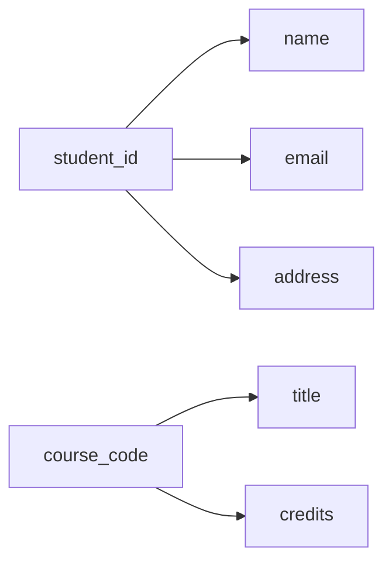
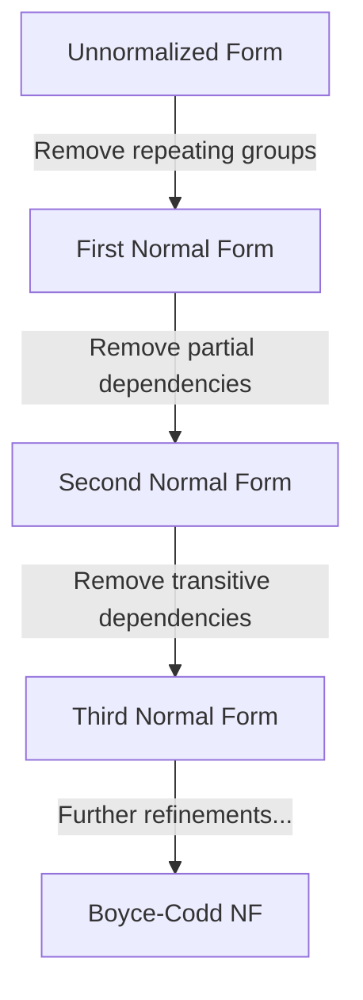
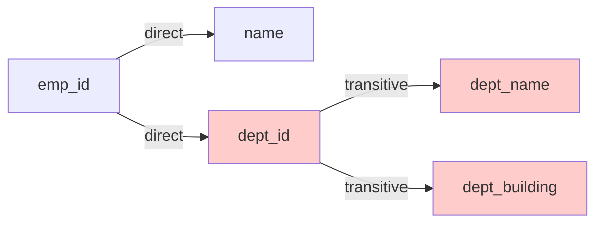

# Module 1: Normalization Theory (1NF - 3NF)

## 1. Learning Objectives
By the end of this lesson, you will be able to:
*   Identify **Update**, **Delete**, and **Insert Anomalies** in poorly designed tables.
*   Define **Functional Dependencies** and use them to analyze table structure.
*   Apply the rules for **1NF**, **2NF**, and **3NF** to decompose tables.
*   Explain *why* normalization matters for data integrity and maintenance.

---

## 2. The "Why": Industry Context
*Why does the structure of our tables matter so much?*

In Week 2, we designed ER diagrams and converted them to relational schemas using intuitive mapping rules. If you followed those rules correctly — especially placing foreign keys on the "many" side and creating junction tables for M:N relationships — you've already done much of the normalization work intuitively. But what if someone hands you an existing, messy database? Or what if your initial design has subtle flaws?

**Normalization** provides a formal, mathematical framework for evaluating and improving table structure. It gives us precise vocabulary (functional dependencies, normal forms) to diagnose problems and a systematic process to fix them.

Poorly normalized data leads to:
*   **Wasted storage** (redundant data repeated across rows)
*   **Inconsistent data** (one copy gets updated, others don't)
*   **Application bugs** (business logic breaks due to bad assumptions)

> **Analogy:** Think of normalization like **organizing a filing cabinet**. You *could* store a customer's address on every invoice in their folder. But when they move, you'd have to update every single invoice. Instead, you store the address once on a "Customer Info" card, and invoices just reference the customer ID.

---

## 3. Core Concept A: Data Anomalies
Before fixing problems, we must recognize them. There are three types of **Data Anomalies**:

### Update Anomaly
*The same fact is stored in multiple places, so updates must happen everywhere.*

**Example:** A `student_courses` table with student address:

| student_id | name  | address     | course_code |
| :---       | :---  | :---        | :---        |
| 101        | Alice | 123 Main St | MATH101     |
| 101        | Alice | 123 Main St | PHYS201     |
| 102        | Bob   | 456 Oak Ave | MATH101     |

If Alice moves to "789 Elm St", we must update **two rows**. Miss one? Now Alice has two addresses.

### Delete Anomaly
*Deleting data removes more information than intended.*

**Example:** If Bob drops MATH101, we delete the only row with Bob's information. Now we've lost Bob's address entirely!

### Insert Anomaly
*Cannot add data without adding unrelated data.*

**Example:** We want to add a new student "Charlie" who hasn't enrolled yet. But without a `course_code`, we can't insert a row (if it's required), or we'd need `NULL` values.

### Key Takeaway
*   Anomalies occur when **unrelated facts** are forced into the same table.
*   The solution: decompose into multiple, focused tables.

---

## 4. Core Concept B: Functional Dependencies
*The mathematical foundation of normalization.*

> **Why learn this first?** Functional dependencies are the *diagnostic tool* we use to detect 2NF and 3NF violations. Without understanding FDs, we can only normalize by intuition. With FDs, we can systematically analyze any table structure.

### Definition
A **Functional Dependency (FD)** exists when one attribute uniquely determines another.

**Notation:** `A → B` means "A determines B" (if you know A, you can find exactly one B).

**Example:** In a student table:
*   `student_id → name` ✓ (Each student_id has exactly one name)
*   `student_id → email` ✓ (Each student_id has exactly one email)
*   `name → student_id` ✗ (Two students could have the same name)

### Visualizing Dependencies

### Why This Matters
Functional dependencies tell us:
1.  What the **Primary Key** should be (the attribute that determines everything else)
2.  When attributes **don't belong** in the same table (they have different determinants)

---

## 5. Core Concept C: The Normal Forms (1NF → 2NF → 3NF)

Normalization is a **progressive process**. Each level builds on the previous.

### First Normal Form (1NF): Atomicity
**Rule:** Every cell must contain a single, atomic value. No repeating groups or arrays.

**Violation Example:**

| student_id | name  | phone_numbers          |
| :---       | :---  | :---                   |
| 101        | Alice | 555-1234, 555-5678     |
| 102        | Bob   | 555-9999               |

**Problem:** `phone_numbers` contains multiple values. How do you search for "555-1234"?

**Solution:** Create a separate row for each phone, or better, a separate table.

| student_id | name  | phone_number |
| :---       | :---  | :---         |
| 101        | Alice | 555-1234     |
| 101        | Alice | 555-5678     |
| 102        | Bob   | 555-9999     |

> **Note:** This "separate rows" solution achieves 1NF but introduces redundancy (`name` repeated). The proper fix is a separate `student_phones` table — exactly what we did in Week 2 when mapping multivalued attributes. Normalization formalizes what good ER-to-relational mapping achieves intuitively.

**1NF Checklist:**
- [ ] All columns have atomic (indivisible) values
- [ ] No repeating groups of columns (phone1, phone2, phone3)
- [ ] Each row is unique (has a primary key)

---

### Second Normal Form (2NF): No Partial Dependencies
**Prerequisite:** Table must be in 1NF.

**Rule:** Every non-key attribute must depend on the **entire** primary key, not just part of it.

*This only applies to tables with **composite primary keys**.*

**Violation Example:** `enrollments` table with `(student_id, course_code)` as PK:

| student_id | course_code | student_name | course_title | grade |
| :---       | :---        | :---         | :---         | :---  |
| 101        | MATH101     | Alice        | Calculus I   | A     |
| 101        | PHYS201     | Alice        | Physics I    | B     |
| 102        | MATH101     | Bob          | Calculus I   | B+    |

**Functional Dependencies:**
*   `(student_id, course_code) → grade` ✓ (Full dependency)
*   `student_id → student_name` ✗ (Partial! Only depends on part of the key)
*   `course_code → course_title` ✗ (Partial! Only depends on part of the key)

**Solution:** Decompose into three tables:

**students:**
| student_id | student_name |
| :---       | :---         |
| 101        | Alice        |
| 102        | Bob          |

**courses:**
| course_code | course_title |
| :---        | :---         |
| MATH101     | Calculus I   |
| PHYS201     | Physics I    |

**enrollments:**
| student_id | course_code | grade |
| :---       | :---        | :---  |
| 101        | MATH101     | A     |
| 101        | PHYS201     | B     |
| 102        | MATH101     | B+    |

**2NF Checklist:**
- [ ] Table is in 1NF
- [ ] If PK is composite, no non-key attribute depends on only part of the PK
- [ ] If PK is single-column, 2NF is automatically satisfied

---

### Third Normal Form (3NF): No Transitive Dependencies
**Prerequisite:** Table must be in 2NF.

**Rule:** Non-key attributes must depend **only** on the primary key, not on other non-key attributes.

**Violation Example:** `employees` table:

| emp_id | name  | dept_id | dept_name   | dept_building |
| :---   | :---  | :---    | :---        | :---          |
| 1      | Alice | D01     | Engineering | Building A    |
| 2      | Bob   | D01     | Engineering | Building A    |
| 3      | Carol | D02     | Marketing   | Building B    |

**Functional Dependencies:**
*   `emp_id → name, dept_id` ✓ (Direct dependency on PK)
*   `dept_id → dept_name, dept_building` (Non-key → Non-key!)
*   `emp_id → dept_name` only through `dept_id` (Transitive!)

**The Problem:** `dept_name` and `dept_building` depend on `dept_id`, not directly on `emp_id`. This is a **transitive dependency**.

*The red nodes show the transitive chain: `emp_id → dept_id → dept_name/dept_building`*

**Solution:** Decompose:

**employees:**
| emp_id | name  | dept_id |
| :---   | :---  | :---    |
| 1      | Alice | D01     |
| 2      | Bob   | D01     |
| 3      | Carol | D02     |

**departments:**
| dept_id | dept_name   | dept_building |
| :---    | :---        | :---          |
| D01     | Engineering | Building A    |
| D02     | Marketing   | Building B    |

**3NF Checklist:**
- [ ] Table is in 2NF
- [ ] No non-key attribute depends on another non-key attribute
- [ ] All non-key attributes depend directly on the primary key

---

## 6. The Normal Form Comparison

| Normal Form | Rule | Eliminates |
| :---        | :--- | :---       |
| **1NF**     | Atomic values only | Repeating groups, multi-valued cells |
| **2NF**     | No partial dependencies | Redundancy from composite keys |
| **3NF**     | No transitive dependencies | Redundancy from indirect dependencies |

---

## 7. Deep Dive: Beyond 3NF (Optional)

Click to expand: BCNF, 4NF, and Higher Normal Forms

### Boyce-Codd Normal Form (BCNF)
A stricter version of 3NF. In BCNF, every determinant must be a candidate key.

**3NF allows:** `A → B` where A is not a superkey, as long as B is part of a candidate key.
**BCNF requires:** If `A → B`, then A must be a superkey.

**When it matters:** Tables with multiple overlapping candidate keys.

### Fourth Normal Form (4NF)
Addresses **multi-valued dependencies** — when two independent lists are stored in the same table.

**Example:** A professor teaches multiple subjects AND speaks multiple languages:

| prof_id | subject | language |
| :---    | :---    | :---     |
| 1       | Math    | English  |
| 1       | Math    | Spanish  |
| 1       | Physics | English  |
| 1       | Physics | Spanish  |

The subjects and languages are independent, but we're forced into a Cartesian product. 4NF would split this into two tables.

### Fifth Normal Form (5NF)
Addresses **join dependencies** — very rare in practice.

### Practical Reality
> **Industry Standard:** Most production databases aim for **3NF** or **BCNF**. Higher normal forms are rarely needed and can over-complicate the design.

---

## 8. FAQ / Industry Reality

### "Do I need to normalize every table to 3NF?"
**Answer:** For transactional (OLTP) systems, **yes**. For analytical (OLAP) systems, **often no** — we intentionally denormalize for query performance. We'll cover this trade-off in the next lesson.

### "How do I identify functional dependencies in practice?"
**Answer:** By understanding the business rules. Ask: "Given this attribute, is the other attribute always uniquely determined?" For example, "Given an ISBN, is the book title always the same?" (Yes → `isbn → title`). "Given a book title, is the ISBN always the same?" (No — different editions exist.)

### "What about NoSQL databases?"
**Answer:** NoSQL databases (MongoDB, DynamoDB) often intentionally embed data that would be normalized in SQL. This is a conscious trade-off: they sacrifice update consistency for read performance. Understanding normalization helps you make that trade-off intelligently.

---

## 9. Summary & Next Steps
*   **Anomalies** (Update, Delete, Insert) indicate design problems.
*   **Functional Dependencies** reveal the structure of your data.
*   **Normal Forms** (1NF → 2NF → 3NF) progressively eliminate redundancy.
*   **3NF** is the standard target for transactional databases.
*   **Next:** Go to the Practical Lab `w03_l05_lab_normalization.md` to normalize a messy dataset step-by-step.

---

## 10. Further Reading
*Curated resources for deeper self-study.*

### Textbook
*   **Database Design - 2nd Edition** by Adrienne Watt
    *   [Chapter 11: Functional Dependencies](https://opentextbc.ca/dbdesign01/chapter/chapter-11-functional-dependencies/)
    *   [Chapter 12: Normalization](https://opentextbc.ca/dbdesign01/chapter/chapter-12-normalization/)

### Documentation
*   [PostgreSQL: Data Definition](https://www.postgresql.org/docs/current/ddl.html) — How constraints support normalization.
*   [DuckDB: Constraints](https://duckdb.org/docs/sql/constraints.html) — Constraint support in DuckDB.

### Articles & Tutorials
*   [Database Normalization Explained (Guru99)](https://www.guru99.com/database-normalization.html) — Visual walkthrough with examples.
*   [A Simple Guide to Five Normal Forms (William Kent)](http://www.bkent.net/Doc/simple5.htm) — Classic paper explaining normal forms in plain English.
