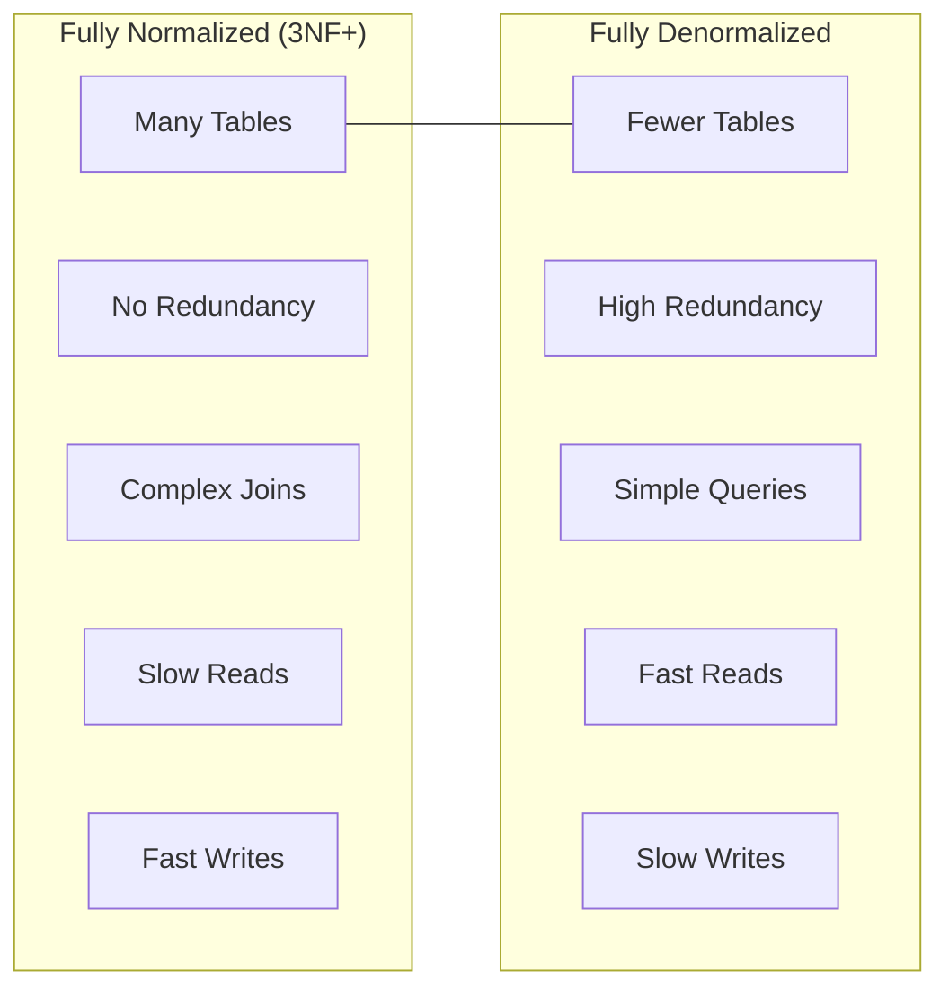
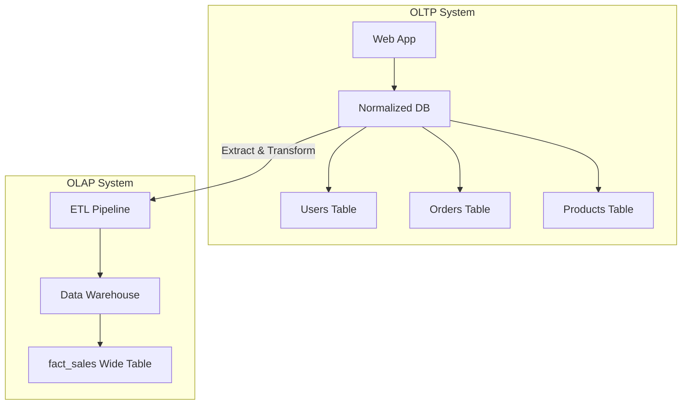
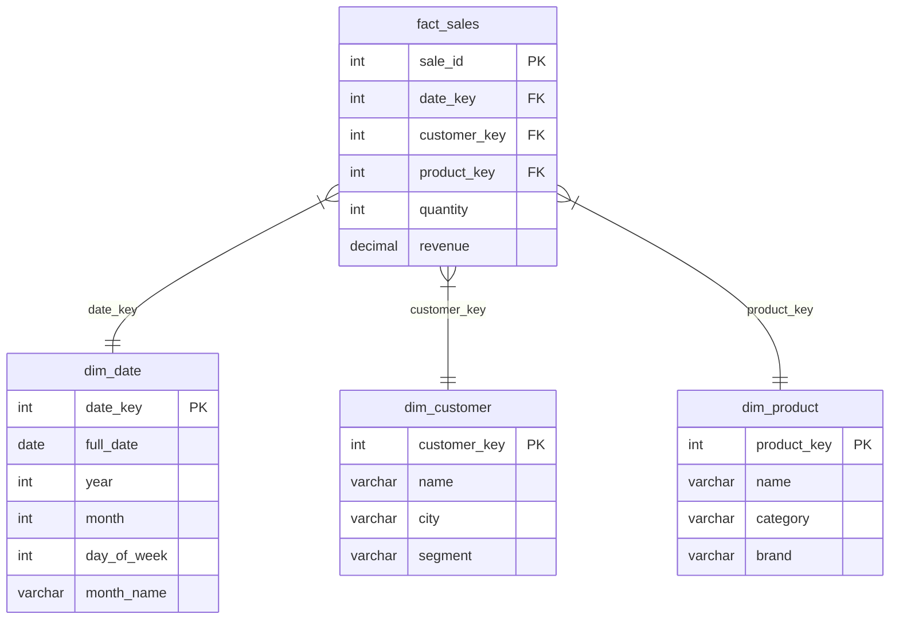

# Module 1: Practical Design & Denormalization

## 1. Learning Objectives
By the end of this lesson, you will be able to:
*   Explain when to **stop normalizing** and why.
*   Contrast **Write Performance** (favors normalization) vs. **Read Performance** (may favor denormalization).
*   Identify scenarios where **controlled denormalization** is the correct choice.
*   Apply trade-off analysis to Data Science workflow decisions.

---

## 2. The "Why": Industry Context
*Normalization is a tool, not a religion.*

In Lesson 5, we learned that normalization eliminates redundancy and prevents anomalies. This is critical for **transactional systems** (OLTP) where data integrity is paramount — think banking, e-commerce checkout, inventory management.

But what about **analytical systems** (OLAP)? Data Scientists and Analysts don't insert individual rows — they run complex queries over millions of records. For them, the overhead of joining 10 normalized tables for every query becomes a bottleneck.

> **Analogy:** Imagine a **library**. For cataloging and maintaining books, you want everything organized in separate sections (Fiction, Non-Fiction, Reference) with cross-reference cards. But for a reader who just wants "all mystery novels by Agatha Christie published in the 1930s," running across five different catalog drawers is painful. Sometimes, you create a **curated reading list** (denormalized view) optimized for that specific use case.

---

## 3. Core Concept A: The Normalization Spectrum

Database design exists on a spectrum:



| Aspect | Normalized | Denormalized |
| :--- | :--- | :--- |
| **Redundancy** | Minimal | High |
| **Update Complexity** | Low (change once) | High (change everywhere) |
| **Query Complexity** | High (many JOINs) | Low (wide tables) |
| **Read Performance** | Slower (many JOINs) | Faster (pre-joined) |
| **Write Performance** | Faster (less data) | Slower (more data) |
| **Data Integrity** | Strong (single source) | Risky (sync issues) |

### Key Insight
There is no "correct" level — it depends on your **workload**.

---

## 4. Core Concept B: OLTP vs. OLAP Revisited

This is where the OLTP/OLAP distinction from Module 2 becomes practical.

### OLTP (Online Transaction Processing)
*   **Workload:** Many small reads/writes per second (transactions)
*   **Examples:** E-commerce checkout, bank transfers, inventory updates
*   **Priority:** Data integrity, consistency, minimal redundancy
*   **Design:** **Highly Normalized** (3NF or higher)

### OLAP (Online Analytical Processing)
*   **Workload:** Few complex reads (aggregations, reports)
*   **Examples:** Sales dashboards, customer analytics, ML feature tables
*   **Priority:** Query speed, simplicity for analysts
*   **Design:** **Strategically Denormalized** (Star Schema, Wide Tables)



---

## 5. Core Concept C: Common Denormalization Strategies

### Strategy 1: Pre-Computed Aggregates
Store calculated values instead of computing them on every query.

**Normalized:** Calculate `total_orders` per customer by counting the `orders` table each time.

**Denormalized:** Add a `total_orders` column to the `customers` table. Update it when orders change.

| customer_id | name | total_orders |
| :--- | :--- | :--- |
| 501 | Alice | 47 |
| 502 | Bob | 23 |

**Trade-off:** Fast reads, but must maintain consistency on every order insert/delete.

---

### Strategy 2: Copying Columns (Snapshot)
Store a copy of frequently-joined data directly in the fact table.

**Normalized:** `orders` has `customer_id`, join to `customers` for `customer_name`.

**Denormalized:** `orders` includes `customer_name` directly.

| order_id | customer_id | customer_name | order_date |
| :--- | :--- | :--- | :--- |
| 1001 | 501 | Alice Smith | 2024-01-15 |

**Trade-off:** Eliminates join, but `customer_name` is now redundant. If Alice changes her name, old orders still show the old name (which might actually be the desired behavior for historical records!).

> **Connection to Lesson 5:** This pattern reintroduces the **Update Anomaly** we worked to eliminate! In analytical contexts, we accept this because: (1) updates are rare, (2) historical accuracy is often desired, and (3) data is typically loaded via batch ETL, not real-time updates.

**Industry Term:** This pattern is formalized as **Slowly Changing Dimensions (SCD)**:
*   **Type 1:** Overwrite old values (loses history)
*   **Type 2:** Keep history with version dates (common in data warehouses)

---

### Strategy 3: Star Schema (The Primary OLAP Pattern)
The industry-standard pattern for analytical databases. One **Fact Table** (events/transactions) surrounded by **Dimension Tables** (context). This is the "big" denormalization pattern — the one data warehouses are built on.



**Why Star Schema?**
*   **Fewer joins:** Fact table links directly to all dimensions (no chains).
*   **Aggregation-friendly:** Easy to GROUP BY any dimension.
*   **Tool compatibility:** BI tools (Tableau, Power BI) expect this pattern.

> **Star vs. Snowflake Schema:** In a **Snowflake Schema**, dimension tables are further normalized (e.g., `dim_product` joins to a separate `dim_category` table). Star is simpler and faster for queries; Snowflake saves storage and handles dimension hierarchies better. Most modern data warehouses prefer Star for simplicity.

---

### Strategy 4: Materialized Views
A database-managed denormalized table that is refreshed periodically.

```sql
-- PostgreSQL example
CREATE MATERIALIZED VIEW sales_summary AS
SELECT
    c.customer_name,
    p.category,
    SUM(oi.quantity * p.unit_price) AS total_revenue
FROM orders o
JOIN order_items oi ON o.order_id = oi.order_id
JOIN products p ON oi.product_id = p.product_id
JOIN customers c ON o.customer_id = c.customer_id
GROUP BY c.customer_name, p.category;

-- Refresh periodically (PostgreSQL requires manual refresh)
REFRESH MATERIALIZED VIEW sales_summary;

-- Typical pattern: refresh nightly via cron job or ETL pipeline
```

**Trade-off:** Query speed of denormalized table, with periodic consistency. Note that PostgreSQL materialized views require explicit `REFRESH` commands — they don't auto-update when source tables change. Schedule refreshes based on your staleness tolerance.

---

## 6. Core Concept D: When NOT to Denormalize

Denormalization is not always the answer. Avoid it when:

| Situation | Why |
| :--- | :--- |
| **High write frequency** | Updates become expensive (maintaining redundant data) |
| **Strict consistency required** | Sync failures cause data corruption |
| **Schema evolves frequently** | Denormalized structures are harder to change |
| **Storage is limited** | Redundancy increases storage costs |
| **Simple queries suffice** | If joins are fast enough, don't over-optimize |

### The Golden Rule
> **Normalize until it hurts. Denormalize until it works.**
>
> Start normalized. Profile your queries. Denormalize only the specific bottlenecks.

---

## 7. Deep Dive: The Data Science Workflow (Optional)

<details>
<summary>Click to expand: Pandas vs. SQL — The Normalization Perspective</summary>

### The Common Mistake
Many Data Science students learn Pandas first. Pandas DataFrames are inherently **flat** (one table). This creates a bias toward denormalized thinking.

**The Workflow:**
1.  Export multiple tables to CSVs.
2.  Load each into Pandas.
3.  Merge them all together.
4.  Work on one giant DataFrame.

**The Problem:**
*   Memory-inefficient (loading redundant data).
*   Slow (re-merging on every notebook run).
*   Error-prone (merge bugs are hard to debug).

### The Better Approach
Let the database do the heavy lifting:

1.  Keep data normalized in PostgreSQL/DuckDB.
2.  Write a SQL query with JOINs that returns exactly the columns you need.
3.  Load the result into Pandas.

```python
# Bad: Load everything, merge in Python
df_orders = pd.read_sql("SELECT * FROM orders", conn)
df_customers = pd.read_sql("SELECT * FROM customers", conn)
df_products = pd.read_sql("SELECT * FROM products", conn)
df = df_orders.merge(df_customers).merge(df_products)  # Memory-heavy

# Good: Let SQL do the join
query = """
SELECT o.order_id, c.customer_name, p.product_name, oi.quantity
FROM orders o
JOIN customers c ON o.customer_id = c.customer_id
JOIN order_items oi ON o.order_id = oi.order_id
JOIN products p ON oi.product_id = p.product_id
WHERE o.order_date >= '2024-01-01'
"""
df = pd.read_sql(query, conn)  # Only the data you need
```

### When to Denormalize for Pandas
Create a **Feature Table** for ML pipelines:

*   Pre-join and aggregate data into a wide table.
*   Store it as a separate "analytics" table or materialized view.
*   Update it nightly via an ETL job.

This gives you the best of both worlds: normalized source tables for integrity, denormalized feature tables for analysis.

</details>

---

## 8. FAQ / Industry Reality

### "Do Data Scientists really need to understand normalization?"
**Answer:** Yes. Even if you work with pre-built data warehouses, understanding why data is structured a certain way helps you:
*   Avoid accidental row duplication in joins.
*   Write efficient queries.
*   Debug data quality issues.
*   Communicate with data engineers about schema changes.

### "Should I denormalize my Postgres database for ML?"
**Answer:** Usually, no. Keep your operational database normalized. Create a **separate analytical layer**:
*   **Option A:** Materialized views in Postgres
*   **Option B:** Export to a columnar store (DuckDB, BigQuery)
*   **Option C:** Create a dedicated "feature store" table

### "What about NoSQL? Is it always denormalized?"
**Answer:** Not always, but often. MongoDB's document model encourages embedding related data (denormalization). But you can still reference documents by ID (normalization). The key difference: NoSQL databases don't enforce referential integrity, so you're responsible for consistency.

---

## 9. Summary & Next Steps
*   **Normalization** optimizes for writes and data integrity (OLTP).
*   **Denormalization** optimizes for reads and query simplicity (OLAP).
*   Common strategies: pre-computed aggregates, copied columns, star schema, materialized views.
*   **The rule:** Start normalized, denormalize specific bottlenecks.
*   **Next:** Go to the Practical Lab `w03_l06_lab_denormalization.md` to analyze trade-offs and build a star schema.

---

## 10. Further Reading
*Curated resources for deeper self-study.*

### Textbook
*   **Database Design - 2nd Edition** by Adrienne Watt
    *   [Chapter 12: Normalization](https://opentextbc.ca/dbdesign01/chapter/chapter-12-normalization/) — Section on when to denormalize.

### Documentation
*   [PostgreSQL: Materialized Views](https://www.postgresql.org/docs/current/rules-materializedviews.html) — Official reference.
*   [DuckDB: Why Columnar?](https://duckdb.org/why_duckdb.html) — Explains why analytical databases favor wide tables.

### Articles & Tutorials
*   [Star Schema vs. Snowflake Schema (Databricks)](https://www.databricks.com/glossary/star-schema) — Clear comparison with diagrams.
*   [The Data Warehouse Toolkit (Kimball)](https://www.kimballgroup.com/data-warehouse-business-intelligence-resources/kimball-techniques/dimensional-modeling-techniques/) — Industry bible for dimensional modeling.
*   [Denormalization Patterns (Martin Fowler)](https://martinfowler.com/bliki/Denormalization.html) — Pragmatic overview from a software architecture perspective.
