# Module 1: Practical Design & Denormalization

## 1. Learning Objectives
By the end of this lesson, you will be able to:
*   Explain when to **stop normalizing** and why.
*   Contrast **Write Performance** (favors normalization) vs. **Read Performance** (may favor denormalization).
*   Identify scenarios where **controlled denormalization** is the correct choice.
*   Apply trade-off analysis to Data Science workflow decisions.
*   Understand the **pipeline paradigm** for maintaining multiple denormalized views.

---

## 2. The "Why": Industry Context
*Normalization is a tool, not a religion.*

In Lesson 5, we learned that normalization eliminates redundancy and prevents anomalies. This is critical for **transactional systems** (OLTP) where data integrity is paramount — think banking, e-commerce checkout, inventory management.

But what about **analytical systems** (OLAP)? Data Scientists and Analysts don't insert individual rows — they run complex queries over millions of records. For them, the overhead of joining 10 normalized tables for every query becomes a bottleneck.

> **Analogy:** Imagine a **library**. For cataloging and maintaining books, you want everything organized in separate sections (Fiction, Non-Fiction, Reference) with cross-reference cards. But for a reader who just wants "all mystery novels by Agatha Christie published in the 1930s," running across five different catalog drawers is painful. Sometimes, you create a **curated reading list** (denormalized view) optimized for that specific use case.
>
> **In practice:** Just as a library creates multiple curated lists for different purposes (Summer Reading, Award Winners, New Releases), data teams create **multiple denormalized views** — each optimized for specific analytical needs. This requires automated pipelines to generate and maintain these "curated lists" dynamically.

---

## 3. Core Concept A: The Normalization Spectrum

Database design exists on a spectrum:


| Aspect | Normalized | Denormalized |
| :--- | :--- | :--- |
| **Redundancy** | Minimal | High |
| **Update Complexity** | Low (change once) | High (change everywhere) |
| **Query Complexity** | High (many JOINs) | Low (wide tables) |
| **Read Performance** | Slower (many JOINs) | Faster (pre-joined) |
| **Write Performance** | Faster (less data) | Slower (more data) |
| **Data Integrity** | Strong (single source) | Risky (sync issues) |

### Key Insight
There is no "correct" level — it depends on your **workload**.

---

## 4. Core Concept B: OLTP vs. OLAP Revisited

This is where the OLTP/OLAP distinction from Module 2 becomes practical.

### OLTP (Online Transaction Processing)
*   **Workload:** Many small reads/writes per second (transactions)
*   **Examples:** E-commerce checkout, bank transfers, inventory updates
*   **Priority:** Data integrity, consistency, minimal redundancy
*   **Design:** **Highly Normalized** (3NF or higher)

### OLAP (Online Analytical Processing)
*   **Workload:** Few complex reads (aggregations, reports)
*   **Examples:** Sales dashboards, customer analytics, ML feature tables
*   **Priority:** Query speed, simplicity for analysts
*   **Design:** **Strategically Denormalized** (Star Schema, Wide Tables)


> **📦 What is a Data Warehouse?**
>
> A **data warehouse** is a centralized repository optimized for analytical queries (OLAP). Unlike operational databases (OLTP) that handle transactions, data warehouses are designed for:
> - **Complex queries** over large datasets (aggregations, joins, analytics)
> - **Historical analysis** (data over time, trends)
> - **Denormalized structures** (star schemas, wide tables)
> - **Read-heavy workloads** (not frequent updates)
>
> **Examples:** Snowflake, Google BigQuery, Amazon Redshift, Azure Synapse
>
> Think of it as: **OLTP = daily operations, Data Warehouse = long-term intelligence.**

**Key Observation:** Notice how **one normalized source** feeds **multiple denormalized outputs**. Each output is a "curated list" for a specific team or use case. The pipeline automates this transformation.

---

## 5. Core Concept C: Common Denormalization Strategies

### Strategy 1: Pre-Computed Aggregates
Store calculated values instead of computing them on every query.

**Normalized:** Calculate `total_orders` per customer by counting the `orders` table each time.

**Denormalized:** Add a `total_orders` column to the `customers` table. Update it when orders change.

| customer_id | name | total_orders |
| :--- | :--- | :--- |
| 501 | Alice | 47 |
| 502 | Bob | 23 |

**Trade-off:** Fast reads, but must maintain consistency on every order insert/delete.

---

### Strategy 2: Copying Columns (Snapshot)
Store a copy of frequently-joined data directly in the fact table.

**Normalized:** `orders` has `customer_id`, join to `customers` for `customer_name`.

**Denormalized:** `orders` includes `customer_name` directly.

| order_id | customer_id | customer_name | order_date |
| :--- | :--- | :--- | :--- |
| 1001 | 501 | Alice Smith | 2024-01-15 |

**Trade-off:** Eliminates join, but `customer_name` is now redundant. If Alice changes her name, old orders still show the old name (which might actually be the desired behavior for historical records!).

> **Connection to Lesson 5:** This pattern reintroduces the **Update Anomaly** we worked to eliminate! In analytical contexts, we accept this because: (1) updates are rare, (2) historical accuracy is often desired, and (3) data is typically loaded via batch ETL, not real-time updates.

**Industry Term:** This pattern is formalized as **Slowly Changing Dimensions (SCD)**:
*   **Type 1:** Overwrite old values (loses history)
*   **Type 2:** Keep history with version dates (common in data warehouses)

---

### Strategy 3: Star Schema (The Primary OLAP Pattern)
The industry-standard pattern for analytical databases. One **Fact Table** (events/transactions) surrounded by **Dimension Tables** (context). This is the "big" denormalization pattern — the one data warehouses are built on.


**Why Star Schema?**
*   **Fewer joins:** Fact table links directly to all dimensions (no chains).
*   **Aggregation-friendly:** Easy to GROUP BY any dimension.
*   **Tool compatibility:** BI tools (Tableau, Power BI) expect this pattern.

> **Star vs. Snowflake Schema:** In a **Snowflake Schema**, dimension tables are further normalized (e.g., `dim_product` joins to a separate `dim_category` table). Star is simpler and faster for queries; Snowflake saves storage and handles dimension hierarchies better. Most modern data warehouses prefer Star for simplicity.

---

### Strategy 4: Materialized Views
A database-managed denormalized table that is refreshed periodically.

```sql
-- PostgreSQL example
CREATE MATERIALIZED VIEW sales_summary AS
SELECT
    c.customer_name,
    p.category,
    SUM(oi.quantity * p.unit_price) AS total_revenue
FROM orders o
JOIN order_items oi ON o.order_id = oi.order_id
JOIN products p ON oi.product_id = p.product_id
JOIN customers c ON o.customer_id = c.customer_id
GROUP BY c.customer_name, p.category;

-- Refresh periodically (PostgreSQL requires manual refresh)
REFRESH MATERIALIZED VIEW sales_summary;

-- Typical pattern: refresh nightly via cron job or ETL pipeline
```

**Trade-off:** Query speed of denormalized table, with periodic consistency. Note that PostgreSQL materialized views require explicit `REFRESH` commands — they don't auto-update when source tables change. Schedule refreshes based on your staleness tolerance.

> **Production Reality:** In industry, you don't manually run `REFRESH MATERIALIZED VIEW`. Instead:
> - Schedule it via cron, Airflow, or dbt
> - Often, you'll have **dozens** of materialized views, each serving different teams
> - Tools like dbt manage dependencies between views (View B waits for View A to refresh)
> - This is the foundation of the **pipeline paradigm** we'll discuss next

---

## 6. Core Concept D: The Pipeline Paradigm — Denormalization at Scale

In production, you don't manually denormalize tables. You build **automated pipelines** that:
1. Extract from normalized sources
2. Transform into multiple purpose-specific denormalized views
3. Refresh on schedules (hourly, daily, on-demand)

### Why Multiple Views?
Different teams need different "curated lists" from the same source data:

| Team | View Name | Purpose | Refresh Frequency |
|:---|:---|:---|:---|
| Marketing | `customer_360` | Customer lifetime value, segments | Daily |
| Product | `feature_usage_daily` | User engagement metrics | Hourly |
| ML Engineering | `churn_features` | Model training data | Weekly |
| Executives | `kpi_dashboard` | High-level business metrics | Real-time |
| Finance | `revenue_rollup` | Financial reporting | Daily |

**Key Insight:** The same normalized source tables feed ALL of these. The pipeline handles the transformations automatically.

---

### Industry Tools for Pipeline-Driven Denormalization

| Tool | Purpose | When to Use |
|:---|:---|:---|
| **dbt** (data build tool) | SQL-based transformation framework | Defining and maintaining denormalized views |
| **Apache Airflow** | Workflow orchestration | Complex scheduling, dependencies |
| **Dagster** | Modern data orchestration | Asset-based pipelines, testing |
| **Fivetran/Airbyte** | Automated data extraction | Moving data from sources to warehouse |
| **Prefect** | Workflow orchestration | Python-first pipeline orchestration |

<details>
<summary>📘 Click to expand: What are dbt, Airflow, and Dagster?</summary>

These are the three major tools for building and managing data pipelines. Here's what each one does:

#### **dbt (data build tool)**
- **What it is**: SQL-based transformation framework
- **What it does**: Turns SQL SELECT statements into managed tables/views in your data warehouse
- **Key feature**: You write SQL, dbt handles dependencies, testing, and documentation
- **Best for**: Data analysts/scientists who know SQL but not necessarily Python
- **Example use case**: Creating and maintaining denormalized views (like `customer_360`) from normalized source tables

```sql
-- You write this SQL, dbt creates/updates the table automatically
SELECT customer_id, COUNT(*) AS total_orders
FROM orders GROUP BY customer_id
```

---

#### **Apache Airflow**
- **What it is**: Workflow orchestration platform (Python-based)
- **What it does**: Schedules and monitors complex workflows (DAGs - Directed Acyclic Graphs)
- **Key feature**: Handles dependencies, retries, monitoring for **any** task (not just SQL)
- **Best for**: Complex pipelines involving multiple systems (APIs, databases, ML models, file processing)
- **Example use case**: Run dbt models, then train ML model, then send Slack notification

```python
# Airflow DAG: orchestrate multiple steps
dag = DAG('data_pipeline')
extract_data >> transform_with_dbt >> train_model >> deploy
```

---

#### **Dagster**
- **What it is**: Modern data orchestration platform (Python-based, newer than Airflow)
- **What it does**: Similar to Airflow but with a focus on **data assets** and testing
- **Key feature**: Asset-centric (tracks tables/files as first-class objects), better local development
- **Best for**: Teams that want better testing, type safety, and modern developer experience
- **Example use case**: Same as Airflow, but with better visibility into what data assets exist and their lineage

```python
# Dagster: define assets (tables) and their dependencies
@asset
def customer_360(orders, customers):
    return orders.merge(customers)  # Dagster knows this creates customer_360
```

---

#### **How They Relate & When to Use Each**

| Tool | Primary Use | Complexity | Language | Best For |
|:---|:---|:---|:---|:---|
| **dbt** | SQL transformations | Low | SQL | Analytics, denormalized views |
| **Airflow** | Full workflow orchestration | Medium-High | Python | Complex multi-step pipelines |
| **Dagster** | Modern orchestration | Medium | Python | Asset-aware pipelines, testing |

#### **Common Pattern: The Modern Data Stack**

These tools often work together:

```
Airflow/Dagster (orchestrator)
    ├── Run dbt models (SQL transformations)
    ├── Extract data from APIs
    ├── Train ML models
    └── Send alerts/reports
```

**The typical workflow:**
1. **dbt** handles SQL transformations (creating denormalized views)
2. **Airflow/Dagster** schedules when dbt runs and coordinates with other tasks

---

#### **Which One Should You Learn First?**

For this course and denormalization context:

1. **Start with dbt**:
   - Most accessible (just SQL)
   - Directly applies to creating denormalized views
   - Free and easy to set up locally

2. **Then Airflow or Dagster**:
   - **Airflow**: Industry standard, more jobs available, mature ecosystem
   - **Dagster**: Better developer experience, growing adoption, modern tooling

**Bottom line:** dbt is essential for analytics work. Airflow/Dagster become important when you need to coordinate dbt with other tasks (ML training, API calls, etc.).

</details>

---

### Minimal Example: dbt

Here's how you'd define a denormalized view in dbt:

```sql
-- models/marts/marketing/customer_360.sql
{{ config(materialized='table') }}

SELECT
    c.customer_id,
    c.name,
    c.segment,
    c.city,
    COUNT(DISTINCT o.order_id) AS total_orders,
    SUM(o.amount) AS lifetime_value,
    MAX(o.order_date) AS last_purchase_date,
    DATEDIFF('day', MAX(o.order_date), CURRENT_DATE) AS days_since_last_order
FROM {{ ref('customers') }} c
LEFT JOIN {{ ref('orders') }} o
    ON c.customer_id = o.customer_id
GROUP BY 1, 2, 3, 4
```

**What happens when you run `dbt run`:**
1. dbt reads all your model files
2. Determines dependencies between models
3. Runs them in the correct order
4. Creates/updates tables in your data warehouse
5. Tests data quality (if you've defined tests)

**This runs automatically** on a schedule (e.g., nightly via cron or Airflow). No manual SQL execution needed.

---

### The Mental Model Shift

```mermaid
graph TB
    subgraph "Ad-hoc Approach ❌"
        direction LR
        M1[Write JOIN query] --> M2[Execute manually]
        M2 --> M3[Export to CSV]
        M3 --> M4[Load in Pandas]
        M4 --> M5[Analysis]
        M5 --> M6[Tomorrow: Repeat everything...]
    end
```




- **Old thinking:** "I'll write a JOIN query and export data whenever I need it"
- **Modern thinking:** "I'll build a pipeline that maintains denormalized views, so anyone can query fresh data anytime"

This is the difference between a **one-time optimization** and a **sustainable data architecture**.

---

### Benefits of the Pipeline Paradigm

1. **Reproducibility:** Same transformation runs every time
2. **Collaboration:** Multiple data scientists use the same vetted tables
3. **Version control:** SQL transformations are in git
4. **Testing:** Automated data quality checks
5. **Documentation:** Self-documenting code (what views exist, how they're built)
6. **Efficiency:** Compute once, query many times

---

## 7. Core Concept E: When NOT to Denormalize

Denormalization is not always the answer. Avoid it when:

| Situation | Why |
| :--- | :--- |
| **High write frequency** | Updates become expensive (maintaining redundant data) |
| **Strict consistency required** | Sync failures cause data corruption |
| **Schema evolves frequently** | Denormalized structures are harder to change |
| **Storage is limited** | Redundancy increases storage costs |
| **Simple queries suffice** | If joins are fast enough, don't over-optimize |

### The Golden Rule
> **Normalize until it hurts. Denormalize until it works.**
>
> Start normalized. Profile your queries. Denormalize only the specific bottlenecks.

---

## 8. Deep Dives (Optional)

### A. The Data Science Workflow

<details>
<summary>Click to expand: Pandas vs. SQL — The Normalization Perspective</summary>

### The Common Mistake
Many Data Science students learn Pandas first. Pandas DataFrames are inherently **flat** (one table). This creates a bias toward denormalized thinking.

**The Workflow:**
1.  Export multiple tables to CSVs.
2.  Load each into Pandas.
3.  Merge them all together.
4.  Work on one giant DataFrame.

**The Problem:**
*   Memory-inefficient (loading redundant data).
*   Slow (re-merging on every notebook run).
*   Error-prone (merge bugs are hard to debug).

### The Better Approach
Let the database do the heavy lifting:

1.  Keep data normalized in PostgreSQL/DuckDB.
2.  Write a SQL query with JOINs that returns exactly the columns you need.
3.  Load the result into Pandas.

```python
# Bad: Load everything, merge in Python
df_orders = pd.read_sql("SELECT * FROM orders", conn)
df_customers = pd.read_sql("SELECT * FROM customers", conn)
df_products = pd.read_sql("SELECT * FROM products", conn)
df = df_orders.merge(df_customers).merge(df_products)  # Memory-heavy

# Good: Let SQL do the join
query = """
SELECT o.order_id, c.customer_name, p.product_name, oi.quantity
FROM orders o
JOIN customers c ON o.customer_id = c.customer_id
JOIN order_items oi ON o.order_id = oi.order_id
JOIN products p ON oi.product_id = p.product_id
WHERE o.order_date >= '2024-01-01'
"""
df = pd.read_sql(query, conn)  # Only the data you need
```

### The Best Approach: Leverage Pipelines
Instead of writing JOINs in every notebook, use a **pipeline-maintained feature table**:

1. **Create a denormalized view via dbt:**
```sql
-- models/marts/analysis/orders_enriched.sql
SELECT
    o.order_id,
    o.order_date,
    c.customer_id,
    c.customer_name,
    c.segment,
    p.product_id,
    p.product_name,
    p.category,
    oi.quantity,
    oi.unit_price,
    oi.quantity * oi.unit_price AS line_total
FROM orders o
JOIN customers c ON o.customer_id = c.customer_id
JOIN order_items oi ON o.order_id = oi.order_id
JOIN products p ON oi.product_id = p.product_id
```

2. **Pipeline refreshes it nightly**

3. **In your notebook, just query the view:**
```python
df = pd.read_sql("SELECT * FROM orders_enriched WHERE order_date >= '2024-01-01'", conn)
# No joins needed — already done!
```

### When to Denormalize for Pandas
Create a **Feature Table** for ML pipelines:

*   Pre-join and aggregate data into a wide table.
*   Store it as a separate "analytics" table or materialized view.
*   Update it nightly via an ETL job (e.g., dbt).

This gives you the best of both worlds: normalized source tables for integrity, denormalized feature tables for analysis.

</details>

---

### B. Star Schema Design

<details>
<summary>Click to expand: Fact Tables, Grain, and the Normalization Spectrum</summary>

Star schema is more nuanced than it first appears. Understanding fact table design and where star schema sits on the normalization spectrum is crucial for building effective analytical systems.

---

## **The Fact Table: The Heart of Star Schema**

### **What is a Fact Table?**

The fact table is the **central table** containing:
- **Measurements/Metrics**: Quantitative data you want to analyze (revenue, quantity, clicks, duration)
- **Foreign Keys**: References to dimension tables (who, what, where, when)
- **Sometimes Degenerate Dimensions**: Simple IDs that don't need their own table (order_number, invoice_number)

**Query Pattern:**
```sql
-- Queries START with the fact table, JOIN to dimensions for context
SELECT
    d_customer.segment,
    d_product.category,
    SUM(f_sales.revenue),      -- Measure from fact table
    COUNT(DISTINCT f_sales.sale_id)
FROM fact_sales f_sales
JOIN dim_customer d_customer ON f_sales.customer_key = d_customer.customer_key
JOIN dim_product d_product ON f_sales.product_key = d_product.product_key
WHERE d_date.year = 2024
GROUP BY d_customer.segment, d_product.category
```

**Mental Model:** Fact table = "What happened?" (events), Dimensions = "In what context?" (who, what, where, when)

---

## **Critical Decision: The Grain**

**Grain** = What does one row in the fact table represent?

This is the **most important design decision** for a fact table. All measures must be at the same grain.

### **Example: Sales System**

| Grain Choice | What One Row Represents | Sample Measures |
|:---|:---|:---|
| **Order grain** | One row per order | `total_order_amount`, `order_line_count` |
| **Line item grain** | One row per product per order | `line_quantity`, `line_amount` |
| **Daily grain** | One row per product per day | `daily_quantity_sold`, `daily_revenue` |

### **The Danger of Mixed Grain**

```sql
-- ❌ WRONG: Mixed grain - causes confusion and incorrect aggregations
fact_sales (
    order_id,              -- Order-level
    line_item_id,          -- Line-item-level
    total_order_amount,    -- Order-level (will be duplicated!)
    line_item_quantity     -- Line-item-level
)

-- Problem: If an order has 3 line items, total_order_amount appears 3 times
-- SUM(total_order_amount) will count the same order 3 times! ❌

-- ✅ CORRECT: Consistent grain (line-item level)
fact_sales (
    order_id,              -- Reference (not the grain)
    line_item_id,          -- The grain
    line_item_quantity,    -- Measure at line-item level
    line_item_amount       -- Measure at line-item level
)

-- Separate fact table for order-level measures
fact_orders (
    order_id,              -- The grain
    total_order_amount,    -- Measure at order level
    order_line_count       -- Measure at order level
)
```

**Rule:** Declare your grain explicitly and ensure all measures align with it.

---

## **Types of Fact Tables**

Different analytical needs require different fact table patterns:

### **1. Transaction Fact Tables**
- **Pattern**: One row per business event (sale, click, login)
- **Growth**: Continuous inserts (never updated)
- **Example**: `fact_sales`, `fact_web_clicks`
- **Use case**: Most common pattern for event-based analytics

```sql
fact_sales (
    sale_id PK,
    date_key FK,
    customer_key FK,
    product_key FK,
    quantity,
    revenue
)
-- New sales just get inserted, rows never change
```

---

### **2. Periodic Snapshot Fact Tables**
- **Pattern**: One row per entity per time period (daily, weekly)
- **Growth**: Regular periodic inserts
- **Example**: `fact_inventory_daily`, `fact_account_balance_monthly`
- **Use case**: Tracking state over time (levels, balances)

```sql
fact_inventory_daily (
    date_key FK,
    product_key FK,
    warehouse_key FK,
    quantity_on_hand,    -- Snapshot of inventory level
    quantity_reserved    -- Snapshot of reserved inventory
)
-- One row per product per warehouse per day
```

---

### **3. Accumulating Snapshot Fact Tables**
- **Pattern**: One row per process instance with multiple date stamps
- **Growth**: Rows inserted when process starts, **updated** as process progresses
- **Example**: `fact_order_fulfillment`
- **Use case**: Tracking workflows with multiple milestones

```sql
fact_order_fulfillment (
    order_id PK,
    order_date_key FK,
    payment_date_key FK,     -- NULL until payment received
    shipment_date_key FK,    -- NULL until shipped
    delivery_date_key FK,    -- NULL until delivered
    order_amount,
    days_to_ship,            -- Calculated when shipped
    days_to_deliver          -- Calculated when delivered
)
-- Row is UPDATED as order moves through stages
```

---

## **Types of Measures (by Additivity)**

Not all measures behave the same way when aggregated!

| Type | Can you SUM it? | Examples | How to Aggregate |
|:---|:---|:---|:---|
| **Additive** | ✅ Across all dimensions | Revenue, quantity, clicks | `SUM()` freely |
| **Semi-additive** | ⚠️ Across some dimensions (not time) | Inventory levels, account balance | `AVG()` across time, `SUM()` across others |
| **Non-additive** | ❌ Never | Unit price, ratios, percentages | Recalculate from components |

### **Examples:**

```sql
-- ✅ Additive: Revenue can be summed across any dimension
SELECT
    SUM(revenue) AS total_revenue
FROM fact_sales
WHERE year = 2024
-- Correct for any time period, product, customer, etc.

-- ⚠️ Semi-additive: Inventory level can't be summed across time
SELECT
    SUM(quantity_on_hand)  -- ❌ WRONG for time dimension!
FROM fact_inventory_daily
WHERE date BETWEEN '2024-01-01' AND '2024-12-31'
-- This adds up inventory across 365 days - meaningless!

-- Correct approach for semi-additive:
SELECT
    AVG(quantity_on_hand) AS avg_daily_inventory
FROM fact_inventory_daily
WHERE date BETWEEN '2024-01-01' AND '2024-12-31'

-- ❌ Non-additive: Unit price can't be summed
SELECT
    SUM(unit_price)  -- ❌ Meaningless!
FROM fact_sales

-- Must recalculate:
SELECT
    SUM(revenue) / SUM(quantity) AS weighted_avg_price
FROM fact_sales
```

---

## **Star Schema as "Intermediate Normalization"**

**Key Insight:** Star schema is a **pragmatic middle ground** between full normalization (3NF) and full denormalization (flat table).

### **The Normalization Spectrum**

```
┌─────────────────────────────────────────────────────────────────┐
│                                                                 │
│   3NF (OLTP)    →    Star Schema (OLAP)    →    Flat Table     │
│                              ↑                                  │
│                    "Intermediate Form"                          │
│                                                                 │
└─────────────────────────────────────────────────────────────────┘
```

### **Visual Comparison: Product Hierarchy**

#### **3NF (Fully Normalized - OLTP):**
```
products (product_id, product_name, category_id)
    ↓
categories (category_id, category_name, department_id)
    ↓
departments (department_id, department_name)
```
**Joins needed:** 3 tables
**Redundancy:** None
**Query speed:** Slower (many joins)

---

#### **Star Schema (Intermediate - OLAP):**
```
dim_product (
    product_key,
    product_name,
    category_name,      -- Denormalized!
    department_name     -- Denormalized!
)
```
**Joins needed:** 1 table
**Redundancy:** Category and department names repeated for each product
**Query speed:** Faster (fewer joins)

**Trade-off:** Accept redundancy in dimensions for query performance

---

#### **Snowflake Schema (Between 3NF and Star):**
```
dim_product (product_key, product_name, category_key)
    ↓
dim_category (category_key, category_name, department_key)
    ↓
dim_department (department_key, department_name)
```
**Joins needed:** 3 tables (like 3NF)
**Redundancy:** Less than Star
**Query speed:** Slower than Star, faster than 3NF

**When to use:** When dimension hierarchies are deep and dimension tables are large

---

#### **Flat Table (Fully Denormalized):**
```
sales_flat (
    sale_id,
    customer_name, customer_city, customer_state,  -- Repeated
    product_name, category_name, department_name,  -- Repeated
    quantity,
    revenue
)
```
**Joins needed:** 0
**Redundancy:** Maximum (everything repeated)
**Query speed:** Fastest for simple queries, but limited flexibility

---

### **What's Normalized and What's Not in Star Schema**

| Component | Normalization Status | Why |
|:---|:---|:---|
| **Fact table** | ✅ Normalized (2NF-ish) | Stores foreign keys, not full data |
| **Fact-to-dimension relationships** | ✅ Normalized | Referential integrity maintained |
| **Dimension hierarchies** | ❌ Denormalized | Category/department flattened |
| **Dimension attributes** | ❌ Denormalized | All attributes in one table |

**Result:** Star schema is **controlled denormalization** - denormalized enough for performance, normalized enough for flexibility.

---

## **Comparison Table: Where Star Schema Fits**

| Aspect | 3NF (OLTP) | Snowflake | **Star Schema** | Flat Table |
|:---|:---|:---|:---|:---|
| **Normalization** | Highest | Medium-High | **Medium** | None |
| **Fact table** | N/A | Normalized | **Normalized** | N/A |
| **Dimensions** | Normalized | Normalized | **Denormalized** | N/A |
| **Redundancy** | Minimal | Low | **Medium** | Maximum |
| **Join complexity** | High | Medium | **Low (star pattern)** | None |
| **Query speed** | Slower | Medium | **Fast** | Fastest* |
| **Flexibility** | High | High | **High** | Low |
| **Storage** | Minimal | Low | **Medium** | Maximum |
| **Use case** | Transactions | Large dims | **Most analytics** | Reports, ML |

*Flat tables are fast for simple queries but lack flexibility for varied analysis

---

## **Practical Design Principles**

### **1. Choose Your Grain Carefully**
- **Too fine**: Billions of rows, slow queries
- **Too coarse**: Can't answer detailed questions
- **Just right**: Matches most common query patterns

**Example:** For sales analysis, line-item grain is usually better than order grain (more flexible)

### **2. Keep Fact Tables Narrow**
- **Good**: 10-20 columns (keys + measures)
- **Bad**: 100+ columns (probably mixed multiple grains)

### **3. Make Dimensions Wide and Denormalized**
- **Good**: `dim_product` includes category, subcategory, brand, department
- **Bad**: Normalizing these into separate tables (use snowflake only if dimensions are huge)

### **4. Partition Fact Tables by Date**
```sql
-- Most queries filter by date
CREATE TABLE fact_sales
PARTITION BY RANGE (date_key) (
    PARTITION p_2024_01 VALUES LESS THAN (20240201),
    PARTITION p_2024_02 VALUES LESS THAN (20240301),
    ...
)
```

### **5. Use Surrogate Keys**
- **Natural key**: `product_id = 'SKU-12345'` (from source system)
- **Surrogate key**: `product_key = 1001` (warehouse-generated integer)

**Why surrogate keys:**
- Insulates warehouse from source system changes
- Handles slowly changing dimensions (SCD Type 2)
- Integer joins are faster than string joins

---

## **Key Takeaway**

Star schema is an **intermediate normalization form** that balances:
- ✅ **Performance**: Denormalized dimensions = fewer joins
- ✅ **Flexibility**: Fact-to-dimension structure = varied queries possible
- ✅ **Maintainability**: Dimensions separated from facts = easier updates
- ✅ **Industry standard**: BI tools expect this pattern

**The normalization level depends on workload:**
- **OLTP** (transactions): 3NF (prevent anomalies)
- **OLAP** (analytics): Star Schema (optimize reads)
- **ML features**: Flat tables (pre-joined for training)

</details>

---

## 9. FAQ / Industry Reality

### "Do Data Scientists really need to understand normalization?"
**Answer:** Yes. Even if you work with pre-built data warehouses, understanding why data is structured a certain way helps you:
*   Avoid accidental row duplication in joins.
*   Write efficient queries.
*   Debug data quality issues.
*   Communicate with data engineers about schema changes.

### "Should I denormalize my Postgres database for ML?"
**Answer:** Usually, no. Keep your operational database normalized. Create a **separate analytical layer**:
*   **Option A:** Materialized views in Postgres
*   **Option B:** Export to a columnar store (DuckDB, BigQuery)
*   **Option C:** Create a dedicated "feature store" table

### "Do I need to learn pipeline tools like dbt or Airflow?"
**Answer:** Yes, if you want to work professionally with data at scale. Here's why:
- **Manual approach doesn't scale:** Refreshing 1 view is manageable. Refreshing 50 interdependent views is impossible without automation.
- **Data Science ≠ Just Pandas:** Modern DS roles expect you to contribute to data pipelines, not just consume CSVs.
- **Industry standard:** Companies with mature data teams use these tools to ensure denormalized views stay fresh and consistent.
- **Collaboration:** Pipelines enable multiple data scientists to work from the same vetted tables instead of everyone writing their own JOINs.

**Learning path:**
1. Start with SQL and materialized views (this course)
2. Then explore dbt (free, SQL-based, great for beginners)
3. Later: Airflow or Dagster for complex orchestration

### "What about NoSQL? Is it always denormalized?"
**Answer:** Not always, but often. MongoDB's document model encourages embedding related data (denormalization). But you can still reference documents by ID (normalization). The key difference: NoSQL databases don't enforce referential integrity, so you're responsible for consistency.

---

## 10. Summary & Next Steps
*   **Normalization** optimizes for writes and data integrity (OLTP).
*   **Denormalization** optimizes for reads and query simplicity (OLAP).
*   Common strategies: pre-computed aggregates, copied columns, star schema, materialized views.
*   **In production:** Build **automated pipelines** (dbt, Airflow) to generate and maintain **multiple purpose-specific** denormalized views.
*   **The mental shift:** From "write queries when needed" to "build pipelines that maintain views."
*   **The rule:** Start normalized, denormalize specific bottlenecks using tooling.
*   **Next:** Go to the Practical Lab `w03_l06_lab_denormalization.md` to analyze trade-offs and build a star schema. Future modules will introduce pipeline concepts with hands-on dbt exercises.

---

## 11. Glossary: Data Storage Architectures

<details>
<summary>📖 Click to expand: Related Concepts (Data Lake, Data Mart, Feature Store, and more)</summary>

Beyond data warehouses, modern data teams work with several related storage architectures. Here's a comprehensive guide to understanding the data storage landscape:

---

### **Data Lake**
- **What it is**: Storage repository for **raw, unstructured data** in native format (CSV, JSON, logs, images, etc.)
- **Structure**: Schema-on-read (figure out structure when you query it)
- **Use case**: Store everything cheaply, process later
- **Examples**: AWS S3 + Athena, Azure Data Lake, Google Cloud Storage
- **Key difference from warehouse**: No predefined schema, stores raw data as-is

**When to use:** When you need to store diverse data types and aren't sure yet how you'll analyze them.

---

### **Data Lakehouse**
- **What it is**: **Hybrid** of data lake + data warehouse
- **Structure**: Raw data storage with query optimization layers on top
- **Use case**: Get lake's flexibility + warehouse's performance in one system
- **Examples**: Databricks (Delta Lake), Apache Iceberg, Apache Hudi
- **Key innovation**: Query structured tables directly on lake storage with ACID transactions

**When to use:** When you want flexibility of a lake but need warehouse-like query performance.

---

### **Data Mart**
- **What it is**: **Subset** of a data warehouse focused on a specific department or subject area
- **Structure**: Highly denormalized, optimized for specific use cases
- **Use case**: Marketing team gets `marketing_mart` without accessing full warehouse
- **Examples**: `sales_mart`, `finance_mart`, `customer_mart`
- **Key difference**: Smaller, more focused than full warehouse

**When to use:** When different teams need customized views of data without accessing the entire warehouse.

---

### **OLAP Cube**
- **What it is**: Pre-aggregated multi-dimensional data structure
- **Structure**: Data organized by dimensions (time, product, location) for instant slicing
- **Use case**: Executive dashboards with sub-second response times
- **Examples**: Microsoft Analysis Services, Oracle OLAP
- **Key feature**: Pre-computed aggregations for every dimension combination

**When to use:** When you need extremely fast queries for dashboards and repeated aggregations.

---

### **Feature Store**
- **What it is**: Specialized storage for **ML features** (engineered data for models)
- **Structure**: Denormalized tables optimized for model training and serving
- **Use case**: Store `churn_features`, `recommendation_features` for ML pipelines
- **Examples**: Feast, Tecton, AWS SageMaker Feature Store
- **Key feature**: Serves the same features to both training and production inference

**When to use:** When you need consistent features across model training and production deployment.

---

### **Operational Database (OLTP)**
- **What it is**: The **source system** where live transactions happen
- **Structure**: Highly normalized (3NF+)
- **Use case**: Run your application (e-commerce, banking, SaaS product)
- **Examples**: PostgreSQL, MySQL, SQL Server (in transactional mode)
- **Key difference**: Write-optimized, handles real-time transactions, not for analytics

**Reminder:** This is what we **extract from** to build data warehouses.

---

### **Columnar Database**
- **What it is**: Database that stores data **by column** instead of by row
- **Structure**: Each column stored separately for fast aggregations
- **Use case**: Analytical queries that scan few columns across many rows
- **Examples**: DuckDB, ClickHouse, Vertica, Google BigQuery
- **Key advantage**: 10-100x faster for analytics than row-based databases

**Why it matters:** Most data warehouses are columnar under the hood.

---

### **MPP Database (Massively Parallel Processing)**
- **What it is**: Database that distributes queries across **many nodes** in parallel
- **Structure**: Data partitioned across multiple machines
- **Use case**: Petabyte-scale analytics
- **Examples**: Redshift, Snowflake, BigQuery, Teradata
- **Key feature**: Can process huge datasets by using hundreds of CPUs simultaneously

**Why it matters:** This is how cloud data warehouses achieve their speed.

---

### **The Architecture Stack: How They Fit Together**


---

### **Quick Comparison Table**

| Term | Purpose | Structure | Primary Users | Update Frequency |
|:---|:---|:---|:---|:---|
| **OLTP Database** | Run applications | Normalized | Developers | Real-time |
| **Data Warehouse** | Analytics at scale | Denormalized (star) | Analysts, Data Scientists | Daily/Hourly |
| **Data Lake** | Store raw data | Unstructured | Data Engineers | Continuous |
| **Data Lakehouse** | Flexible analytics | Semi-structured | Data Teams | Varies |
| **Data Mart** | Department analytics | Highly denormalized | Specific teams | Daily/Hourly |
| **Feature Store** | ML features | Denormalized for ML | ML Engineers | Real-time + Batch |
| **OLAP Cube** | Fast dashboards | Pre-aggregated | Executives, BI | Scheduled |

---

### **Evolution Timeline**

Understanding how we got here helps clarify why each architecture exists:

- **1990s**: OLTP databases + manual exports to Excel
- **2000s**: Data Warehouses emerge (Oracle, Teradata) - expensive, on-premise
- **2010s**: Data Lakes (Hadoop, S3) + Cloud warehouses (Redshift, BigQuery)
- **2020s**: Data Lakehouses (Databricks) + Modern pipelines (dbt) + Feature Stores

---

### **Key Insight for This Lesson**

In the context of **denormalization**:

1. **OLTP databases** stay **normalized** (source of truth for transactions)
2. **Data warehouses** are **denormalized** (star schema for analytics)
3. **Data marts/feature stores** are **even more denormalized** (optimized for specific use cases)

The **pipeline paradigm** we discussed moves data through this architecture:

```
Normalized OLTP → ETL Pipeline → Denormalized Warehouse → Purpose-specific Marts
```

This is why understanding both normalization AND denormalization is essential - you need normalized sources for data integrity, but denormalized targets for analytical performance.

</details>

---

## 12. Further Reading
*Curated resources for deeper self-study.*

### Textbook
*   **Database Design - 2nd Edition** by Adrienne Watt
    *   [Chapter 12: Normalization](https://opentextbc.ca/dbdesign01/chapter/chapter-12-normalization/) — Section on when to denormalize.

### Documentation
*   [PostgreSQL: Materialized Views](https://www.postgresql.org/docs/current/rules-materializedviews.html) — Official reference.
*   [DuckDB: Why Columnar?](https://duckdb.org/why_duckdb.html) — Explains why analytical databases favor wide tables.
*   [dbt Documentation](https://docs.getdbt.com/) — Learn SQL-based transformation pipelines.

### Articles & Tutorials
*   [Star Schema vs. Snowflake Schema (Databricks)](https://www.databricks.com/glossary/star-schema) — Clear comparison with diagrams.
*   [The Data Warehouse Toolkit (Kimball)](https://www.kimballgroup.com/data-warehouse-business-intelligence-resources/kimball-techniques/dimensional-modeling-techniques/) — Industry bible for dimensional modeling.
*   [Denormalization Patterns (Martin Fowler)](https://martinfowler.com/bliki/Denormalization.html) — Pragmatic overview from a software architecture perspective.
*   [dbt Learn](https://courses.getdbt.com/collections) — Free courses on building data transformation pipelines.

### Video Resources
*   [What is dbt?](https://www.youtube.com/watch?v=5rNquRnNb4E) — 5-minute intro to pipeline-driven analytics.
*   [Kimball Dimensional Modeling](https://www.youtube.com/results?search_query=kimball+dimensional+modeling) — Deep dive into star schema design.
