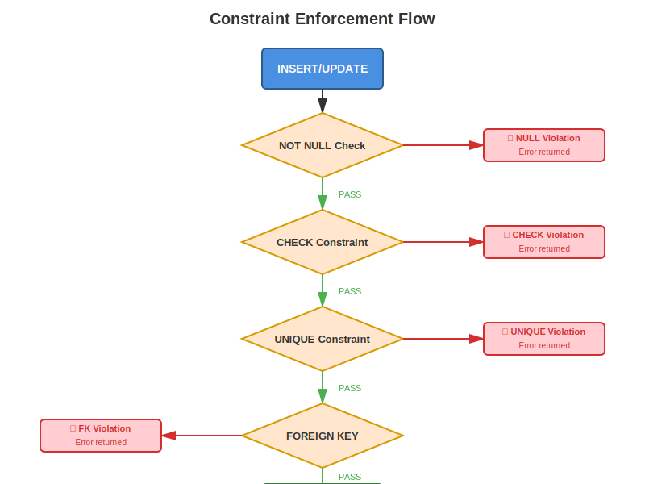
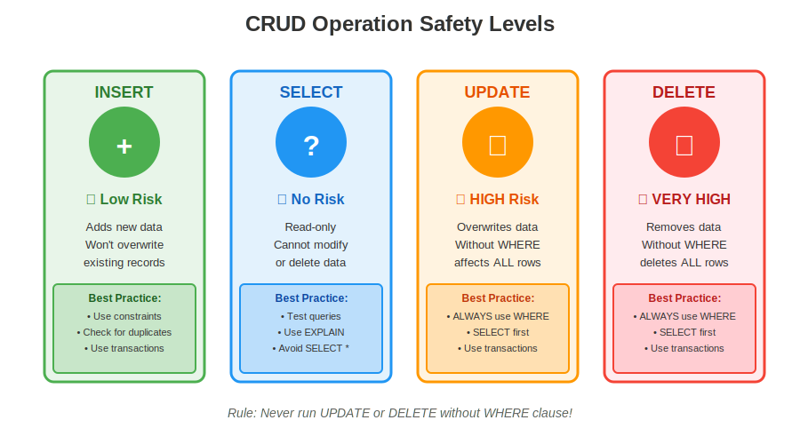
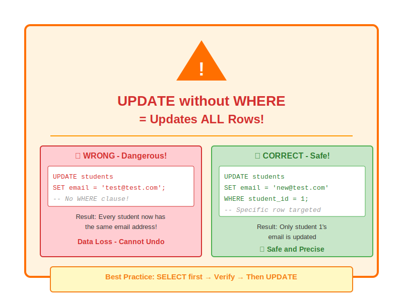

# Week 04: Transactional SQL (PostgreSQL)

## Overview

This week marks a critical transition from database **design** to **implementation**. You'll take the normalized schemas you designed in Weeks 02-03 and build them using PostgreSQL's DDL (Data Definition Language). Then, you'll populate and manipulate those schemas using DML (Data Manipulation Language) to master the fundamental CRUD operations that power all database applications.

By the end of this week, you'll have implemented a complete, production-ready University Course Registration database with proper constraints, referential integrity, and realistic data - the foundation for all transactional database systems.

---

## Lesson 07: DDL & Schema Implementation

### Learning Objectives

- Understand PostgreSQL's client-server architecture and its role in OLTP vs OLAP systems
- Master PostgreSQL data types (INTEGER, VARCHAR, DATE, SERIAL, NUMERIC) and choose appropriate types for different use cases
- Write DDL statements (CREATE, ALTER, DROP) to implement normalized database schemas
- Apply all constraint types (NOT NULL, UNIQUE, CHECK, PRIMARY KEY, FOREIGN KEY) to enforce data integrity
- Explain the relationship between normalization theory (Week 03) and physical schema implementation with constraints

### Materials

**Concept Notes:**
- [DDL & Schema Implementation in PostgreSQL](w04_l07_concept_ddl_schema.md)

**Lab Exercise:**
- [Implementing Schemas in PostgreSQL](w04_l07_lab_ddl_implementation.md)

### Interactive Notebook

[](https://colab.research.google.com/github/devomh/comp4098-2026/blob/main/week_04/w04_l07_lab_ddl_implementation.ipynb)

*Note: Replace `USERNAME` with your GitHub username once the repository is set up.*

---

## Lesson 08: DML & Basic Querying

### Learning Objectives

- Master DML (Data Manipulation Language) statements: INSERT, UPDATE, DELETE
- Write multi-row inserts and work with DEFAULT values and auto-generated IDs
- Construct SELECT queries with WHERE clauses using comparison and logical operators
- Sort and paginate results with ORDER BY, LIMIT, and OFFSET
- Apply transaction safety patterns (BEGIN, COMMIT, ROLLBACK) to protect data integrity

### Materials

**Concept Notes:**
- [DML & Basic Querying in PostgreSQL](w04_l08_concept_dml_querying.md)

**Lab Exercise:**
- [CRUD Operations in PostgreSQL](w04_l08_lab_dml_operations.md)

### Interactive Notebook

[](https://colab.research.google.com/github/devomh/comp4098-2026/blob/main/week_04/w04_l08_lab_dml_operations.ipynb)

*Note: Replace `USERNAME` with your GitHub username once the repository is set up.*

---

## Key Concepts

### DDL (Data Definition Language)
- **CREATE TABLE** - Building database schemas with columns, data types, and constraints
- **ALTER TABLE** - Modifying existing schemas (add/drop columns, add constraints)
- **DROP TABLE** - Removing tables (with CASCADE implications)
- **Data Types** - INTEGER, SERIAL, VARCHAR, TEXT, DATE, TIMESTAMP, NUMERIC, BOOLEAN
- **Constraints** - NOT NULL, UNIQUE, CHECK, PRIMARY KEY, FOREIGN KEY

### DML (Data Manipulation Language)
- **INSERT** - Adding data (single-row, multi-row, with DEFAULT values, with RETURNING)
- **UPDATE** - Modifying existing data (with WHERE, conditional updates with CASE)
- **DELETE** - Removing data (with WHERE, understanding CASCADE effects)
- **SELECT** - Querying data (WHERE, comparison/logical operators, ORDER BY, LIMIT/OFFSET)

### Database Architecture & Concepts
- **PostgreSQL Architecture** - Client-server model, ACID guarantees, OLTP optimization
- **OLTP vs OLAP** - Row-oriented (PostgreSQL) for transactions vs Column-oriented (DuckDB) for analytics
- **Transactions** - BEGIN, COMMIT, ROLLBACK for atomic operations and data safety
- **CRUD Pattern** - Create (INSERT), Read (SELECT), Update (UPDATE), Delete (DELETE)
- **Referential Integrity** - Foreign keys with ON DELETE/UPDATE options (CASCADE, RESTRICT, SET NULL)

### Safety & Best Practices
- ⚠️ **Always use WHERE with UPDATE and DELETE** - Without it, you affect ALL rows
- ✅ **SELECT before UPDATE/DELETE** - Preview which rows will be affected
- 🔒 **Use transactions for critical operations** - BEGIN lets you ROLLBACK mistakes
- 💾 **Test on non-production data first** - Never experiment with live data

---

## Connection from Previous Weeks

### Week 02 → Week 04: From Design to Implementation
- **Week 02:** Created ER diagrams for the University Course Registration system
- **Week 04 Lesson 7:** Implemented those designs with CREATE TABLE statements in PostgreSQL
- **Key Connection:** Entities become tables, attributes become columns, relationships become foreign keys

### Week 03 → Week 04: Normalization Enforced by Constraints
- **Week 03:** Learned normalization theory (1NF, 2NF, 3NF) to eliminate data anomalies
- **Week 04 Lesson 7:** Constraints enforce normalization:
  - **1NF (Atomic values)** → Proper data types (VARCHAR, INTEGER, not TEXT blobs)
  - **2NF (No partial dependencies)** → Foreign keys to parent tables
  - **3NF (No transitive dependencies)** → Separate tables for independent entities
- **Key Connection:** Normalization theory tells you **what** to design; DDL constraints enforce it

### Week 04 → Week 05: From OLTP to OLAP
- **Week 04:** PostgreSQL for OLTP - optimized for many small transactions (INSERT, UPDATE, DELETE)
- **Week 05 Preview:** DuckDB for OLAP - optimized for few large analytical queries (aggregations, JOINs)
- **Key Connection:** Production data captured in PostgreSQL, then extracted to DuckDB for analysis

---

## Practical Applications for Data Scientists

### Why DDL Matters
1. **Requesting schema changes** - "Can you add a NOT NULL constraint to the email column?" communicates precisely with DBAs
2. **Designing staging databases** - Data engineering pipelines often require intermediate schemas for ETL
3. **Understanding performance** - Knowing how data is stored helps you write efficient extraction queries

### Why DML Matters
1. **ETL Pipelines** - INSERT statements load processed data into staging tables
2. **Feature Engineering** - UPDATE statements modify derived features in production databases
3. **Data Quality** - DELETE statements remove duplicates or invalid records
4. **Analysis Foundation** - SELECT is the basis of all data analysis and reporting

### Real-World Workflow
```
Raw Data → PostgreSQL (OLTP)
    ↓ (Production transactions: INSERT, UPDATE)
    ↓ (Constraints enforce data quality)
    ↓ (Extract with SELECT)
DuckDB (OLAP)
    ↓ (Analytical queries: aggregations, window functions)
Pandas / Matplotlib
    ↓ (Visualization, ML preprocessing)
Insights & Models
```

---

## Visual Aids

### Constraint Enforcement Flow


*How PostgreSQL validates each INSERT/UPDATE operation through multiple constraint checks.*

### CRUD Operation Safety Levels


*Visual comparison of risk levels for each CRUD operation with best practices.*

### UPDATE Without WHERE Warning


*Critical warning about the dangers of UPDATE/DELETE without WHERE clauses.*

---

## Additional Resources

### Textbooks
- **Database Design - 2nd Edition** by Adrienne Watt
  - [Chapter 8: The Entity Relationship Data Model](https://opentextbc.ca/dbdesign01/chapter/chapter-8-the-entity-relationship-data-model/)
  - [Chapter 9: Integrity Rules and Constraints](https://opentextbc.ca/dbdesign01/chapter/chapter-9-integrity-rules-and-constraints/)

### PostgreSQL Official Documentation
- [Data Types](https://www.postgresql.org/docs/current/datatype.html)
- [DDL Commands](https://www.postgresql.org/docs/current/ddl.html)
- [DML Commands](https://www.postgresql.org/docs/current/dml.html)
- [Constraints](https://www.postgresql.org/docs/current/ddl-constraints.html)

### Tutorials
- [PostgreSQL Tutorial: CREATE TABLE](https://www.postgresqltutorial.com/postgresql-tutorial/postgresql-create-table/)
- [PostgreSQL Tutorial: CRUD Operations](https://www.postgresqltutorial.com/postgresql-tutorial/postgresql-insert/)

---

## Lab Requirements

### Prerequisites
- Google Colab account (free)
- PostgreSQL database access (choose one):
  - **Supabase** (recommended) - Free tier, 500MB
  - **ElephantSQL** - Free tier, 20MB
  - Local PostgreSQL installation (advanced)

### Software Packages
All labs use the following Python packages (installed automatically in notebooks):
- `psycopg2-binary` - PostgreSQL adapter
- `ipython-sql` - SQL magic for Jupyter
- `sqlalchemy` - Database toolkit
- `pandas` - Data analysis
- `mermaid-py` - Diagram generation

### Estimated Time
- **Lesson 7:** 45 min concept + 60 min lab = 105 minutes
- **Lesson 8:** 45 min concept + 60 min lab = 105 minutes
- **Total:** ~3.5 hours (can be split across multiple sessions)

---

## What's Next?

### Week 05: Analytical SQL & Architecture
- Transition from OLTP (PostgreSQL) to OLAP (DuckDB)
- Learn row-oriented vs column-oriented storage
- Master complex JOINs, aggregations, and analytical functions
- Understand when to use each database type

**Preview:** You'll extract data from your Week 04 PostgreSQL database and analyze it in DuckDB using window functions, CTEs, and aggregations to answer complex analytical questions.

---

## Questions or Issues?

If you encounter problems with:
- **PostgreSQL connections** - Check connection string format and credentials
- **SQL syntax errors** - Verify your PostgreSQL version matches documentation
- **Constraint violations** - Review error messages and constraint definitions
- **Lab exercises** - Review concept notes and previous examples

For additional help, refer to the troubleshooting sections in each lab file.
