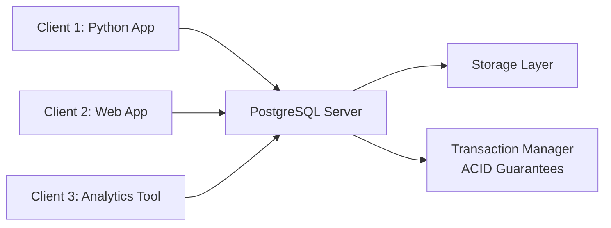
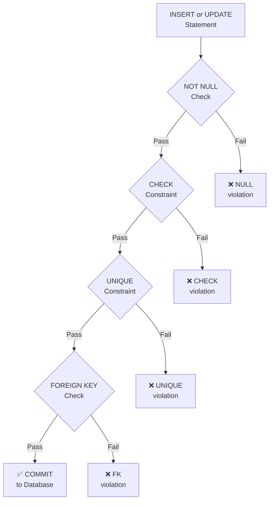

# DDL & Schema Implementation in PostgreSQL

## Learning Objectives

By the end of this lesson, you will be able to:
- Understand PostgreSQL's client-server architecture and its role in the OLTP vs OLAP landscape
- Master PostgreSQL data types and choose appropriate types for different use cases
- Write DDL statements (CREATE, ALTER, DROP) to implement normalized database schemas
- Apply all constraint types (NOT NULL, UNIQUE, CHECK, PRIMARY KEY, FOREIGN KEY) to enforce data integrity
- Explain the relationship between normalization theory (Week 03) and physical schema implementation

## The "Why": From Design to Production

In Weeks 02 and 03, you learned how to **design** databases: creating ER diagrams, converting them to relational schemas, and normalizing to eliminate anomalies. Now it's time to **build** those databases.

**PostgreSQL** is the industry-standard open-source relational database for production OLTP (Online Transaction Processing) systems. While you may spend most of your time as a data scientist querying data with SQL or analyzing it in Pandas/DuckDB, understanding how to *implement* database schemas is crucial because:

1. **You'll need to request schema changes from DBAs** - Knowing DDL helps you communicate precisely what you need
2. **You'll design staging databases for ETL pipelines** - Data engineering often involves creating temporary or intermediate schemas
3. **You'll understand performance implications** - Constraints and data types directly impact query speed and data integrity
4. **You'll debug production issues** - Understanding the schema helps you identify why certain operations fail or are slow

**Analogy:** If normalization theory is the **architectural blueprint** for a building, DDL is the **construction process** that actually builds it. You're moving from paper to production.

---

## Core Concept A: PostgreSQL Architecture

### Client-Server Model

Unlike DuckDB (which runs in-process within your Python script), PostgreSQL uses a **client-server architecture**:



**Key Differences: PostgreSQL vs. DuckDB**

| Feature | PostgreSQL (OLTP) | DuckDB (OLAP) |
|---------|-------------------|---------------|
| **Architecture** | Client-server, multi-user | In-process, embedded |
| **Primary Use** | Many small transactions (INSERT, UPDATE) | Few large analytical queries (aggregations) |
| **Storage** | Row-oriented (fast writes) | Column-oriented (fast scans) |
| **ACID** | Full ACID compliance | Limited (single-user context) |
| **Best For** | Production applications, data capture | Analytical queries, data science notebooks |

### ACID Guarantees

PostgreSQL guarantees **ACID** properties for all transactions:

- **Atomicity:** All-or-nothing transactions (if one part fails, everything rolls back)
- **Consistency:** Data always moves from one valid state to another (constraints enforced)
- **Isolation:** Concurrent transactions don't interfere with each other
- **Durability:** Once committed, data survives crashes and power failures

This makes PostgreSQL ideal for systems where **data integrity is critical**: financial applications, user authentication systems, inventory management, etc.

---

## Core Concept B: PostgreSQL Data Types

Choosing the correct data type is essential for:
- **Storage efficiency** - Smaller types use less disk space
- **Performance** - Appropriate types enable index optimizations
- **Data integrity** - Types prevent invalid data (e.g., storing text in a number column)

### Numeric Types

| Type | Storage | Range | Use Case |
|------|---------|-------|----------|
| `INTEGER` | 4 bytes | -2 billion to +2 billion | General-purpose IDs, counts |
| `BIGINT` | 8 bytes | ±9 quintillion | Very large counts, timestamps |
| `SERIAL` | 4 bytes | Auto-incrementing INTEGER | Primary keys (auto-generates) |
| `BIGSERIAL` | 8 bytes | Auto-incrementing BIGINT | Primary keys for huge tables |
| `NUMERIC(p,s)` | Variable | Exact precision | Money, scientific measurements |
| `REAL` | 4 bytes | 6 decimal digits precision | Approximate numbers (fast but inexact) |
| `DOUBLE PRECISION` | 8 bytes | 15 decimal digits | Floating-point calculations |

**Pro Tip:** For monetary values, **always use `NUMERIC`** (not REAL/DOUBLE) to avoid rounding errors.

<details>
<summary><strong>Understanding <code>NUMERIC(p, s)</code> precision and scale</strong></summary>

- **p** = precision → total number of significant digits (both sides of the decimal point)
- **s** = scale → number of digits to the right of the decimal point

**Example:** `NUMERIC(7, 2)` stores values like `12345.67`
- 7 total digits
- 2 after the decimal point

</details>

### Text Types

| Type | Description | Use Case |
|------|-------------|----------|
| `VARCHAR(n)` | Variable length, max n characters | Email (255), names (100), zip codes (10) |
| `TEXT` | Unlimited length | Long descriptions, blog posts, JSON strings |
| `CHAR(n)` | Fixed length (space-padded) | Country codes (2), legacy systems |

**Pro Tip:** `VARCHAR` without a length limit is equivalent to `TEXT` in PostgreSQL, but explicit lengths document business rules.

### Temporal Types

| Type | Storage | Range | Use Case |
|------|---------|-------|----------|
| `DATE` | 4 bytes | 4713 BC to 5874897 AD | Birthdates, event dates |
| `TIME` | 8 bytes | 00:00:00 to 24:00:00 | Appointment times |
| `TIMESTAMP` | 8 bytes | Date + Time (no timezone) | Avoid in new code — use TIMESTAMPTZ instead |
| `TIMESTAMPTZ` | 8 bytes | Date + Time (UTC-normalized) | **Preferred for production** — created_at, updated_at, any event time |
| `INTERVAL` | 16 bytes | Time duration | Age calculations, time differences |

<details>
<summary><strong>How PostgreSQL Stores Temporal Types Internally</strong></summary>

**`DATE`** — 4-byte integer
Days since **2000-01-01** (Julian day offset).

---

**`TIME`** — 8-byte integer
Microseconds since **midnight** (`00:00:00`).

---

**`TIMESTAMP`** — 8-byte integer
Microseconds since **2000-01-01 00:00:00** (PostgreSQL's own epoch, not Unix epoch 1970-01-01).

---

**`TIMESTAMPTZ`** — same as `TIMESTAMP`
Also an 8-byte integer (microseconds since 2000-01-01 UTC). The timezone is **not stored** — PostgreSQL converts to/from UTC on input/output using the session timezone.

---

**`INTERVAL`** — 16 bytes, **3-part structure**:
- 8 bytes → microseconds (hours, minutes, seconds)
- 4 bytes → days
- 4 bytes → months

Days and months are kept separate because they are not fixed-length (e.g., "1 month" ≠ 30 days always).

---

**Key takeaway:** Most types are a **single integer (microseconds)** relative to PostgreSQL's epoch (2000-01-01), not Unix epoch (1970-01-01). `INTERVAL` is the exception with its 3-part structure.

</details>

### Other Important Types

- **BOOLEAN:** `TRUE`, `FALSE`, or `NULL` - Used for flags (is_active, is_verified)
- **UUID:** Universal Unique Identifier - Distributed systems, avoiding collisions
- **JSON/JSONB:** Semi-structured data - Store flexible schemas (JSONB is binary, faster)

<details>
<summary><strong>What is a UUID and why does it avoid collisions?</strong></summary>

A **UUID** (Universally Unique Identifier) is a 128-bit number represented as 32 hex digits in 5 groups:

```
550e8400-e29b-41d4-a716-446655440000
```

**Why use it instead of `SERIAL`?**

| | `SERIAL` | `UUID` |
|---|---|---|
| Generated by | Database (sequential) | Any machine independently |
| Predictable | Yes (1, 2, 3...) | No |
| Safe to expose in URLs | No | Yes |
| Merge multiple DBs | Conflicts | No conflicts |

**Why collisions are practically impossible:**

A UUID v4 is 122 random bits, giving **2¹²² ≈ 5.3 × 10³⁶** possible values. To reach a 1% chance of a single collision, you would need to generate ~10¹⁸ UUIDs. At 1 billion UUIDs/second across all machines on Earth, that would take ~85 years.

**Contrast with `SERIAL`:** Two separate PostgreSQL instances both start counting from `1`. If you merge their data, you immediately get collisions. UUIDs avoid this entirely, which is why they're preferred in:
- **Microservices** — each service inserts independently
- **Distributed databases** — multiple nodes writing simultaneously
- **Client-generated IDs** — mobile apps that create records offline

In PostgreSQL: `gen_random_uuid()` generates a UUID v4 (random).

</details>

---

## Core Concept C: CREATE TABLE - Building Your Schema

### Basic Syntax

```sql
CREATE TABLE table_name (
    column1_name data_type constraints,
    column2_name data_type constraints,
    ...
    table_constraints
);
```

### Example: Simple Student Table

```sql
CREATE TABLE students (
    student_id SERIAL PRIMARY KEY,
    name VARCHAR(100) NOT NULL,
    email VARCHAR(255) UNIQUE NOT NULL,
    dob DATE CHECK (dob < CURRENT_DATE),
    gpa NUMERIC(3,2) CHECK (gpa >= 0.0 AND gpa <= 4.0)
);
```

**Breaking it down:**
- `SERIAL PRIMARY KEY` - Auto-generates unique IDs (1, 2, 3, ...)
- `VARCHAR(100) NOT NULL` - Required text field, max 100 characters
- `UNIQUE NOT NULL` - Email must be unique and can't be empty
- `CHECK (dob < CURRENT_DATE)` - Date of birth must be in the past
- `CHECK (gpa >= 0.0 AND gpa <= 4.0)` - GPA must be between 0.0 and 4.0

### Creating Tables with Foreign Keys

```sql
CREATE TABLE departments (
    dept_id SERIAL PRIMARY KEY,
    name VARCHAR(100) NOT NULL UNIQUE,
    building VARCHAR(100) NOT NULL
);

CREATE TABLE professors (
    emp_id SERIAL PRIMARY KEY,
    name VARCHAR(100) NOT NULL,
    dept_id INTEGER NOT NULL,
    FOREIGN KEY (dept_id) REFERENCES departments(dept_id)
        ON DELETE RESTRICT
        ON UPDATE CASCADE
);
```

**Important:** You must create parent tables (departments) **before** child tables (professors) because foreign keys must reference existing tables. In the example above, `ON DELETE RESTRICT` prevents deleting a department that still has professors, while `ON UPDATE CASCADE` automatically updates `dept_id` in `professors` if it changes in `departments` — most useful with natural keys (e.g., a country code `'US'` renamed to `'USA'`), since surrogate keys like `SERIAL` are rarely updated.

---

## Core Concept D: Constraints - Enforcing Data Integrity

Constraints are **business rules enforced by the database**. They prevent bad data from ever entering your system. Remember Week 03's normalization? Constraints are how we **enforce** those normalized designs.

| Normalization Rule | DDL Enforcement |
|--------------------|-----------------|
| Atomic values (1NF) | Column data types + `NOT NULL` |
| Single-column primary key (1NF) | `PRIMARY KEY` on a surrogate key column |
| No partial dependencies (2NF) | Separate tables per entity, joined by `FOREIGN KEY` |
| No transitive dependencies (3NF) | Lookup table + `FOREIGN KEY` instead of repeated text values |
| Candidate keys (all NFs) | `UNIQUE` constraint on non-primary identifying columns |

### Constraint Enforcement Flow



### 1. NOT NULL - Preventing Missing Data

```sql
CREATE TABLE students (
    student_id SERIAL PRIMARY KEY,
    name VARCHAR(100) NOT NULL,  -- Name is required
    email VARCHAR(255) NOT NULL  -- Email is required
);
```

**When to use:** Any column that is **essential** to the entity. If a student must have a name, make it NOT NULL.

### 2. CHECK - Domain Constraints

```sql
-- Range check: credits must be a positive number no greater than 6
credits INTEGER CHECK (credits > 0 AND credits <= 6),

-- Enumerated values: level must be one of three codes
level CHAR(1) CHECK (level IN ('U', 'G', 'D')),  -- Undergraduate, Graduate, Doctoral

-- Combined range and sanity check: dob must be a plausible past date
dob DATE CHECK (dob < CURRENT_DATE AND dob > '1900-01-01'),

-- Numeric range: GPA must be within the 0.0–4.0 scale
gpa NUMERIC(3,2) CHECK (gpa BETWEEN 0.0 AND 4.0)
```

**When to use:** Enforce **domain integrity** - valid ranges, allowed values, logical rules.

### 3. UNIQUE - Preventing Duplicates

```sql
CREATE TABLE students (
    student_id SERIAL PRIMARY KEY,
    email VARCHAR(255) UNIQUE NOT NULL,  -- No two students can share an email
    ssn CHAR(11) UNIQUE                  -- SSN must be unique (but can be NULL)
);
```

**When to use:** Candidate keys (columns that could be primary keys but aren't). Examples: email, ISBN, username, phone number.

### 4. PRIMARY KEY - Unique Identifier

```sql
CREATE TABLE students (
    student_id SERIAL PRIMARY KEY  -- Shorthand for: UNIQUE NOT NULL + indexed
);

-- Equivalent to:
CREATE TABLE students (
    student_id SERIAL,
    PRIMARY KEY (student_id)
);
```

**Rules:**
- Exactly **one PRIMARY KEY** per table
- Automatically creates an index (fast lookups)
- Combines NOT NULL + UNIQUE
- Used by FOREIGN KEY constraints

### 5. FOREIGN KEY - Referential Integrity

```sql
CREATE TABLE enrollments (
    student_id INTEGER NOT NULL,
    course_code CHAR(8) NOT NULL,
    enrollment_date DATE DEFAULT CURRENT_DATE,
    grade CHAR(1) CHECK (grade IS NULL OR grade IN ('A', 'B', 'C', 'D', 'F')),
    PRIMARY KEY (student_id, course_code),
    FOREIGN KEY (student_id) REFERENCES students(student_id)
        ON DELETE CASCADE,
    FOREIGN KEY (course_code) REFERENCES courses(course_code)
        ON DELETE RESTRICT
);
```

**Foreign keys enforce referential integrity:**
- You cannot insert an enrollment for a non-existent student
- You cannot delete a student who has enrollments (if using RESTRICT)
- Changes propagate automatically (if using CASCADE)

<details>
<summary><strong>Deep Dive: ON DELETE and ON UPDATE Options</strong></summary>

When a referenced row is deleted or updated, PostgreSQL can take different actions:

| Option | Behavior | When to Use |
|--------|----------|-------------|
| `NO ACTION` | Block the operation **(default)** — checked at end of transaction | Most cases: the default when no clause is specified |
| `RESTRICT` | Block the operation immediately (before transaction ends) | Protect critical data: can't delete a course if students are enrolled |
| `CASCADE` | Delete/update child rows automatically | Dependent data: delete student's phone numbers when student is deleted |
| `SET NULL` | Set FK to NULL | Optional relationships: if a course's prerequisite is deleted, set prereq_code to NULL |
| `SET DEFAULT` | Set FK to a default value | Fallback values: assign orphaned enrollments to a default "Archived" course |

**Examples:**

```sql
-- CASCADE: Deleting a student deletes all their phone numbers
CREATE TABLE student_phones (
    student_id INTEGER NOT NULL,
    phone_number VARCHAR(20),
    FOREIGN KEY (student_id) REFERENCES students(student_id)
        ON DELETE CASCADE
);

-- RESTRICT: Can't delete a department that has professors
CREATE TABLE professors (
    emp_id SERIAL PRIMARY KEY,
    dept_id INTEGER NOT NULL,
    FOREIGN KEY (dept_id) REFERENCES departments(dept_id)
        ON DELETE RESTRICT
);

-- SET NULL: If a course's prerequisite is deleted, just remove the prerequisite link
CREATE TABLE courses (
    course_code CHAR(8) PRIMARY KEY,
    prereq_code CHAR(8),
    FOREIGN KEY (prereq_code) REFERENCES courses(course_code)
        ON DELETE SET NULL
);
```

**Pro Tip:** Use CASCADE carefully - it can delete large amounts of data unintentionally. Always test on non-production data first.

</details>

---

## Core Concept E: ALTER TABLE - Modifying Schemas

Real-world databases evolve. `ALTER TABLE` allows you to modify existing schemas without losing data.

### Adding Columns

```sql
-- Add a new column (will be NULL for existing rows)
ALTER TABLE students ADD COLUMN middle_name VARCHAR(100);

-- Add a column with a default value
ALTER TABLE students ADD COLUMN status VARCHAR(20) DEFAULT 'active';
```

### Dropping Columns

```sql
ALTER TABLE students DROP COLUMN middle_name;
```

**Warning:** This permanently deletes data in that column. Always back up first!

### Adding Constraints

```sql
-- Add a CHECK constraint
ALTER TABLE students ADD CONSTRAINT check_gpa
    CHECK (gpa >= 0.0 AND gpa <= 4.0);

-- Add a UNIQUE constraint
ALTER TABLE students ADD CONSTRAINT unique_email UNIQUE (email);

-- Add a FOREIGN KEY
ALTER TABLE professors ADD CONSTRAINT fk_department
    FOREIGN KEY (dept_id) REFERENCES departments(dept_id);
```

### Dropping Constraints

```sql
ALTER TABLE students DROP CONSTRAINT check_gpa;
```

### Modifying Columns

```sql
-- Change data type
ALTER TABLE students ALTER COLUMN email TYPE TEXT;

-- Set/remove NOT NULL
ALTER TABLE students ALTER COLUMN email SET NOT NULL;
ALTER TABLE students ALTER COLUMN middle_name DROP NOT NULL;

-- Set a default value
ALTER TABLE enrollments ALTER COLUMN enrollment_date SET DEFAULT CURRENT_DATE;
```

---

## Core Concept F: DROP TABLE - Removing Tables

```sql
-- Drop a table (fails if other tables reference it)
DROP TABLE students;

-- Drop if exists (doesn't error if table doesn't exist)
DROP TABLE IF EXISTS students;

-- Drop and remove all dependent objects (dangerous!)
DROP TABLE students CASCADE;
```

**Warning:** `DROP TABLE CASCADE` will delete not just the table, but also:
- All foreign keys pointing to it
- All views that reference it
- All indexes and triggers

**Best Practice:** Avoid dropping tables in production. Instead, use a "soft delete" pattern (add an `is_deleted` flag) to retire data without destroying it.

---

## FAQ / Industry Reality

### Q: "Why learn PostgreSQL when data scientists mostly use Pandas and DuckDB?"

**A:** PostgreSQL is the **production system** where your data originates. The motivations are covered in [*The "Why": From Design to Production*](#the-why-from-design-to-production) above. Beyond those general reasons, data science teams often maintain their own PostgreSQL databases specifically for:
- **Feature stores** - Storing pre-computed features for ML models
- **Annotation databases** - Managing labeled training data
- **Experiment tracking** - Storing model runs, hyperparameters, and results

### Q: "Do I always need to specify VARCHAR lengths?"

**A:** In PostgreSQL, `VARCHAR` without a length is equivalent to `TEXT` (unlimited). However, **explicit lengths are documentation** of business rules:

- `VARCHAR(255)` for email → Documents that you expect "normal" email lengths
- `VARCHAR(10)` for zip code → Self-documenting constraint
- `TEXT` for blog content → Signals "unbounded length expected"

Explicit lengths can also help with:
- **Index optimization** - Smaller fixed-length columns create more efficient indexes
- **Client-side validation** - Applications can validate before sending to database
- **Storage planning** - Helps estimate database size

### Q: "What's the difference between SERIAL and IDENTITY columns?"

**A:** Both create auto-incrementing integers, but with different syntax:

```sql
-- SERIAL (PostgreSQL traditional approach)
CREATE TABLE students (
    student_id SERIAL PRIMARY KEY
);

-- IDENTITY (SQL standard, PostgreSQL 10+)
CREATE TABLE students (
    student_id INTEGER GENERATED ALWAYS AS IDENTITY PRIMARY KEY
);
```

**Recommendations:**
- **SERIAL:** Simpler syntax, widely used in existing codebases
- **IDENTITY:** SQL standard, better for new projects, more control (ALWAYS vs BY DEFAULT)

For most use cases, either works fine. Use SERIAL for simplicity unless you need IDENTITY's advanced features.

---

## Summary & Next Steps

In this lesson, you learned how to **implement** database schemas in PostgreSQL:

- **PostgreSQL Architecture:** Client-server, ACID-compliant, optimized for OLTP workloads
- **Data Types:** INTEGER, VARCHAR, TEXT, DATE, SERIAL, NUMERIC, and when to use each
- **CREATE TABLE:** Building tables with columns and constraints
- **Constraints:** NOT NULL, UNIQUE, CHECK, PRIMARY KEY, FOREIGN KEY for data integrity
- **ALTER TABLE:** Modifying schemas after creation
- **DROP TABLE:** Removing tables (with caution!)

**Connection to Week 03:** Normalization theory told you **what** to design (eliminate anomalies, create separate tables for entities). DDL tells you **how** to build it (CREATE TABLE with FOREIGN KEY constraints).

**Companion Lab:** In [Lesson 7 Lab](w04_l07_lab_ddl_implementation.md), you'll implement the University Course Registration system from Week 02 using PostgreSQL DDL statements.

**Looking Ahead:** Lesson 8 covers DML (Data Manipulation Language) - how to populate your schema with INSERT, UPDATE, DELETE, and SELECT.

---

## Further Reading

### Textbook
- **Database Design - 2nd Edition** by Adrienne Watt
  - [Chapter 8: The Entity Relationship Data Model](https://opentextbc.ca/dbdesign01/chapter/chapter-8-the-entity-relationship-data-model/)
  - Focus on how conceptual designs map to physical implementation

### PostgreSQL Official Documentation
- [Data Types](https://www.postgresql.org/docs/current/datatype.html) - Complete reference for all PostgreSQL types
- [DDL (Data Definition Language)](https://www.postgresql.org/docs/current/ddl.html) - CREATE, ALTER, DROP statements
- [Constraints](https://www.postgresql.org/docs/current/ddl-constraints.html) - Detailed explanation of all constraint types

### Additional Resources
- [PostgreSQL Tutorial: CREATE TABLE](https://www.postgresqltutorial.com/postgresql-tutorial/postgresql-create-table/) - Beginner-friendly examples
- [PostgreSQL Foreign Key](https://www.postgresqltutorial.com/postgresql-tutorial/postgresql-foreign-key/) - Deep dive into referential integrity
