# DML & Basic Querying in PostgreSQL

## Learning Objectives

By the end of this lesson, you will be able to:
- Master DML (Data Manipulation Language) statements: INSERT, UPDATE, DELETE
- Write multi-row inserts and handle default values effectively
- Construct SELECT queries with WHERE, ORDER BY, and LIMIT clauses
- Apply comparison and logical operators for precise data filtering
- Understand transaction basics (BEGIN, COMMIT, ROLLBACK) for data safety

## The "Why": From Schema to Data

In Lesson 7, you built the **structure** of your database with DDL (CREATE TABLE, constraints). Now you'll learn to **populate and manipulate** that structure with DML.

**DML (Data Manipulation Language)** consists of four fundamental operations, collectively known as **CRUD**:

- **C**reate → `INSERT` - Add new data
- **R**ead → `SELECT` - Query existing data
- **U**pdate → `UPDATE` - Modify existing data
- **D**elete → `DELETE` - Remove data

**Why this matters for data scientists:**

1. **ETL Pipelines:** You'll write INSERT statements to load processed data into staging tables
2. **Feature Engineering:** UPDATE statements modify derived features in production databases
3. **Data Quality:** DELETE statements remove duplicates or invalid records
4. **Analysis:** SELECT is the foundation of all data analysis and reporting

**Analogy:** If DDL is the **blueprint** for a building, DML is **moving in the furniture and residents**. The building exists, but it's empty until you populate it.

---

## Core Concept A: INSERT - Adding Data

### Single-Row INSERT

The simplest form: insert one row at a time.

```sql
INSERT INTO students (name, email, dob)
VALUES ('Alice Smith', 'alice@university.edu', '2000-05-15');
```

**Syntax breakdown:**
- `INSERT INTO table_name` - Specify the target table
- `(column1, column2, ...)` - List columns to populate (order matters!)
- `VALUES (value1, value2, ...)` - Provide values in the same order

**Pro Tip:** Always list columns explicitly, even if you're inserting all of them. This makes your code resilient to schema changes.

### Multi-Row INSERT

Insert multiple rows in a single statement (faster and more efficient):

```sql
INSERT INTO students (name, email, dob) VALUES
    ('Alice Smith', 'alice@university.edu', '2000-05-15'),
    ('Bob Jones', 'bob@university.edu', '1999-08-22'),
    ('Carol White', 'carol@university.edu', '2001-03-10'),
    ('David Brown', 'david@university.edu', '2000-11-30');
```

**Why multi-row inserts are better:**
- **Performance:** Single network round-trip vs. four separate ones
- **Transaction safety:** All-or-nothing (if one fails, none are inserted)
- **Readability:** See related data together

### Using DEFAULT and Auto-Generated Values

Some columns have defaults or auto-generate values:

```sql
-- SERIAL columns auto-generate
INSERT INTO departments (name, building)
VALUES ('Computer Science', 'Tech Building');
-- dept_id is automatically assigned (1, 2, 3, ...)

-- DEFAULT values are used when not specified
INSERT INTO enrollments (student_id, course_code)
VALUES (1, 'COMP101');
-- enrollment_date uses DEFAULT CURRENT_DATE

-- Explicitly use DEFAULT keyword
INSERT INTO enrollments (student_id, course_code, enrollment_date)
VALUES (2, 'COMP101', DEFAULT);
```

### INSERT with SELECT (Copying Data)

Copy data from one table to another:

```sql
-- Create an archive table for old students
CREATE TABLE archived_students (LIKE students INCLUDING ALL);

-- Copy students who graduated before 1995
INSERT INTO archived_students
SELECT * FROM students WHERE dob < '1995-01-01';
```

**Use cases:**
- Creating backups before bulk updates
- Moving data to archive tables
- Populating staging tables for ETL

### INSERT with RETURNING (PostgreSQL Extension)

Get back the inserted data (useful for confirming operations):

```sql
INSERT INTO students (name, email, dob)
VALUES ('Eve Martinez', 'eve@university.edu', '2002-01-05')
RETURNING student_id, name;
```

**Returns:**
| student_id | name |
|------------|------|
| 5 | Eve Martinez |

This is extremely useful in application code to get the auto-generated ID.

---

## Core Concept B: UPDATE - Modifying Data

### Basic UPDATE

Change values in existing rows:

```sql
UPDATE students
SET email = 'alice.smith@university.edu'
WHERE student_id = 1;
```

**Critical:** The `WHERE` clause specifies **which rows** to update.

### Update Multiple Columns

```sql
UPDATE enrollments
SET grade = 'A',
    enrollment_date = '2024-01-15'
WHERE student_id = 1 AND course_code = 'COMP101';
```

### Conditional UPDATE with CASE

Update different rows differently based on conditions:

```sql
UPDATE courses
SET credits = CASE
    WHEN course_code LIKE 'COMP1%' THEN 3
    WHEN course_code LIKE 'COMP2%' THEN 4
    WHEN course_code LIKE 'COMP3%' THEN 4
    ELSE credits
END;
```

**This reads as:** "For 1000-level COMP courses, set credits to 3; for 2000 and 3000-level, set to 4; leave others unchanged."

### UPDATE with Calculations

```sql
-- Give all professors a 5% raise
UPDATE professors
SET salary = salary * 1.05;

-- Increment credits for all courses
UPDATE courses
SET credits = credits + 1
WHERE credits < 5;
```

### The Danger: UPDATE Without WHERE

```mermaid
graph TD
    A[UPDATE students<br/>SET email = 'test@test.com'] --> B{WHERE clause?}
    B -->|YES| C[Updates specific rows ✅]
    B -->|NO| D[❌ Updates EVERY row!]
    D --> E[All students now have<br/>the same email]
    E --> F[Data loss - cannot undo]
```



**CRITICAL WARNING:** Running UPDATE without WHERE updates **ALL ROWS** in the table!

```sql
-- DANGER: This changes EVERY student's email
UPDATE students SET email = 'wrong@email.com';

-- SAFE: This changes only one student
UPDATE students SET email = 'right@email.com' WHERE student_id = 1;
```

**Best Practice: Always SELECT Before UPDATE**

```sql
-- Step 1: Preview which rows will be affected
SELECT * FROM students WHERE student_id = 1;

-- Step 2: If results look correct, change SELECT to UPDATE
UPDATE students SET email = 'new@email.com' WHERE student_id = 1;

-- Step 3: Verify the change
SELECT * FROM students WHERE student_id = 1;
```

---

## Core Concept C: DELETE - Removing Data

### Basic DELETE

Remove rows that match a condition:

```sql
DELETE FROM enrollments
WHERE grade = 'F' AND enrollment_date < '2020-01-01';
```

### DELETE All Rows (Dangerous!)

```sql
-- DANGER: Deletes EVERY row
DELETE FROM students;

-- Equivalent but faster:
TRUNCATE TABLE students;
```

**TRUNCATE vs DELETE:**
- `DELETE` removes rows one by one (can be rolled back, triggers fire)
- `TRUNCATE` removes all rows instantly (faster, resets auto-increment, can't be rolled back easily)

### DELETE with Foreign Key Considerations

Remember ON DELETE options from Lesson 7:

```sql
-- If student is deleted and enrollments has ON DELETE CASCADE:
DELETE FROM students WHERE student_id = 1;
-- This also deletes all enrollments for student 1

-- If course is deleted and enrollments has ON DELETE RESTRICT:
DELETE FROM courses WHERE course_code = 'COMP101';
-- ERROR: cannot delete because enrollments reference this course
```

**Best Practice: Safe DELETE Pattern**

```sql
-- Step 1: Preview what will be deleted
SELECT * FROM enrollments WHERE grade = 'F';

-- Step 2: Verify the count
SELECT COUNT(*) FROM enrollments WHERE grade = 'F';

-- Step 3: If correct, delete
DELETE FROM enrollments WHERE grade = 'F';

-- Step 4: Verify deletion
SELECT COUNT(*) FROM enrollments WHERE grade = 'F';  -- Should return 0
```

---

## Core Concept D: SELECT - Querying Data

### Basic SELECT

```sql
-- Select specific columns
SELECT name, email FROM students;

-- Select all columns
SELECT * FROM students;

-- Select distinct values (remove duplicates)
SELECT DISTINCT course_code FROM enrollments;
```

**Pro Tip:** Avoid `SELECT *` in production code. Explicitly list columns for better performance and clarity.

### WHERE Clause: Filtering Rows

#### Comparison Operators

```sql
-- Equal to
SELECT * FROM students WHERE student_id = 1;

-- Not equal to
SELECT * FROM students WHERE student_id != 1;
SELECT * FROM students WHERE student_id <> 1;  -- Alternative syntax

-- Greater than, less than
SELECT * FROM students WHERE dob > '2000-01-01';
SELECT * FROM courses WHERE credits >= 3;

-- Pattern matching with LIKE
SELECT * FROM students WHERE email LIKE '%@university.edu';
SELECT * FROM courses WHERE course_code LIKE 'COMP%';  -- Starts with COMP
SELECT * FROM students WHERE name LIKE '%Smith%';       -- Contains Smith
```

**LIKE Wildcards:**
- `%` - Matches any sequence of characters (including zero characters)
- `_` - Matches exactly one character

```sql
-- Email format: exactly 3 characters, then @, then anything
SELECT * FROM students WHERE email LIKE '___@%';
```

#### Logical Operators

```sql
-- AND: Both conditions must be true
SELECT * FROM students
WHERE dob > '2000-01-01' AND email LIKE '%@gmail.com';

-- OR: Either condition can be true
SELECT * FROM courses
WHERE credits = 3 OR credits = 4;

-- NOT: Negates a condition
SELECT * FROM students WHERE NOT (dob < '1995-01-01');
-- Equivalent to: WHERE dob >= '1995-01-01'
```

#### Range and Set Operators

```sql
-- BETWEEN: Value within a range (inclusive)
SELECT * FROM courses WHERE credits BETWEEN 3 AND 4;
-- Equivalent to: WHERE credits >= 3 AND credits <= 4

-- IN: Value matches any in a list
SELECT * FROM students WHERE student_id IN (1, 2, 3, 5, 8);

-- NOT IN: Value doesn't match any in a list
SELECT * FROM courses WHERE course_code NOT IN ('COMP101', 'MATH101');

-- IS NULL: Check for NULL values
SELECT * FROM students WHERE email IS NULL;

-- IS NOT NULL: Check for non-NULL values
SELECT * FROM enrollments WHERE grade IS NOT NULL;
```

**Important:** Use `IS NULL` and `IS NOT NULL`, not `= NULL` or `!= NULL` (those don't work as expected).

### ORDER BY: Sorting Results

```sql
-- Sort by one column (ascending by default)
SELECT * FROM students ORDER BY name;
SELECT * FROM students ORDER BY name ASC;  -- Explicit ascending

-- Sort descending
SELECT * FROM students ORDER BY dob DESC;  -- Newest birthdate first

-- Sort by multiple columns
SELECT * FROM enrollments
ORDER BY course_code ASC, grade DESC;
-- First by course code (A-Z), then by grade (A before B)
```

**Use case:** "Show me all enrollments grouped by course, with best grades first."

### LIMIT and OFFSET: Pagination

```sql
-- Get first 10 students
SELECT * FROM students ORDER BY student_id LIMIT 10;

-- Get students 21-30 (skip first 20, then take 10)
SELECT * FROM students ORDER BY student_id LIMIT 10 OFFSET 20;

-- Pagination pattern (page 3, 10 items per page)
-- OFFSET = (page - 1) * items_per_page = (3-1) * 10 = 20
SELECT * FROM students ORDER BY student_id LIMIT 10 OFFSET 20;
```

### Combining Multiple Clauses

```sql
SELECT name, email, dob
FROM students
WHERE dob > '2000-01-01'
    AND email LIKE '%@university.edu'
ORDER BY dob DESC
LIMIT 5;
```

**SQL Execution Order (conceptually):**
1. `FROM` - Identify the table
2. `WHERE` - Filter rows
3. `SELECT` - Choose columns
4. `ORDER BY` - Sort results
5. `LIMIT` - Restrict number of results

---

## Core Concept E: Transactions - Data Safety

A **transaction** is a sequence of operations treated as a single unit. Either **all succeed**, or **all fail** (atomicity).

### Basic Transaction Pattern

```sql
BEGIN;  -- Start transaction

UPDATE students SET email = 'new@email.com' WHERE student_id = 1;

-- Verify the change
SELECT * FROM students WHERE student_id = 1;

-- If correct: make it permanent
COMMIT;

-- If wrong: undo everything
-- ROLLBACK;
```

### Why Transactions Matter

**Without transactions:**
```sql
-- Update 1 succeeds
UPDATE accounts SET balance = balance - 100 WHERE account_id = 1;

-- Power failure here! Update 2 never runs
UPDATE accounts SET balance = balance + 100 WHERE account_id = 2;

-- Result: Money disappeared from account 1 but never appeared in account 2!
```

**With transactions:**
```sql
BEGIN;

UPDATE accounts SET balance = balance - 100 WHERE account_id = 1;
UPDATE accounts SET balance = balance + 100 WHERE account_id = 2;

-- Both succeed: COMMIT
-- Either fails: ROLLBACK (both undone)
COMMIT;
```

### Transaction Lifecycle


### Autocommit Mode

By default, PostgreSQL runs in **autocommit mode** - each statement is its own transaction.

```python
# In SQL Magic, disable autocommit for explicit control
%config SqlMagic.autocommit = False
```

Now you must explicitly COMMIT or ROLLBACK.

---

## Comparison: CRUD Operation Safety Levels

| Statement | Purpose | Danger Level | Requires WHERE? | Reversible? |
|-----------|---------|--------------|-----------------|-------------|
| **INSERT** | Add new data | 🟢 Low | No | ❌ (unless in transaction) |
| **SELECT** | Read data | 🔵 None | No (optional) | N/A (read-only) |
| **UPDATE** | Modify data | 🟠 HIGH | ⚠️ ALWAYS | ❌ (unless in transaction) |
| **DELETE** | Remove data | 🔴 VERY HIGH | ⚠️ ALWAYS | ❌ (unless in transaction) |

**Key Takeaways:**
- INSERT is relatively safe - worst case, you insert duplicates (caught by constraints)
- SELECT can never harm your data
- UPDATE without WHERE is catastrophic - overwrites all rows
- DELETE without WHERE is catastrophic - removes all rows
- **Always use transactions for critical operations**

---

## Deep Dive: RETURNING Clause (PostgreSQL Extension)

<details>
<summary><strong>PostgreSQL's RETURNING Clause</strong></summary>

PostgreSQL extends standard SQL with a `RETURNING` clause that lets you get data back from INSERT, UPDATE, and DELETE operations.

### INSERT with RETURNING

```sql
INSERT INTO students (name, email, dob)
VALUES ('Frank Wilson', 'frank@university.edu', '2001-07-20')
RETURNING student_id, name;
```

**Returns:**
| student_id | name |
|------------|------|
| 6 | Frank Wilson |

**Use case:** Get the auto-generated ID without a second query.

### UPDATE with RETURNING

```sql
UPDATE students
SET email = 'alice.new@university.edu'
WHERE student_id = 1
RETURNING *;
```

**Returns the entire updated row** - useful for confirming the change.

### DELETE with RETURNING

```sql
DELETE FROM enrollments
WHERE grade = 'F'
RETURNING student_id, course_code;
```

**Returns the rows that were deleted** - useful for logging or auditing.

### Why RETURNING is Powerful

**Without RETURNING:**
```sql
INSERT INTO students (name, email, dob) VALUES (...);
SELECT student_id FROM students WHERE email = 'specific@email.com';
```

**With RETURNING:**
```sql
INSERT INTO students (name, email, dob) VALUES (...)
RETURNING student_id;
```

Single query, no race conditions, faster.

</details>

---

## FAQ / Industry Reality

### Q: "Why not just use Pandas for all data manipulation?"

**A:** SQL is executed **server-side**, while Pandas runs **client-side**:

| Feature | SQL (PostgreSQL) | Pandas |
|---------|------------------|--------|
| **Execution** | Server-side | Client-side |
| **Data Transfer** | Only results | Entire dataset |
| **Concurrency** | Multi-user safe (ACID) | Single-user |
| **Scale** | Billions of rows | Millions of rows (memory-limited) |
| **Transaction Safety** | BEGIN/COMMIT/ROLLBACK | No built-in transactions |

**When to use SQL:**
- Loading data into production databases
- Multi-user systems (web applications, dashboards)
- Data larger than RAM
- Operations requiring atomic transactions

**When to use Pandas:**
- Exploratory data analysis
- Complex transformations not easily expressed in SQL
- Machine learning preprocessing
- Data visualization pipelines

**Best practice:** Use SQL for data extraction and manipulation, Pandas for analysis and visualization.

### Q: "How do I undo a DELETE I just ran?"

**A:** You can't, unless you:

1. **Used a transaction:**
   ```sql
   BEGIN;
   DELETE FROM students WHERE student_id = 1;
   -- Oh no, wrong student!
   ROLLBACK;  -- Saved!
   ```

2. **Have backups:**
   - Restore from database backup (time-consuming)
   - Use point-in-time recovery (if configured)

**Prevention strategies:**
1. **Always use WHERE** - Double-check the condition
2. **SELECT before DELETE** - Preview what will be deleted
3. **Use transactions** - Gives you a safety net
4. **Soft deletes** - Add `is_deleted` flag instead of actual DELETE
5. **Restrict permissions** - Production databases shouldn't allow DELETE for most users
6. **Regular backups** - Last resort, but essential

### Q: "What's the difference between DELETE and TRUNCATE?"

**A:**

| Feature | DELETE | TRUNCATE |
|---------|--------|----------|
| **Speed** | Slower (row-by-row) | Faster (removes all at once) |
| **WHERE clause** | ✅ Can filter | ❌ Removes all rows |
| **Triggers** | ✅ Fires | ❌ Doesn't fire |
| **Rollback** | ✅ Can rollback (in transaction) | ⚠️ Limited (depends on configuration) |
| **Auto-increment** | Keeps current value | Resets to 1 |
| **Foreign keys** | Respects constraints | May fail if referenced |

**Use DELETE when:**
- You need to remove specific rows (with WHERE)
- You need triggers to fire
- You need to respect foreign key constraints

**Use TRUNCATE when:**
- You want to empty the entire table quickly
- You want to reset auto-increment counters
- The table has no foreign key references

---

## Summary & Next Steps

In this lesson, you mastered the four CRUD operations:

- **INSERT:** Adding data (single-row, multi-row, with DEFAULT, with RETURNING)
- **UPDATE:** Modifying data (with WHERE, with CASE, calculation updates)
- **DELETE:** Removing data (with WHERE, understanding CASCADE effects)
- **SELECT:** Querying data (WHERE, ORDER BY, LIMIT, comparison/logical operators)
- **Transactions:** BEGIN, COMMIT, ROLLBACK for data safety

**Critical Safety Rules:**
1. ⚠️ **Always use WHERE with UPDATE and DELETE**
2. ✅ **SELECT before UPDATE/DELETE** to preview changes
3. 🔒 **Use transactions for critical operations**
4. 💾 **Test on non-production data first**

**Next:** In [Lesson 8 Lab](w04_l08_lab_dml_operations.md), you'll populate the University Course Registration database you created in Lesson 7 and practice all CRUD operations.

**Looking Ahead:** Week 05 introduces **analytical SQL** - aggregations, JOINs, window functions, and the transition from OLTP (PostgreSQL) to OLAP (DuckDB).

---

## Further Reading

### Textbook
- **Database Design - 2nd Edition** by Adrienne Watt
  - [Chapter 9: Integrity Rules and Constraints](https://opentextbc.ca/dbdesign01/chapter/chapter-9-integrity-rules-and-constraints/)
  - Focus on how constraints interact with DML operations

### PostgreSQL Official Documentation
- [INSERT](https://www.postgresql.org/docs/current/sql-insert.html) - Complete INSERT syntax and options
- [UPDATE](https://www.postgresql.org/docs/current/sql-update.html) - UPDATE statement reference
- [DELETE](https://www.postgresql.org/docs/current/sql-delete.html) - DELETE statement reference
- [SELECT](https://www.postgresql.org/docs/current/sql-select.html) - Comprehensive SELECT documentation
- [Transaction Control](https://www.postgresql.org/docs/current/tutorial-transactions.html) - BEGIN, COMMIT, ROLLBACK

### Additional Resources
- [PostgreSQL Tutorial: INSERT](https://www.postgresqltutorial.com/postgresql-tutorial/postgresql-insert/) - Practical examples
- [PostgreSQL Tutorial: UPDATE](https://www.postgresqltutorial.com/postgresql-tutorial/postgresql-update/) - UPDATE patterns
- [PostgreSQL Tutorial: DELETE](https://www.postgresqltutorial.com/postgresql-tutorial/postgresql-delete/) - Safe deletion practices
- [SQL CRUD Operations Best Practices](https://www.postgresql.org/docs/current/dml.html) - Official PostgreSQL DML guide
