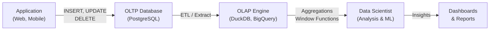
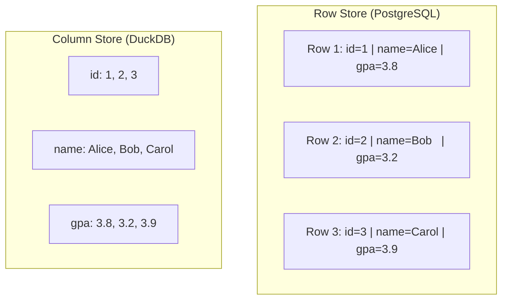
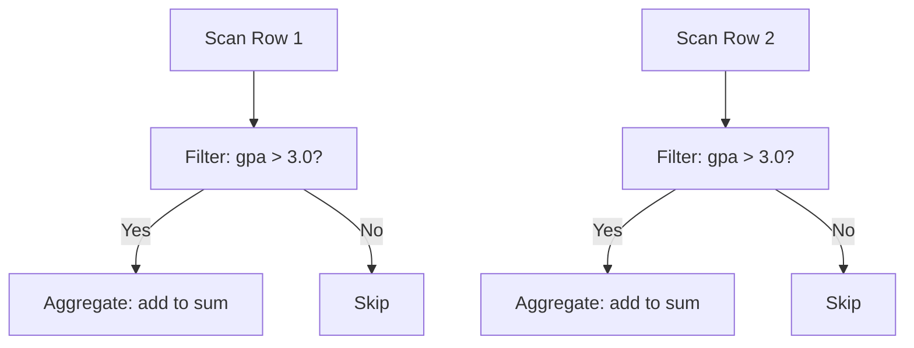
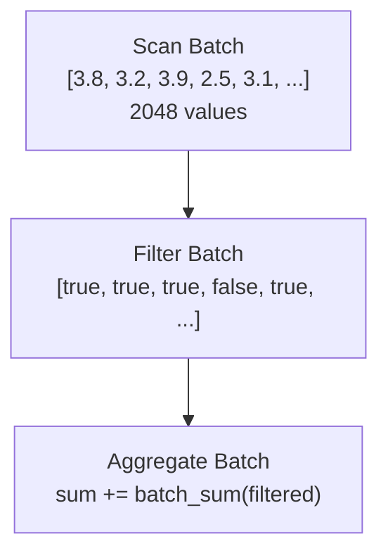
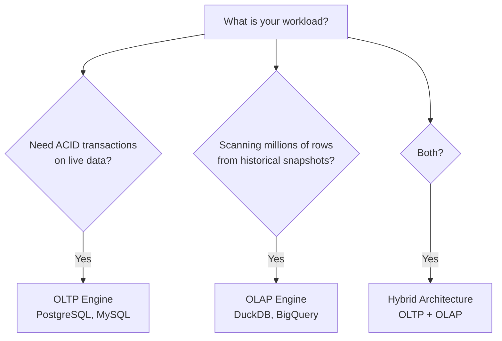

# OLTP vs. OLAP: Analytical Architectures

## Learning Objectives

By the end of this lesson, you will be able to:
- Distinguish between OLTP and OLAP workloads and explain when each is appropriate
- Compare row-oriented and column-oriented storage layouts at the physical level
- Explain how columnar compression techniques (Run-Length Encoding, Dictionary Encoding) reduce storage and accelerate queries
- Describe how vectorized execution achieves higher throughput than row-at-a-time processing
- Justify why data scientists need both PostgreSQL (OLTP) and DuckDB (OLAP) in their toolkit

## The "Why": Two Worlds of Data Processing

In Week 04, you built a PostgreSQL database optimized for **transactions** — inserting students, updating grades, enrolling in courses. Each operation touched a few rows at a time. This is **OLTP (Online Transaction Processing)**.

But as a data scientist, your day-to-day work looks very different:

- "What's the average GPA across all 50,000 students?"
- "Show me enrollment trends over the last 5 years"
- "Which departments have the highest course completion rates?"

These questions scan **millions of rows** but only touch **a few columns**. Trying to answer them on an OLTP database is like using a sports car to haul freight — it works, but it's painfully inefficient.

**OLAP (Online Analytical Processing)** engines are purpose-built for these analytical workloads. Understanding the architectural differences between OLTP and OLAP is fundamental to choosing the right tool — and to understanding *why* your queries are fast or slow.

> **Analogy:** Think of OLTP as a **filing cabinet** — optimized for quickly finding and updating a single file (one student's record). OLAP is a **spreadsheet pivot table** — optimized for summarizing patterns across thousands of records at once.

---

## Core Concept A: OLTP vs. OLAP Workloads

### What Defines Each Workload?

| Characteristic | OLTP | OLAP |
|:---|:---|:---|
| **Primary Operation** | INSERT, UPDATE, DELETE | SELECT with aggregations |
| **Query Pattern** | Few rows, many columns | Many rows, few columns |
| **Users** | Application users (thousands) | Analysts, data scientists (few) |
| **Data Volume per Query** | Small (one student, one order) | Large (entire tables, years of data) |
| **Latency Requirement** | Milliseconds (real-time) | Seconds to minutes (batch) |
| **Data Freshness** | Current (live transactions) | Historical (periodic snapshots) |
| **Example** | "Update Alice's grade to A" | "Average grade by department, 2020-2025" |

### The Workflow: OLTP Feeds OLAP

In production systems, OLTP and OLAP databases work together:



**Key Insight:** Data is **captured** in OLTP, then **extracted and analyzed** in OLAP. You don't run heavy analytics on your production PostgreSQL — you extract the data first.

### Real-World Architecture

| Layer | Technology | Purpose |
|:---|:---|:---|
| **Capture** | PostgreSQL, MySQL | Record transactions with ACID guarantees |
| **Extract** | ETL pipelines, SQL COPY | Move data to analytical storage |
| **Analyze** | DuckDB, BigQuery, Snowflake | Run aggregations, joins, window functions |
| **Visualize** | Pandas, Matplotlib, Tableau | Present insights to stakeholders |

---

## Core Concept B: Row-Oriented vs. Column-Oriented Storage

The fundamental architectural difference between OLTP and OLAP engines is **how data is physically stored on disk**.

### Row-Oriented Storage (PostgreSQL)

Data is stored **row by row** — all columns of a single row are stored together.

```
Disk Layout (Row Store):
┌─────────────────────────────────────────────────────┐
│ Row 1: [1, "Alice", "alice@uni.edu", "2000-05-15"]  │
│ Row 2: [2, "Bob",   "bob@uni.edu",   "1999-08-22"]  │
│ Row 3: [3, "Carol", "carol@uni.edu", "2001-03-10"]  │
│ Row 4: [4, "David", "david@uni.edu", "2000-11-30"]  │
└─────────────────────────────────────────────────────┘
```

**Strengths:**
- Fast for accessing **entire rows** (e.g., `SELECT * FROM students WHERE student_id = 1`)
- Efficient for INSERT/UPDATE/DELETE (write one contiguous block)
- Natural for transactional workloads

**Weakness:**
- To compute `AVG(gpa)` across 1M students, the engine must read **every column** of every row, even though it only needs the `gpa` column
- Wastes I/O bandwidth reading unnecessary data

### Column-Oriented Storage (DuckDB)

Data is stored **column by column** — all values of a single column are stored together.

```
Disk Layout (Column Store):
┌──────────────────────────────────────┐
│ student_id: [1, 2, 3, 4]            │
│ name:       ["Alice", "Bob", ...]    │
│ email:      ["alice@", "bob@", ...]  │
│ dob:        ["2000-05", "1999-08"...]│
└──────────────────────────────────────┘
```

**Strengths:**
- To compute `AVG(gpa)`, only the `gpa` column is read — **no wasted I/O**
- Consecutive values of the same type compress extremely well
- Vectorized processing (operate on batches of values, not one at a time)

**Weakness:**
- Inserting a single row requires writing to **every column file** (scattered writes)
- Poor for transactional workloads (INSERT/UPDATE/DELETE)

### Side-by-Side Comparison



### Query Performance Impact

Consider the query: `SELECT AVG(gpa) FROM students;` on a table with **1 million rows** and **10 columns**.

| Metric | Row Store | Column Store |
|:---|:---|:---|
| **Columns read** | All 10 | Only `gpa` (1) |
| **Data scanned** | ~100 MB (10 cols × 10 bytes × 1M rows) | ~4 MB (1 col × 4 bytes × 1M rows) |
| **I/O reduction** | Baseline | **~25× less I/O** |
| **CPU cache efficiency** | Low (mixed types per cache line) | High (same type, sequential access) |

---

## Core Concept C: Columnar Compression

Because column stores group identical data types together, they achieve **dramatically better compression** than row stores. This means less disk space, less I/O, and faster queries.

### Run-Length Encoding (RLE)

When consecutive values are the same, store the value once with a count.

```
Original column (department):
["CS", "CS", "CS", "CS", "Math", "Math", "Physics"]

RLE compressed:
[(CS, 4), (Math, 2), (Physics, 1)]
```

**Compression ratio:** 7 values → 3 entries (57% reduction)

**When it works best:** Sorted columns with many repeated values (e.g., department, country, status codes).

### Dictionary Encoding

Replace repeated string values with small integer codes, then store a lookup dictionary.

```
Original column (department):
["Computer Science", "Computer Science", "Mathematics", "Computer Science", "Mathematics"]

Dictionary:
  0 → "Computer Science"
  1 → "Mathematics"

Encoded column:
[0, 0, 1, 0, 1]
```

**Space savings:** Instead of storing "Computer Science" (16 bytes) repeatedly, store a 1-byte integer code.

**When it works best:** Columns with low cardinality (few distinct values), like status, country, category.

### Bit Packing

Store small integers using fewer bits than the standard type.

```
Column (credits): [3, 4, 3, 4, 3, 4, 3, 3]

Standard INTEGER: 32 bits × 8 = 256 bits
Bit-packed (3 bits each): 3 bits × 8 = 24 bits

Compression ratio: ~10×
```

**When it works best:** Integer columns where all values fit in a small range (e.g., credits 1-6, grades 0-4).

### Compression in Practice

| Compression | Best For | Typical Ratio |
|:---|:---|:---|
| **Run-Length Encoding** | Sorted columns with repeats | 10-100× |
| **Dictionary Encoding** | Low-cardinality strings | 5-50× |
| **Bit Packing** | Small-range integers | 2-10× |
| **Delta Encoding** | Sequential/time-series data | 5-20× |

<details>
<summary><strong>Deep Dive: Delta Encoding for Time-Series Data</strong></summary>

Delta encoding stores the **difference** between consecutive values instead of the values themselves. This is especially effective for sorted or sequential data like timestamps, IDs, and sensor readings.

```
Original column (timestamp as epoch seconds):
[1000000, 1000060, 1000120, 1000180, 1000240]

Delta encoded:
[1000000, 60, 60, 60, 60]
```

The first value is stored in full. Subsequent values store only the difference (delta) from the previous value. Since deltas are small and often identical, they combine well with bit packing and RLE:

```
Delta + RLE:
[1000000, (60, 4)]
```

5 values compressed to just 2 entries. For time-series data with regular intervals (sensor data sampled every minute, daily stock prices), this achieves extreme compression ratios.

**Why row stores can't do this:** In a row store, timestamps from different rows are not adjacent on disk — they're interleaved with other columns. You can't apply delta encoding across non-adjacent values.

</details>

### Why Row Stores Can't Compress as Well

Row stores mix data types within each storage block:

```
Row store block:
[1, "Alice", "alice@uni.edu", "2000-05-15", 3.8]
[2, "Bob",   "bob@uni.edu",   "1999-08-22", 3.2]
```

You can't apply RLE or dictionary encoding across mixed types. Column stores keep each type separate, enabling type-specific compression.

---

## Core Concept D: Vectorized Execution

Beyond storage layout and compression, OLAP engines use a fundamentally different **execution model**.

### Row-at-a-Time (Traditional / Volcano Model)

PostgreSQL processes queries using the **Volcano model** — one row at a time flows through a pipeline of operators:



**Problem:** Each row incurs function-call overhead. For 1 million rows, that's 1 million function calls per operator.

### Vectorized Execution (Batch Processing)

DuckDB processes data in **vectors** (batches of ~2,048 values):



**Benefits:**
- **Fewer function calls:** 1M rows ÷ 2,048 = ~488 function calls (vs. 1M)
- **CPU cache friendly:** Batch fits in L1/L2 cache
- **SIMD instructions:** Modern CPUs can process 4-8 values in a single instruction (Single Instruction, Multiple Data)

### Execution Model Comparison

| Feature | Row-at-a-Time (PostgreSQL) | Vectorized (DuckDB) |
|:---|:---|:---|
| **Processing unit** | 1 row | ~2,048 rows (vector) |
| **Function calls per 1M rows** | 1,000,000 | ~488 |
| **CPU cache usage** | Poor (cache misses) | Excellent (batch fits in cache) |
| **SIMD utilization** | None | Leverages hardware parallelism |
| **Best for** | Point lookups, single-row ops | Full-table scans, aggregations |

<details>
<summary><strong>Deep Dive: SIMD — How CPUs Process Multiple Values at Once</strong></summary>

**SIMD (Single Instruction, Multiple Data)** is a hardware feature in modern CPUs that lets a single instruction operate on multiple data values simultaneously.

**Without SIMD (scalar):**
```
Step 1: load a[0], add b[0], store c[0]
Step 2: load a[1], add b[1], store c[1]
Step 3: load a[2], add b[2], store c[2]
Step 4: load a[3], add b[3], store c[3]
→ 4 instructions
```

**With SIMD (vectorized):**
```
Step 1: load [a[0], a[1], a[2], a[3]]
        add  [b[0], b[1], b[2], b[3]]
        store [c[0], c[1], c[2], c[3]]
→ 1 instruction (4× throughput)
```

Modern CPUs support **AVX-256** (8 × 32-bit floats per instruction) and **AVX-512** (16 × 32-bit floats). Column stores naturally align data for SIMD because all values in a column have the same type and are contiguous in memory.

Row stores mix types (int, varchar, date) within each row, making SIMD alignment impractical.

</details>

---

## Core Concept E: Choosing the Right Engine

### Decision Framework



<details>
<summary><strong>Example: University Student Information System</strong></summary>

A university Student Information System (SIS) illustrates why hybrid architecture exists — neither engine alone can do both jobs well.

**OLTP side (PostgreSQL):**
- A student submits a course registration — that INSERT must be atomic so two students can't both claim the last seat
- A professor updates a grade — ACID guarantees prevent concurrent writes from corrupting the record
- Thousands of students hit the portal simultaneously during registration week, each needing sub-second responses on live data

**OLAP side (DuckDB / data warehouse):**
- Every night at 2 AM, an ETL job extracts the day's transactions into historical snapshots
- Institutional research runs: *"What is the 5-year trend in STEM enrollment by municipality?"*
- That query scans millions of rows across years of data — it doesn't need live data, it needs speed over large volumes

**Why not just one engine?**
- Running the 5-year trend scan directly on PostgreSQL during registration week competes with live transactions for I/O — registration slows to a crawl
- Running registrations through DuckDB loses ACID guarantees — two students could both "successfully" register for the last seat in a full course

**The hybrid flow:**
```
Student Portal → PostgreSQL (live, ACID)
                      ↓ nightly ETL
                 Parquet files / data warehouse
                      ↓
                 DuckDB ← Institutional Research
```

The key trade-off: analytical data is always slightly stale (up to 24 hours behind), which is acceptable for trend analysis but would be unacceptable for live registration.

</details>

### When to Use Each

| Scenario | Use | Why |
|:---|:---|:---|
| Web app user registration | PostgreSQL (OLTP) | Single-row INSERTs with ACID guarantees |
| Real-time inventory tracking | PostgreSQL (OLTP) | Frequent UPDATEs, concurrent users |
| Monthly sales report | DuckDB (OLAP) | Scan millions of rows, aggregate by region |
| ML feature engineering | DuckDB (OLAP) | Complex joins, window functions on large datasets |
| ETL pipeline staging | PostgreSQL (OLTP) | Temporary storage with transaction safety |
| Ad-hoc data exploration | DuckDB (OLAP) | Fast iteration on CSV/Parquet files |

### The Modern Data Science Stack

```
Production App → PostgreSQL (OLTP)
                      ↓ (ETL / COPY)
                CSV / Parquet files
                      ↓
                DuckDB (OLAP) ← You are here
                      ↓
                Pandas / Matplotlib
                      ↓
                Insights & Models
```

---

## FAQ / Industry Reality

### "Why not just use PostgreSQL for everything?"

**A:** You *can*, and many teams do for small datasets (< 1M rows). PostgreSQL is remarkably versatile. However, once datasets grow large, the performance gap becomes significant:

- A query scanning 10M rows across 50 columns in PostgreSQL might take **30 seconds**
- The same query in DuckDB might take **0.5 seconds** (reading only the 2-3 columns needed, with compression and vectorization)

The crossover point depends on your dataset size and query complexity. For this course, we'll benchmark both to see the difference firsthand (Week 08).

### "Is DuckDB replacing PostgreSQL?"

**A:** No — and the two projects are actively converging rather than competing. They serve different purposes:

- **PostgreSQL** handles the **write-heavy, multi-user, transactional** side
- **DuckDB** handles the **read-heavy, single-user, analytical** side

The integration goes deeper than simply reading from one another. As of 2025, two complementary efforts make this partnership concrete:

- **DuckDB → PostgreSQL:** DuckDB's built-in `postgres` extension lets you query a live PostgreSQL database as if it were a native DuckDB table — read, write, and export to Parquet without any ETL tooling.
- **PostgreSQL → DuckDB (`pg_duckdb`):** An official open-source extension (built jointly by DuckDB and MotherDuck) that embeds DuckDB's vectorized engine *inside* PostgreSQL. Analytical queries are automatically routed through DuckDB's columnar execution engine, with queries that previously timed out in PostgreSQL completing in under 10 seconds — no data migration or syntax changes required.

These are complementary tools, not substitutes. PostgreSQL owns the transactional layer; DuckDB accelerates the analytical layer — increasingly from within PostgreSQL itself.

### "What about cloud OLAP solutions like BigQuery or Snowflake?"

**A:** Cloud OLAP engines (BigQuery, Snowflake, Redshift) use the same column-oriented principles but add distributed computing across many machines. DuckDB applies the same concepts but runs **locally on your laptop** — no cloud setup, no cost, no network latency. This makes it ideal for:

- Development and prototyping
- Datasets that fit on a single machine (up to ~100GB)
- Reproducible analysis in notebooks

---

## Summary & Next Steps

In this lesson, you learned the fundamental architectural differences between OLTP and OLAP systems:

- **OLTP (PostgreSQL):** Row-oriented, optimized for transactions (INSERT/UPDATE/DELETE), ACID-compliant
- **OLAP (DuckDB):** Column-oriented, optimized for analytics (aggregations, scans), compression-friendly
- **Row vs. Column Storage:** Column stores read only the columns needed, dramatically reducing I/O
- **Compression:** RLE, Dictionary Encoding, Bit Packing — column stores achieve 5-100× compression
- **Vectorized Execution:** Processing batches of ~2,048 values instead of one row at a time
- **Decision Framework:** Use OLTP for writes, OLAP for reads, both together for production systems

**Connection to Week 04:** PostgreSQL is perfect for the CRUD operations you learned (INSERT, UPDATE, DELETE on individual records). But for the analytical queries coming in Weeks 06-07 (JOINs, aggregations, window functions), an OLAP engine will be dramatically faster.

**Next:** In [Lesson 9 Lab](w05_l09_lab_storage_comparison.md), you'll build a hands-on simulation comparing row vs. column storage to see these performance differences firsthand.

---

## Further Reading

### Textbook
- **Database Design - 2nd Edition** by Adrienne Watt
  - [Chapter 13: Database Development](https://opentextbc.ca/dbdesign01/chapter/chapter-13-database-development/) — Context on how databases are used in different application architectures

### Documentation
- [DuckDB: Why DuckDB?](https://duckdb.org/why_duckdb) — Official overview of DuckDB's design philosophy
- [PostgreSQL Documentation: Architecture](https://www.postgresql.org/docs/current/tutorial-arch.html) — PostgreSQL's client-server architecture
- [pg_duckdb — GitHub](https://github.com/duckdb/pg_duckdb) — Official extension embedding DuckDB's analytical engine inside PostgreSQL (v1.0, 2025)

### Articles & Tutorials
- [The Design and Implementation of Modern Column-Oriented Database Systems](https://stratos.seas.harvard.edu/files/stratos/files/columnstoresfntdbs.pdf) — Academic survey of columnar database design (advanced reading)
- [Column-Oriented Database Systems (CMU)](https://15721.courses.cs.cmu.edu/spring2024/slides/03-storage1.pdf) — Lecture slides from Carnegie Mellon's advanced database course
- [DuckDB Blog: Vectorized Execution](https://duckdb.org/2021/05/14/sql-on-pandas.html) — How DuckDB processes data faster than Pandas
