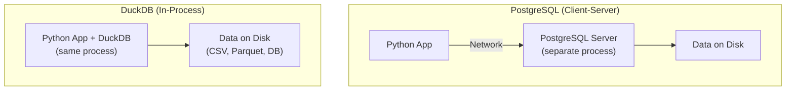
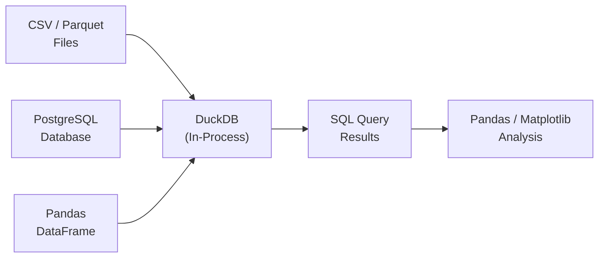
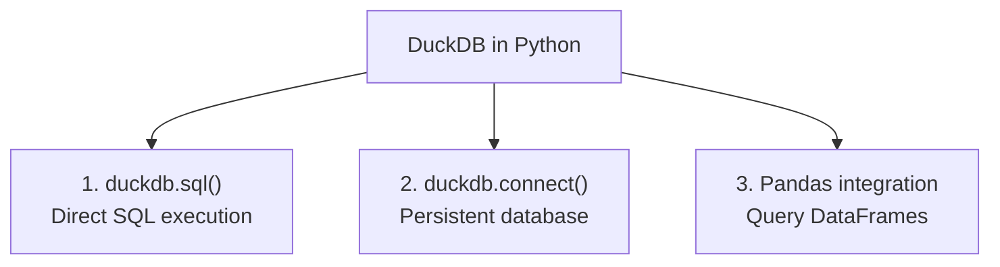

# Introduction to DuckDB

## Learning Objectives

By the end of this lesson, you will be able to:
- Explain DuckDB's in-process architecture and how it differs from PostgreSQL's client-server model
- Read and query data directly from CSV and Parquet files using DuckDB SQL
- Compare Parquet and CSV file formats in terms of performance, compression, and schema enforcement
- Write analytical SQL queries in DuckDB and understand its relationship to PostgreSQL syntax
- Describe when to use DuckDB vs. PostgreSQL in a data science workflow

## The "Why": SQL Without a Server

In Lesson 9, you learned that OLAP engines use column-oriented storage, compression, and vectorized execution to run analytical queries orders of magnitude faster than OLTP databases. Now you'll meet **DuckDB** — an OLAP engine designed specifically for data science workflows.

**The problem DuckDB solves:**

| Traditional Approach | DuckDB Approach |
|:---|:---|
| Install PostgreSQL server | `pip install duckdb` |
| Configure users, ports, passwords | No configuration needed |
| Load data into tables first | Query CSV/Parquet files directly |
| Manage a running server process | Runs inside your Python process |
| Limited to data in the database | Query any file on disk |

DuckDB lets you **execute SQL against files** — no server, no setup, no ETL. It's SQLite for analytics.

> **Analogy:** PostgreSQL is a **city power grid** — always on, serves many users, requires infrastructure and maintenance. DuckDB is a **portable generator** — plug it in anywhere, instant power, just for you.

---

## Core Concept A: DuckDB Architecture

### In-Process vs. Client-Server



**Key Differences:**

| Feature | PostgreSQL | DuckDB |
|:---|:---|:---|
| **Architecture** | Client-server (separate process) | In-process (library, like Pandas) |
| **Installation** | System package + configuration | `pip install duckdb` |
| **Multi-user** | Yes (concurrent connections) | No (single-user, embedded) |
| **Network** | Communicates over TCP/IP | No network — direct memory access |
| **Startup time** | Seconds (server boot) | Milliseconds (library import) |
| **Persistence** | Always persistent (server database) | Optional (in-memory or file-based) |
| **Data sources** | Only data loaded into tables | CSV, Parquet, JSON, Pandas DataFrames, PostgreSQL |

### How DuckDB Fits in Your Workflow



DuckDB acts as a **universal SQL engine** that can query data from multiple sources without requiring you to load everything into a database first.

---

## Core Concept B: File Formats — CSV vs. Parquet

DuckDB can query files directly. Understanding the two most common formats is essential.

### CSV (Comma-Separated Values)

```
student_id,name,department,gpa
1,Alice,CS,3.8
2,Bob,Math,3.2
3,Carol,Physics,3.9
```

**Characteristics:**
- **Format:** Plain text, human-readable
- **Schema:** None — all values are strings until parsed
- **Compression:** None (raw text)
- **Column access:** Must read entire file (row-oriented text)
- **Size:** Large (no compression, repeated delimiters)

### Parquet (Apache Parquet)

Parquet is a **binary columnar file format** designed for analytical workloads.

```
Parquet File Structure:
┌─────────────────────────────────┐
│ File Metadata (schema, stats)   │
├─────────────────────────────────┤
│ Row Group 1                     │
│   ├── Column Chunk: student_id  │
│   ├── Column Chunk: name        │
│   ├── Column Chunk: department  │
│   └── Column Chunk: gpa         │
├─────────────────────────────────┤
│ Row Group 2                     │
│   ├── Column Chunk: student_id  │
│   ├── Column Chunk: name        │
│   ├── Column Chunk: department  │
│   └── Column Chunk: gpa         │
└─────────────────────────────────┘
```

**Characteristics:**
- **Format:** Binary, not human-readable
- **Schema:** Embedded (column names, types, null counts)
- **Compression:** Built-in (Snappy, ZSTD, GZIP per column)
- **Column access:** Read only the columns you need (columnar layout)
- **Size:** Compact (typically 2-10× smaller than CSV)

### Head-to-Head Comparison

| Feature | CSV | Parquet |
|:---|:---|:---|
| **Human-readable** | Yes | No |
| **Schema enforcement** | None | Strong (schema is embedded inside the file itself) |
| **Compression** | None | Built-in (Snappy, ZSTD) |
| **Column pruning** | No (read all columns) | Yes (read only needed columns) |
| **Predicate pushdown** | No | Yes (skip row groups based on stats) |
| **File size (1M rows)** | ~100 MB | ~10-30 MB |
| **Read speed (DuckDB)** | Slower | Much faster |
| **Write speed** | Fast (simple text) | Slower (encoding + compression) |
| **Ecosystem** | Universal (Excel, text editors) | Analytics (Spark, DuckDB, Pandas) |

### When to Use Each

| Use Case | Format | Why |
|:---|:---|:---|
| Sharing data with non-technical users | CSV | Opens in Excel, Google Sheets |
| Quick data export/import | CSV | Simple, universal |
| Analytical pipelines | Parquet | Compression, column pruning, schema |
| Large dataset storage | Parquet | 2-10× smaller files |
| Data exchange between systems | Parquet | Schema preserved, no type ambiguity |
| Debugging / visual inspection | CSV | Human-readable |

---

## Core Concept C: DuckDB SQL

DuckDB uses **standard SQL** with PostgreSQL-compatible syntax. If you know PostgreSQL SQL, you already know DuckDB SQL.

### Reading Files Directly

```sql
-- Read a CSV file as if it were a table
SELECT * FROM 'students.csv';

-- Read a Parquet file
SELECT * FROM 'students.parquet';

-- Read with explicit options
SELECT * FROM read_csv('students.csv', header=true, delim=',');

-- Read multiple files with glob patterns
SELECT * FROM 'data/*.parquet';
```

**This is DuckDB's killer feature:** No CREATE TABLE, no COPY, no ETL. Just point SQL at a file.

### Creating Tables from Files

```sql
-- Create a persistent table from a CSV
CREATE TABLE students AS SELECT * FROM 'students.csv';

-- Create a table from a Parquet file
CREATE TABLE enrollments AS SELECT * FROM 'enrollments.parquet';

-- Create a table from a query
CREATE TABLE cs_students AS
    SELECT * FROM 'students.csv' WHERE department = 'CS';
```

### Writing Query Results to Files

```sql
-- Export to CSV
COPY (SELECT * FROM students WHERE gpa > 3.5)
TO 'high_gpa_students.csv' (HEADER, DELIMITER ',');

-- Export to Parquet
COPY (SELECT * FROM students)
TO 'students.parquet' (FORMAT PARQUET);
```

### DuckDB-Specific Features

DuckDB extends standard SQL with several convenient features:

```sql
-- Exclude columns from SELECT *
SELECT * EXCLUDE (email, phone) FROM students;

-- Replace a column in SELECT *
SELECT * REPLACE (ROUND(gpa, 1) AS gpa) FROM students;

-- String slicing (0-indexed)
SELECT name[1:5] FROM students;

-- List aggregation
SELECT department, LIST(name) AS student_names
FROM students
GROUP BY department;

-- Directly query a Pandas DataFrame (from Python)
-- result = duckdb.sql("SELECT * FROM df WHERE gpa > 3.0")
```

---

## Core Concept D: DuckDB + Python Integration

### Three Ways to Use DuckDB



### 1. Direct SQL (Simplest)

```python
import duckdb

# Query a file directly
result = duckdb.sql("SELECT department, AVG(gpa) FROM 'students.csv' GROUP BY department")
print(result)

# Convert to Pandas DataFrame
df = result.df()
```

### 2. Persistent Database

```python
import duckdb

# Create a persistent database file
conn = duckdb.connect('university.duckdb')

# Create tables, run queries
conn.sql("CREATE TABLE students AS SELECT * FROM 'students.csv'")
result = conn.sql("SELECT COUNT(*) FROM students")

conn.close()
```

### 3. Query Pandas DataFrames

```python
import duckdb
import pandas as pd

# Create a DataFrame
df = pd.read_csv('students.csv')

# Query it with SQL — no loading needed!
result = duckdb.sql("SELECT department, AVG(gpa) FROM df GROUP BY department")
print(result.df())
```

**Why query Pandas with DuckDB?**
- SQL is often more readable than Pandas method chains for complex aggregations
- DuckDB is faster than Pandas for GROUP BY, JOINs, and window functions
- You can join DataFrames with files in a single query

---

## Core Concept E: DuckDB vs. PostgreSQL — Syntax Comparison

For most queries, the syntax is identical. Here are the key differences:

| Feature | PostgreSQL | DuckDB |
|:---|:---|:---|
| **Read CSV** | `COPY ... FROM 'file.csv'` (must create table first) | `SELECT * FROM 'file.csv'` |
| **Read Parquet** | Not supported natively | `SELECT * FROM 'file.parquet'` |
| **String concat** | `'hello' \|\| ' world'` | Same, or `concat('hello', ' world')` |
| **SERIAL/auto-increment** | `SERIAL PRIMARY KEY` | Same |
| **Current timestamp** | `CURRENT_TIMESTAMP` | Same |
| **ILIKE (case-insensitive)** | Supported | Supported |
| **Window functions** | Supported | Supported (same syntax) |
| **CTEs** | Supported | Supported (same syntax) |
| **EXCLUDE columns** | Not supported | `SELECT * EXCLUDE (col1, col2)` |
| **Multi-file queries** | Not supported | `SELECT * FROM 'data/*.csv'` |

**Bottom line:** If you know PostgreSQL SQL, you can use DuckDB immediately. DuckDB adds convenience features but doesn't remove anything you know.

---

## Deep Dive: Predicate Pushdown in Parquet (Optional)

<details>
<summary>Click to expand: Predicate Pushdown in Parquet</summary>

Parquet files store **column statistics** (min, max, null count) for each row group. DuckDB uses these statistics to **skip entire row groups** that can't match a filter condition.

**Example:** Query `SELECT * FROM students WHERE gpa > 3.5`

```
Row Group 1: gpa min=1.2, max=2.8  → SKIP (max < 3.5)
Row Group 2: gpa min=2.5, max=4.0  → READ (might contain matches)
Row Group 3: gpa min=0.5, max=1.9  → SKIP (max < 3.5)
```

Without reading a single data value, DuckDB eliminates 2 out of 3 row groups. This is called **predicate pushdown** — the filter condition is "pushed down" into the file reader.

**CSV files can't do this** because they have no metadata. Every row must be read and parsed, then filtered.

This is why Parquet queries can be 10-100× faster than CSV for selective filters on large files.

</details>

---

## FAQ / Industry Reality

### "Should I learn DuckDB or Pandas for data analysis?"

**A:** Both, but for different purposes:

| Task | Better Tool | Why |
|:---|:---|:---|
| Quick data exploration | Pandas | `.head()`, `.describe()`, `.plot()` |
| Complex aggregations | DuckDB | SQL is more readable than method chains |
| JOINing multiple tables | DuckDB | SQL JOINs are clearer and faster |
| Data cleaning/transformation | Pandas | `.fillna()`, `.apply()`, `.str` methods |
| Window functions | DuckDB | SQL window functions are standard and well-documented |
| Large files (>1GB) | DuckDB | Doesn't load everything into memory |

**In practice:** Load data with DuckDB SQL, analyze in Pandas, visualize with Matplotlib.

### "Can DuckDB replace PostgreSQL?"

**A:** No. DuckDB is **single-user** and **in-process** — it can't serve a web application with thousands of concurrent users. PostgreSQL handles multi-user ACID transactions that DuckDB doesn't support. They serve different roles:

- **PostgreSQL:** Production database for applications (OLTP)
- **DuckDB:** Local analytics engine for data scientists (OLAP)

### "What is Parquet and why should I care?"

**A:** Parquet is the **standard file format for analytical data**. It's used by:
- Apache Spark, Databricks
- AWS Athena, Google BigQuery
- Pandas (`pd.read_parquet()`)
- DuckDB (native support)

If you work with data pipelines, ML training data, or cloud analytics, you'll encounter Parquet files constantly. Understanding Parquet is as fundamental as understanding CSV.

### "Does DuckDB use Parquet as its internal storage format?"

**A:** No. DuckDB uses its own proprietary columnar format (`.duckdb` file). Parquet is an **external interchange format** that DuckDB reads and writes very efficiently — but internally, DuckDB stores persistent data in a format optimized for its own execution engine. Think of Parquet as a language DuckDB speaks fluently, not the language it thinks in.

---

## Summary & Next Steps

In this lesson, you learned about DuckDB as an in-process OLAP engine:

- **In-Process Architecture:** DuckDB runs inside your Python process — no server, no setup
- **File Querying:** Query CSV and Parquet files directly with SQL (`SELECT * FROM 'file.csv'`)
- **CSV vs. Parquet:** Parquet is columnar, compressed, and schema-aware — ideal for analytics
- **Python Integration:** Use `duckdb.sql()`, persistent connections, or query Pandas DataFrames
- **SQL Compatibility:** DuckDB uses PostgreSQL-compatible SQL with convenient extensions
- **Workflow Position:** DuckDB sits between raw data (files) and analysis tools (Pandas/Matplotlib)

**Connection to Lesson 9:** DuckDB implements the column-oriented storage, compression, and vectorized execution concepts you learned. It's the practical realization of those architectural principles.

---

## Further Reading

### Documentation
- [DuckDB Documentation](https://duckdb.org/docs/) — Official reference for all DuckDB features
- [DuckDB Python API](https://duckdb.org/docs/api/python/overview) — Python integration guide
- [Apache Parquet Format](https://parquet.apache.org/docs/overview/) — Official Parquet specification

### Articles & Tutorials
- [DuckDB: Why DuckDB?](https://duckdb.org/why_duckdb) — Design philosophy and use cases
- [DuckDB vs. Pandas Performance](https://duckdb.org/2021/05/14/sql-on-pandas.html) — Benchmark comparison
- [The Parquet Format and Performance Optimization](https://www.databricks.com/glossary/what-is-parquet) — Practical overview of Parquet
