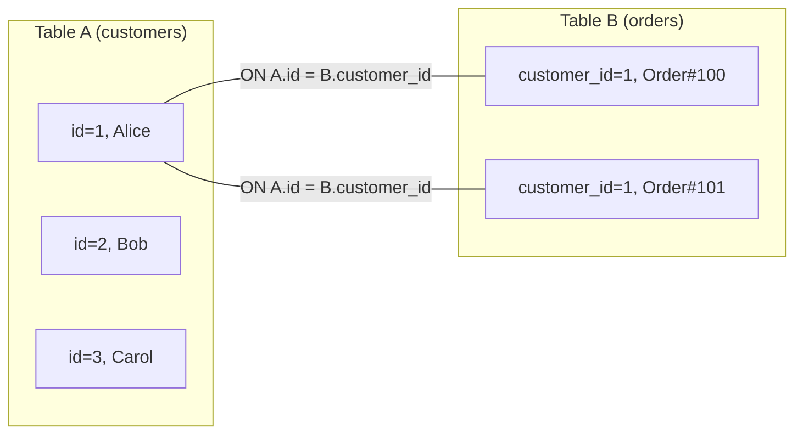
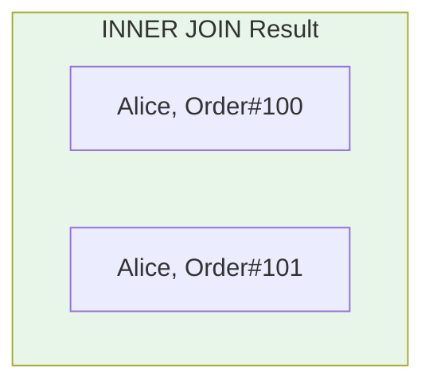
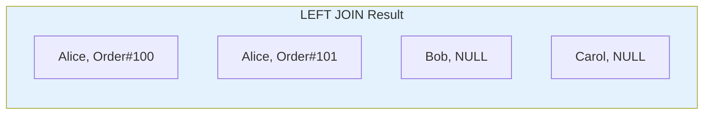
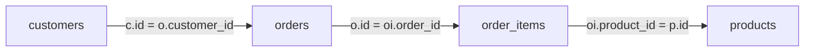

# Complex Joins

## Learning Objectives

By the end of this lesson, you will be able to:
- Distinguish between INNER, LEFT, RIGHT, and FULL OUTER joins and explain when to use each
- Write multi-table joins that chain three or more tables together
- Identify NULL rows produced by outer joins and explain why they appear
- Avoid common join pitfalls such as Cartesian products and duplicate rows
- Choose the correct join type to answer a given analytical question

## The "Why": Connecting the Dots

In the real world, data is never stored in a single table. A customer's full story — who they are, what they bought, when they bought it, and which products they chose — lives across multiple tables. **Joins are how you reassemble the full picture from normalized data.**

> **Analogy:** Imagine you're organizing a conference. You have three separate guest lists: one from registration, one from meal preferences, and one from workshop sign-ups. To create a complete attendee profile, you need to **match** rows across all three lists by attendee ID. Some people registered but didn't sign up for a workshop. Some signed up for meals but their registration is missing. Joins let you decide: do you want only people on **all** lists (INNER JOIN), everyone from registration **even if they skipped** workshops (LEFT JOIN), or **everyone from every list** regardless of gaps (FULL OUTER JOIN)?

In data science, you'll constantly join:
- **Fact tables** (transactions, events, measurements) with **dimension tables** (customers, products, dates)
- **User activity logs** with **user profiles**
- **Survey responses** with **demographic data**

Mastering joins is the single most important SQL skill for analytical work.

---

## Core Concept A: How Joins Work

A join combines rows from two tables based on a **matching condition**, specified in the `ON` clause. The database evaluates every possible pair of rows and keeps only those where the condition is true.



**The join condition** (`ON A.id = B.customer_id`) determines which rows pair together. Different join types decide what happens to **unmatched** rows.

### The Four Join Types at a Glance

| Join Type | Keeps from Left | Keeps from Right | Unmatched Rows |
|:---|:---|:---|:---|
| **INNER JOIN** | Only matched (may duplicate) | Only matched (may duplicate) | Discarded from both sides |
| **LEFT JOIN** | All rows (may duplicate per right match) | Only matched | Left unmatched → NULLs for right columns |
| **RIGHT JOIN** | Only matched | All rows (may duplicate per left match) | Right unmatched → NULLs for left columns |
| **FULL OUTER JOIN** | All rows (may duplicate per right match) | All rows (may duplicate per left match) | NULLs on whichever side has no match |

---

## Core Concept B: INNER JOIN

An INNER JOIN returns **only the rows that have a match in both tables**. If a row in the left table has no match in the right table, it's excluded — and vice versa.



In the example above, Bob (no orders) and Carol (no orders) are **excluded**. Alice, who has two orders, appears **twice** in the result — one row per matching order. This is correct and expected behavior for a one-to-many relationship.

### Syntax

```sql
SELECT c.name, o.order_id, o.order_date
FROM customers AS c
INNER JOIN orders AS o
    ON c.id = o.customer_id;
```

### When to Use INNER JOIN

- You want **only rows with complete data on both sides**
- "Show me customers who have placed at least one order"
- "List products that have been sold"

**Key property:** INNER JOIN can never produce NULL values from the join itself (both sides must match).

---

## Core Concept C: LEFT JOIN

A LEFT JOIN returns **all rows from the left table**, plus matching rows from the right table. When there's no match, the right-side columns are filled with NULL.



Bob and Carol appear in the result even though they have no orders — their order columns are NULL.

### Syntax

```sql
SELECT c.name, o.order_id, o.order_date
FROM customers AS c
LEFT JOIN orders AS o
    ON c.id = o.customer_id;
```

### The "Find Missing" Pattern

LEFT JOIN's most powerful use is finding rows in the left table that **don't exist** in the right table:

```sql
-- Find customers who have NEVER placed an order
SELECT c.name
FROM customers AS c
LEFT JOIN orders AS o
    ON c.id = o.customer_id
WHERE o.order_id IS NULL;
```

The `WHERE o.order_id IS NULL` filter keeps only the unmatched rows — those customers with no orders.

### When to Use LEFT JOIN

- You want **all rows from the primary table**, even if related data is missing
- "Show all customers and their orders (if any)"
- "Find customers who haven't ordered"
- "List all products with their reviews, including unreviewed products"

**LEFT JOIN is the most commonly used join in analytics** — it preserves your primary dataset's completeness.

---

## Core Concept D: RIGHT JOIN and FULL OUTER JOIN

### RIGHT JOIN

A RIGHT JOIN is the mirror image of LEFT JOIN: it keeps **all rows from the right table** and fills NULLs for unmatched left-side rows.

```sql
SELECT c.name, o.order_id
FROM customers AS c RIGHT JOIN orders AS o
    ON c.id = o.customer_id;
```

In practice, most SQL developers **rewrite RIGHT JOINs as LEFT JOINs** by swapping the table order. The two queries below are equivalent:

```sql
-- RIGHT JOIN
SELECT c.name, o.order_id
FROM customers AS c RIGHT JOIN orders AS o 
  ON c.id = o.customer_id;

-- Equivalent LEFT JOIN (preferred style)
SELECT c.name, o.order_id
FROM orders AS o LEFT JOIN customers AS c 
  ON c.id = o.customer_id;
```

### FULL OUTER JOIN

A FULL OUTER JOIN keeps **all rows from both tables**. Unmatched rows on either side get NULLs for the other side's columns.

FULL OUTER JOIN makes the most sense when **neither table is a strict subset of the other**. Example: comparing which products sold in Q1 versus Q2. Each snapshot is computed independently — neither has a FK relationship to the other.

| Q1 sold products | | Q2 sold products |
|:---|:---|:---|
| Product_A | matched | Product_A |
| Product_B | matched | Product_B |
| Product_C | Q1 only | *(absent)* |
| *(absent)* | Q2 only | Product_D |

Product_C sold in Q1 but had zero Q2 sales — perhaps it was discontinued. Product_D is new to Q2 and had no Q1 history. A LEFT JOIN would drop Product_D; a RIGHT JOIN would drop Product_C. Only FULL OUTER JOIN surfaces both.

### When to Use FULL OUTER JOIN

- **Period-over-period comparison** — finding items that appear in one time window but not another
- **Data reconciliation** — comparing two independent snapshots to find gaps on either side
- "Which products sold in Q1 had no Q2 sales, and which Q2 products are newly launched?"
- FULL OUTER JOIN is **rare in production analytics** but essential for gap analysis and data quality checks

---

## Core Concept E: Multi-Table Joins

Real analytical queries often join three, four, or more tables. You chain joins one after another:

```sql
SELECT
    c.name AS customer,
    o.order_id,
    o.order_date,
    p.name AS product,
    p.category,
    oi.quantity,
    oi.unit_price,
    oi.quantity * oi.unit_price AS line_total
FROM customers AS c
INNER JOIN orders AS o
    ON c.id = o.customer_id
INNER JOIN order_items AS oi
    ON o.id = oi.order_id
INNER JOIN products AS p
    ON oi.product_id = p.id;
```

### The Join Chain



### Best Practices for Multi-Table Joins

1. **Use table aliases** — `c`, `o`, `oi`, `p` are much more readable than full table names
2. **Start from the table you care about most** — usually the fact table or the entity you're reporting on
3. **Choose the right join type per relationship:**
   - Use INNER JOIN when both sides must exist
   - Use LEFT JOIN when the left side is your primary dataset
4. **Be explicit about which columns come from which table** — always prefix with the alias (`c.name`, not just `name`)

---

## Core Concept F: Join Pitfalls

### Pitfall 1: Missing ON Clause (Cartesian Product)

Forgetting the `ON` clause — or joining on the wrong column — produces a **Cartesian product**, where every row in Table A is paired with every row in Table B:

```sql
-- WRONG: Forgot the ON clause — this is an implicit CROSS JOIN
SELECT c.name, o.order_id
FROM customers AS c, orders AS o;  -- 5,000 × 50,000 = 250,000,000 rows!
```

(`CROSS JOIN` is valid SQL for when you *intentionally* want every combination, but accidentally omitting `ON` in a regular join produces the same explosive result.)

If your join result has unexpectedly large row counts, check your ON clause first.

### Pitfall 2: Duplicate Rows from One-to-Many

When joining a one-to-many relationship (e.g., one customer → many orders), the "one" side gets repeated:

```
customer_name | order_id
--------------|---------
Alice         | 100      ← Alice appears 3 times
Alice         | 101      ← because she has 3 orders
Alice         | 102
Bob           | 103
```

This is correct behavior, but it means **you can't simply COUNT(*) to get the number of customers** — you'd be counting rows, not distinct customers. Use `COUNT(DISTINCT c.id)` instead.

### Pitfall 3: NULLs in Join Columns

NULLs **never match** in a join condition — `NULL = NULL` evaluates to UNKNOWN, not TRUE. If `customer_id` is NULL in the orders table, that row is silently excluded from an INNER JOIN:

```sql
-- Suppose orders contains a row: (id=999, customer_id=NULL, ...)
-- The join condition NULL = c.id evaluates to UNKNOWN → row is dropped
SELECT c.name, o.id AS order_id
FROM customers AS c
INNER JOIN orders AS o ON c.id = o.customer_id;
-- order 999 never appears in the result
```

The same applies to outer joins: a NULL join key will not match any row on the other side, so the NULL row still gets the outer-join NULL-padding treatment rather than a match.

Be aware of NULL join keys in your data — they're a common source of "missing" rows.

### Pitfall 4: A Downstream INNER JOIN Silently Cancels a LEFT JOIN

Because joins are evaluated left-to-right, a later INNER JOIN operates on the output of an earlier LEFT JOIN. Any NULL rows produced by the LEFT JOIN will fail the INNER JOIN condition and be dropped — effectively turning the LEFT JOIN into an INNER JOIN:

```sql
-- INTENT: keep all orders, even those with no items
FROM customers AS c
INNER JOIN orders AS o       ON c.id = o.customer_id
LEFT JOIN order_items AS oi  ON o.id = oi.order_id   -- NULLs produced here...
INNER JOIN products AS p     ON oi.product_id = p.id -- ...are dropped here (NULL ≠ any p.id)
```

The LEFT JOIN appears to preserve orders with no items, but `oi.product_id` is NULL for those rows and `NULL = p.id` evaluates to UNKNOWN — so the final INNER JOIN silently discards them. To actually preserve those orders, the products join must also be a LEFT JOIN:

```sql
FROM customers AS c
INNER JOIN orders AS o       ON c.id = o.customer_id
LEFT JOIN order_items AS oi  ON o.id = oi.order_id
LEFT JOIN products AS p      ON oi.product_id = p.id  -- NULLs now pass through
```

**Rule of thumb:** once you introduce a LEFT JOIN in a chain, every subsequent join on the outer side's columns must also be a LEFT JOIN to preserve the intended rows.

---

## Deep Dive: Join Algorithms (Optional)

<details>
<summary>Click to expand: How databases execute joins internally</summary>

When you write a JOIN, the database engine must decide **how** to physically match rows. There are three main algorithms:

### Nested Loop Join

The simplest approach: for each row in Table A, scan all rows in Table B looking for matches.

```
For each row in customers:          -- 5,000 rows
    For each row in orders:         -- 50,000 rows
        If customer.id = order.customer_id:
            Emit matched row
```

- **Time complexity:** O(n × m) — very slow for large tables
- **When used:** Small tables, or when an index exists on the inner table

### Hash Join

Build a hash table on the smaller table, then probe it with the larger table.

```
Step 1: Build hash table from customers (5,000 rows)
    hash(customer.id) → customer row

Step 2: Probe with orders (50,000 rows)
    For each order:
        Look up hash(order.customer_id)
        If found → emit matched row
```

- **Time complexity:** O(n + m) — much faster
- **When used:** DuckDB's default for most joins

### Sort-Merge Join

Sort both tables by the join key, then merge them like a zipper.

```
Step 1: Sort customers by id
Step 2: Sort orders by customer_id
Step 3: Walk both sorted lists simultaneously
    Advance pointers to match rows
```

- **Time complexity:** O(n log n + m log m)
- **When used:** When data is already sorted, or for range joins

**DuckDB primarily uses hash joins**, which is why it performs well on large analytical datasets without requiring indexes.

</details>

---

## FAQ / Industry Reality

### "LEFT JOIN vs LEFT OUTER JOIN — is there a difference?"

**A:** No. `LEFT JOIN` and `LEFT OUTER JOIN` are identical in every SQL database. The `OUTER` keyword is optional. Similarly, `RIGHT JOIN` = `RIGHT OUTER JOIN` and `FULL JOIN` = `FULL OUTER JOIN`. Most developers prefer the shorter form.

### "Should I always use INNER JOIN?"

**A:** No. In analytics, **LEFT JOIN is more common** because you typically want to preserve all rows from your primary dataset even when related data is missing. INNER JOIN silently drops rows, which can make your counts look wrong. Start with LEFT JOIN and only switch to INNER JOIN when you specifically want to exclude unmatched rows.

### "How does a SQL JOIN relate to Pandas merge?"

**A:** They're conceptually identical:

| SQL | Pandas |
|:---|:---|
| `INNER JOIN ... ON a.id = b.id` | `df.merge(other, how='inner', on='id')` |
| `LEFT JOIN ... ON a.id = b.id` | `df.merge(other, how='left', on='id')` |
| `RIGHT JOIN ... ON a.id = b.id` | `df.merge(other, how='right', on='id')` |
| `FULL OUTER JOIN ... ON a.id = b.id` | `df.merge(other, how='outer', on='id')` |
| `ON a.id = b.fk` (different names) | `left_on='id', right_on='fk'` |

> **Note:** Omitting `on=` in `df.merge()` joins on all column names common to both DataFrames — the pandas equivalent of `NATURAL JOIN`. This can silently produce wrong results if both DataFrames share an unintended column name (e.g., both have a `date` column). Always specify `on=` explicitly.

SQL JOINs are typically faster than Pandas merges for large datasets because DuckDB uses hash joins and vectorized execution.

### "My join produced way more rows than expected. What happened?"

**A:** This usually means one of two things:
1. **Cartesian product** — you forgot the `ON` clause or joined on the wrong column
2. **Many-to-many relationship** — both tables have duplicate values in the join column, causing multiplicative row growth. Use `COUNT(DISTINCT ...)` or investigate your data's cardinality.

---

## Summary & Next Steps

In this lesson, you learned the four SQL join types:

- **INNER JOIN:** Only matched rows from both tables
- **LEFT JOIN:** All left rows + matched right rows (NULLs for unmatched)
- **RIGHT JOIN:** Mirror of LEFT JOIN (all right rows preserved)
- **FULL OUTER JOIN:** All rows from both tables (NULLs on either side)

You also learned to chain multi-table joins and avoid common pitfalls like Cartesian products, duplicate rows, and NULL join keys.

---

## Further Reading

### Textbook
- *Database Design, 2nd Ed.* by Adrienne Watt — [Chapter 9: SQL Joins](https://opentextbc.ca/dbdesign01/chapter/chapter-9-sql-joins/) — Foundational coverage of join types with examples

### Documentation
- [DuckDB JOIN Documentation](https://duckdb.org/docs/sql/query_syntax/from.html#joins) — Join syntax and DuckDB-specific behavior
- [PostgreSQL JOIN Tutorial](https://www.postgresql.org/docs/current/tutorial-join.html) — Official PostgreSQL guide to joins (syntax transfers to DuckDB)

### Articles & Tutorials
- [Visual Representation of SQL Joins](https://www.codeproject.com/Articles/33052/Visual-Representation-of-SQL-Joins) — Classic visual guide using Venn-style diagrams
