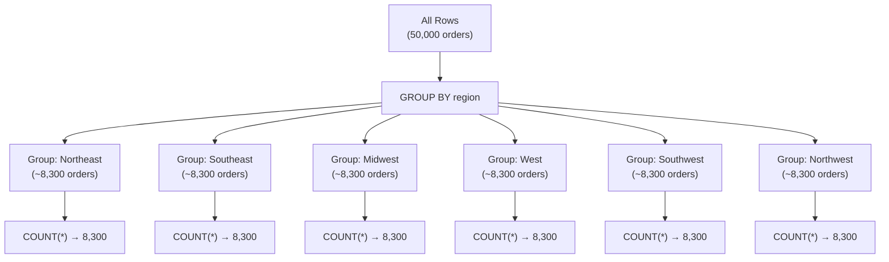
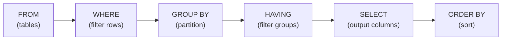
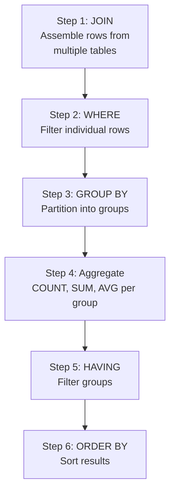

# Aggregation & Grouping

## Learning Objectives

By the end of this lesson, you will be able to:
- Use the five core aggregate functions: COUNT, SUM, AVG, MIN, MAX
- Explain GROUP BY semantics — how rows are partitioned and aggregated
- Filter groups with HAVING and distinguish it from WHERE
- Write multi-level GROUP BY queries with two or more grouping columns
- Combine JOINs with GROUP BY to produce summary reports from multiple tables

## The "Why": From Rows to Insights

Raw data is rows. **Insights are aggregates.** Nobody reads 50,000 order rows — they want to know total revenue, average order value, and top-selling categories. Aggregation is the bridge between raw data and the dashboards, reports, and KPIs that drive business decisions.

> **Analogy:** Imagine you have a shoebox full of individual grocery receipts from the past year. That's your raw data. Now imagine creating a monthly spending summary: total spent per month, average per trip, which store you visit most. That summary is **aggregation** — compressing thousands of individual data points into a handful of meaningful numbers.

In data science, nearly every analytical question involves aggregation:
- "What is the average customer lifetime value?"
- "Which product category generates the most revenue?"
- "How many orders were placed per month?"

GROUP BY and aggregate functions are the SQL tools that answer these questions.

---

## Dataset Used in This Lesson

All examples query a ShopStream e-commerce dataset (the same one built in the lab):

```
customers  (id, name, city, region, signup_date)
products   (id, name, category, price)
orders     (id, customer_id, order_date, status)   -- status: 'completed' | 'pending' | 'cancelled'
order_items(id, order_id, product_id, quantity, unit_price)
```

The lab generates this dataset synthetically: 5,000 customers, 200 products, 50,000 orders, and ~150,000 order items.

---

## Core Concept A: Aggregate Functions

An aggregate function takes **many rows** as input and produces **one value** as output.

### The Five Core Functions

| Function | Description | NULL Handling |
|:---|:---|:---|
| `COUNT(*)` | Number of rows | Counts all rows (including NULLs) |
| `COUNT(column)` | Number of non-NULL values | Skips NULL values |
| `SUM(column)` | Total of all values | Ignores NULLs |
| `AVG(column)` | Average (mean) of all values | Ignores NULLs |
| `MIN(column)` | Smallest value | Ignores NULLs |
| `MAX(column)` | Largest value | Ignores NULLs |

### COUNT(*) vs COUNT(column)

This distinction is critical:

```sql
-- Table: employees
-- id | name   | bonus
-- 1  | Alice  | 1000
-- 2  | Bob    | NULL
-- 3  | Carol  | 500

SELECT COUNT(*) FROM employees;           -- Returns 3 (counts all rows)
SELECT COUNT(bonus) FROM employees;       -- Returns 2 (skips NULL bonus)
SELECT COUNT(DISTINCT bonus) FROM employees; -- Returns 2 (1000 and 500)
```

### Using Aggregates Without GROUP BY

When used without GROUP BY, aggregate functions operate on **the entire table**:

```sql
SELECT
    COUNT(*) AS total_orders,
    SUM(quantity * unit_price) AS total_revenue,
    AVG(quantity * unit_price) AS avg_line_total,
    MIN(unit_price) AS cheapest_item,
    MAX(unit_price) AS most_expensive_item
FROM order_items;
```

This returns a **single row** summarizing the entire table.

---

## Core Concept B: GROUP BY

GROUP BY partitions rows into groups based on one or more columns, then applies aggregate functions **to each group separately**.

### The Rule

> **Every column in SELECT must either be in the GROUP BY clause or inside an aggregate function.**

This is the most common GROUP BY error. The database needs to know: for each group, what single value should this column show?

```sql
-- CORRECT: region is in GROUP BY, COUNT is an aggregate
SELECT region, COUNT(*) AS order_count
FROM customers
GROUP BY region;

-- ERROR: name is not in GROUP BY and not aggregated
SELECT region, name, COUNT(*) AS order_count
FROM customers
GROUP BY region;
-- "column name must appear in GROUP BY or be used in an aggregate function"
```

### How GROUP BY Works — Step by Step



**Conceptually:**
1. The database sorts/partitions all rows into buckets by the GROUP BY column(s)
2. For each bucket, it runs the aggregate function(s)
3. Each bucket produces exactly one output row

### Examples

```sql
-- Revenue by product category
SELECT
    category,
    COUNT(*) AS items_sold,
    SUM(quantity) AS total_units,
    ROUND(SUM(quantity * unit_price), 2) AS revenue
FROM order_items AS oi
JOIN products AS p ON oi.product_id = p.id
GROUP BY category
ORDER BY revenue DESC;
```

```sql
-- Orders by status
SELECT
    status,
    COUNT(*) AS order_count,
    ROUND(100.0 * COUNT(*) / SUM(COUNT(*)) OVER (), 1) AS percentage
FROM orders
GROUP BY status;
```

---

## Core Concept C: HAVING

HAVING filters **groups** after aggregation. It's the aggregate equivalent of WHERE.

### WHERE vs HAVING



| Clause | Filters | When it Runs | Can Use Aggregates? |
|:---|:---|:---|:---|
| **WHERE** | Individual rows | Before GROUP BY | No |
| **HAVING** | Groups (aggregated results) | After GROUP BY | Yes |

### Example

```sql
-- Find categories with revenue over $1,000,000
SELECT
    category,
    ROUND(SUM(quantity * unit_price), 2) AS revenue
FROM order_items AS oi
JOIN products AS p ON oi.product_id = p.id
GROUP BY category
HAVING SUM(quantity * unit_price) > 1000000
ORDER BY revenue DESC;
```

### WHERE + HAVING Together

You can use both in the same query — WHERE filters rows before grouping, HAVING filters groups after:

```sql
-- Among completed orders only, find categories with > 500 items sold
SELECT
    p.category,
    COUNT(*) AS items_sold,
    ROUND(SUM(oi.quantity * oi.unit_price), 2) AS revenue
FROM order_items AS oi
JOIN orders AS o ON oi.order_id = o.id
JOIN products AS p ON oi.product_id = p.id
WHERE o.status = 'completed'          -- row filter: only completed orders
GROUP BY p.category
HAVING COUNT(*) > 500                 -- group filter: only big categories
ORDER BY revenue DESC;
```

---

## Core Concept D: Multi-Level Grouping

You can GROUP BY multiple columns to create hierarchical summaries.

```sql
-- Revenue by region AND category
SELECT
    c.region,
    p.category,
    COUNT(DISTINCT o.id) AS order_count,
    ROUND(SUM(oi.quantity * oi.unit_price), 2) AS revenue
FROM customers AS c
JOIN orders AS o ON c.id = o.customer_id
JOIN order_items AS oi ON o.id = oi.order_id
JOIN products AS p ON oi.product_id = p.id
GROUP BY c.region, p.category
ORDER BY c.region, revenue DESC;
```

This produces one row for each unique (region, category) combination — e.g., "Northeast + Electronics", "Northeast + Clothing", "Southeast + Electronics", etc.

### Choosing Grouping Levels

| Grouping | Rows Produced | Detail Level |
|:---|:---|:---|
| `GROUP BY region` | 6 rows | Regional summary |
| `GROUP BY region, category` | 36 rows | Regional × Category |
| `GROUP BY region, category, status` | 108 rows | Regional × Category × Status |
| No GROUP BY | 1 row | Grand total |

More grouping columns = more rows = more detail. Fewer grouping columns = fewer rows = higher-level summary.

---

## Core Concept E: Combining JOINs + Aggregations

The most powerful analytical pattern is: **JOIN to assemble data, GROUP BY to summarize.**

### The Pattern



### SQL Execution Order

The order SQL clauses execute is different from how you write them:

| Write Order | Execution Order | Purpose |
|:---|:---|:---|
| SELECT | 5th | Choose output columns |
| FROM / JOIN | 1st | Identify source tables |
| WHERE | 2nd | Filter individual rows |
| GROUP BY | 3rd | Partition into groups |
| HAVING | 4th | Filter groups |
| ORDER BY | 6th | Sort final output |
| LIMIT | 7th | Restrict row count |

Understanding execution order explains why:
- You **can't** use a SELECT alias in WHERE (WHERE runs before SELECT)
- You **can** use a SELECT alias in ORDER BY (ORDER BY runs after SELECT)
- You **must** use the raw expression (not alias) in HAVING in some databases

### Example: Top-Spending Customers

```sql
SELECT
    c.name,
    c.region,
    COUNT(DISTINCT o.id) AS total_orders,
    ROUND(SUM(oi.quantity * oi.unit_price), 2) AS total_spent
FROM customers AS c
JOIN orders AS o ON c.id = o.customer_id
JOIN order_items AS oi ON o.id = oi.order_id
WHERE o.status = 'completed'
GROUP BY c.id, c.name, c.region
HAVING SUM(oi.quantity * oi.unit_price) > 10000
ORDER BY total_spent DESC
LIMIT 10;
```

This query:
1. **JOINs** three tables to connect customers → orders → line items
2. **WHERE** filters to completed orders only
3. **GROUP BY** customer to get per-customer totals
4. **HAVING** keeps only customers who spent > $10,000
5. **ORDER BY** sorts by spending, descending
6. **LIMIT** shows the top 10

---

## Deep Dive: NULL Semantics in Aggregates (Optional)

<details>
<summary>Click to expand: How aggregate functions handle NULLs</summary>

NULLs in SQL mean "unknown" — and each aggregate function handles them differently.

### Function-by-Function Behavior

| Function | Input: [10, NULL, 30, NULL, 50] | Result |
|:---|:---|:---|
| `COUNT(*)` | Counts all 5 rows | **5** |
| `COUNT(column)` | Counts non-NULL values | **3** |
| `SUM(column)` | 10 + 30 + 50 (ignores NULLs) | **90** |
| `AVG(column)` | 90 / 3 (divides by non-NULL count) | **30** |
| `MIN(column)` | Smallest non-NULL | **10** |
| `MAX(column)` | Largest non-NULL | **50** |

### The AVG Trap

`AVG` divides by the count of **non-NULL values**, not by the total row count. This can produce surprising results:

```sql
-- Table: reviews (rating can be NULL if customer didn't rate)
-- product | rating
-- A       | 5
-- A       | 3
-- A       | NULL
-- B       | 4

SELECT product, AVG(rating), COUNT(*), COUNT(rating)
FROM reviews GROUP BY product;

-- Product A: AVG = 4.0 (average of 5,3 = 8/2, NOT 8/3)
-- Product B: AVG = 4.0 (average of 4 = 4/1)
```

If you want NULLs to count as zero, use `COALESCE`:

```sql
SELECT product, AVG(COALESCE(rating, 0)) AS avg_including_nulls
FROM reviews GROUP BY product;
-- Product A: AVG = 2.67 (8/3, treating NULL as 0)
```

### GROUP BY and NULLs

NULLs form their **own group** in GROUP BY:

```sql
-- If region has some NULL values:
SELECT region, COUNT(*) FROM customers GROUP BY region;
-- Returns: Northeast: 800, Southeast: 750, ..., NULL: 50
```

</details>

---

## FAQ / Industry Reality

### "I keep getting 'column must appear in GROUP BY' errors"

**A:** This is the #1 GROUP BY mistake. Every column in your SELECT must either:
1. Be listed in GROUP BY, OR
2. Be inside an aggregate function (COUNT, SUM, AVG, etc.)

```sql
-- ERROR: customer_name not in GROUP BY or aggregate
SELECT region, customer_name, COUNT(*) FROM orders GROUP BY region;

-- FIX 1: Add to GROUP BY (if you want per-customer counts)
SELECT region, customer_name, COUNT(*) FROM orders GROUP BY region, customer_name;

-- FIX 2: Aggregate it (if you just want one name per region)
SELECT region, MIN(customer_name), COUNT(*) FROM orders GROUP BY region;
```

### "When do I use WHERE vs HAVING?"

**A:** Simple rule:
- **WHERE** = filtering individual rows (before grouping): "only completed orders"
- **HAVING** = filtering groups (after aggregation): "only categories with revenue > $1M"

If your filter doesn't involve an aggregate function, use WHERE. If it does, use HAVING.

### "Can I GROUP BY a column not in SELECT?"

**A:** Yes! You can GROUP BY any column, even if it doesn't appear in SELECT. This is useful when you want to aggregate at a certain level but don't need to display the grouping key:

```sql
-- Count distinct categories per region (region is grouped, but we only show counts)
SELECT COUNT(DISTINCT category) AS categories
FROM products;
```

However, most GROUP BY queries include the grouping column in SELECT for clarity.

### "How is this different from Pandas groupby?"

**A:** Conceptually identical. The syntax maps directly:

| SQL | Pandas |
|:---|:---|
| `GROUP BY region` | `df.groupby('region')` |
| `COUNT(*)` | `.size()` or `.count()` |
| `SUM(revenue)` | `.agg({'revenue': 'sum'})` |
| `HAVING COUNT(*) > 10` | `.filter(lambda x: len(x) > 10)` |

SQL is often more readable for complex multi-table aggregations. Pandas is better for row-level transformations.

---

## Summary & Next Steps

In this lesson, you learned:

- **Aggregate Functions:** COUNT, SUM, AVG, MIN, MAX compress many rows into one value
- **GROUP BY:** Partitions rows into groups before aggregation; all non-aggregated columns must be in GROUP BY
- **HAVING:** Filters groups after aggregation (vs. WHERE which filters rows before)
- **Multi-Level Grouping:** GROUP BY col1, col2 creates hierarchical summaries
- **JOINs + Aggregations:** The core analytical pattern — JOIN to assemble, GROUP BY to summarize
- **Execution Order:** FROM → WHERE → GROUP BY → HAVING → SELECT → ORDER BY

---

## Further Reading

### Textbook
- *Database Design, 2nd Ed.* by Adrienne Watt — [Chapter 9: SQL Aggregate Functions](https://opentextbc.ca/dbdesign01/chapter/chapter-9-sql-aggregate-functions/) — Foundational coverage of COUNT, SUM, AVG, GROUP BY

### Documentation
- [DuckDB Aggregation Functions](https://duckdb.org/docs/sql/functions/aggregates) — Complete list of DuckDB aggregate functions including MEDIAN, STDDEV, and more
- [PostgreSQL GROUP BY Documentation](https://www.postgresql.org/docs/current/queries-table-expressions.html#QUERIES-GROUP) — Official reference for GROUP BY and HAVING

### Articles & Tutorials
- [SQL GROUP BY — Mode Analytics Tutorial](https://mode.com/sql-tutorial/sql-group-by/) — Interactive tutorial with exercises and visual explanations
