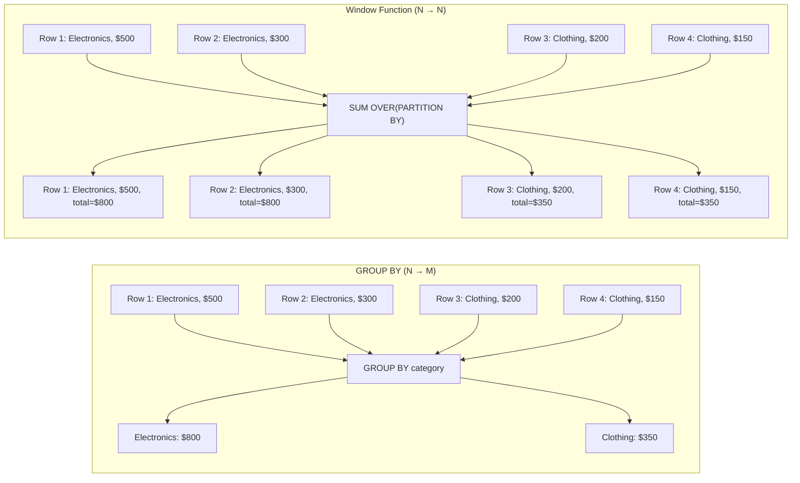
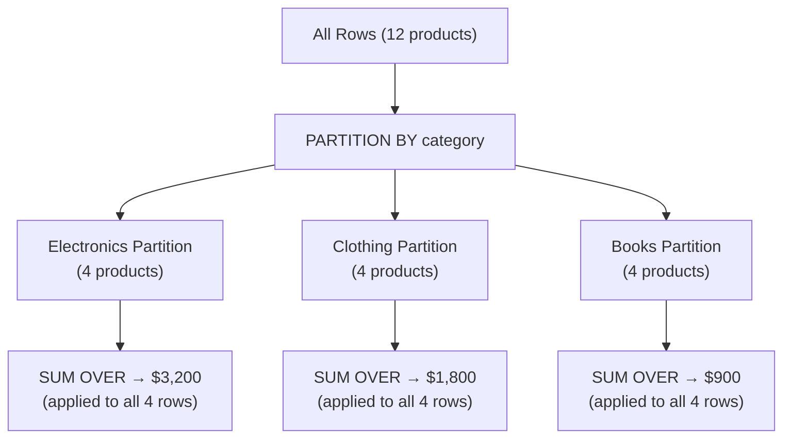
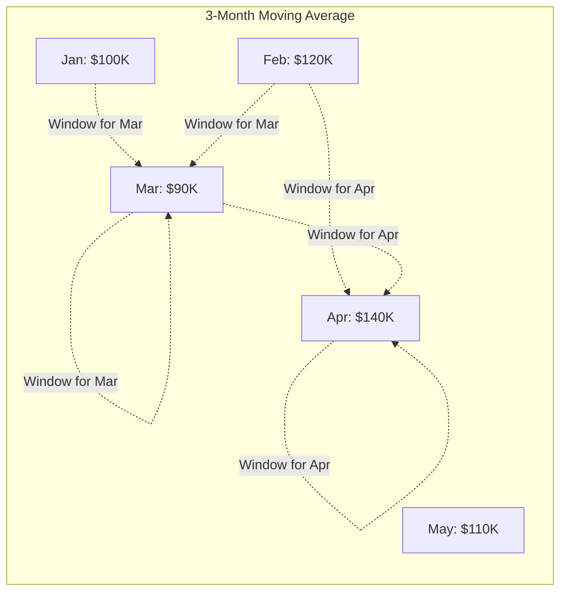

# Window Functions

## Learning Objectives

By the end of this lesson, you will be able to:
- Explain the OVER clause and how it defines a "window" of rows for computation
- Use PARTITION BY and ORDER BY within OVER to control grouping and sequencing
- Apply RANK, DENSE_RANK, and ROW_NUMBER to produce rankings
- Distinguish between the three ranking functions and choose the right one for a given scenario
- Compute running totals and running averages using aggregate functions with OVER

## The "Why": Analytics Without Losing Detail

In Lesson 12, you learned GROUP BY — the SQL tool that compresses thousands of rows into summary totals. GROUP BY is essential, but it has a fundamental limitation: **it collapses rows**. Once you GROUP BY category, you can't see individual products anymore. Once you GROUP BY region, individual customers disappear.

Window functions solve this problem. They perform calculations **across a set of rows** (a "window") while **keeping every row in the output**. You get the best of both worlds: aggregate-level insight with row-level detail.

> **Analogy:** Imagine a classroom of 30 students who just took an exam. **GROUP BY** gives you the class average — one number, all individual scores gone. A **window function** gives you the class average *printed next to each student's score*, plus their rank in the class. Every student's row stays; you just added new computed columns.

Window functions power some of the most common analytical patterns:
- **Rankings:** "What rank is this product within its category?"
- **Running totals:** "What is the cumulative revenue through this month?"
- **Percentage of total:** "What share of regional revenue does this customer represent?"
- **Row comparisons:** "How does this month compare to the previous month?" (covered in L14)

---

## Core Concept A: Window Functions vs GROUP BY

The key difference is in the output:

| Aspect | GROUP BY | Window Function |
|:---|:---|:---|
| **Output rows** | One row per group (N → M, where M < N) | Same number of rows as input (N → N) |
| **Detail preserved?** | No — individual rows are collapsed | Yes — every row stays |
| **Adds columns?** | Replaces detail with aggregates | Adds computed columns alongside existing data |
| **Use case** | Summary reports | Analytics, rankings, running calculations |

### Side-by-Side SQL Comparison

```sql
-- GROUP BY: Collapses to 6 rows (one per category)
SELECT category, SUM(revenue) AS total_revenue
FROM product_sales
GROUP BY category;

-- Window Function: Keeps ALL rows, adds total_revenue column
SELECT
    product_name,
    category,
    revenue,
    SUM(revenue) OVER (PARTITION BY category) AS category_total
FROM product_sales;
```

The GROUP BY query returns 6 rows. The window function query returns **every row in the table**, each annotated with its category's total.



---

## Core Concept B: The OVER Clause

Every window function requires an `OVER()` clause. This clause defines the **window** — which rows the function should consider.

### Anatomy of a Window Function Call

```sql
function_name(arguments) OVER (
    PARTITION BY column(s)   -- optional: divide rows into groups
    ORDER BY column(s)       -- optional: define row sequence within partitions
    frame_clause             -- optional: limit which rows in the partition to include
)
```

### OVER Clause Combinations

| OVER Clause | Meaning | Example Use |
|:---|:---|:---|
| `OVER ()` | All rows in the table | Grand total, percentage of total |
| `OVER (PARTITION BY cat)` | All rows in the same category | Category total next to each product |
| `OVER (ORDER BY date)` | All rows, ordered by date | Running total across all rows |
| `OVER (PARTITION BY cat ORDER BY date)` | Rows in same category, ordered by date | Running total per category |

### How Partitioning Works



Each partition is an independent group. The window function computes separately within each partition, then the results are placed back next to each original row.

---

## Core Concept C: Ranking Functions

SQL provides three ranking functions, each handling **ties** differently.

### The Three Functions

Consider four exam scores: **95, 90, 90, 85**

| Function | Score 95 | Score 90 | Score 90 | Score 85 | Tie Behavior |
|:---|:---|:---|:---|:---|:---|
| `ROW_NUMBER()` | 1 | 2 | 3 | 4 | No ties — arbitrary tiebreak |
| `RANK()` | 1 | 2 | 2 | 4 | Ties share rank, gap after |
| `DENSE_RANK()` | 1 | 2 | 2 | 3 | Ties share rank, no gap |

### When to Use Each

| Function | Best For | Example |
|:---|:---|:---|
| `ROW_NUMBER()` | Top-N per group (need exactly N rows) | "Top 3 products per category" |
| `RANK()` | Competition-style ranking (1st, 2nd, 2nd, 4th) | "Rank athletes by time" |
| `DENSE_RANK()` | Consecutive rank labels (1st, 2nd, 2nd, 3rd) | "Rank customers into tiers" |

### Syntax

All three require `ORDER BY` inside the `OVER` clause:

```sql
SELECT
    product_name,
    category,
    revenue,
    ROW_NUMBER() OVER (PARTITION BY category ORDER BY revenue DESC) AS row_num,
    RANK()       OVER (PARTITION BY category ORDER BY revenue DESC) AS rank,
    DENSE_RANK() OVER (PARTITION BY category ORDER BY revenue DESC) AS dense_rank
FROM product_sales;
```

---

## Core Concept D: Running Aggregates

When you combine an aggregate function with `OVER(ORDER BY ...)`, you get a **running (cumulative) calculation**. The function processes rows from the first row up to the current row.

### Running Total

```sql
SELECT
    order_month,
    monthly_revenue,
    SUM(monthly_revenue) OVER (ORDER BY order_month) AS cumulative_revenue
FROM monthly_sales;
```

| order_month | monthly_revenue | cumulative_revenue |
|:---|:---|:---|
| 2024-01 | $100,000 | $100,000 |
| 2024-02 | $120,000 | $220,000 |
| 2024-03 | $90,000 | $310,000 |
| 2024-04 | $140,000 | $450,000 |

Each row's `cumulative_revenue` is the sum of all rows **up to and including** the current row.

### Running Average

```sql
SELECT
    order_month,
    monthly_revenue,
    ROUND(AVG(monthly_revenue) OVER (ORDER BY order_month), 2) AS running_avg
FROM monthly_sales;
```

### Per-Partition Running Totals

Add `PARTITION BY` to compute running totals independently within each group:

```sql
SELECT
    category,
    order_month,
    monthly_revenue,
    SUM(monthly_revenue) OVER (
        PARTITION BY category
        ORDER BY order_month
    ) AS category_cumulative
FROM category_monthly_sales;
```

Each category's running total starts from zero and accumulates independently.

### Default Frame Behavior

When you specify `ORDER BY` in the OVER clause, SQL applies a **default frame**: `ROWS BETWEEN UNBOUNDED PRECEDING AND CURRENT ROW`. This means "from the first row of the partition up to the current row" — which is why `SUM(...) OVER(ORDER BY ...)` gives a running total.

---

## Core Concept E: Frame Clauses (ROWS BETWEEN)

Frame clauses let you control **exactly which rows** relative to the current row are included in the calculation.

### Frame Options

| Frame Specification | Meaning |
|:---|:---|
| `UNBOUNDED PRECEDING` | First row of the partition |
| `N PRECEDING` | N rows before the current row |
| `CURRENT ROW` | The current row |
| `N FOLLOWING` | N rows after the current row |
| `UNBOUNDED FOLLOWING` | Last row of the partition |

### Common Frame Patterns

| Pattern | Frame Clause | Use Case |
|:---|:---|:---|
| Running total | `ROWS BETWEEN UNBOUNDED PRECEDING AND CURRENT ROW` | Cumulative revenue (default with ORDER BY) |
| 3-month moving average | `ROWS BETWEEN 2 PRECEDING AND CURRENT ROW` | Smoothed trend line |
| Centered average | `ROWS BETWEEN 1 PRECEDING AND 1 FOLLOWING` | Smoothing with look-ahead |
| Full partition | `ROWS BETWEEN UNBOUNDED PRECEDING AND UNBOUNDED FOLLOWING` | Same as no ORDER BY |

### Sliding Window Visualization



For the current row (Mar), the 3-month moving average includes **2 PRECEDING** (Jan, Feb) and **CURRENT ROW** (Mar): ($100K + $120K + $90K) / 3 = $103.3K.

Frame clauses become especially powerful when combined with CTEs for moving averages and trend analysis — which we'll explore in Lesson 14.

---

## Deep Dive: The "Top N Per Group" Pattern (Optional)

<details>
<summary>Click to expand: CTE + ROW_NUMBER for Top-N queries</summary>

### The Problem

One of the most common analytical questions is: "What are the top N items in each group?" For example:
- Top 3 products per category by revenue
- Top 5 customers per region by spending
- Top 10 songs per genre by streams

You might try:

```sql
-- WRONG: This gives the top 3 overall, not per category
SELECT category, product, revenue
FROM product_sales
ORDER BY revenue DESC
LIMIT 3;
```

### Why You Can't Filter Window Functions in WHERE

Window functions are evaluated **after** WHERE (and after GROUP BY). This means you can't write:

```sql
-- ERROR: window functions not allowed in WHERE
SELECT *
FROM product_sales
WHERE ROW_NUMBER() OVER (PARTITION BY category ORDER BY revenue DESC) <= 3;
```

### The Solution: CTE + ROW_NUMBER

Wrap the window function in a CTE (or subquery), then filter in the outer query:

```sql
WITH ranked AS (
    SELECT
        category,
        product_name,
        revenue,
        ROW_NUMBER() OVER (PARTITION BY category ORDER BY revenue DESC) AS rn
    FROM product_sales
)
SELECT category, product_name, revenue
FROM ranked
WHERE rn <= 3
ORDER BY category, revenue DESC;
```

This pattern:
1. **CTE** computes ROW_NUMBER per category
2. **Outer query** filters to only the top 3 per group
3. Uses `ROW_NUMBER` (not `RANK`) to guarantee exactly N rows per group, even with ties

You saw a preview of this pattern in [Lesson 12, Step 4](../week_06/w06_l12_lab_summary_reports.md). In the L13 lab, you'll practice it formally.

</details>

---

## FAQ / Industry Reality

### "When should I use a window function instead of GROUP BY?"

**A:** Use GROUP BY when you want **summary rows** (one row per group). Use a window function when you want to **keep every row** and add a computed column. A common pattern is to use both: GROUP BY first to create a summary, then a window function on the summary to add rankings or running totals.

### "Can I filter on window function results?"

**A:** Not directly in WHERE — window functions run after WHERE in SQL's execution order. Wrap your query in a CTE or subquery, then filter in the outer query:

```sql
-- Filter on window function result using a CTE
WITH ranked AS (
    SELECT *, RANK() OVER (ORDER BY revenue DESC) AS rnk
    FROM sales
)
SELECT * FROM ranked WHERE rnk <= 10;
```

### "Do window functions work the same in DuckDB and PostgreSQL?"

**A:** Yes — DuckDB implements the same SQL window function syntax as PostgreSQL. The queries you write in DuckDB will work in PostgreSQL (and most other modern SQL databases) without modification. DuckDB's columnar engine is particularly efficient at window function execution.

### "Why not just use a self-join instead of a window function?"

**A:** Self-joins can sometimes achieve the same result (e.g., comparing a row to the previous row), but they're harder to read, harder to maintain, and often slower. Window functions are the idiomatic SQL solution for row-level analytics and are optimized by modern query engines.

---

## Summary & Next Steps

In this lesson, you learned:

- **Window Functions vs GROUP BY:** Window functions compute across rows without collapsing them (N → N output)
- **OVER Clause:** Defines the window — PARTITION BY for grouping, ORDER BY for sequencing
- **Ranking Functions:** ROW_NUMBER (no ties), RANK (gaps after ties), DENSE_RANK (no gaps)
- **Running Aggregates:** SUM/AVG with OVER(ORDER BY) for cumulative calculations
- **Frame Clauses:** ROWS BETWEEN controls exactly which rows are included in the window
- **Top-N Per Group:** CTE + ROW_NUMBER pattern for filtering on window function results

**Next:** In [Lesson 13 Lab](w07_l13_lab_ranking_problems.md), you'll apply these concepts to the ShopStream e-commerce dataset — building rankings, running totals, and percentage-of-total calculations.

Then in **Lesson 14**, you'll learn **CTEs and offset functions** (LEAD/LAG) for year-over-year comparisons and moving averages.

---

## Further Reading

### Textbook
- *Database Design, 2nd Ed.* by Adrienne Watt — [Chapter 9: SQL Queries](https://opentextbc.ca/dbdesign01/chapter/chapter-9-sql-queries/) — Foundational SQL patterns including advanced query techniques

### Documentation
- [DuckDB Window Functions](https://duckdb.org/docs/sql/window_functions) — Complete reference for window functions, frame clauses, and DuckDB-specific optimizations
- [PostgreSQL Window Function Tutorial](https://www.postgresql.org/docs/current/tutorial-window.html) — Official PostgreSQL guide with clear examples (syntax transfers to DuckDB)

### Articles & Tutorials
- [SQL Window Functions — Mode Analytics](https://mode.com/sql-tutorial/sql-window-functions/) — Interactive tutorial with visual explanations and practice problems
