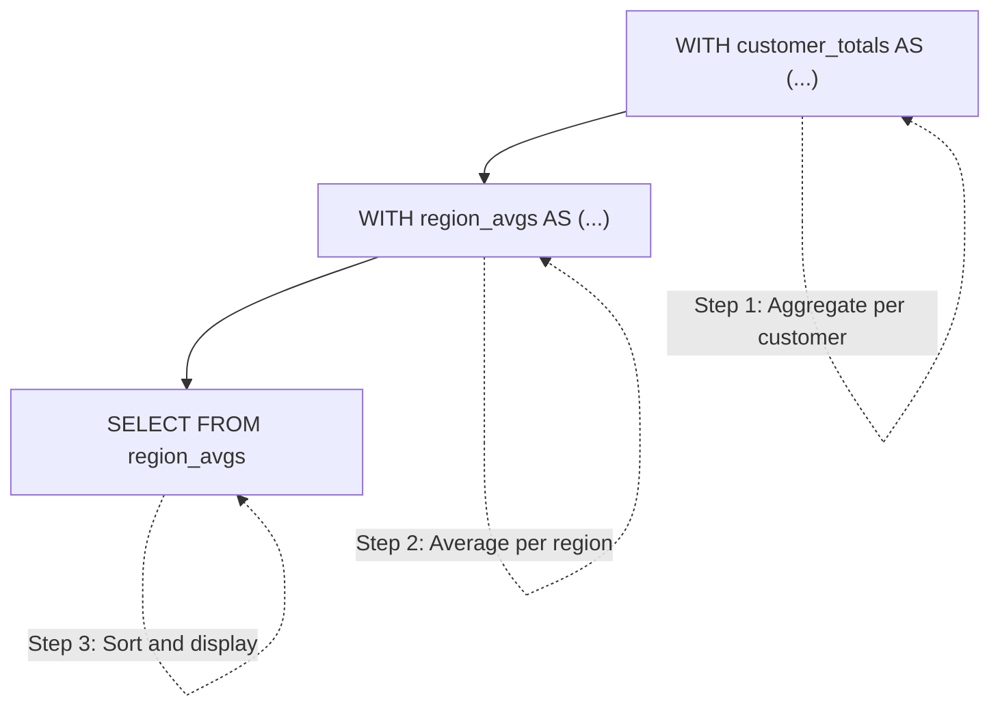
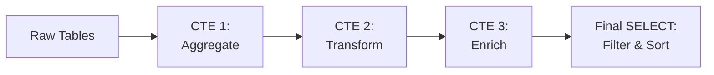
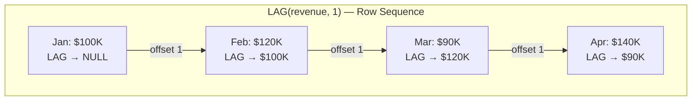
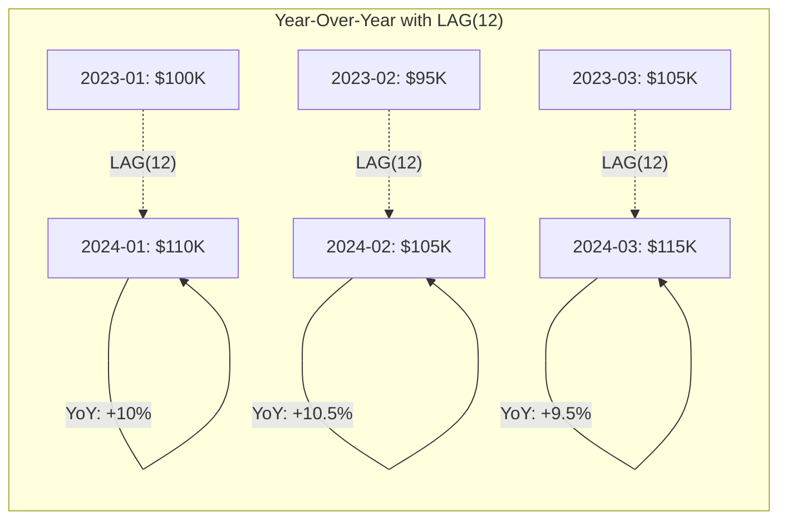

# CTEs & Advanced Analytics

## Learning Objectives

By the end of this lesson, you will be able to:
- Write Common Table Expressions (CTEs) using the WITH clause to create named, temporary result sets
- Chain multiple CTEs into readable, multi-step analytical pipelines
- Use LEAD and LAG to access previous and next rows without self-joins
- Calculate year-over-year (YoY) growth using LAG with chained CTEs
- Combine CTEs with window functions for moving averages and trend analysis

## The "Why": Composable, Readable Analytics

As analytical queries grow more complex, nesting subqueries becomes unmanageable. A real-world dashboard query might need to: aggregate by month, compare to the prior year, compute a moving average, and rank the results. Writing that as nested subqueries produces an unreadable mess.

**Common Table Expressions (CTEs)** solve this by letting you name each step. Combined with **LEAD/LAG** offset functions, CTEs enable the most important patterns in time-series analytics: month-over-month change, year-over-year growth, and smoothed trend lines.

> **Analogy:** Think of a recipe. Without CTEs, your query is like writing the entire recipe in one run-on sentence: "Take the flour that you mixed with the eggs that you whisked after melting the butter that you cut into cubes..." With CTEs, each step has a name: **Step 1: Cube the butter. Step 2: Melt it. Step 3: Whisk the eggs. Step 4: Mix with flour.** Same result, but each step is clear, testable, and reusable.

---

## Core Concept A: What is a CTE?

A CTE (Common Table Expression) is a **temporary named result set** defined with the `WITH` keyword. It exists only for the duration of a single query.

### Basic Syntax

```sql
WITH cte_name AS (
    SELECT ...
    FROM ...
    WHERE ...
)
SELECT *
FROM cte_name
WHERE ...;
```

### CTE vs Subquery

The same logic written two ways:

```sql
-- Subquery: harder to read, harder to debug
SELECT region, avg_spent
FROM (
    SELECT c.region, ROUND(AVG(total), 2) AS avg_spent
    FROM (
        SELECT o.customer_id, SUM(oi.quantity * oi.unit_price) AS total
        FROM orders o
        JOIN order_items oi ON o.id = oi.order_id
        WHERE o.status = 'completed'
        GROUP BY o.customer_id
    ) customer_totals
    JOIN customers c ON customer_totals.customer_id = c.id
    GROUP BY c.region
) region_avgs
ORDER BY avg_spent DESC;

-- CTE: same logic, clear step-by-step structure
WITH customer_totals AS (
    SELECT o.customer_id, SUM(oi.quantity * oi.unit_price) AS total
    FROM orders o
    JOIN order_items oi ON o.id = oi.order_id
    WHERE o.status = 'completed'
    GROUP BY o.customer_id
),
region_avgs AS (
    SELECT c.region, ROUND(AVG(total), 2) AS avg_spent
    FROM customer_totals
    JOIN customers c ON customer_totals.customer_id = c.id
    GROUP BY c.region
)
SELECT region, avg_spent
FROM region_avgs
ORDER BY avg_spent DESC;
```

Both produce the same result. The CTE version is easier to read, debug, and extend.



---

## Core Concept B: Chaining CTEs

Multiple CTEs are separated by commas after a single `WITH` keyword. Each CTE can reference any CTE defined **before** it.

### Syntax

```sql
WITH
    step_1 AS (
        SELECT ... FROM raw_table
    ),
    step_2 AS (
        SELECT ... FROM step_1  -- references step_1
    ),
    step_3 AS (
        SELECT ... FROM step_2  -- references step_2 (and could reference step_1)
    )
SELECT *
FROM step_3;
```

### Pipeline Pattern



### Rules for Chaining

| Rule | Details |
|:---|:---|
| **Forward reference only** | CTE 2 can reference CTE 1, but CTE 1 cannot reference CTE 2 |
| **No self-reference** | A CTE cannot reference itself (unless it's a recursive CTE — see Deep Dive) |
| **Single WITH keyword** | All CTEs share one `WITH`; only the first CTE gets `WITH`, the rest use commas |
| **Any CTE is queryable** | The final SELECT can reference any CTE, not just the last one |

### Example: Multi-Step Sales Pipeline

```sql
WITH monthly_revenue AS (
    -- Step 1: Aggregate orders by month
    SELECT
        DATE_TRUNC('month', o.order_date) AS month,
        SUM(oi.quantity * oi.unit_price) AS revenue
    FROM orders o
    JOIN order_items oi ON o.id = oi.order_id
    WHERE o.status = 'completed'
    GROUP BY DATE_TRUNC('month', o.order_date)
),
with_growth AS (
    -- Step 2: Add month-over-month change
    SELECT
        month,
        revenue,
        LAG(revenue) OVER (ORDER BY month) AS prev_month,
        ROUND(100.0 * (revenue - LAG(revenue) OVER (ORDER BY month))
              / LAG(revenue) OVER (ORDER BY month), 1) AS mom_growth_pct
    FROM monthly_revenue
)
-- Step 3: Filter and display
SELECT *
FROM with_growth
ORDER BY month;
```

---

## Core Concept C: LEAD and LAG

LEAD and LAG are **offset functions** — they access values from other rows relative to the current row, without needing a self-join.

### Syntax

```sql
LAG(column, offset, default)  OVER (ORDER BY ...)
LEAD(column, offset, default) OVER (ORDER BY ...)
```

| Parameter | Description | Default |
|:---|:---|:---|
| `column` | The column to retrieve | Required |
| `offset` | Number of rows to look back (LAG) or ahead (LEAD) | 1 |
| `default` | Value to return when there is no row at the offset | NULL |

### LAG: Look Back

```sql
-- Previous month's revenue
SELECT
    month,
    revenue,
    LAG(revenue, 1) OVER (ORDER BY month) AS prev_month_revenue
FROM monthly_sales;
```

| month | revenue | prev_month_revenue |
|:---|:---|:---|
| 2024-01 | $100K | NULL |
| 2024-02 | $120K | $100K |
| 2024-03 | $90K | $120K |

### LEAD: Look Ahead

```sql
-- Next month's revenue
SELECT
    month,
    revenue,
    LEAD(revenue, 1) OVER (ORDER BY month) AS next_month_revenue
FROM monthly_sales;
```

| month | revenue | next_month_revenue |
|:---|:---|:---|
| 2024-01 | $100K | $120K |
| 2024-02 | $120K | $90K |
| 2024-03 | $90K | NULL |

### Partitioned LEAD/LAG

Add `PARTITION BY` to compute offsets independently within each group:

```sql
-- Previous month's revenue PER CATEGORY
SELECT
    category,
    month,
    revenue,
    LAG(revenue) OVER (PARTITION BY category ORDER BY month) AS prev_month
FROM category_monthly_sales;
```

Each category's LAG operates independently — the first month of each category returns NULL.



---

## Core Concept D: Year-Over-Year Growth

The most common time-series pattern in business analytics: comparing each period to the **same period in the prior year**.

### The Pattern: CTE + LAG(12)

With monthly data, `LAG(revenue, 12)` retrieves the revenue from **12 months earlier** — the same month in the prior year.

```sql
WITH monthly_revenue AS (
    SELECT
        DATE_TRUNC('month', order_date) AS month,
        SUM(revenue) AS revenue
    FROM sales
    GROUP BY DATE_TRUNC('month', order_date)
),
yoy AS (
    SELECT
        month,
        revenue AS current_year,
        LAG(revenue, 12) OVER (ORDER BY month) AS prior_year,
        ROUND(100.0 * (revenue - LAG(revenue, 12) OVER (ORDER BY month))
              / LAG(revenue, 12) OVER (ORDER BY month), 1) AS yoy_growth_pct
    FROM monthly_revenue
)
SELECT *
FROM yoy
WHERE prior_year IS NOT NULL  -- exclude first 12 months (no prior year)
ORDER BY month;
```

### NULL Handling

The first 12 months of data will have `NULL` for `prior_year` because there is no data from 12 months earlier. Always filter with `WHERE prior_year IS NOT NULL` (or use a default value) to show only months with valid comparisons.



---

## Core Concept E: Moving Averages

A **moving average** smooths out short-term fluctuations to reveal underlying trends. It combines frame clauses (from L13) with CTEs for clean, readable queries.

### 3-Month Trailing Average

```sql
WITH monthly_revenue AS (
    SELECT
        DATE_TRUNC('month', order_date) AS month,
        SUM(revenue) AS revenue
    FROM sales
    GROUP BY DATE_TRUNC('month', order_date)
)
SELECT
    month,
    revenue,
    ROUND(AVG(revenue) OVER (
        ORDER BY month
        ROWS BETWEEN 2 PRECEDING AND CURRENT ROW
    ), 2) AS moving_avg_3m
FROM monthly_revenue
ORDER BY month;
```

### Variations

| Type | Frame Clause | Description |
|:---|:---|:---|
| 3-month trailing | `ROWS BETWEEN 2 PRECEDING AND CURRENT ROW` | Average of current + 2 prior months |
| 3-month centered | `ROWS BETWEEN 1 PRECEDING AND 1 FOLLOWING` | Average of prior, current, and next month |
| 6-month trailing | `ROWS BETWEEN 5 PRECEDING AND CURRENT ROW` | Smoother, but more lagging |

### Trailing vs Centered

- **Trailing** (most common in business): Only uses past data. No "future leak." The Jan-Feb-Mar average is available at end of March.
- **Centered** (common in statistics): Uses past + future data. Better for visualization, but the latest months are incomplete.

For business dashboards and financial reporting, **trailing** is the standard.

---

## Deep Dive: Recursive CTEs (Optional)

<details>
<summary>Click to expand: WITH RECURSIVE for hierarchical data</summary>

A **recursive CTE** references itself, allowing it to process hierarchical or graph-structured data like:
- Organizational charts (employee → manager)
- Category trees (subcategory → parent category)
- Bill of materials (component → assembly)

### Syntax

```sql
WITH RECURSIVE cte_name AS (
    -- Base case: starting rows
    SELECT id, name, manager_id, 1 AS level
    FROM employees
    WHERE manager_id IS NULL  -- start with CEO

    UNION ALL

    -- Recursive case: join back to the CTE
    SELECT e.id, e.name, e.manager_id, r.level + 1
    FROM employees e
    JOIN cte_name r ON e.manager_id = r.id
)
SELECT * FROM cte_name;
```

### How It Works

1. **Base case** runs first, producing the initial row(s)
2. **Recursive case** runs repeatedly, each time joining new rows against the previous iteration's results
3. Recursion stops when the recursive case produces no new rows

### When to Use

Recursive CTEs are more common in application development than in data science analytics. Most analytical work uses non-recursive (regular) CTEs. However, if you encounter hierarchical data (e.g., product category trees, geographic hierarchies), recursive CTEs are the SQL-native solution.

Both DuckDB and PostgreSQL support `WITH RECURSIVE`.

</details>

---

## FAQ / Industry Reality

### "Are CTEs just syntactic sugar? Do they affect performance?"

**A:** In most modern databases (including DuckDB and PostgreSQL), CTEs are **optimized inline** — the query planner treats them like subqueries and can push filters, join reordering, and other optimizations through them. In older PostgreSQL versions (before 12), CTEs were "optimization fences" that materialized results, but this is no longer the case. Write CTEs for readability without worrying about performance.

### "When should I use LEAD/LAG vs a self-join?"

**A:** Almost always use LEAD/LAG. Self-joins for row comparison are the pre-window-function approach — they're verbose, harder to read, and can be slower. LEAD/LAG express the intent directly:

```sql
-- Self-join approach (avoid this)
SELECT a.month, a.revenue, b.revenue AS prev_month
FROM monthly m1
JOIN monthly m2 ON m2.month = m1.month - INTERVAL '1 month';

-- LEAD/LAG approach (preferred)
SELECT month, revenue, LAG(revenue) OVER (ORDER BY month) AS prev_month
FROM monthly;
```

### "How does LAG compare to Pandas shift()?"

**A:** They're conceptually identical:

| SQL | Pandas |
|:---|:---|
| `LAG(revenue, 1)` | `df['revenue'].shift(1)` |
| `LEAD(revenue, 1)` | `df['revenue'].shift(-1)` |
| `LAG(revenue, 12)` | `df['revenue'].shift(12)` |
| `PARTITION BY category` | `df.groupby('category')['revenue'].shift(1)` |

The SQL version handles partitioning and ordering declaratively; Pandas requires explicit groupby and sorting.

### "When should I use multiple CTEs vs one complex query?"

**A:** Use multiple CTEs whenever a query involves more than two logical steps. Each CTE should represent one clear transformation. Signs you need to break into CTEs:
- Nested subqueries more than 2 levels deep
- Reusing the same aggregation in multiple places
- Complex WHERE conditions on aggregated or windowed results
- Building a dashboard with metrics from different granularities

---

## Summary & Next Steps

In this lesson, you learned:

- **CTEs (WITH clause):** Named, temporary result sets that make complex queries readable and composable
- **Chaining CTEs:** Multiple CTEs form a data pipeline — each step builds on the previous one
- **LEAD/LAG:** Offset functions that access previous or next rows without self-joins
- **Year-Over-Year Growth:** LAG(value, 12) compares each month to the same month in the prior year
- **Moving Averages:** Frame clauses + CTEs for smoothed trend lines (3-month trailing, centered, 6-month)

**Next:** In [Lesson 14 Lab](w07_l14_lab_yoy_growth.md), you'll build a complete analytical pipeline: monthly trends, month-over-month change, year-over-year growth, moving averages, and an executive dashboard — all using CTEs and offset functions on the ShopStream dataset.

Then in **Week 08**, you'll **benchmark** these analytical queries against both PostgreSQL and DuckDB to see how OLTP and OLAP engines handle window functions and CTEs differently.

---

## Further Reading

### Textbook
- *Database Design, 2nd Ed.* by Adrienne Watt — [Chapter 9: SQL Queries](https://opentextbc.ca/dbdesign01/chapter/chapter-9-sql-queries/) — Foundational SQL patterns

### Documentation
- [DuckDB Common Table Expressions](https://duckdb.org/docs/sql/query_syntax/with.html) — CTE syntax, chaining, and recursive CTEs in DuckDB
- [DuckDB Window Functions](https://duckdb.org/docs/sql/window_functions) — LEAD, LAG, and frame clause reference
- [PostgreSQL WITH Queries (CTEs)](https://www.postgresql.org/docs/current/queries-with.html) — Official PostgreSQL CTE documentation

### Articles & Tutorials
- [SQL CTE Tutorial — Mode Analytics](https://mode.com/sql-tutorial/sql-cte/) — Interactive tutorial with examples and exercises
