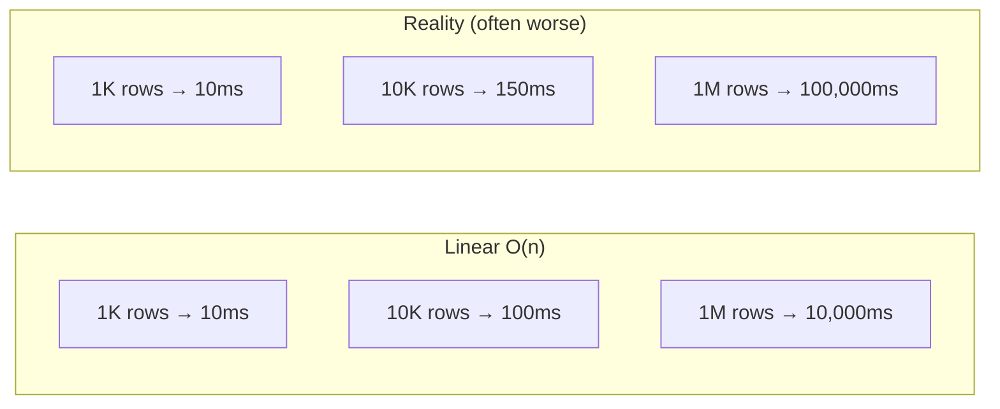
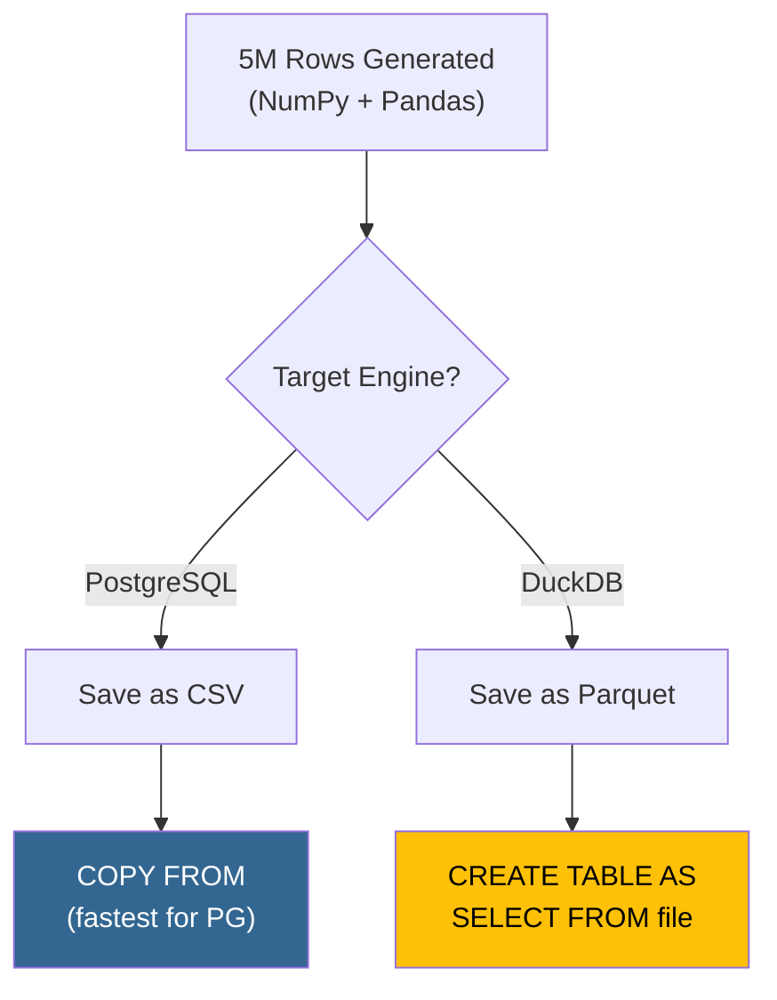
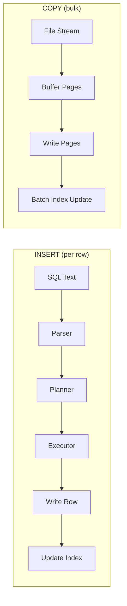

# Data at Scale: Generation & Loading Strategies

## 1. Learning Objectives

By the end of this lesson, you will be able to:
*   Explain why query behavior changes dramatically as data grows from thousands to millions of rows
*   Compare data generation strategies: manual loops, vectorized NumPy, and SQL-based generation
*   Distinguish between loading methods (row-by-row INSERT, batch INSERT, COPY) and their performance characteristics
*   Compare CSV and Parquet storage formats and explain when to use each
*   Explain why dropping indexes before bulk loading and recreating them afterward is faster than loading with active indexes
*   Observe how loading and indexing operations scale across dataset sizes from thousands to millions of rows
*   Select the right generation and loading strategy for a given dataset size and target engine

---

## 2. The "Why": Development Data ≠ Production Data

Throughout this course, you've worked with datasets of 100 to 100,000 rows. Your queries run instantly. Every approach seems fast enough. But in the real world, tables contain millions or billions of rows — and the techniques that work at small scale often collapse entirely.

> **Analogy:** Testing a bridge with a skateboard tells you the bridge *exists*. Testing it with a 40-ton truck tells you the bridge *works*. The difference between development data (1,000 rows) and production data (10,000,000 rows) is the difference between the skateboard and the truck.

This lesson prepares you for the performance benchmark in Lesson 16. You'll learn how to generate large datasets efficiently, load them into both PostgreSQL (row-oriented) and DuckDB (column-oriented), and understand the storage formats that make analytical workloads fast.

---

## 3. Why Scale Matters

### Non-Linear Growth

Not everything scales linearly. A query that takes 10ms on 1,000 rows might take 100 *seconds* on 1,000,000 rows — far worse than the 10,000ms (10 seconds) you'd expect from linear extrapolation.



Why does performance degrade faster than expected?

*   **Memory pressure:** At small scale, everything fits in RAM. At large scale, the database spills to disk — and disk access is 100–1,000x slower than memory.
*   **Disk I/O amplification:** Sequential reads are fast; random reads (scattered data) are slow. Scale amplifies the difference because more data means more disk pages to fetch.
*   **Algorithm complexity:** A nested loop join that's O(n²) is invisible at 1K rows (1 million operations) but catastrophic at 1M rows (1 trillion operations).

### The Scale Spectrum

| Scale | Rows | Typical Use | What You Learn |
| :--- | ---: | :--- | :--- |
| **Toy** | 100 – 1,000 | Trace queries by hand | SQL syntax |
| **Small** | 10K – 100K | Functional testing | Correctness |
| **Medium** | 500K – 2M | Performance differences appear | Architecture matters |
| **Large** | 5M – 10M+ | Engine choice becomes critical | OLTP ≠ OLAP |

In Lessons 15–16, we work at the **Large** scale to make the performance differences between PostgreSQL and DuckDB clearly visible.

In the lab, you'll run the same operations at several dataset sizes — from 50K to 5M rows — to observe this scaling firsthand. A helper function automates each run and saves the timings so you can compare them side by side.

---

## 4. Data Generation Strategies

When you need millions of rows for testing, where does the data come from?

### Strategy 1: Python Loops

```python
# Slow — Python creates one dict per iteration
rows = []
for i in range(5_000_000):
    rows.append({
        'id': i,
        'category': random.choice(categories),
        'amount': round(random.uniform(5, 500), 2),
    })
```

*   **Pros:** Simple, readable, flexible — can generate complex relational structures
*   **Cons:** Very slow for millions of rows (~2 minutes for 5M rows in Python)

### Strategy 2: Vectorized Generation (NumPy)

```python
# Fast — NumPy generates entire columns at once
import numpy as np
ids = np.arange(1, 5_000_001)
categories = np.random.choice(['Electronics', 'Clothing', 'Books'], 5_000_000)
amounts = np.round(np.random.uniform(5, 500, 5_000_000), 2)
```

*   **Pros:** 10–50x faster than loops; generates millions of rows in seconds
*   **Cons:** Less flexible for complex relational dependencies (e.g., foreign keys across tables)
*   **Best for:** Flat tables where columns are statistically independent

### Strategy 3: SQL-Based Generation

```sql
-- PostgreSQL: generate_series for bulk data
INSERT INTO sales (id, amount)
SELECT id, random() * 500
FROM generate_series(1, 5000000) AS id;
```

*   **Pros:** No data transfer between Python and the database — data is generated in-place
*   **Cons:** Limited to what SQL expressions can produce; hard to generate realistic text
*   **Best for:** Simple numeric/date columns when data stays in a single database

### Comparison

| Criterion | Python Loops | NumPy | SQL generate_series |
| :--- | :--- | :--- | :--- |
| **Speed (5M rows)** | ~120s | ~3s | ~30s |
| **Flexibility** | High | Medium | Low |
| **Realistic text** | Yes (with Faker) | Limited | No |
| **Cross-engine** | Yes (export to file) | Yes (export to file) | Single engine only |

For this course, we use **NumPy** — it's fast, produces data we can save as files, and loads into both PostgreSQL and DuckDB.

---

## 5. Loading Strategies

Once data is generated, how do you get it into the database?

### Row-by-Row INSERT

```sql
INSERT INTO sales (id, category, amount) VALUES (1, 'Electronics', 99.99);
INSERT INTO sales (id, category, amount) VALUES (2, 'Clothing', 45.50);
-- × 5,000,000 more...
```

Each INSERT is a separate SQL statement. The database must parse the SQL, plan execution, acquire a lock, write the row, and release the lock — for every single row. For 5M rows, that's 5M round trips. **Estimated time: 30+ minutes.**

### Batch INSERT

```sql
INSERT INTO sales (id, category, amount) VALUES
  (1, 'Electronics', 99.99),
  (2, 'Clothing', 45.50),
  ...
  (1000, 'Books', 12.30);
```

Grouping 1,000 rows per INSERT statement reduces parsing and network overhead by 1,000x. **Estimated time: ~5 minutes for 5M rows.**

### COPY (PostgreSQL Bulk Loader)

```sql
COPY sales FROM '/path/to/sales.csv' WITH (FORMAT csv, HEADER true);
```

PostgreSQL's `COPY` command bypasses the SQL parser entirely. It reads the file as a continuous stream and bulk-writes pages to disk. **Estimated time: ~30–60 seconds for 5M rows.**

### File-Based Ingestion (DuckDB)

```sql
-- DuckDB reads files directly — no explicit loading step
SELECT * FROM 'sales.parquet';

-- Or create a persistent table from a file
CREATE TABLE sales AS SELECT * FROM 'sales.parquet';
```

DuckDB can query Parquet and CSV files directly without loading them into a table first. When using Parquet, it can skip columns that aren't needed by the query. **Estimated time: ~3–5 seconds for 5M rows from Parquet.**

### Loading Pipeline



### Performance Comparison

| Method | 5M Rows | Notes |
| :--- | :--- | :--- |
| Row-by-row INSERT | ~30 min | Never use for bulk data |
| Batch INSERT (1K/batch) | ~5 min | Acceptable for moderate data |
| PostgreSQL COPY | ~30–60 sec | **Best for PostgreSQL** |
| DuckDB from CSV | ~10–15 sec | Good |
| DuckDB from Parquet | ~3–5 sec | **Best for DuckDB** |

---

## 6. Storage Formats: CSV vs Parquet

The file format you choose has a dramatic impact on file size, loading speed, and query performance.

### CSV (Comma-Separated Values)

```text
id,category,amount,date
1,Electronics,99.99,2024-01-15
2,Clothing,45.50,2024-01-15
```

*   **Layout:** Row-oriented text
*   **Types:** Everything is a string — the reader must parse and infer types
*   **Compression:** None (unless externally compressed with gzip, etc.)
*   **Schema:** Not embedded; reader must infer or be told column types

### Parquet (Apache Parquet)

*   **Layout:** Column-oriented binary
*   **Types:** Embedded in file metadata (int32, float64, string, date, etc.)
*   **Compression:** Built-in (Snappy, ZSTD, etc.) — applied per-column
*   **Schema:** Embedded in file — reader knows exact types without guessing

### Side-by-Side Comparison

| Feature | CSV | Parquet |
| :--- | :--- | :--- |
| **Format** | Text (human-readable) | Binary |
| **Storage layout** | Row-oriented | Column-oriented |
| **Compression** | None | Built-in (3–10x smaller) |
| **Type safety** | No (everything is text) | Yes (schema embedded) |
| **Read speed (full scan)** | Moderate | Fast |
| **Read speed (select columns)** | Must read all columns | Reads only needed columns |
| **Write speed** | Fast | Slightly slower |
| **Ecosystem** | Universal | Analytics tools (Pandas, DuckDB, Spark) |

### File Size at Scale

For a 5M-row sales dataset with 11 columns:

| Format | Approximate Size |
| :--- | :--- |
| CSV | ~480 MB |
| Parquet (Snappy) | ~80 MB |
| Parquet (ZSTD) | ~50 MB |

Parquet achieves this compression because:
1.  **Columnar storage:** Values in the same column are similar, so they compress well together
2.  **Dictionary encoding:** Repeated strings (like "Electronics" appearing 833K times) are stored once with a reference ID
3.  **Run-length encoding:** Sequences of identical values are collapsed into a single value + count

### Choosing a Compression Algorithm

Not all Parquet compression is the same. The default (Snappy) balances ratio and speed, but other options exist:

*   **Snappy** — lightweight compression and decompression. The default for good reason: minimal CPU overhead with solid compression ratios.
*   **ZSTD** — compresses more aggressively, producing smaller files at the cost of slower writes. Better for archival storage or when data must travel over a network.
*   **None** — fastest writes and reads (no CPU overhead), but largest files. Best when disk is fast and plentiful.

The right choice depends on whether your workload is **I/O-bound** (prefer compression — less data to read from disk) or **CPU-bound** (prefer no compression — avoid decompression overhead). In the lab, you'll measure the trade-off directly.

> **Key Insight:** Parquet's column-oriented layout mirrors DuckDB's column-oriented engine. This is why DuckDB reads Parquet files extremely fast — the data is already organized the way DuckDB processes it internally.

---

## 7. Deep Dives (Optional)

### A. PostgreSQL's COPY Protocol

<details>
<summary>Click to expand: The COPY Protocol</summary>

### How COPY Works Internally

When you run `COPY sales FROM '/path/to/file.csv'`, PostgreSQL:

1.  **Opens the file** and reads it as a stream (not loaded into memory all at once)
2.  **Skips the SQL parser** — no per-row parsing overhead
3.  **Buffers rows** into 8 KB pages (PostgreSQL's storage unit)
4.  **Writes pages sequentially** to disk — no random I/O
5.  **Updates indexes** in batch after loading (not per-row)

This is fundamentally different from INSERT, which processes each row through the full SQL pipeline independently.

### COPY vs INSERT — Architectural Difference



### When to Use COPY

*   **Always** for initial data loading (ETL pipelines, migrations)
*   **Always** for datasets larger than ~10,000 rows
*   **Not suitable** for real-time streaming (use INSERT for individual transactions)

### COPY FROM vs COPY TO

```sql
-- Import: file → table
COPY sales FROM '/path/to/sales.csv' WITH (FORMAT csv, HEADER true);

-- Export: table → file
COPY sales TO '/path/to/export.csv' WITH (FORMAT csv, HEADER true);
```

### `COPY` vs `\COPY`

PostgreSQL has two variants:

| Command | Runs On | File Access |
| :--- | :--- | :--- |
| `COPY` | Server | Reads files from the server's filesystem (requires superuser) |
| `\COPY` | Client (psql) | Reads files from the client's filesystem (no superuser needed) |

Since PostgreSQL runs directly on the Colab VM, plain COPY works fine. \COPY (via psql) is the alternative when connecting to a remote server whose filesystem you can't reach.

### Binary COPY Format

PostgreSQL's COPY also supports a binary format (`FORMAT binary`) that sends data in the database's internal binary representation. This skips all text-to-type conversion — no parsing `"99.99"` into a float, no parsing `"2024-01-15"` into a date. The database reads raw bytes directly into its storage pages.

The trade-offs are significant: binary files are not human-readable, not portable across PostgreSQL major versions, and cannot be inspected or debugged with a text editor. In practice, binary COPY is used for **PostgreSQL-to-PostgreSQL transfers** — replication or migration between servers running the same major version — where both sides agree on the binary format.

</details>

### B. Index Overhead During Bulk Loading

<details>
<summary>Click to expand: Why Indexes Slow Down Bulk Loads</summary>

### The Hidden Cost of Loading with Active Indexes

When you run `COPY` into a table that has a PRIMARY KEY (or any index), PostgreSQL must update the B-tree index **for every row inserted**. Each index update involves:

1.  **Navigating the B-tree** to find the correct insertion point
2.  **Splitting nodes** when a leaf page is full (cascading up the tree)
3.  **Writing WAL (Write-Ahead Log)** entries for both the heap page and the index page

For 5M rows with a single PRIMARY KEY index, that's 5M individual B-tree insertions interleaved with the data writes. Add secondary indexes and the cost multiplies — a table with a PK and 3 secondary indexes does **4× the index work per row**.

### The Production Pattern: Drop → Load → Recreate

The standard approach in ETL pipelines is:

1.  **Drop** (or disable) all indexes on the target table
2.  **COPY** the data — raw sequential writes with zero index overhead
3.  **Recreate** all indexes — PostgreSQL sorts the data first, then builds each B-tree bottom-up in a single efficient pass

This works because batch index creation is fundamentally different from incremental index maintenance. Incremental insertion causes repeated node splits and random I/O. Batch creation sorts the keys, then constructs the tree level by level — no splits, no backtracking.

### Expected Performance Impact

| Method | Estimated Time (5M rows) |
| :--- | :--- |
| COPY with PK index active | ~60–80s |
| COPY without index + recreate PK after | ~40–50s (COPY) + ~10–15s (index build) = ~50–65s |
| COPY with PK + 3 secondary indexes active | ~120–180s |
| COPY without indexes + recreate all 4 after | ~40–50s (COPY) + ~40–60s (4 index builds) = ~80–110s |

The gap widens with more indexes and larger datasets.

### Additional Notes

*   **`REINDEX`** — PostgreSQL can rebuild a bloated or corrupted index in place without a full drop/recreate cycle
*   **Why batch creation is faster:** PostgreSQL sorts the indexed column first, then builds the B-tree bottom-up in one sequential pass — no node splits, no random I/O
*   **This is standard practice** — production ETL pipelines routinely drop indexes before loading and recreate them afterward. It's not a hack; it's how bulk loading is designed to work.

</details>

---

## 8. FAQ / Industry Reality

### "Can't I just use Pandas `to_sql()` for loading?"

**For small datasets, yes.** Pandas `to_sql()` uses batch INSERTs under the hood. For 10K rows, it's fine. For 5M rows, it can take 20+ minutes because each batch still goes through the SQL parser. In production, always use `COPY` for PostgreSQL or native file ingestion for analytical engines.

### "Why not generate data directly in SQL with `generate_series`?"

**It works for simple schemas, but not for cross-engine benchmarks.** `generate_series` is great for numeric sequences and dates, but generating realistic categorical data (product names, regions, payment methods) requires procedural logic that's easier in Python. More importantly, SQL-generated data stays inside one database — you can't easily load the same data into a second engine for comparison.

### "Is 5 million rows really 'big data'?"

**Not by industry standards** — production databases routinely hold billions of rows. But 5M rows is large enough to make the architectural differences between row-oriented and column-oriented engines clearly visible, which is the goal. The patterns you learn here — bulk loading, format selection, engine matching — scale to any dataset size.

---

## 9. Summary & Next Steps

**Key takeaways:**

*   **Scale changes everything.** Queries and loading strategies that work at 1K rows may fail at 5M rows.
*   **NumPy + Parquet** is the fastest path from Python to analytical engines.
*   **PostgreSQL COPY** is the only practical loading method for millions of rows in PostgreSQL.
*   **Parquet > CSV** for analytical workloads — smaller files, embedded types, columnar layout.
*   **Drop indexes before bulk loading** — recreating them afterward is faster than maintaining them during COPY.
*   **Match the format to the engine:** CSV → PostgreSQL (via COPY), Parquet → DuckDB (via direct read).

*   **Next:** Go to the Practical Lab [w08_l15_lab_dataset_preparation.md](w08_l15_lab_dataset_preparation.md) to generate a 5M-row dataset and load it into both PostgreSQL and DuckDB.

---

## 10. Further Reading

### Documentation
*   [PostgreSQL: COPY Command](https://www.postgresql.org/docs/current/sql-copy.html) — Official reference for bulk loading and exporting
*   [Apache Parquet Format](https://parquet.apache.org/docs/file-format/) — How Parquet organizes data on disk
*   [DuckDB: Data Import](https://duckdb.org/docs/data/overview) — All supported ingestion formats

### Articles & Tutorials
*   [Parquet File Format — Databricks](https://www.databricks.com/glossary/what-is-parquet) — Visual explanation of columnar storage and compression
*   [Fastest Way to Load Data into PostgreSQL — Haki Benita](https://hakibenita.com/fast-load-data-python-postgresql) — Benchmarks of INSERT vs COPY vs alternatives in Python
