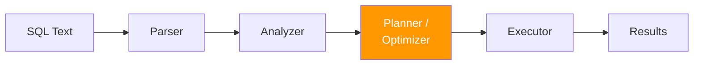
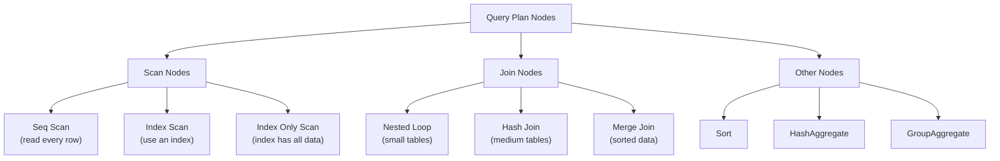
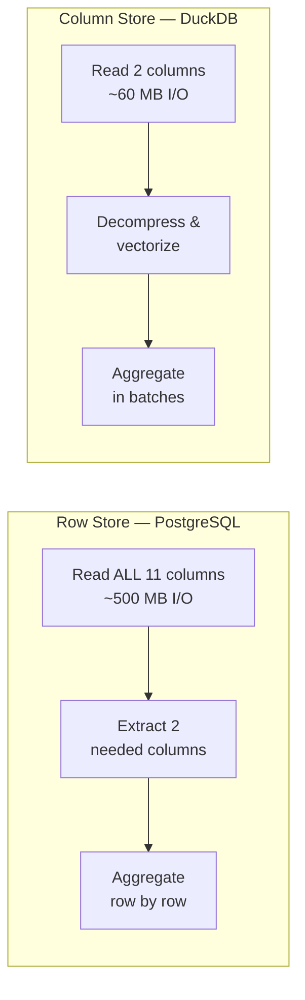
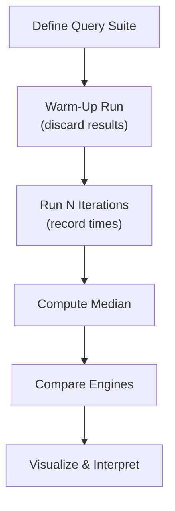

# Query Plans & Performance Benchmarking

## 1. Learning Objectives

By the end of this lesson, you will be able to:
*   Describe the lifecycle of a SQL query from text to results
*   Interpret PostgreSQL's `EXPLAIN` and `EXPLAIN ANALYZE` output
*   Interpret DuckDB's `EXPLAIN ANALYZE` output and compare it with PostgreSQL's query plans
*   Identify common query plan operations (Seq Scan, Index Scan, Hash Aggregate, Sort)
*   Explain why column-oriented engines outperform row-oriented engines on analytical queries
*   Explain how join order and filter placement affect query performance
*   Observe how the PostgreSQL vs DuckDB speedup ratio changes across dataset sizes
*   Design a fair performance benchmark with proper methodology

---

## 2. The "Why": Reading Your Database's Mind

When a query takes 30 seconds instead of 300 milliseconds, how do you figure out why? You could guess — maybe the table is too big, maybe it needs an index, maybe the JOIN is inefficient. Or you could *ask the database what it's doing*.

Every SQL database has a **query planner** that decides HOW to execute your query. `EXPLAIN` lets you see that plan before the query runs. `EXPLAIN ANALYZE` shows the plan AND the actual execution metrics. This is the database equivalent of a debugger.

> **Analogy:** Imagine you need to find a specific book in a library with 5 million books. You have two strategies: (A) walk through every shelf sequentially until you find it, or (B) check the catalog, note the shelf number, and walk directly to it. `EXPLAIN` tells you which strategy the database chose — and if it made a bad choice, you can guide it toward a better one.

Understanding query plans is critical for this week's benchmark. When PostgreSQL takes 3 seconds and DuckDB takes 0.1 seconds for the same query, the query plan tells you *why* — not just *that* one is slower.

---

## 3. The Query Lifecycle

When you type `SELECT * FROM sales WHERE region = 'West'`, the database doesn't just "run" it. It goes through a multi-stage pipeline:



| Stage | What It Does |
| :--- | :--- |
| **Parser** | Validates SQL syntax. Turns text into a parse tree. |
| **Analyzer** | Checks that tables and columns exist. Resolves data types. |
| **Planner/Optimizer** | Decides HOW to execute: which algorithm, which order. This is where performance is won or lost. |
| **Executor** | Runs the chosen plan and returns results. |

The **Planner** is the most important stage for performance. It considers multiple execution strategies and picks the one with the lowest estimated cost. For example:
*   Scan the entire table, or use an index?
*   Join with a nested loop, hash table, or merge?
*   Sort in memory, or spill to disk?

---

## 4. EXPLAIN and EXPLAIN ANALYZE

### EXPLAIN — The Plan Without Execution

`EXPLAIN` shows you what the database *plans to do* without actually running the query.

```sql
EXPLAIN
SELECT category, SUM(total_amount)
FROM sales_transactions
GROUP BY category;
```

Output:
```
HashAggregate  (cost=112654.00..112654.06 rows=6 width=44)
  Group Key: category
  ->  Seq Scan on sales_transactions  (cost=0.00..87654.00 rows=5000000 width=28)
```

This tells you:
*   **Seq Scan** — The database will read every row in the table (sequential scan)
*   **HashAggregate** — It will group results using a hash table in memory
*   **cost=0.00..87654.00** — Estimated cost in arbitrary units (startup cost..total cost)
*   **rows=5000000** — Estimated number of rows to process

### EXPLAIN ANALYZE — The Plan With Actual Metrics

`EXPLAIN ANALYZE` runs the query and shows both the estimated and actual metrics.

```sql
EXPLAIN ANALYZE
SELECT category, SUM(total_amount)
FROM sales_transactions
GROUP BY category;
```

Output:
```
HashAggregate  (cost=112654.00..112654.06 rows=6 width=44)
               (actual time=1523.456..1523.461 rows=6 loops=1)
  Group Key: category
  ->  Seq Scan on sales_transactions  (cost=0.00..87654.00 rows=5000000 width=28)
                                      (actual time=0.015..823.456 rows=5000000 loops=1)
Planning Time: 0.085 ms
Execution Time: 1523.512 ms
```

Now you see **actual time** (in milliseconds), **actual rows**, and total **Execution Time**.

### Reading EXPLAIN Output — Key Fields

| Field | Meaning |
| :--- | :--- |
| **Node type** | The operation (Seq Scan, Index Scan, Hash Join, Sort, etc.) |
| **cost** | Estimated cost in arbitrary units. Format: startup..total. Lower is better. |
| **rows** | Estimated (EXPLAIN) or actual (ANALYZE) number of output rows |
| **width** | Estimated average row width in bytes |
| **actual time** | Real execution time in ms (only with ANALYZE). Format: startup..total. |
| **loops** | How many times this node was executed |

### Common Query Plan Nodes



| Node | When Used | Performance |
| :--- | :--- | :--- |
| **Seq Scan** | No useful index; must read entire table | Slow for selective queries, fine for full-table analytics |
| **Index Scan** | Index exists and query is selective (few rows match) | Fast for lookups; slower than Seq Scan when many rows match |
| **Hash Join** | Joining two tables when one fits in memory | Good for medium-sized joins |
| **HashAggregate** | GROUP BY with few distinct groups | Fast — builds hash table once |
| **Sort** | ORDER BY or Merge Join input | Can spill to disk if data exceeds `work_mem` |

---

## 5. Why Column Stores Win at Analytics

In Lesson 09, you learned the difference between row-oriented and column-oriented storage. Now let's see why that difference matters at scale.

### The Analytical Query Pattern

Analytical queries typically:
1.  **Scan many rows** (thousands to millions)
2.  **Read few columns** (2–5 out of 20+)
3.  **Aggregate** results (SUM, AVG, COUNT)

This is the *opposite* of transactional queries, which read few rows but need all columns.

### What Happens at 5 Million Rows

Consider: `SELECT category, SUM(total_amount) FROM sales_transactions GROUP BY category`

**PostgreSQL (row-oriented):**
1.  Reads every row from disk — all 11 columns per row, even though only 2 are needed
2.  For 5M rows × ~100 bytes/row = **~500 MB of I/O**
3.  Extracts `category` and `total_amount` from each row
4.  Aggregates using a hash table

**DuckDB (column-oriented):**
1.  Reads only the `category` and `total_amount` columns from storage
2.  For 5M rows × ~12 bytes (just 2 columns) = **~60 MB of I/O**
3.  Processes values in compressed, vectorized batches of 2,048
4.  Aggregates using vectorized operations



### Three Reasons Column Stores Are Faster for Analytics

| Advantage | Why It Helps |
| :--- | :--- |
| **Column pruning** | Only reads columns mentioned in the query. 2 of 11 columns = 82% less I/O. |
| **Better compression** | Similar values in the same column compress well. "Electronics" repeated 833K times → stored once with a count. |
| **Vectorized execution** | Processes 2,048 values at once using CPU SIMD instructions, instead of one row at a time. |

### Seeing It from DuckDB's Side

So far, we've used PostgreSQL's `EXPLAIN ANALYZE` to see why it's slow. But DuckDB has its own `EXPLAIN ANALYZE` that reveals the other side of the story — why it's *fast*.

When you run `EXPLAIN ANALYZE` in DuckDB for the same GROUP BY query, the plan shows:

*   **Column pruning in action:** The scan node reads only `category` and `total_amount` — not all 11 columns. This is visible in the operator's column list.
*   **Vectorized operators:** `HASH_GROUP_BY` processes data in batches of 2,048 values using CPU SIMD instructions, rather than one row at a time.
*   **Per-operator timing:** You can see exactly where DuckDB spends its time — and it's dramatically less than PostgreSQL's Seq Scan because it reads ~60 MB instead of ~500 MB.

In the lab, you'll run both plans side by side for the same query and compare them directly.

### Real-World Data: Beyond Flat Tables

The synthetic dataset is a single flat table — intentional for isolating engine architecture differences. But real-world analytical data is rarely flat: it has **fact tables** and **dimension tables** connected by foreign keys (a star schema). The NYC Taxi dataset provides a natural example: a trips fact table (~3M rows) joined with a zones dimension table (265 rows). In the lab's additional activity, you'll work with this real data — including joins, which the flat synthetic data cannot demonstrate.

### When PostgreSQL Wins

Column stores aren't universally faster. PostgreSQL outperforms DuckDB when:

| Workload | Why PostgreSQL Wins |
| :--- | :--- |
| **Single-row lookup** (`WHERE id = 42`) | Index scan retrieves one row instantly; column store must read column chunks |
| **Write-heavy** (INSERT/UPDATE/DELETE) | Row store appends a single row; column store must update multiple column files |
| **Concurrent users** | PostgreSQL handles many simultaneous connections; DuckDB is single-process |
| **Full ACID transactions** | PostgreSQL provides row-level locking and MVCC for concurrent modifications |

### Join Order and Filter Placement

When queries involve JOINs, the order in which you filter and join affects performance. Three patterns to watch for:

*   **Late filtering vs early filtering:** Filtering after a JOIN processes more rows through the join. Filtering first (via subquery or CTE) reduces the join input. However, PostgreSQL's optimizer often rewrites both into the same plan via **predicate pushdown** — this is itself a teaching moment.
*   **Cross products from missing JOIN conditions:** Forgetting the `ON` clause turns an intended join into a Cartesian product — the row count explodes (e.g., 3M × 265 = 795M rows instead of ~3M).
*   **Pre-filtering the fact table:** When a `WHERE` clause can eliminate a large fraction of the fact table, wrapping it in a CTE before joining can reduce the data flowing into the join — especially if the optimizer doesn't push the predicate down automatically.

In the lab's NYC Taxi activity, you'll test these patterns with `EXPLAIN ANALYZE` and see which optimizations the planner applies on its own.

---

## 6. Benchmarking Methodology

A fair benchmark requires discipline. Without it, you'll draw wrong conclusions.

### Rules for Fair Benchmarking

1.  **Same data** — Both engines must have identical datasets
2.  **Same queries** — Identical SQL on both engines
3.  **Same machine** — Run both on the same Colab instance
4.  **Warm the cache** — Run each query once before measuring (discard the first run)
5.  **Multiple iterations** — Run each query 3–5 times, report the **median** (not the average — averages are distorted by outliers)
6.  **Measure wall time** — Use `time.perf_counter()` for consistent, high-resolution timing
7.  **Test at multiple scales** — Running the same benchmark at different dataset sizes reveals how the speedup ratio changes with scale. A difference that's barely visible at 50K rows may become a 30x gap at 5M rows — toy-scale testing can be misleading

### What NOT to Do

| Mistake | Why It's Wrong |
| :--- | :--- |
| Run PostgreSQL first, DuckDB second | Later runs benefit from OS file cache |
| Report the fastest time | Cherry-picking; use median |
| Run 1 iteration | Could be an outlier (GC pause, I/O spike) |
| Compare different queries | You're benchmarking query complexity, not engines |
| Compare different data sizes | Differences may be invisible at small scale |

### The Benchmarking Framework



In the lab, you'll implement this framework as a Python function and run it against both PostgreSQL and DuckDB with 6 representative analytical queries.

---

## 7. Deep Dives (Optional)

### A. Cost-Based Optimization in PostgreSQL

<details>
<summary>Click to expand: How PostgreSQL Chooses a Plan</summary>

### Statistics and pg_stats

PostgreSQL maintains statistics about every table and column. These statistics are updated by the `ANALYZE` command (which runs automatically in the background via autovacuum).

```sql
-- View statistics for a column
SELECT
    tablename,
    attname AS column_name,
    n_distinct,
    most_common_vals,
    most_common_freqs
FROM pg_stats
WHERE tablename = 'sales_transactions'
  AND attname = 'category';
```

The planner uses these statistics to estimate:
*   How many rows will match a WHERE filter
*   How many distinct values exist for GROUP BY
*   Whether an index would be selective enough to be worth using

### Cost Estimation

The planner assigns costs based on configuration parameters:

| Parameter | Default | Meaning |
| :--- | :--- | :--- |
| `seq_page_cost` | 1.0 | Cost of reading one disk page sequentially |
| `random_page_cost` | 4.0 | Cost of reading one disk page randomly (index lookup) |
| `cpu_tuple_cost` | 0.01 | Cost of processing one row |
| `cpu_operator_cost` | 0.0025 | Cost of applying an operator (comparison, function call) |

For a Seq Scan of 5M rows stored on ~70,000 disk pages:
*   Disk cost: 70,000 × 1.0 = 70,000
*   CPU cost: 5,000,000 × 0.01 = 50,000
*   Total: ~120,000 (this matches what you see in EXPLAIN output)

### When the Optimizer Gets It Wrong

The optimizer's estimates are based on statistics, which can be stale or incomplete:

*   **Stale statistics:** After a large bulk load, run `ANALYZE tablename` to update statistics
*   **Correlated columns:** The optimizer assumes column values are independent. If `region='West'` always implies `store_id < 10`, the planner may misestimate the number of matching rows
*   **Skewed distributions:** The "average" number of rows per group may hide groups with vastly different sizes

### Stale Statistics After Bulk Loading

After a large `COPY` load, PostgreSQL's `autovacuum` may not have updated statistics yet. The `pg_class.reltuples` column may still show 0 or the count from a previous load. This causes the planner to wildly misestimate row counts — potentially choosing Nested Loop instead of Hash Join, or Seq Scan instead of Index Scan.

The fix is simple: run `ANALYZE tablename;` after bulk loading. This updates the statistics in a single pass. Combined with what you learned in Lesson 15, the full production bulk-loading pattern is:

1.  **Drop** indexes
2.  **COPY** the data
3.  **Recreate** indexes
4.  **ANALYZE** the table

In the lab, you'll check for stale statistics and see how `ANALYZE` corrects the planner's estimates.

</details>

### B. work_mem and Query Plan Behavior

<details>
<summary>Click to expand: How work_mem Changes Query Plans</summary>

### What work_mem Controls

PostgreSQL's `work_mem` parameter sets the amount of memory available for **each sort or hash operation** before the database spills intermediate results to disk. The default is 4 MB.

When a sort operation's data fits within `work_mem`, PostgreSQL uses an in-memory **quicksort** — fast. When it exceeds `work_mem`, PostgreSQL switches to an **external merge sort** — writing temporary data to disk, then merging sorted runs. Disk I/O makes this 2–5x slower.

### Per-Operation, Not Per-Query

A critical detail: `work_mem` applies **per operation**, not per query. A complex query with 5 sort or hash operations can use up to **5× `work_mem`** simultaneously. This is why setting it too high is dangerous in production:

*   100 concurrent queries × 5 operations × 256 MB = **128 GB** just for sorts
*   A production DBA tunes `work_mem` based on available RAM and expected concurrency

### What You'll See in EXPLAIN ANALYZE

Same query, same data, different `work_mem`:

**Low `work_mem` (1 MB):**
```
Sort  (actual time=2500.123..2800.456 rows=90 loops=1)
  Sort Key: revenue DESC
  Sort Method: external merge  Disk: 4096kB
```

**High `work_mem` (256 MB):**
```
Sort  (actual time=1800.123..1800.456 rows=90 loops=1)
  Sort Key: revenue DESC
  Sort Method: quicksort  Memory: 32kB
```

The key difference is `Sort Method: external merge Disk` vs `Sort Method: quicksort Memory`. The execution time drops because disk I/O is eliminated.

### Teaching Point

Performance tuning isn't always about rewriting queries — sometimes a single configuration change makes the difference. In the lab, you'll toggle `work_mem` with `SET work_mem = '...'` and see the plan change in real time.

</details>

---

## 8. FAQ / Industry Reality

### "Why not just add indexes to make PostgreSQL faster for analytics?"

**Indexes help selective queries but don't help full-table analytics.** If your query needs to aggregate 5M out of 5M rows, an index adds overhead — the database has to check the index AND then fetch rows from scattered disk locations (random I/O). Indexes shine when you need less than ~10% of the table. For analytical queries that scan entire datasets, column-oriented storage is a better solution than adding indexes.

### "Is DuckDB always faster than PostgreSQL?"

**No.** DuckDB is optimized for analytical queries on a single machine. PostgreSQL excels at:
*   **Concurrent access:** Hundreds of users querying simultaneously
*   **Transactional workloads:** High-frequency INSERT/UPDATE/DELETE
*   **Data integrity:** Row-level locking, MVCC, full ACID compliance
*   **Network access:** Client-server architecture for multi-application access

DuckDB is an *embedded* analytical engine — ideal for single-user analysis, not for production OLTP.

### "Do professional Data Scientists need to read EXPLAIN plans?"

**Yes — it's one of the most valuable debugging skills.** When a dashboard query takes 30 seconds instead of 3, `EXPLAIN ANALYZE` tells you exactly where the time is spent. It's the difference between guessing ("maybe it needs an index?") and knowing ("the Sort node is spilling 2 GB to disk because `work_mem` is too low").

---

## 9. Summary & Next Steps

**Key takeaways:**

*   Every SQL query goes through **Parse → Analyze → Plan → Execute**
*   **EXPLAIN** shows the plan; **EXPLAIN ANALYZE** shows the plan + actual execution metrics
*   **DuckDB's EXPLAIN ANALYZE** confirms column pruning and vectorized execution — compare both plans side by side
*   Column stores outperform row stores on analytics due to **column pruning**, **compression**, and **vectorized execution**
*   Row stores outperform column stores on **lookups**, **writes**, and **concurrent access**
*   **Join order and filter placement matter** — but PostgreSQL's optimizer often rewrites your SQL via predicate pushdown
*   **The speedup ratio grows with scale** — differences invisible at 50K rows become dramatic at 5M rows
*   Fair benchmarks require **same data**, **same queries**, **warm cache**, **median of multiple runs**, and **multiple scales**

*   **Next:** Go to the Practical Lab [w08_l16_lab_performance_benchmark.md](w08_l16_lab_performance_benchmark.md) to run a real benchmark comparing PostgreSQL and DuckDB on 5M rows.

---

## 10. Further Reading

### Documentation
*   [PostgreSQL: Using EXPLAIN](https://www.postgresql.org/docs/current/using-explain.html) — Official practical guide to interpreting query plans
*   [PostgreSQL: EXPLAIN Reference](https://www.postgresql.org/docs/current/sql-explain.html) — Full syntax reference
*   [DuckDB: Profiling](https://duckdb.org/docs/dev/profiling) — DuckDB's query plan and profiling tools

### Articles & Tutorials
*   [Use The Index, Luke](https://use-the-index-luke.com/) — The definitive guide to database indexing and query optimization
*   [Reading a PostgreSQL EXPLAIN ANALYZE Query Plan — Thoughtbot](https://thoughtbot.com/blog/reading-an-explain-analyze-query-plan) — Step-by-step guide with real examples
*   [DuckDB: Why DuckDB?](https://duckdb.org/why_duckdb.html) — DuckDB team's explanation of columnar and vectorized execution advantages
