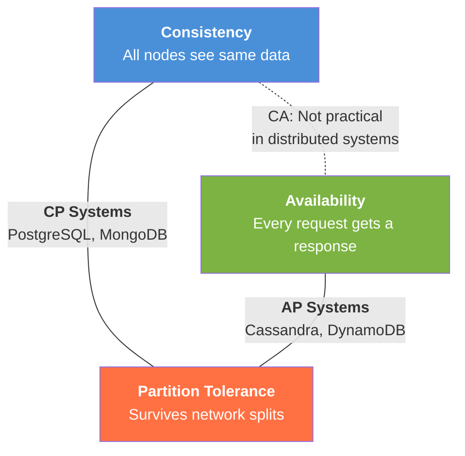
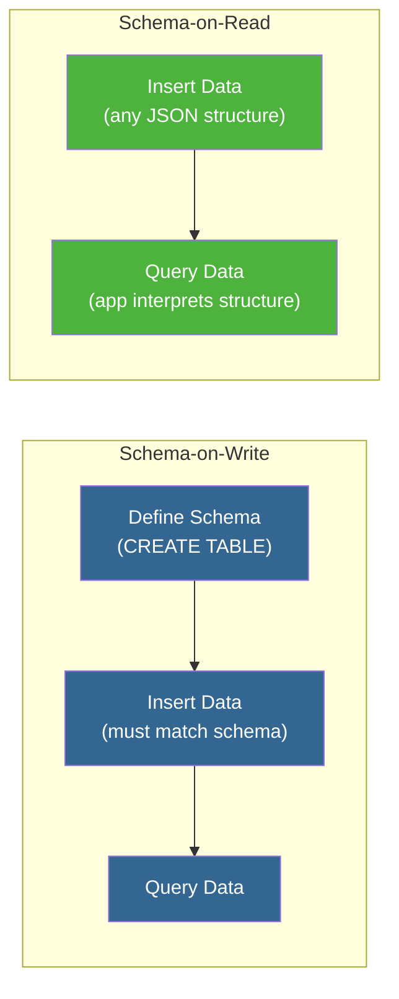
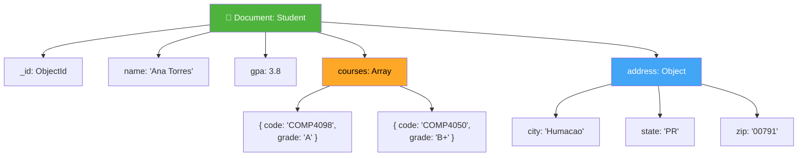
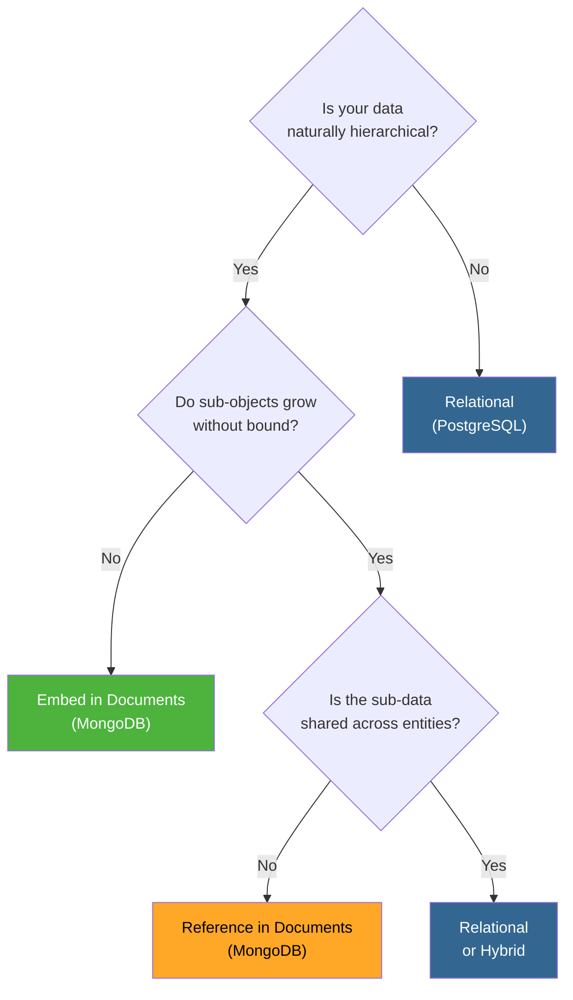

# Why NoSQL? Distributed Trade-offs & the Document Model

## 1. Learning Objectives

By the end of this lesson, you will be able to:
*   Define Consistency, Availability, and Partition Tolerance and explain the CAP impossibility result
*   Classify real-world database systems as CP or AP and explain the trade-off each makes
*   Distinguish Schema-on-Write (relational) from Schema-on-Read (document/NoSQL)
*   Explain the MongoDB data model: documents, collections, and databases
*   Compare embedded documents vs. references and identify when each is appropriate
*   Model one-to-one, one-to-many, and many-to-many relationships as JSON documents
*   Identify scenarios where a document model is superior to a relational model (and vice versa)

---

## 2. The "Why": Beyond the Relational World

Throughout this course, you've built a strong relational foundation — ER modeling, normalization, PostgreSQL, DuckDB. Every system you've used enforces a rigid schema: define your tables first, then insert data that fits. This works beautifully for structured, well-understood data.

But two forces are pushing the industry beyond relational-only architectures:

1.  **Scale and distribution** — Global applications, microservices, and cloud-native systems need databases that survive network failures and scale horizontally across data centers. This creates fundamental trade-offs that relational databases weren't designed for.
2.  **Schema flexibility** — Data science pipelines, JSON APIs, IoT sensor readings, and social media feeds produce semi-structured data that doesn't fit neatly into predefined table schemas.

> **Analogy:** Think of a relational database as a tax form — every field is predefined, every entry must match the format, and the structure must be approved *before* you fill it in. A document database is more like a notebook — you write whatever you need, in whatever structure makes sense for that entry. Both are legitimate ways to organize information; the right choice depends on whether you value strict uniformity or flexible expression.

To understand *why* document databases exist, we first need to understand the fundamental constraint that shapes all distributed data systems: the CAP theorem.

---

## 3. The CAP Theorem

### The Three Properties

Every distributed database makes promises about three properties:

| Property | Formal Definition | Plain English |
| :--- | :--- | :--- |
| **Consistency (C)** | Every read receives the most recent write or an error | All nodes see the same data at the same time |
| **Availability (A)** | Every request receives a non-error response (no guarantee it's the latest) | The system always responds, even if the answer is stale |
| **Partition Tolerance (P)** | The system continues operating despite network messages being dropped or delayed between nodes | The system works even when some servers can't talk to each other |

### The Impossibility Result

In 2000, Eric Brewer conjectured — and in 2002, Gilbert and Lynch formally proved — that a distributed system cannot simultaneously guarantee all three properties. This is the **CAP theorem**.

The key insight: in a distributed system, **network partitions will happen**. Cables get cut, data centers lose connectivity, cloud regions go down. Partition tolerance is not optional — it's a fact of life.

So the real question is not "pick any 2 of 3." It's:

> **Given that partitions will happen, do you sacrifice Consistency or Availability?**

*   **Sacrifice Availability (CP):** During a partition, the system blocks or rejects requests rather than return stale data. When the partition heals, all nodes agree.
*   **Sacrifice Consistency (AP):** During a partition, the system continues responding, but different nodes may return different (stale) values. Data converges *eventually*.

### Visual: The CAP Triangle



### CP vs. AP: Real-World Systems

| System | Classification | What It Sacrifices During Partition | Typical Use Case |
| :--- | :--- | :--- | :--- |
| **PostgreSQL** | CP | Availability (blocks or rejects writes) | Banking, ERP, transactional apps |
| **MongoDB** (default) | CP | Availability (writes to primary only; election blocks writes) | Content management, product catalogs |
| **Cassandra** | AP | Consistency (allows stale reads across nodes) | IoT sensor data, social media feeds |
| **DynamoDB** | AP | Consistency (eventually consistent reads by default) | Shopping carts, user sessions |
| **Redis** (standalone) | CP | Availability (single node — no partition tolerance) | Caching, session store |

**Note:** These are *default* behaviors. Most modern systems offer tunable consistency — for example, MongoDB's `readConcern` and `writeConcern` settings let you trade between consistency and latency. See the Deep Dives section for details.

### Key Takeaway

*   Network partitions are inevitable in distributed systems
*   **CP systems** (PostgreSQL, MongoDB) prioritize correctness — they'd rather reject a request than return wrong data
*   **AP systems** (Cassandra, DynamoDB) prioritize uptime — they'd rather return potentially stale data than go offline
*   The relational databases you've used so far are CP — they choose consistency. NoSQL databases make different choices depending on their design goals.

---

## 4. Schema-on-Write vs. Schema-on-Read

The CAP theorem explains *distributed* trade-offs. But there's a second fundamental difference between relational and NoSQL systems: **when the schema is enforced**.

### Definitions

| Approach | When Schema Is Defined | Enforced By | Examples |
| :--- | :--- | :--- | :--- |
| **Schema-on-Write** | Before data is written (`CREATE TABLE`) | Database engine (rejects invalid data at INSERT) | PostgreSQL, MySQL, Oracle |
| **Schema-on-Read** | When data is read or queried | Application code (interprets structure at query time) | MongoDB, JSON data lakes, Elasticsearch |

### Visual: Two Paths from Raw Data to Queryable Data



### When Each Approach Shines

**Schema-on-Write wins when:**
*   Data integrity is critical (financial transactions, medical records)
*   The schema is stable and well-understood
*   Multiple applications share the same database and need guaranteed structure

**Schema-on-Read wins when:**
*   The schema evolves frequently (startups, rapid prototyping)
*   Data arrives in varied structures (JSON APIs, IoT sensors, web scraping)
*   Data scientists need to ingest first and explore later — "store now, structure later"

Schema-on-write prevents bad data from entering the system. Schema-on-read prevents rigid schemas from blocking data ingestion. The document model embraces schema-on-read — let's see how it works.

---

## 5. The Document Model

### 5.1 MongoDB Vocabulary

If you know relational databases, you already know the document model — just with different names:

| Relational (PostgreSQL) | Document (MongoDB) | Notes |
| :--- | :--- | :--- |
| Database | Database | Same concept |
| Table | **Collection** | A group of documents (no enforced schema by default) |
| Row | **Document** | A JSON/BSON object |
| Column | **Field** | A key-value pair within a document |
| Primary Key | **`_id` field** | Automatically generated as an ObjectId if not provided |
| JOIN | **Embedded document** or `$lookup` | Denormalization (embedding) is preferred over joins |

### 5.2 JSON/BSON Document Structure

A MongoDB document is a JSON object that can contain nested objects and arrays. Here's a student record — notice how it stores data that would require multiple relational tables in a single document:

```json
{
  "_id": "ObjectId('665a1b2c...')",
  "name": "Ana Torres",
  "email": "ana.torres@upr.edu",
  "major": "Data Science",
  "gpa": 3.8,
  "courses": [
    {"code": "COMP4098", "title": "Data Management", "grade": "A"},
    {"code": "COMP4050", "title": "Machine Learning", "grade": "B+"}
  ],
  "address": {
    "city": "Humacao",
    "state": "PR",
    "zip": "00791"
  }
}
```

**Key features:**
*   **Nested objects** (`address`) — embed related data directly inside the parent document
*   **Arrays** (`courses`) — store multiple values or sub-documents in one field
*   **BSON** (Binary JSON) — MongoDB's internal storage format. Extends JSON with types like `ObjectId`, `Date`, `Decimal128`, and `Binary`. You interact with JSON; MongoDB stores BSON.



In a relational model, this student would require at least three tables: `students`, `enrollments` (with a foreign key to `courses`), and `addresses`. In the document model, it's one document — one read, no joins.

### 5.3 Embedded Documents vs. References

This is the central modeling decision in MongoDB, analogous to normalization vs. denormalization in the relational world.

**Embedded (Denormalized):** Store related data inside the parent document.

```json
{
  "_id": 1001,
  "customer": "Ana Torres",
  "order_date": "2026-03-15",
  "items": [
    {"product": "Laptop", "qty": 1, "price": 999.99},
    {"product": "Mouse", "qty": 2, "price": 25.00}
  ]
}
```

**Referenced (Normalized):** Store related data in separate collections and link by ID.

```json
// orders collection
{"_id": 1001, "customer_id": "C001", "item_ids": [5001, 5002]}

// customers collection
{"_id": "C001", "name": "Ana Torres", "email": "ana@example.com"}

// items collection
{"_id": 5001, "product": "Laptop", "qty": 1, "price": 999.99}
{"_id": 5002, "product": "Mouse", "qty": 2, "price": 25.00}
```

| Criterion | Embedded | Referenced |
| :--- | :--- | :--- |
| **Read speed** | Fast (single read) | Slower (multiple reads or `$lookup`) |
| **Write complexity** | Harder to update shared data | Easier (update in one place) |
| **Data duplication** | Yes (if same sub-document in many places) | No |
| **Document size** | Can grow large | Stays small |
| **Best for** | Data accessed together, bounded (one-to-few) | Shared data, many-to-many, unbounded arrays |

**Rule of thumb:**
*   *"If you always access X and Y together, embed Y in X."*
*   *"If Y is shared by many X's, or Y grows without bound, use a reference."*

### 5.4 Modeling Patterns: Cardinalities

**One-to-One** — always embed:

```json
{
  "name": "Ana Torres",
  "address": {"city": "Humacao", "state": "PR", "zip": "00791"}
}
```

**One-to-Many (bounded / "one-to-few")** — embed:

```json
{
  "name": "Ana Torres",
  "phone_numbers": ["787-555-0001", "787-555-0002"]
}
```

**One-to-Many (unbounded / "one-to-millions")** — reference:

```json
// hosts collection
{"_id": "host123", "hostname": "web-server-1"}

// log_entries collection (millions per host)
{"host_id": "host123", "timestamp": "2026-03-15T10:00:00Z", "message": "..."}
```

Why not embed? If a server generates 10,000 log entries per day, after a year that's 3.65 million sub-documents. MongoDB has a **16 MB document size limit** — embedding unbounded arrays will eventually hit it.

**Many-to-Many** — array of references on one or both sides:

```json
// students collection
{"_id": "S001", "name": "Ana", "course_ids": ["COMP4098", "COMP4050"]}

// courses collection
{"_id": "COMP4098", "title": "Data Management", "student_ids": ["S001", "S002"]}
```

### 5.5 When Documents Beat Tables (and Vice Versa)



| Scenario | Better Fit |
| :--- | :--- |
| Complex transactions across multiple entities | Relational (PostgreSQL) |
| Content management (articles, blog posts) | Document (MongoDB) |
| Real-time analytics on structured data | Relational + OLAP (DuckDB) |
| Product catalogs with varying attributes | Document (MongoDB) |
| User profiles with nested preferences | Document (MongoDB) |
| Financial ledger with strict constraints | Relational (PostgreSQL) |

---

## 6. Deep Dives (Optional)

### A. PACELC: Beyond CAP

<details>
<summary>Click to expand: PACELC Theorem</summary>

The CAP theorem only describes behavior *during a partition*. But most of the time, your system is running normally with no partitions. What trade-offs apply then?

In 2012, Daniel Abadi proposed **PACELC** as an extension:

> **If** Partition → choose **A**vailability or **C**onsistency.
> **Else** (normal operation) → choose **L**atency or **C**onsistency.

The "Else" clause captures a reality CAP ignores: even without partitions, replicating data across nodes takes time. You can either wait for all replicas to confirm (consistent but slower) or respond immediately from the nearest replica (fast but potentially stale).

| System | If Partition (PA or PC) | Else (EL or EC) | Full Classification |
| :--- | :--- | :--- | :--- |
| **PostgreSQL** | PC (consistent) | EC (consistent) | PC/EC |
| **MongoDB** (default) | PC (consistent) | EC (consistent) | PC/EC |
| **Cassandra** | PA (available) | EL (low latency) | PA/EL |
| **DynamoDB** (default) | PA (available) | EL (low latency) | PA/EL |
| **CockroachDB** | PC (consistent) | EC (consistent) | PC/EC |

**Why this matters:** PACELC explains why Cassandra and DynamoDB feel faster for reads even when no partition exists — they prioritize latency (EL) over consistency (EC) during normal operation, not just during failures.

</details>

### B. Eventual Consistency Models

<details>
<summary>Click to expand: Eventual Consistency</summary>

When an AP system "sacrifices consistency," what does that actually mean?

**Eventual consistency** guarantees: *if no new updates are made to a data item, all replicas will eventually converge to the same value.* The key word is "eventually" — in practice, this convergence usually happens within milliseconds, not minutes.

The consistency spectrum (from strongest to weakest):

| Model | Guarantee | Cost |
| :--- | :--- | :--- |
| **Linearizability** | Every operation appears to happen at a single instant in time; reads always return the latest write | Highest latency — requires coordination across all nodes |
| **Sequential consistency** | Operations appear in some total order consistent with each client's local order | High — still requires global ordering |
| **Causal consistency** | Operations that are causally related are seen in the same order by all nodes | Moderate — only tracks dependencies |
| **Eventual consistency** | All replicas converge given no new writes | Lowest latency — no coordination required |

**Session guarantees** add practical safety to eventual consistency:
*   **Read-your-writes:** After you write a value, your subsequent reads will see that value (even if other clients don't yet)
*   **Monotonic reads:** Once you read a value, you won't see an older value in later reads

MongoDB supports configurable consistency through `readConcern` and `writeConcern`:
*   `writeConcern: { w: "majority" }` — wait for a write to be confirmed by a majority of replica set members
*   `readConcern: "majority"` — only return data that has been confirmed by a majority of members
*   `readConcern: "local"` — return the most recent data from this node (faster, but potentially stale after a failover)

</details>

### C. MongoDB Schema Validation

<details>
<summary>Click to expand: Schema Validation in MongoDB</summary>

MongoDB's "schema-on-read" doesn't mean "no schema ever." For production systems, you can add **optional schema validation** using JSON Schema:

```json
db.createCollection("students", {
  validator: {
    $jsonSchema: {
      bsonType: "object",
      required: ["name", "email", "gpa"],
      properties: {
        name: { bsonType: "string", description: "must be a string" },
        email: { bsonType: "string", pattern: "^.+@.+$" },
        gpa: { bsonType: "double", minimum: 0.0, maximum: 4.0 }
      }
    }
  },
  validationLevel: "strict"
})
```

**Validation levels:**
*   `strict` — All inserts and updates must pass validation
*   `moderate` — Only validates documents that already satisfy the schema; allows existing non-conforming documents to be updated without validation

**Validation actions:**
*   `error` — Reject the operation (default)
*   `warn` — Allow the operation but log a warning

This is the middle ground between relational rigidity and total schema freedom — "schema-on-read with optional guardrails."

</details>

---

## 7. FAQ / Industry Reality

### "So MongoDB has no schema at all?"

**Answer:** MongoDB collections have no *enforced* schema by default, but that doesn't mean "no schema." In practice, applications expect documents to follow a consistent structure, and most teams define that structure in application code or ODM libraries (like Mongoose for Node.js or MongoEngine for Python). MongoDB also offers optional `$jsonSchema` validation for teams that want enforcement. The schema exists — it lives in the application layer rather than the database definition.

### "Should I use MongoDB instead of PostgreSQL for my data science projects?"

**Answer:** Usually not. For structured, tabular data with clear relationships — which describes most data science datasets — PostgreSQL is still the better choice. MongoDB shines when your data is hierarchical, semi-structured, or has a rapidly evolving schema: product catalogs where every category has different attributes, user-generated content, or ingesting JSON from varied APIs. The best answer is often "both, for different parts of the pipeline."

### "Isn't denormalization in MongoDB just the same as denormalization in SQL?"

**Answer:** The concept is the same — duplicating data to avoid joins — but the mechanics differ. In SQL, denormalization means adding redundant columns or creating materialized views. In MongoDB, denormalization means nesting related data as embedded sub-documents. MongoDB's document model makes denormalization the *default* approach rather than a deliberate compromise, and the database is optimized for reading these nested structures efficiently.

---

## 8. Summary & Next Steps

**Key takeaways:**

*   The **CAP theorem** proves that no distributed database can guarantee consistency, availability, and partition tolerance simultaneously
*   **CP systems** (PostgreSQL, MongoDB) prioritize correctness; **AP systems** (Cassandra, DynamoDB) prioritize uptime
*   **Schema-on-write** (relational) enforces structure at insert time; **schema-on-read** (document) defers structure to query time
*   MongoDB organizes data as **documents** (JSON/BSON) in **collections**, rather than rows in tables
*   The key modeling decision is **embed vs. reference**: embed when data is accessed together and bounded; reference when data is shared or unbounded
*   Documents excel for hierarchical, semi-structured data; relational tables excel for structured, highly relational data with strict integrity requirements

*   **Next:** Go to the Practical Lab [w09_l17_lab_document_modeling.md](w09_l17_lab_document_modeling.md) to practice classifying distributed systems and redesigning relational schemas as document models.

---

## 9. Further Reading

### Documentation
*   [MongoDB Manual: Data Modeling Introduction](https://www.mongodb.com/docs/manual/core/data-modeling-introduction/) — Official guide to document modeling concepts, embedding vs. referencing
*   [MongoDB Manual: Schema Validation](https://www.mongodb.com/docs/manual/core/schema-validation/) — How to add optional schema enforcement to collections

### Articles & Tutorials
*   [Visual Guide to NoSQL Systems — Nathan Hurst](http://blog.nahurst.com/visual-guide-to-nosql-systems) — The widely-referenced CAP triangle visualization that classifies dozens of databases
*   [Martin Kleppmann: "Please stop calling databases CP or AP"](https://martin.kleppmann.com/2015/05/11/please-stop-calling-databases-cp-or-ap.html) — Nuanced critique of oversimplified CAP classifications; excellent for students who want the full picture
