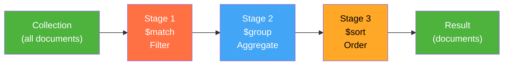
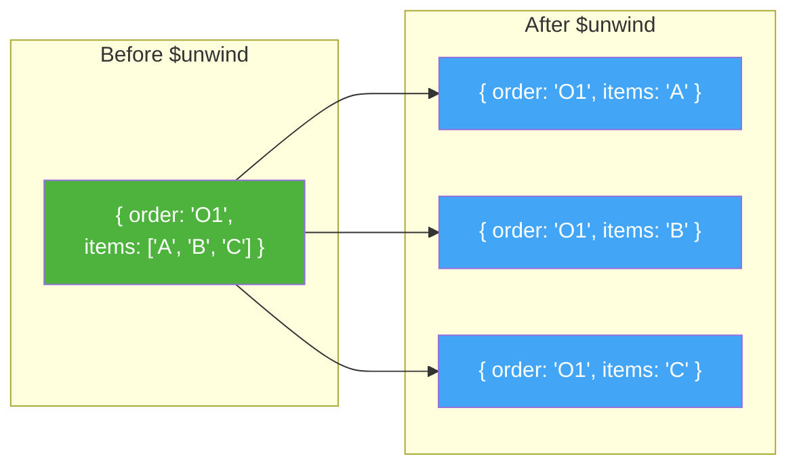

# Advanced Document Querying & the Aggregation Pipeline

## 1. Learning Objectives

By the end of this lesson, you will be able to:
*   Combine query filters using logical operators (`$and`, `$or`, `$not`)
*   Query arrays using `$elemMatch`, `$all`, and `$size`
*   Explain the Aggregation Pipeline as a sequence of data transformation stages
*   Use the core pipeline stages: `$match`, `$group`, `$project`, `$unwind`, `$sort`, and `$limit`
*   Map MongoDB aggregation concepts to their SQL equivalents (`WHERE`, `GROUP BY`, `SELECT`)
*   Use accumulator operators (`$sum`, `$avg`, `$min`, `$max`) within `$group`

---

## 2. The "Why": From CRUD to Analytics

In the previous lesson, you learned to insert, find, update, and delete documents — the building blocks of any database interaction. But data science doesn't stop at CRUD. You need to *analyze* data: compute averages, group by categories, rank results, and transform nested structures into flat summaries.

In SQL, you'd reach for `GROUP BY`, `HAVING`, aggregate functions, and subqueries. MongoDB's equivalent is the **Aggregation Pipeline** — a powerful, composable framework that processes documents through a sequence of stages, each transforming the data for the next.

> **Analogy:** Think of the aggregation pipeline as a factory assembly line. Raw materials (documents) enter at one end. Each station (stage) performs one operation — filtering, grouping, reshaping, sorting — and passes the result to the next station. At the end of the line, you get the finished product (your analytical result). You can add, remove, or reorder stations to build any analysis you need.

---

## 3. Logical and Array Query Operators

Before diving into aggregation, let's complete your query toolkit with logical and array operators.

### 3.1 Logical Operators

| Operator | Description | SQL Equivalent |
| :--- | :--- | :--- |
| `$and` | All conditions must be true | `WHERE a AND b` |
| `$or` | At least one condition must be true | `WHERE a OR b` |
| `$not` | Negates a condition | `WHERE NOT a` |
| `$nor` | None of the conditions are true | `WHERE NOT (a OR b)` |

```python
# Explicit $and — electronics under $50
{"$and": [{"category": "Electronics"}, {"price": {"$lt": 50}}]}

# Implicit $and — same result (multiple keys in one dict)
{"category": "Electronics", "price": {"$lt": 50}}

# $or — electronics OR under $10
{"$or": [{"category": "Electronics"}, {"price": {"$lt": 10}}]}

# $not — prices that are NOT greater than 100 (i.e., price ≤ 100)
# Note: $not wraps a field-level operator, unlike $and/$or which wrap top-level conditions
{"price": {"$not": {"$gt": 100}}}
```

**Tip:** When filtering on the *same* field with different operators, place them in the same sub-document: `{"price": {"$gte": 20, "$lte": 100}}`. Use explicit `$and` or `$or` when you need to combine conditions on different fields or when the same operator key appears twice.

### 3.2 Array Query Operators

MongoDB has specialized operators for querying array fields:

| Operator | Description | Example |
| :--- | :--- | :--- |
| `{"tags": "sale"}` | Array contains the value | Match docs where `tags` includes `"sale"` |
| `$all` | Array contains *all* specified values | `{"tags": {"$all": ["premium", "new"]}}` |
| `$size` | Array has exactly N elements | `{"tags": {"$size": 3}}` |
| `$elemMatch` | At least one element matches *all* conditions | See below |

### 3.3 `$elemMatch` vs. Dot Notation

This distinction is subtle but important. Dot notation checks conditions independently across array elements. `$elemMatch` ensures all conditions match the *same* element.

```python
# Document: {"items": [{"qty": 10, "price": 20}, {"qty": 3, "price": 5}]}

# Dot notation: qty > 5 AND price < 10 — checked independently
# MATCHES: qty=10 > 5 (element 1), price=5 < 10 (element 2)
{"items.qty": {"$gt": 5}, "items.price": {"$lt": 10}}

# $elemMatch: SAME element must satisfy both
# Does NOT match: no single element has qty > 5 AND price < 10
{"items": {"$elemMatch": {"qty": {"$gt": 5}, "price": {"$lt": 10}}}}
```

**Rule of thumb:** Use `$elemMatch` when you need to ensure multiple conditions apply to the *same* array element. Use dot notation for simple single-condition queries on array fields.

---

## 4. The Aggregation Pipeline

### 4.1 Pipeline Structure

An aggregation pipeline is an **ordered array of stages**. Each stage receives documents from the previous stage, transforms them, and passes the result forward.



```python
# Pipeline syntax in pymongo
result = collection.aggregate([
    {"$match":   { ... }},   # Stage 1: Filter documents
    {"$group":   { ... }},   # Stage 2: Group and aggregate
    {"$sort":    { ... }},   # Stage 3: Sort results
])
```

### 4.2 Core Stages

#### `$match` — Filter Documents

Works exactly like `find()` filters. Place it early in the pipeline to reduce documents processed by later stages.

```python
# Only delivered orders
{"$match": {"status": "delivered"}}

# Orders from March 2026
{"$match": {"order_date": {"$gte": datetime(2026, 3, 1), "$lt": datetime(2026, 4, 1)}}}
```

**SQL equivalent:** `WHERE status = 'delivered'`

#### `$group` — Group and Aggregate

Groups documents by a key and computes aggregate values using **accumulator operators**.

```python
# Average price by category
{"$group": {
    "_id": "$category",              # Group key (field reference with $)
    "avg_price": {"$avg": "$price"}, # Accumulator
    "count": {"$sum": 1}             # Count documents per group
}}
```

**SQL equivalent:** `SELECT category, AVG(price), COUNT(*) FROM products GROUP BY category`

**Accumulator operators:**

| Accumulator | Description | SQL Equivalent |
| :--- | :--- | :--- |
| `$sum` | Sum values (or count with `$sum: 1`) | `SUM()` / `COUNT(*)` |
| `$avg` | Average of values | `AVG()` |
| `$min` | Minimum value | `MIN()` |
| `$max` | Maximum value | `MAX()` |
| `$push` | Collect values into an array | `ARRAY_AGG()` |
| `$first` | First value in each group | (with `ORDER BY`) |
| `$last` | Last value in each group | (with `ORDER BY`) |

**Grouping by multiple fields** — use a document as `_id`:

```python
{"$group": {
    "_id": {"category": "$category", "status": "$status"},
    "count": {"$sum": 1}
}}
```

**SQL equivalent:** `GROUP BY category, status`

#### `$project` — Reshape Documents

Controls which fields appear in the output. Can also compute new fields.

```python
# Include name, compute total, exclude _id
{"$project": {
    "name": 1,
    "total": {"$multiply": ["$quantity", "$price"]},
    "_id": 0
}}
```

**SQL equivalent:** `SELECT name, quantity * price AS total`

#### `$unwind` — Flatten Arrays

Deconstructs an array field, creating one document per array element. Essential for aggregating across embedded array data.



```python
# Flatten the items array
{"$unwind": "$items"}
```

After `$unwind`, each original document with N array elements becomes N documents. You can then `$group` by array element fields — for example, counting how many orders include each product.

#### `$sort` and `$limit`

```python
{"$sort": {"total": -1}}    # -1 = descending, 1 = ascending
{"$limit": 5}               # Return at most 5 documents
```

**SQL equivalent:** `ORDER BY total DESC LIMIT 5`

### 4.3 SQL-to-Pipeline Mapping

| SQL Clause | Pipeline Stage | Notes |
| :--- | :--- | :--- |
| `WHERE` | `$match` | Place early in pipeline for performance |
| `GROUP BY` | `$group` | `_id` is the grouping key |
| `HAVING` | `$match` (after `$group`) | A second `$match` filters grouped results |
| `SELECT` | `$project` | Controls output fields and computed values |
| `ORDER BY` | `$sort` | 1 = ascending, -1 = descending |
| `LIMIT` | `$limit` | Maximum number of documents to return |
| `COUNT(*)` | `$count` or `{"$sum": 1}` in `$group` | `$count` is a shorthand stage |
| `JOIN ... GROUP BY` | `$unwind` + `$group` | Flatten embedded arrays, then re-aggregate |

### 4.4 Building a Complete Pipeline

Let's build a pipeline that answers: *"How many delivered orders came from each city?"*

```python
pipeline = [
    # Stage 1: Only delivered orders (WHERE)
    {"$match": {"status": "delivered"}},

    # Stage 2: Group by customer city (GROUP BY)
    {"$group": {
        "_id": "$customer.city",
        "order_count": {"$sum": 1}
    }},

    # Stage 3: Sort by count descending (ORDER BY)
    {"$sort": {"order_count": -1}},

    # Stage 4: Rename _id for readability (SELECT AS)
    {"$project": {
        "city": "$_id",
        "order_count": 1,
        "_id": 0
    }}
]
```

**SQL equivalent:**
```sql
SELECT customer_city AS city, COUNT(*) AS order_count
FROM orders
WHERE status = 'delivered'
GROUP BY customer_city
ORDER BY order_count DESC;
```

### 4.5 The `$unwind` + `$group` Pattern

The most powerful aggregation pattern in MongoDB: **unwind an array, then group by array element fields.** This lets you aggregate *across* embedded data.

Example — finding the most popular products across all orders:

```python
pipeline = [
    {"$unwind": "$items"},                           # 1 doc per item
    {"$group": {
        "_id": "$items.product",                     # Group by product name
        "times_ordered": {"$sum": 1},                # Count appearances
        "total_qty": {"$sum": "$items.quantity"}     # Sum quantities
    }},
    {"$sort": {"total_qty": -1}}                     # Most popular first
]
```

Without `$unwind`, you can't aggregate across the `items` arrays of different orders — each order's items array is a single field. `$unwind` explodes each array into individual rows (like SQL's `UNNEST`), making them groupable.

### Key Takeaway
*   Pipelines are composable — each stage is independent and can be added, removed, or reordered
*   Place `$match` early to filter documents before expensive operations like `$group`
*   `$unwind` is the key to analyzing array data — it converts nested arrays into flat, groupable documents
*   Use a second `$match` after `$group` for `HAVING`-style filtering on aggregated results
*   The SQL-to-pipeline mapping makes it easy to translate familiar SQL analytics into MongoDB

---

## 5. Deep Dive: Pipeline Optimization and `$lookup` (Optional)

<details>
<summary>Click to expand: Pipeline Performance Tips</summary>

### Stage Ordering Matters

MongoDB optimizes some pipelines automatically, but you should still follow these rules:

1. **`$match` first** — Reduce the working set before any transformation. MongoDB can use indexes on `$match` stages at the beginning of a pipeline.
2. **`$project` early** — Drop unneeded fields to reduce memory usage in later stages.
3. **`$sort` + `$limit` together** — When consecutive, MongoDB only tracks the top N documents instead of sorting the entire collection.

### The `$lookup` Stage (Joins in MongoDB)

While embedding is the preferred approach, MongoDB supports cross-collection joins via `$lookup`:

```python
{"$lookup": {
    "from": "customers",           # Collection to join
    "localField": "customer_id",   # Field in current collection
    "foreignField": "_id",         # Field in target collection
    "as": "customer_info"          # Output array field
}}
```

This is similar to a SQL `LEFT OUTER JOIN`. The result is an array (`customer_info`) because multiple matches are possible. For a one-to-one relationship, you'd follow with `{"$unwind": "$customer_info"}` to flatten it.

**Performance note:** `$lookup` is slower than embedding because it reads from a second collection. Use it when references are necessary (shared data, unbounded arrays), not as a default.

### Explain Plans

Like SQL's `EXPLAIN`, MongoDB provides query plans:

```python
explanation = db.command("aggregate", "orders",
                         pipeline=pipeline, explain=True)
```

This shows which indexes are used, how many documents each stage processes, and where bottlenecks occur.

</details>

---

## 6. FAQ / Industry Reality

### "When should I use the aggregation pipeline instead of processing data in Python (pandas)?"

**Answer:** Use the aggregation pipeline when the data lives in MongoDB and you want to filter, group, or transform it *before* pulling it into Python. The pipeline runs on the database server, close to the data — it processes millions of documents without transferring them over the network. Pull data into pandas when you need operations MongoDB doesn't support natively (e.g., machine learning, complex statistical analysis, or visualization). For a 10-million-row collection, `$group` in MongoDB is orders of magnitude faster than `pd.DataFrame(list(collection.find())).groupby(...)`.

### "Can I use multiple `$match` stages in one pipeline?"

**Answer:** Yes, and it's a common pattern. Use an early `$match` to filter the initial dataset (like SQL's `WHERE`), then a later `$match` after `$group` to filter aggregated results (like SQL's `HAVING`). For example: first `$match` for orders in 2026, then `$group` by customer, then `$match` for customers with total spending over $1,000.

### "How is `$unwind` different from a SQL JOIN?"

**Answer:** `$unwind` doesn't combine data from two sources — it flattens data that's already embedded. If an order has 3 items in an `items` array, `$unwind` on `items` produces 3 documents (one per item), each carrying the parent order's fields. It's more like SQL's `UNNEST` or `LATERAL JOIN` than a regular `JOIN`. The key use case: you embedded related data (items inside orders) and now need to aggregate *across* the embedded elements (e.g., "most popular product across all orders").

---

## 7. Summary & Next Steps

**Key takeaways:**

*   **Logical operators** (`$and`, `$or`) combine conditions; **array operators** (`$elemMatch`, `$all`, `$size`) query within array fields
*   `$elemMatch` ensures multiple conditions match the *same* array element — dot notation checks them independently
*   The **Aggregation Pipeline** is an ordered array of stages that transform documents sequentially
*   Core stages: `$match` (filter), `$group` (aggregate), `$project` (reshape), `$unwind` (flatten arrays), `$sort` (order), `$limit` (cap results)
*   **SQL mapping:** `WHERE` -> `$match`, `GROUP BY` -> `$group`, `SELECT` -> `$project`, `HAVING` -> second `$match`
*   The `$unwind` + `$group` pattern is essential for analytics on embedded array data

*   **Next:** Go to the Practical Lab [w10_l20_lab_aggregation_pipeline.md](w10_l20_lab_aggregation_pipeline.md) to build aggregation pipelines against an e-commerce orders dataset.

---

## 8. Further Reading

### Documentation
*   [MongoDB Manual: Aggregation Pipeline](https://www.mongodb.com/docs/manual/core/aggregation-pipeline/) — Official reference for all pipeline stages and operators
*   [MongoDB Manual: Query and Projection Operators](https://www.mongodb.com/docs/manual/reference/operator/query/) — Complete list of query operators with examples

### Articles & Tutorials
*   [MongoDB University: M121 — The MongoDB Aggregation Framework](https://university.mongodb.com/) — Free course dedicated entirely to the aggregation pipeline
*   [Practical MongoDB Aggregations (free e-book)](https://www.practical-mongodb-aggregations.com/) — Community-written guide with real-world pipeline examples and optimization tips
