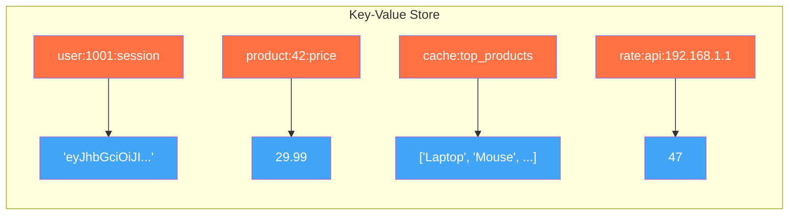
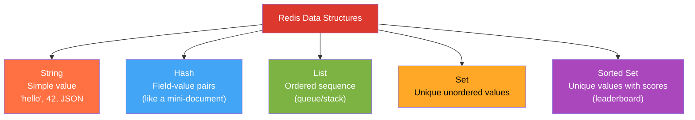
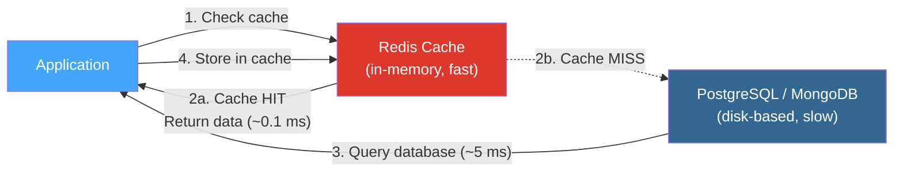
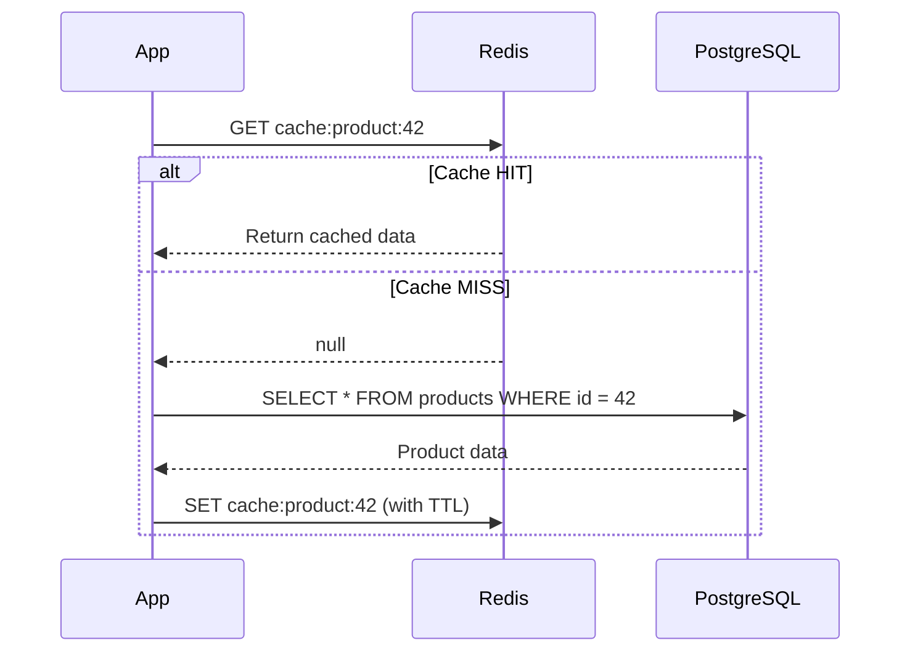
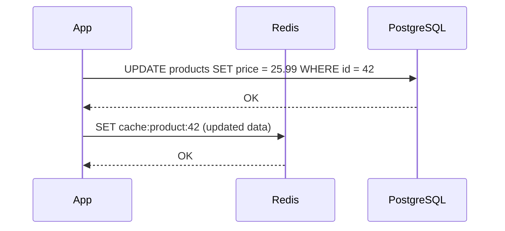
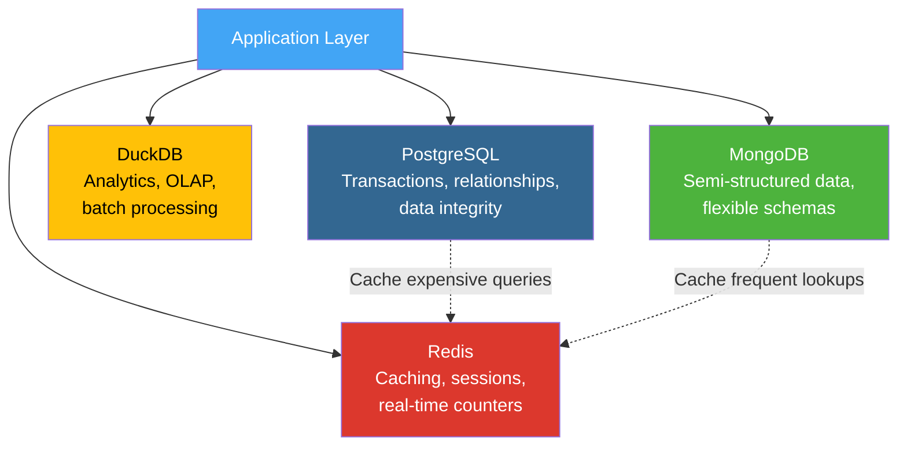

# Key-Value Stores & Redis

## 1. Learning Objectives

By the end of this lesson, you will be able to:
*   Define the key-value data model and explain how it differs from document and relational models
*   Identify use cases where key-value stores outperform relational and document databases
*   Describe Redis's core data structures: Strings, Hashes, Lists, Sets, and Sorted Sets
*   Explain caching strategies (Cache-Aside, Write-Through) and when to use each
*   Define TTL (Time-To-Live) and explain its role in cache management
*   Position Redis within the polyglot persistence stack alongside PostgreSQL, DuckDB, and MongoDB

---

## 2. The "Why": Speed as a Feature

You've now worked with three storage engines: PostgreSQL (row-oriented, OLTP), DuckDB (column-oriented, OLAP), and MongoDB (document-oriented). Each optimizes for a different access pattern — but all of them store data on disk and answer queries by reading from that storage.

What happens when your application needs a response in **under 1 millisecond**? Think session tokens during login, real-time leaderboards, rate limiters for APIs, or caching the result of an expensive database query that thousands of users request every second. Disk-based databases — even fast ones — can't consistently deliver sub-millisecond responses under high concurrency.

This is where **key-value stores** enter the picture. They trade the query expressiveness of SQL and MongoDB's aggregation pipeline for raw speed: store a value under a key, retrieve it by that key, done.

> **Analogy:** Imagine a library. A relational database is like searching the card catalog by subject, author, and year — powerful but slow. A document database is like browsing a well-organized shelf where related books sit together. A key-value store is like a coat-check counter: hand over your ticket (key), get your coat (value) back instantly. No browsing, no searching — just direct lookup.

---

## 3. The Key-Value Data Model

### 3.1 Definition

A key-value store is the simplest database model: every piece of data is stored as a **key** (a unique identifier, typically a string) mapped to a **value** (which can be a string, number, JSON blob, binary data, or a complex data structure).



### 3.2 Operations

The API is minimal by design:

| Operation | Description | Example |
| :--- | :--- | :--- |
| `GET key` | Retrieve the value for a key | `GET user:1001:session` |
| `SET key value` | Store a value under a key | `SET product:42:price 29.99` |
| `DELETE key` | Remove a key and its value | `DELETE user:1001:session` |
| `EXISTS key` | Check if a key exists | `EXISTS rate:api:192.168.1.1` |

No `SELECT ... WHERE ... JOIN` — no query language at all. You must know the exact key you want. This constraint is what makes key-value stores fast: every operation is an O(1) hash table lookup.

### 3.3 Where Key-Value Fits in the Data Model Spectrum

| Model | Query Power | Schema Flexibility | Read Latency | Best For |
| :--- | :--- | :--- | :--- | :--- |
| **Relational** (PostgreSQL) | High (SQL joins, aggregates) | Low (rigid schema) | ~1–10 ms | Transactions, complex queries |
| **Document** (MongoDB) | Medium (nested queries, aggregation) | High (schema-on-read) | ~1–10 ms | Hierarchical / semi-structured data |
| **Key-Value** (Redis) | Low (key lookup only) | Highest (opaque values) | **~0.1–0.5 ms** | Caching, sessions, counters |

**Key takeaway:** Key-value stores sacrifice query expressiveness for extreme speed. They complement — not replace — relational and document databases.

---

## 4. Redis: The Swiss Army Knife of Key-Value Stores

### 4.1 What Is Redis?

**Redis** (Remote Dictionary Server) is an open-source, **in-memory** key-value store. Unlike PostgreSQL or MongoDB, Redis stores all data in RAM, which is why it achieves sub-millisecond latency.

Key characteristics:

| Feature | Description |
| :--- | :--- |
| **In-memory** | All data lives in RAM; optional persistence to disk |
| **Single-threaded** | One thread processes commands sequentially — no locks, no race conditions |
| **Rich data structures** | Not just strings — supports Hashes, Lists, Sets, Sorted Sets, and more |
| **TTL support** | Keys can auto-expire after a configurable time |
| **Atomic operations** | Increment, append, push/pop — all atomic without explicit transactions |

### 4.2 Redis Data Structures

Redis is more than a simple key-string store. Its built-in data structures are what make it a "data structure server."



#### Strings

The most basic type. A key maps to a single value (string, number, or serialized data).

```text
SET greeting "Hello, COMP 4098!"
GET greeting          → "Hello, COMP 4098!"

SET counter 0
INCR counter          → 1
INCR counter          → 2
INCRBY counter 10     → 12
```

**Use cases:** Counters (page views, API rate limits), cached query results, session tokens.

**Why `INCR` matters:** It's atomic. If 100 users hit your API simultaneously, `INCR rate:api:user123` will correctly count to 100 — no race conditions, no locks. Try that with a SQL `UPDATE SET count = count + 1` under high concurrency.

#### Hashes

A key maps to a set of field-value pairs — like a single-row table or a flat JSON object.

```text
HSET user:1001 name "Ana Torres" email "ana@upr.edu" role "student"
HGET user:1001 name          → "Ana Torres"
HGETALL user:1001            → {"name": "Ana Torres", "email": "ana@upr.edu", "role": "student"}
HINCRBY user:1001 login_count 1
```

**Use cases:** User profiles, configuration objects, any entity with multiple fields that you access by individual field.

**Why not just use a JSON string?** With a Hash, you can read or update a single field without fetching and rewriting the entire value. `HSET user:1001 email "new@upr.edu"` is O(1); updating a field inside a JSON string requires GET → parse → modify → SET.

#### Lists

An ordered sequence of strings. Supports push/pop from both ends — acts as both a **queue** (FIFO) and a **stack** (LIFO).

```text
RPUSH queue:tasks "task_a" "task_b" "task_c"
LPOP queue:tasks          → "task_a"     (FIFO: first in, first out)
RPOP queue:tasks          → "task_c"     (LIFO: last in, first out)
LRANGE queue:tasks 0 -1   → ["task_b"]   (remaining)
```

**Use cases:** Task queues, recent activity feeds ("last 10 actions"), message buffers.

#### Sets

An unordered collection of unique strings. Supports set operations (union, intersection, difference).

```text
SADD tags:article:42 "python" "redis" "nosql"
SADD tags:article:99 "python" "mongodb" "nosql"

SINTER tags:article:42 tags:article:99  → {"python", "nosql"}  (shared tags)
SUNION tags:article:42 tags:article:99  → {"python", "redis", "nosql", "mongodb"}
SISMEMBER tags:article:42 "redis"       → 1 (true)
```

**Use cases:** Tags, unique visitor tracking, social features ("mutual friends").

#### Sorted Sets

Like a Set, but each member has a **score** (a floating-point number). Members are always sorted by score.

```text
ZADD leaderboard 1500 "ana" 1200 "luis" 1800 "maria"

ZRANGE leaderboard 0 -1 WITHSCORES
  → [("luis", 1200), ("ana", 1500), ("maria", 1800)]

ZREVRANGE leaderboard 0 0    → ["maria"]  (top scorer)

ZINCRBY leaderboard 400 "ana"  → 1900     (ana now leads!)
```

**Use cases:** Leaderboards, priority queues, time-series data sorted by timestamp, "trending now" feeds.

### 4.3 Key Naming Conventions

Redis has a flat keyspace — no databases/collections/tables. The community convention is to use **colon-separated namespaces**:

```text
user:1001:session          → Session token for user 1001
cache:query:top_products   → Cached query result
rate:api:192.168.1.1       → Rate counter for an IP
queue:email:pending        → Email queue
```

This provides logical organization without any hierarchy enforcement.

---

## 5. Caching with Redis

### 5.1 Why Cache?

The most common use of Redis is as a **cache layer** between your application and a slower database.



**Numbers that matter:**
*   RAM access: ~100 nanoseconds
*   SSD read: ~100 microseconds (1,000x slower)
*   Network round-trip (same datacenter): ~500 microseconds
*   PostgreSQL simple query: ~1–10 milliseconds

Caching turns a 5 ms database query into a 0.1 ms Redis lookup. At 10,000 requests/second, that's the difference between overwhelming your database and barely noticing the traffic.

### 5.2 Cache-Aside (Lazy Loading)

The most common caching pattern. The application manages both the cache and the database.



**How it works:**
1. Application checks Redis first
2. **Cache hit:** Return data immediately (fast path)
3. **Cache miss:** Query the real database, store the result in Redis for next time
4. Set a TTL so stale data expires automatically

**Pros:** Only caches data that's actually requested; cache misses are self-healing.
**Cons:** First request for any data is always slow (cold cache); data can become stale until TTL expires.

### 5.3 Write-Through

Every write goes to both the cache and the database simultaneously.



**How it works:**
1. Application writes to the database
2. Immediately updates (or invalidates) the cache entry
3. Reads always find fresh data in cache

**Pros:** Cache is always consistent with the database; no stale data.
**Cons:** Every write is slower (two writes instead of one); caches data that may never be read.

### 5.4 TTL (Time-To-Live)

TTL is the mechanism that prevents stale data from living in the cache forever.

```text
SET cache:weather:humacao "sunny, 85°F" EX 300    # Expires in 300 seconds (5 minutes)
TTL cache:weather:humacao                           → 297 (seconds remaining)

# After 300 seconds...
GET cache:weather:humacao                           → null (expired, gone)
```

**Choosing a TTL:**

| Data Type | Suggested TTL | Reasoning |
| :--- | :--- | :--- |
| User session tokens | 30 minutes–24 hours | Security: limit exposure if token is stolen |
| API rate counters | 1 minute–1 hour | Reset the counter window periodically |
| Cached query results | 5–60 minutes | Balance freshness vs. database load |
| Feature flags / config | 1–5 minutes | Need near-real-time updates |
| Rarely changing data (countries, timezones) | 24 hours+ | Data changes infrequently |

---

## 6. Redis in the Polyglot Persistence Stack

No single database is optimal for every workload. Modern systems use **polyglot persistence** — multiple storage engines, each handling what it does best.



| Engine | Role in Stack | Example |
| :--- | :--- | :--- |
| **PostgreSQL** | Source of truth for structured, transactional data | User accounts, orders, payments |
| **DuckDB** | Analytical queries on large datasets | Monthly revenue reports, data science exploration |
| **MongoDB** | Hierarchical/semi-structured data | Product catalogs, content management |
| **Redis** | Speed layer — caching, sessions, real-time | Session tokens, rate limiting, cached dashboard data |

### Key Takeaway

*   Redis is not a replacement for PostgreSQL or MongoDB — it's an accelerator that sits in front of them
*   Use Redis for data that is read frequently, updated infrequently, and where sub-millisecond latency matters
*   Always have a "source of truth" (PostgreSQL or MongoDB); Redis is a **derived** copy optimized for speed

---

## 7. Deep Dives (Optional)

### A. Redis Persistence

<details>
<summary>Click to expand: How Redis Survives Restarts</summary>

Redis is in-memory, but it offers two persistence mechanisms to survive server restarts:

**RDB (Redis Database) Snapshots:**
*   Periodically saves the entire dataset to a binary file (`dump.rdb`)
*   Fast restarts (load the snapshot), but you lose data since the last snapshot
*   Configuration: `save 900 1` = "snapshot if at least 1 key changed in the last 900 seconds"

**AOF (Append-Only File):**
*   Logs every write command to a file. On restart, Redis replays the log to rebuild state.
*   More durable (can be configured to sync every second or every write)
*   Larger files and slower restarts than RDB

**Hybrid (recommended for production):**
*   Redis 7+ supports using RDB snapshots for fast loading plus AOF for durability between snapshots
*   Configuration: `aof-use-rdb-preamble yes`

**For this course:** We run Redis in Colab (ephemeral), so persistence is irrelevant. But in production, choosing the right persistence strategy is critical.

</details>

### B. Redis Pub/Sub and Streams

<details>
<summary>Click to expand: Beyond Key-Value — Messaging</summary>

Redis extends beyond simple key-value storage into messaging:

**Pub/Sub (Publish/Subscribe):**
*   Channels that broadcast messages to all subscribers
*   Fire-and-forget: if nobody is listening, the message is lost
*   Use case: real-time notifications, chat rooms, live dashboards

```text
SUBSCRIBE notifications:order_updates
PUBLISH notifications:order_updates "Order ORD-001 shipped!"
```

**Redis Streams (since Redis 5.0):**
*   A persistent, append-only log (similar to Kafka topics)
*   Messages are stored and can be replayed; consumer groups allow parallel processing
*   Use case: event sourcing, activity feeds, reliable task queues

```text
XADD stream:orders * customer "Ana" total "1329.98"
XREAD COUNT 10 STREAMS stream:orders 0
```

These features make Redis useful for real-time event-driven architectures, not just caching.

</details>

---

## 8. FAQ / Industry Reality

### "If Redis is so fast, why not store everything in Redis?"

**Answer:** Cost and volatility. RAM is roughly 10–30x more expensive per gigabyte than SSD storage. A 1 TB PostgreSQL database would cost tens of thousands of dollars to keep in Redis. More importantly, Redis data is volatile by default — a crash or restart without proper persistence means data loss. Use Redis for data you can afford to lose or rebuild: caches, sessions, and counters. Keep your source of truth in a disk-based database.

### "Is Redis a NoSQL database?"

**Answer:** Yes, technically — it doesn't use SQL. But it's a different *kind* of NoSQL than MongoDB. MongoDB replaces relational tables with flexible documents; Redis replaces complex queries with raw speed. In the NoSQL taxonomy: MongoDB is a *document store*, Redis is a *key-value store*. They solve different problems and often coexist in the same system.

### "How does Redis handle concurrency if it's single-threaded?"

**Answer:** Redis processes commands sequentially on a single thread — each command completes before the next starts. This means every operation is inherently atomic: `INCR`, `LPUSH`, `SADD` all complete without any chance of a race condition. For most workloads, the bottleneck is network I/O, not CPU, and a single Redis thread can handle 100,000+ operations per second. For CPU-heavy operations (like Lua scripts), Redis 7+ supports I/O multi-threading for network handling while keeping command execution single-threaded.

---

## 9. Summary & Next Steps

**Key takeaways:**

*   **Key-value stores** are the simplest data model: one key, one value, O(1) lookup
*   **Redis** is an in-memory key-value store that achieves sub-millisecond latency
*   Redis offers rich **data structures** beyond simple strings: Hashes, Lists, Sets, and Sorted Sets — each with purpose-built commands
*   **Cache-Aside** is the most common caching pattern: check Redis first, fall back to the database on a miss, store the result for next time
*   **TTL** prevents stale data from persisting in the cache indefinitely
*   Redis fits into a **polyglot persistence** architecture as the speed layer — it accelerates reads but is not the source of truth

*   **Next:** Go to the Practical Lab [w11_l21_lab_redis_practice.md](w11_l21_lab_redis_practice.md) to install Redis, explore its data structures hands-on, and build a cache for database lookups.

---

## 10. Further Reading

### Documentation
*   [Redis Documentation: Data Types](https://redis.io/docs/data-types/) — Official guide to all Redis data structures with command references
*   [Redis Documentation: Client-Side Caching](https://redis.io/docs/manual/client-side-caching/) — Advanced caching patterns beyond basic Cache-Aside

### Articles & Tutorials
*   [AWS: Caching Strategies and Best Practices](https://aws.amazon.com/caching/best-practices/) — Industry perspective on cache-aside, write-through, and TTL strategies
*   [Redis University: RU101 — Introduction to Redis Data Structures](https://university.redis.io/) — Free course covering all core Redis data types with hands-on exercises
