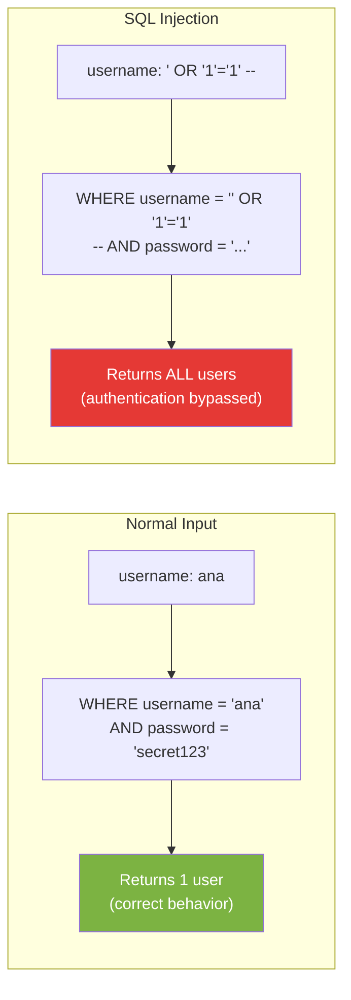
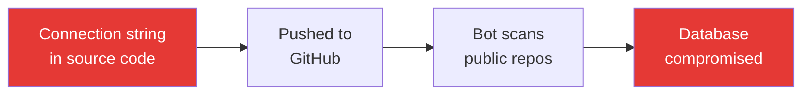

# Data Security & Secure Connectivity

## 1. Learning Objectives

By the end of this lesson, you will be able to:
*   Explain SQL injection as an attack vector and why it ranks in the OWASP Top 10
*   Demonstrate how unsanitized user input can alter SQL query logic
*   Implement parameterized queries as the primary defense against SQL injection
*   Distinguish between string formatting (vulnerable) and parameterized queries (safe) in Python
*   Describe secure credential management using environment variables and `.env` files
*   Explain why connection strings should never appear in source code

---

## 2. The "Why": Your Database Is an Attack Surface

Every database you've built in this course — PostgreSQL, MongoDB, Redis — accepts commands from application code. If that application takes input from users (web forms, API parameters, search bars) and passes it to the database without proper handling, attackers can manipulate the input to execute unintended commands.

This isn't theoretical. SQL injection has been the #1 or top-3 web application vulnerability for over two decades. It has caused some of the largest data breaches in history:

*   **2008 — Heartland Payment Systems:** 130 million credit card numbers stolen via SQL injection
*   **2011 — Sony Pictures:** User data for 77 million accounts leaked
*   **2015 — TalkTalk:** Personal data of 157,000 customers exposed
*   **2019 — Fortnite:** 200 million user accounts vulnerable to a SQL injection flaw

> **Analogy:** Imagine a bank teller who follows instructions literally. If you write on the withdrawal slip: "Withdraw $100 from account 5678; also transfer all funds from account 1234 to account 5678," an uncritical teller would execute both commands. SQL injection works the same way — the database can't tell the difference between your query and the attacker's injected commands because they arrive as one string.

---

## 3. SQL Injection

### 3.1 How It Works

SQL injection occurs when user input is **concatenated directly into a SQL query string**, allowing the attacker to inject their own SQL commands.

Consider a login form that checks username and password:

```python
# VULNERABLE — string concatenation
username = request.form["username"]   # User-provided input
password = request.form["password"]   # User-provided input

query = f"SELECT * FROM users WHERE username = '{username}' AND password = '{password}'"
```

**Normal use:**
If the user enters `username = "ana"` and `password = "secret123"`:

```sql
SELECT * FROM users WHERE username = 'ana' AND password = 'secret123'
```

This works as expected — returns the user if credentials match.

**Attack:**
If the attacker enters `username = "' OR '1'='1' --"` and any password:

```sql
SELECT * FROM users WHERE username = '' OR '1'='1' --' AND password = 'anything'
```

Breaking this down:
*   `''` — closes the original username string (empty)
*   `OR '1'='1'` — always true, so the `WHERE` clause matches every row
*   `--` — SQL comment, ignores everything after it (including the password check)

**Result:** The query returns *all users*. The attacker bypasses authentication entirely.



### 3.2 Types of SQL Injection

| Type | Technique | Impact |
| :--- | :--- | :--- |
| **Classic (In-band)** | Inject SQL via input fields; results visible in the response | Read/modify data, bypass auth |
| **UNION-based** | Use `UNION SELECT` to extract data from other tables | Read any table in the database |
| **Blind** | No visible output; infer data from true/false responses or timing | Slower but still dangerous |
| **Second-order** | Malicious input stored first, executed later in a different query | Harder to detect |

### 3.3 Beyond Authentication: Data Theft and Destruction

SQL injection isn't limited to login bypasses. Depending on database permissions:

```sql
-- Extract all email addresses (UNION-based)
' UNION SELECT email, password FROM users --

-- Delete an entire table
'; DROP TABLE users; --

-- Read files from the server (PostgreSQL)
'; COPY (SELECT '') TO '/tmp/hack.txt'; --
```

The famous "Bobby Tables" comic illustrates this:

```text
Student name: Robert'); DROP TABLE students;--

Resulting query:
INSERT INTO students (name) VALUES ('Robert'); DROP TABLE students;--')
```

---

## 4. The Defense: Parameterized Queries

### 4.1 The Core Principle

**Never build SQL queries by concatenating user input into the query string.** Instead, use **parameterized queries** (also called prepared statements or bound parameters), where the SQL structure and the data are sent to the database separately.

```mermaid
graph TD
    subgraph "VULNERABLE: String Concatenation"
        INPUT1["User Input:<br/>' OR '1'='1' --"]
        CONCAT["f'SELECT * FROM users<br/>WHERE name = '{input}'"]
        SQL1["SELECT * FROM users<br/>WHERE name = '' OR '1'='1' --"]
        DB1["Database executes<br/>INJECTED SQL"]

        INPUT1 --> CONCAT --> SQL1 --> DB1
    end

    subgraph "SAFE: Parameterized Query"
        INPUT2["User Input:<br/>' OR '1'='1' --"]
        PARAM["SELECT * FROM users<br/>WHERE name = %s"]
        BIND["Parameter: [\"' OR '1'='1' --\"]"]
        DB2["Database treats input<br/>as LITERAL STRING"]

        INPUT2 --> PARAM
        INPUT2 --> BIND
        PARAM --> DB2
        BIND --> DB2
    end

    style DB1 fill:#E53935,color:white
    style DB2 fill:#7CB342,color:white
```

### 4.2 How Parameterized Queries Work

When you use parameterized queries, the database driver sends two things separately:

1. **The query template** — with placeholders (`%s`, `?`, `:name`) where data belongs
2. **The parameter values** — as a separate data structure

The database engine compiles the query template first (parsing the SQL structure), then binds the parameter values as literal data. The values can never be interpreted as SQL commands — they are always treated as data.

```python
# VULNERABLE: String formatting (NEVER do this with user input)
query = f"SELECT * FROM users WHERE username = '{username}'"

# SAFE: Parameterized query (psycopg2)
cursor.execute("SELECT * FROM users WHERE username = %s", (username,))

# SAFE: Parameterized query (SQLAlchemy)
result = engine.execute(text("SELECT * FROM users WHERE username = :name"),
                        {"name": username})
```

**What happens with the attack input `' OR '1'='1' --`?**
*   **Concatenation:** The string becomes part of the SQL syntax → injection succeeds
*   **Parameterized:** The entire string `' OR '1'='1' --` is treated as a literal username value → database searches for a user literally named `' OR '1'='1' --` → finds nothing → no injection

### 4.3 Parameterized Queries Across Languages

| Library/Framework | Placeholder | Example |
| :--- | :--- | :--- |
| **psycopg2** (Python/PostgreSQL) | `%s` | `cursor.execute("SELECT * FROM t WHERE id = %s", (42,))` |
| **sqlite3** (Python) | `?` | `cursor.execute("SELECT * FROM t WHERE id = ?", (42,))` |
| **SQLAlchemy** (Python) | `:name` | `text("SELECT * FROM t WHERE id = :id"), {"id": 42}` |
| **pymongo** (Python/MongoDB) | N/A (uses dicts) | `collection.find({"username": username})` |
| **Node.js/pg** | `$1, $2` | `client.query("SELECT * FROM t WHERE id = $1", [42])` |
| **Java/JDBC** | `?` | `ps.setInt(1, 42)` |

**Note on MongoDB:** MongoDB uses dictionary-based queries, not string-based SQL. This makes it naturally resistant to *SQL* injection, but it's still vulnerable to **NoSQL injection** if query operators are constructed from unsanitized user input (e.g., passing `{"$gt": ""}` as a value).

### Key Takeaway

*   **Parameterized queries are not optional** — they are the standard, required defense
*   No amount of input sanitization (escaping quotes, stripping characters) is as reliable as parameterized queries
*   Every database driver in every language supports them — there is no excuse not to use them

---

## 5. The OWASP Top 10

The **Open Web Application Security Project (OWASP)** maintains a regularly updated list of the most critical web application security risks. SQL injection falls under multiple categories.

### 2021 OWASP Top 10 (Current as of 2025)

| Rank | Category | Relevance to This Course |
| :--- | :--- | :--- |
| **A01** | Broken Access Control | Unauthorized data access (e.g., accessing other users' records) |
| **A02** | Cryptographic Failures | Storing passwords in plaintext, weak hashing |
| **A03** | **Injection** | **SQL injection, NoSQL injection, command injection** |
| **A04** | Insecure Design | Missing security controls in architecture |
| **A05** | Security Misconfiguration | Default passwords, open database ports, verbose error messages |
| **A06** | Vulnerable Components | Using outdated libraries with known vulnerabilities |
| **A07** | Authentication Failures | Weak passwords, missing rate limiting on login |
| **A08** | Data Integrity Failures | Accepting untrusted serialized data |
| **A09** | Logging Failures | Not logging security events for detection |
| **A10** | Server-Side Request Forgery | Tricking the server into making unauthorized requests |

**A03: Injection** dropped from #1 (2017) to #3 (2021) — not because it became less dangerous, but because more applications now use frameworks with built-in parameterized queries. The risk remains critical for anyone writing raw SQL.

---

## 6. Secure Credential Management

### 6.1 The Problem: Credentials in Code

Database connections require credentials: host, port, username, password. A connection string looks like:

```text
postgresql://admin:s3cretP@ss!@db.example.com:5432/production_db
```

If this string appears in your source code and that code is pushed to GitHub, your database is compromised. GitHub scans for exposed credentials and sends alerts — but automated bots also scan public repos and can exploit credentials within minutes of a commit.



### 6.2 Environment Variables

The standard solution: store credentials in **environment variables** that exist only on the machine running the code.

```python
import os

# Read credentials from environment variables
db_host = os.environ["DB_HOST"]        # e.g., "db.example.com"
db_user = os.environ["DB_USER"]        # e.g., "admin"
db_pass = os.environ["DB_PASSWORD"]    # e.g., "s3cretP@ss!"
db_name = os.environ["DB_NAME"]        # e.g., "production_db"

# Build connection string from variables
connection_string = f"postgresql://{db_user}:{db_pass}@{db_host}:5432/{db_name}"
```

**Advantages:**
*   Credentials never appear in source code or version control
*   Different environments (dev, staging, production) use different values
*   Easy to rotate: change the variable, restart the app

### 6.3 The `.env` File Pattern

Typing `export DB_PASSWORD=...` every time you start a development session is tedious. The `.env` file pattern solves this:

1. Create a `.env` file in your project root with key-value pairs
2. Use the `python-dotenv` library to load them into `os.environ`
3. **Add `.env` to `.gitignore`** so it never enters version control

```text
# .env (THIS FILE IS NEVER COMMITTED)
DB_HOST=localhost
DB_PORT=5432
DB_USER=dev_user
DB_PASSWORD=dev_password_123
DB_NAME=dev_database
```

```python
from dotenv import load_dotenv
import os

load_dotenv()  # Reads .env file into os.environ

db_host = os.environ["DB_HOST"]
db_pass = os.environ["DB_PASSWORD"]
print(f"Connecting to {db_host}...")
```

### 6.4 The Credential Management Hierarchy

From least secure to most secure:

| Method | Security Level | Use When |
| :--- | :--- | :--- |
| Hardcoded in source code | **Never** | Never |
| `.env` file (local, in `.gitignore`) | Development | Local development, Colab notebooks |
| Environment variables (set by deployment) | Staging/Production | Docker, cloud deployments |
| Secret managers (AWS Secrets Manager, Vault) | Production | Sensitive production systems |

### Key Takeaway

*   **Never hardcode credentials** in source files — even "temporarily"
*   Use `.env` files for development and add `.env` to `.gitignore`
*   Use environment variables or secret managers for production
*   If you accidentally commit a credential, **rotate it immediately** — deleting the commit is not enough (it remains in git history)

---

## 7. Deep Dives (Optional)

### A. NoSQL Injection in MongoDB

<details>
<summary>Click to expand: MongoDB Is Not Immune</summary>

MongoDB doesn't use SQL, but it's still vulnerable to injection if query operators are constructed from unsanitized user input.

**Vulnerable pattern (Python/Flask):**

```python
# If username comes from a JSON body, an attacker can send an object
# instead of a string: {"username": {"$gt": ""}, "password": {"$gt": ""}}
user = db.users.find_one({
    "username": request.json["username"],
    "password": request.json["password"]
})
```

If the attacker sends `{"username": {"$gt": ""}, "password": {"$gt": ""}}`, the query becomes:

```python
db.users.find_one({"username": {"$gt": ""}, "password": {"$gt": ""}})
```

This matches any user whose username and password are greater than an empty string — which is all users.

**Defense:**
*   Validate that inputs are the expected type (string, not dict/object)
*   Use schema validation on API inputs (e.g., Pydantic, JSON Schema)
*   MongoDB drivers handle this safely if you pass strings directly — the vulnerability arises from passing unsanitized JSON objects as query values

</details>

### B. Password Hashing (Beyond This Course)

<details>
<summary>Click to expand: Why Passwords Should Never Be Stored as Plaintext</summary>

This course focuses on data management, not authentication, but understanding password storage is essential context:

**Never store passwords in plaintext.** If an attacker gains read access to your database (via SQL injection or a backup leak), plaintext passwords expose all user accounts — and since people reuse passwords, the damage extends beyond your application.

**The correct approach:**
1. Hash the password with a slow, salted algorithm: **bcrypt**, **argon2**, or **scrypt**
2. Store only the hash in the database
3. To verify a login, hash the submitted password and compare hashes

```python
import bcrypt

# Registration: hash and store
password = "user_password_123"
hashed = bcrypt.hashpw(password.encode(), bcrypt.gensalt())
# Store `hashed` in the database

# Login: verify
submitted = "user_password_123"
if bcrypt.checkpw(submitted.encode(), hashed):
    print("Login successful")
```

**Why bcrypt, not SHA-256?**
SHA-256 is fast — an attacker with a GPU can compute billions of SHA-256 hashes per second, brute-forcing passwords rapidly. bcrypt is *intentionally slow* (configurable work factor), making brute-force attacks impractical.

</details>

---

## 8. FAQ / Industry Reality

### "Can't I just escape quotes in user input instead of using parameterized queries?"

**Answer:** Escaping (replacing `'` with `''`) is fragile and error-prone. Different databases have different escaping rules. Unicode tricks, encoding mismatches, and second-order injection can bypass escaping. Parameterized queries are simpler, more reliable, and database-agnostic. Every security guide, OWASP included, recommends parameterized queries as the primary defense — not escaping.

### "I'm a data scientist, not a web developer. Why should I care about SQL injection?"

**Answer:** Data scientists write SQL in notebooks, dashboards (Metabase, Superset), internal tools, and data pipelines. If any of these accept user input — a search box, a date filter, a parameter dropdown — and pass it to SQL via string concatenation, the system is vulnerable. Internal tools are often *less* protected than public-facing apps because teams assume the network is trusted. An internal SQL injection can expose sensitive datasets or corrupt analytical tables.

### "Is it safe to put database credentials in a Colab notebook?"

**Answer:** Colab notebooks should use either (a) ephemeral local databases (like our in-notebook PostgreSQL/MongoDB installs) that require no credentials, or (b) Google Colab's Secrets feature (`userdata.get('key')`) for cloud database credentials. Never paste production credentials into a notebook cell — notebooks are often shared, downloaded, or committed to repos.

---

## 9. Summary & Next Steps

**Key takeaways:**

*   **SQL injection** exploits string concatenation of user input into SQL queries, allowing attackers to read, modify, or delete data
*   **Parameterized queries** are the primary defense — they send SQL structure and data values separately, so user input can never be interpreted as SQL commands
*   The **OWASP Top 10** identifies injection as one of the most critical web application risks
*   **Credentials belong in environment variables or `.env` files**, never in source code
*   Always add `.env` to `.gitignore` — if you accidentally commit a credential, rotate it immediately

*   **Next:** Go to the Practical Lab [w11_l22_lab_sql_injection.md](w11_l22_lab_sql_injection.md) to demonstrate a SQL injection attack, fix it with parameterized queries, and practice secure credential management.

---

## 10. Further Reading

### Documentation
*   [OWASP: SQL Injection](https://owasp.org/www-community/attacks/SQL_Injection) — Authoritative reference on SQL injection attack patterns and defenses
*   [OWASP Top 10 (2021)](https://owasp.org/www-project-top-ten/) — The full list of critical web application security risks

### Articles & Tutorials
*   [psycopg2 Documentation: Passing Parameters to SQL Queries](https://www.psycopg.org/docs/usage.html#passing-parameters-to-sql-queries) — Python/PostgreSQL parameterized query reference with security warnings
*   [The Twelve-Factor App: Config](https://12factor.net/config) — Industry-standard methodology for storing configuration (including credentials) in the environment
