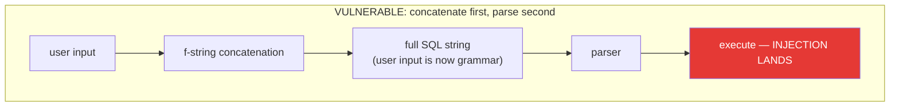
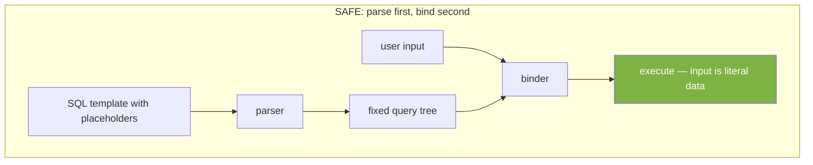

# Data Security & Secure Connectivity

**Lesson order:** this concept file is the **debrief** for [w11_l22_lab_sql_injection.md](w11_l22_lab_sql_injection.md). The lab showed you the attacks hands-on; this file explains *why* each attack works, *why* each defense holds, and where the whole topic fits in the industry's security model. If you haven't run the lab yet, do that first — this reading is much more useful after you have felt SQLi land in your own hands.

---

## 1. Learning Objectives

By the end of this lesson, you will be able to:

*   Explain SQL injection as an attack vector and why it sits in the OWASP Top 10
*   Describe the **parser / binder separation** that makes parameterized queries safe
*   Name the "restriction window" constraint — why an attacker's UNION must match column count and types — and explain why that reframes SQLi as a *grammar* problem, not a *filter-bypassing* problem
*   Distinguish the four major categories of SQLi: classic, UNION-based, blind, and second-order
*   Implement parameterized queries in the major dialects (psycopg2, SQLAlchemy, sqlite3) and identify what they do *not* protect
*   Describe defense-in-depth for a database tier: parameterization, hashing, least privilege, credential hygiene, auditing

---

## 2. The "Why": Your Database Is an Attack Surface

Every database-backed feature you have ever built has this shape:

~~~text
user input --> application code --> SQL --> database
~~~

If the application builds the SQL by *concatenating* the user's input into a query string, the user gets to choose part of the SQL. That is SQL injection, in one sentence.

This has been the #1 or top-3 web-application vulnerability for twenty years. A non-exhaustive list of breaches where SQLi was a root cause:

*   **2008 — Heartland Payment Systems:** 130 million credit card numbers.
*   **2011 — Sony Pictures:** 77 million accounts.
*   **2015 — TalkTalk:** 157,000 customer records.
*   **2019 — Fortnite:** 200 million accounts exposed by a single vulnerable endpoint.

> **Analogy.** Imagine a bank teller who does exactly what the slip says. You slide across a slip that reads: *"Withdraw $100 from account 5678. Also transfer all funds from account 1234 to account 5678."* A literal-minded teller executes both instructions. The database is that teller. It cannot tell which parts of the query came from the developer and which from the attacker, because they arrive as one string.

---

## 3. Anatomy of What You Just Did

### 3.1 The parser / binder separation

Databases execute a query in two phases:

1. **Parse.** Take the SQL text and build a tree: *this is a SELECT, that is a WHERE, those are two columns, this is a literal string.* Structure is fixed at the end of this step.
2. **Bind & execute.** Plug data values into the tree and run it.

When user input is **concatenated into the SQL string**, it arrives *before* step 1 — so the input can become structure. An attacker's `' OR 1=1 --` is parsed as three new tokens: a string terminator, a boolean OR clause, a comment.

When user input is **parameterized**, it arrives *between* step 1 and step 2. The parser has already committed to the grammar. The input can only fill a slot that the grammar already designated as a literal. No matter what the input says, it cannot introduce a new clause.

This is the whole mental model. Every other rule about SQLi follows from it.

### 3.2 The "Restriction Window" — why Rungs 3 and 4 felt so constrained

When you wrote `' UNION SELECT ?, ?, ? --` in the lab, you were not free to invent anything you liked. You had to:

*   Match the **column count** of the outer query — three columns, not two, not four.
*   Match **compatible types** — integer in slot 1, text in slots 2 and 3.
*   Produce **syntactically valid SQL** that fits inside the single quote the outer query left open.

Call this the *restriction window*: the shape the victim query leaves for the attacker to fill. An attacker who can see it (via error messages, behavioral probing, or guesswork) can craft a matching payload. An attacker who cannot see it has a much harder problem (this is the *blind* case, §7.B).

The practical implication is more interesting than it first appears: **SQL injection is a grammar-conformance problem, not an escape-character problem.** The attacker is not "sneaking past quotes." They are writing valid SQL that fits a valid slot. That is why escape-based defenses are so fragile — they are trying to sanitize the wrong category of thing. The right defense separates structure from data *before* the data is seen. That is parameterization.

### 3.3 Taxonomy

The lab demonstrated four of the five categories; the deep dive below covers the fifth.

| Type | What it is | Lab rung |
|---|---|---|
| **Classic (in-band)** | Payload produces visible changes in the response (rows, errors) | Rungs 1, 2 |
| **UNION-based** | Use `UNION SELECT` to smuggle data from a different table through the response | Rungs 3, 4 |
| **Stacked** | Chain multiple statements separated by `;` (driver-dependent) | Rung 5 |
| **Second-order** | Malicious value stored safely; fires on a *later* non-parameterized query | §6 |
| **Blind** | No visible output — infer data from boolean side-channels or timing | §7.B |

### 3.4 The classic login-bypass example — for completeness

You will meet this in every article, every interview question, every CTF writeup. Given:

~~~python
sql = f"SELECT * FROM users WHERE username = '{u}' AND password = '{p}'"
~~~

Input `u = "' OR 1=1 --"` renders as:

~~~sql
SELECT * FROM users WHERE username = '' OR 1=1 --' AND password = '...'
~~~

First user in the table, probably admin, logged in as. Mechanically this is a special case of Rung 1 from the lab — the same grammar attack, applied to a different query shape. *Recognize this pattern*; it is part of the security-literacy baseline, and it is how most SQLi articles introduce the topic. But it is not the whole picture, and the lab deliberately started somewhere else so you would not mistake the canonical demo for the general phenomenon.

---

## 4. The Defense: Parameterized Queries

### 4.1 Why parameterized queries work

Because of §3.1 — structure is fixed before data is seen. That's it. That's the whole reason.

Every good database driver supports this. It is not optional, slow, or exotic. It is the default, and every codebase you write in your career should treat raw string-concatenated SQL as a **failing code review** the moment it appears.

~~~python
# VULNERABLE — any of these, same reason
sql = f"... WHERE username = '{u}'"
sql = "... WHERE username = '{}'".format(u)
sql = "... WHERE username = '%s'" % u
sql = "... WHERE username = '" + u + "'"

# SAFE
cursor.execute("... WHERE username = %s", (u,))
~~~

The formatting operator is a distractor. The bug is **concatenation**, regardless of syntax.

### 4.2 Parameterized queries across languages

| Library / Framework | Placeholder | Example |
|---|---|---|
| **psycopg2** (Python / PostgreSQL) | `%s` | `cur.execute("... WHERE id = %s", (42,))` |
| **sqlite3** (Python stdlib)         | `?`  | `cur.execute("... WHERE id = ?", (42,))` |
| **SQLAlchemy Core** (Python)        | `:name` | `conn.execute(text("... WHERE id = :id"), {"id": 42})` |
| **DuckDB** (Python)                 | `?`  | `con.execute("... WHERE id = ?", [42])` |
| **psycopg / asyncpg** native        | `$1, $2` | `await conn.fetch("... WHERE id = $1", 42)` |
| **pymongo** (Python / MongoDB)      | n/a — dict-based | `coll.find({"username": u})` |
| **Node-pg** (Node.js)               | `$1, $2` | `client.query("... WHERE id = $1", [42])` |
| **JDBC** (Java)                     | `?` + `setXxx` | `ps.setInt(1, 42); ps.executeQuery();` |

Different syntax, identical semantics. In every one of these, the template is parsed first and the values are bound as data.

### 4.3 What parameterization does *not* protect

Placeholders only stand in for **values**. They cannot stand in for identifiers (table or column names) or structural elements. If you need to inject those dynamically, parameterization alone is not enough.

| Thing you want dynamic | Parameterizable? | What to do |
|---|---|---|
| Literal values in `WHERE`, `VALUES`, `SET` | Yes | Use the driver's placeholder |
| Table or column names | **No** | Validate against an **allowlist** in application code, then format into the SQL |
| `ORDER BY` column        | **No** | Allowlist of sort keys; map user input to a known column |
| Direction (`ASC`/`DESC`) | **No** | Allowlist: `{"asc": "ASC", "desc": "DESC"}[user_input]` |
| `IN (...)` list of values | Yes, per driver | psycopg2 accepts tuples; SQLAlchemy has `bindparam(expanding=True)` |

**Allowlist, not blacklist.** The rule is: user input chooses *which* of a set of known-safe identifiers to use; it never provides an identifier directly. A dropdown in the UI maps to `{"name": "name", "price": "price", "rating": "rating"}` in code. Anything outside the map is rejected.

---

## 5. Secure Credential Management & Defense in Depth

SQLi prevention is the load-bearing defense. Real systems layer several more on top, so that when any single layer fails, the damage is bounded.

### 5.1 Credentials belong outside the code

A connection string looks like:

~~~text
postgresql://admin:s3cretP@ss!@db.example.com:5432/production_db
~~~

If any version of that string has ever been committed to a git repository — public or private, merged or not — treat the credential as compromised. GitHub's own scanners and third-party bots watch public commits continuously and exploit leaked credentials within minutes. Private repos are safer but not safe; contractors leave, forks get cloned, laptops get stolen.

### 5.2 The hierarchy

| Approach | Where it's appropriate |
|---|---|
| Hardcoded in source | **Never.** |
| `.env` file in `.gitignore`, loaded via `python-dotenv` | Local development only |
| Environment variables injected by the deployment system | Containerized / cloud apps |
| Dedicated secret manager (AWS Secrets Manager, HashiCorp Vault, GCP Secret Manager) | Production, especially for regulated data |

### 5.3 Principle of least privilege

The lab's `postgres` superuser was deliberately wrong. A least-privileged user scoped to only what the feature needs changes what an attacker can do after a successful SQLi:

| DB user privileges                       | Worst case after SQLi                          |
|------------------------------------------|------------------------------------------------|
| Superuser (our lab)                      | `DROP`, `COPY FROM`/`COPY PROGRAM` → RCE on the DB host |
| Owner of the application schema          | Read/modify/drop any table the app uses         |
| `SELECT` on specific tables, no `DELETE` | Read-only leak — bad, but recoverable           |
| Read-only view that excludes PII         | Leak of non-sensitive data only                 |

Least privilege does not prevent SQLi. It caps the blast radius.

### 5.4 Hashing passwords (recap from the lab)

You saw this in §5.5 of the lab. The compressed version:

*   **Plaintext or unsalted SHA-256** — broken by dictionary attack the moment a hash leaks.
*   **Salt** — defeats rainbow tables and cross-user precomputation. Necessary, not sufficient.
*   **Iteration cost** — bcrypt/argon2 are designed to be slow. That turns a millisecond dictionary attack into a months-long one per user. This is what bounds the damage when the DB is stolen.
*   **argon2id** is the current best-practice default for new systems; **bcrypt** remains fine; anything older (MD5, unsalted SHA) is a finding in any security review.

### 5.5 Monitoring and auditing

Parameterization prevents the attacks you know about. Logging and anomaly detection catch the one that slips through when someone adds a raw `.execute(f"...")` in a later PR.

*   Turn on query logging in any data tier that handles sensitive data.
*   Watch for query-shape anomalies: sudden spikes in `UNION SELECT`, unusually long query strings, bursts of syntax errors (a sign of live probing).
*   Log *access* to PII, not just changes. Regulated environments (HIPAA, PCI, GLBA) generally require this.

---

## 6. OWASP Top 10 — Where SQLi Sits in the Threat Model

The **Open Web Application Security Project (OWASP)** publishes the most widely referenced list of web-application security risks. The current release is the 2021 list, still authoritative as of 2026.

| Rank | Category | Relevance to this course |
|---|---|---|
| A01 | Broken Access Control            | Accessing other users' data; authorization bugs |
| A02 | Cryptographic Failures           | Plaintext passwords, weak hashes, no TLS |
| **A03** | **Injection**                | **SQL / NoSQL / command injection** — this lesson |
| A04 | Insecure Design                  | Missing security requirements at the architecture stage |
| A05 | Security Misconfiguration        | Default credentials, superuser app connections, verbose errors |
| A06 | Vulnerable and Outdated Components | Old library versions with known CVEs |
| A07 | Identification and Authentication Failures | Weak passwords, missing rate limiting |
| A08 | Software and Data Integrity Failures | Trusting unsigned updates, insecure deserialization |
| A09 | Security Logging and Monitoring Failures | No audit trail when a breach happens |
| A10 | Server-Side Request Forgery      | Server fetches attacker-controlled URLs |

Injection dropped from #1 (2017) to #3 (2021) — not because it got less dangerous, but because the fraction of applications using frameworks with built-in parameterization grew. For anyone writing raw SQL, it is still the bug most likely to end a career.

---

## 7. Deep Dives (Optional)

### A. Multi-line queries and the `--` comment

Click to expand: why `--` sometimes breaks the attack on multi-line SQL

Single-line comments (`--`) terminate at the end of the current line. So in a multi-line query:

~~~python
sql = f"""
    SELECT * FROM users
    WHERE username = '{u}'
    AND password = '{p}'
"""
~~~

With `u = "' OR 1=1 --"`:

~~~sql
SELECT * FROM users
WHERE username = '' OR 1=1 --'
AND password = '...'
~~~

The `--` kills the stray `'` on its line, but line 4 survives. Operator precedence groups it as:

~~~sql
WHERE username = '' OR (1=1 AND password = '...')
~~~

No real row matches `password = 'anything'`, so the bypass fails. Attackers adapt in two ways:

**1. Block comments `/* ... */`** span multiple lines. Pair them across input fields:

~~~text
username: ' OR 1=1 /*
password: */ --
~~~

Renders as:

~~~sql
WHERE username = '' OR 1=1 /*'
AND password = '*/ --'
~~~

Everything between `/*` and `*/` disappears. Bypass succeeds.

**2. Close the clause validly** without commenting out the rest:

~~~text
username: ' OR 1=1 OR '1'='
password: anything
~~~

Renders as:

~~~sql
WHERE username = '' OR 1=1 OR '1'=''
AND password = 'anything'
~~~

`OR 1=1` is true → whole `WHERE` is true. No comments needed.

**Conclusion:** multi-line SQL is not a defense. It just changes which payloads the attacker chooses.

### B. Blind SQL Injection

Click to expand: attacking without any visible output

What if the vulnerable query runs but the application never shows you the result? No rows, no error messages. Attackers still win, they just switch side-channels.

**Boolean-based blind.** Inject a condition whose truth value is observable from the response: "did the product page render or 404?" Probe:

~~~text
' AND (SELECT substring(password_hash, 1, 1) FROM users WHERE id=1) = 'a' --
~~~

Page renders → first character of hash is `a`. Increment the position, enumerate the alphabet, reconstruct the hash one character at a time. Tedious but mechanical; tools like `sqlmap` automate it.

**Time-based blind.** When not even a binary signal is visible, use delays:

~~~text
' AND (SELECT CASE WHEN (first_char = 'a') THEN pg_sleep(5) ELSE 0 END) --
~~~

If the response takes >5 seconds, the guess was right. Slower but works against fully silent endpoints.

**Practical note:** blind SQLi is orders of magnitude slower than UNION-based, but it is not less effective. An hour of automated probing can still exfiltrate a user table. Parameterize anyway; "the attacker can't see errors" is not a mitigation.

### C. NoSQL injection

Click to expand: MongoDB is not immune

MongoDB uses dictionary-shaped queries instead of SQL strings, so classic string concatenation doesn't apply directly. But if an application takes JSON input from the client and forwards it into a query, the client can substitute operators for values:

~~~python
# If username/password come straight from request.json and the client
# sends {"username": {"$gt": ""}, "password": {"$gt": ""}},
# the query becomes:
db.users.find_one({
    "username": {"$gt": ""},
    "password": {"$gt": ""},
})
# "any user whose username and password are lexically greater than empty string" — everyone.
~~~

**Defenses:** schema-validate API inputs (Pydantic, JSON Schema), coerce fields to expected primitive types before using them in a query, never pass the raw JSON body into a query filter.

### D. ORMs and the escape hatches

Click to expand: does an ORM save me?

Mostly yes. SQLAlchemy's Core and ORM APIs, Django's QuerySet, SQLModel — all generate parameterized SQL by default. The attacks in this lab fail against ORM-expressed queries for the same reason they fail against `cursor.execute(sql, params)`: structure and data are separate.

The risk lives in the **escape hatches**:

*   SQLAlchemy's `text()` with string interpolation.
*   Django's `.extra(where=[...])` and `.raw(...)` with f-strings.
*   Any ORM's "just run this string" backdoor.

These are legitimate features; real applications sometimes need them. But they drop you back to raw SQL, which means you own the parameterization again. Treat every `.execute(text(f"..."))` as a code-review flag.

---

## 8. FAQ / Industry Reality

**"Can't I just escape quotes in user input?"**
Escaping is fragile. Different databases have different rules; Unicode normalization, encoding mismatches, and second-order injection all break naive escape filters. Every OWASP guide recommends parameterized queries as the *primary* defense and treats escaping as an additional layer at best. If your defense is "I replaced `'` with `''`", you are one clever attacker away from a breach.

**"I'm a data scientist, not a web developer. Why does this matter to me?"**
Data scientists write SQL in notebooks, internal BI tools (Metabase, Superset), custom dashboards, and pipelines. Any of these that accept user parameters — a date range, a category filter, a free-text search — and build SQL by string formatting is vulnerable. Internal tools are often *less* hardened than public apps because the network is assumed to be trusted, which means an internal SQLi can be more damaging, not less.

**"What about stored procedures?"**
Stored procedures are only safe if they *themselves* use parameterized inputs internally. A stored procedure that concatenates its arguments into a dynamic SQL string is every bit as vulnerable as application code that does the same.

**"Is it safe to paste my database credentials into a Colab notebook?"**
For this course's labs, yes — the databases are local and disposable. For anything connected to real data, no. Use Colab's Secrets feature (`google.colab.userdata`) or a real deployment environment. Notebooks are routinely shared, downloaded, and committed, and each of those is an exit channel for a credential.

---

## 9. Summary & Next Steps

Compressed to one page:

*   **SQL injection** is what happens when user input becomes part of the SQL grammar instead of staying as data.
*   **Parameterized queries** fix this by parsing structure first and binding data second. They are the primary defense. There is no general substitute.
*   The **restriction window** — column count and types — is why attacker UNIONs have to conform to the victim query. This makes SQLi a grammar problem, not an escape-sequence problem, which is why escape-based defenses are unreliable.
*   **Defense in depth** layers hashing (bcrypt/argon2), least privilege, credential hygiene, and logging on top of parameterization. Each layer bounds the damage when another fails.
*   **OWASP A03: Injection** remains a top-three risk. Treat any string-concatenated SQL in a code review as a blocker.

**Next lesson:** Module 4 begins with Lesson 23 — **Data Access Layer architecture**. You will apply everything from this week (parameterized queries, credential hygiene, least privilege) to a structured DAL using connection pooling and the DAO pattern.

---

## 10. Further Reading

### Authoritative references
*   [OWASP: SQL Injection](https://owasp.org/www-community/attacks/SQL_Injection) — the canonical reference on attack patterns and defenses
*   [OWASP Top 10 (2021)](https://owasp.org/www-project-top-ten/) — full list of categories with mitigation guidance
*   [OWASP: SQL Injection Prevention Cheat Sheet](https://cheatsheetseries.owasp.org/cheatsheets/SQL_Injection_Prevention_Cheat_Sheet.html) — concise defense checklist

### Documentation
*   [psycopg2: Passing Parameters to SQL Queries](https://www.psycopg.org/docs/usage.html#passing-parameters-to-sql-queries) — Python/PostgreSQL parameterization, with security warnings
*   [SQLAlchemy: Textual SQL](https://docs.sqlalchemy.org/en/20/core/tutorial.html#using-textual-sql) — `text()`, `bindparam`, and how to avoid concatenation inside `text()`

### Hands-on practice
*   [PortSwigger Web Security Academy: SQL Injection](https://portswigger.net/web-security/sql-injection) — free browser-based labs covering every category in this lesson, including blind and second-order

### Industry methodology
*   [The Twelve-Factor App: Config](https://12factor.net/config) — the standard argument for keeping credentials outside source code
