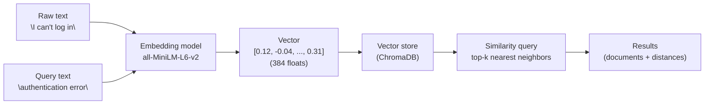

# Module 5: Embeddings & Vector Search

## 1. Learning Objectives

By the end of this lesson, you will be able to:

*   Explain what an **embedding** is and why high-dimensional vectors capture semantic similarity between pieces of text.
*   Compare **cosine similarity**, **dot product**, and **Euclidean distance**, and pick the right metric for normalized embeddings.
*   Distinguish **lexical search** (SQL `LIKE`, full-text BM25) from **semantic search** and explain where each wins.
*   Describe what a **vector database** adds over a `numpy` brute-force similarity scan — indexing, persistence, metadata filtering, deletion/update at scale.
*   Position **ChromaDB** within the polyglot persistence stack you have been building across the semester (PostgreSQL, DuckDB, MongoDB, Redis).

---

## 2. The "Why": Industry Context

Up to this point, every query you have written has matched **symbols** — a string equality, a `LIKE` pattern, an index lookup on a specific value. Symbol matching is precise, cheap, and completely blind to meaning. Ask a relational database for rows containing `"can't log in"` and it will happily ignore a row that says `"authentication failure"` — even though, to any human user, those two strings describe the same problem.

> **Analogy — library card catalog vs. "find me books that *feel* like this one."**
> A card catalog is a brilliant lexical index: look up "Hemingway" and every Hemingway book appears. But try asking the catalog *"find me books that feel like The Old Man and the Sea"*. The catalog has no answer — it matches titles, authors, and subject headings, not *vibes*. A good librarian can answer the second question because they've read widely enough to place books on an internal map of meaning. **Embeddings are how we give that map to a computer.**

### Concrete Pain: The Support-Ticket Search Problem

A customer types *"I can't log in"* into a help-center search box. The backend runs `WHERE title ILIKE '%log in%' OR body ILIKE '%log in%'`. What does the user see?

*   A matching ticket titled `"How to log in for the first time"` (good).
*   **Nothing** from a ticket titled `"Authentication error on the login page"` — `ILIKE` cannot connect "log in" to "authentication".
*   **Nothing** from a ticket titled `"Password reset email never arrived"` — which is almost certainly the same root cause.

The fix is not a more clever regex. The fix is a search engine that scores matches by **meaning**, not spelling. That is what semantic search with embeddings delivers, and it is why vector databases have become core infrastructure over the last three years.

### Where Embeddings Show Up

*   **Product and site search** — Amazon, Airbnb, and Notion all use vector search to surface results that match intent, not just keywords.
*   **Deduplication** — "are these two customer records the same person?" becomes a similarity threshold on embedded profiles.
*   **RAG retrieval** — the step that finds *"which three paragraphs of our internal docs are relevant to this question?"* This is the use case that drives most of the industry's current ML-infrastructure spend. L26 builds exactly this.

---

## 3. Core Concepts

### 3.1 What an Embedding Actually Is

An **embedding** is a fixed-length vector of floating-point numbers produced by a model. Every piece of text you pass through the model comes out as a point in the same high-dimensional space. Training the model on very large amounts of text pushes **pieces that mean similar things to nearby points**, and pushes unrelated pieces apart.

For this course we use `all-MiniLM-L6-v2`, a compact `sentence-transformers` model that produces **384-dimensional** vectors. That means every sentence becomes an array of 384 floats. Other models produce 768 dims (`all-mpnet-base-v2`), 1024 dims (OpenAI `text-embedding-3-small`), or 3072 dims (OpenAI `text-embedding-3-large`). You do not choose the dimension — the model does.

#### 2D Intuition (then stop)

Diagrams always show embeddings in 2D. That's a lie for comprehension's sake. The real space has hundreds of dimensions, and "distance" in that space is what captures meaning. Think of it as a map where neighborhoods correspond to topics:

*   A neighborhood for login / authentication complaints.
*   A neighborhood for shipping questions.
*   A neighborhood far from both for pizza recipes.

The model has never seen the exact sentences you embed. Similarity comes from **training**, not from memorization.

### 3.2 The Embedding Pipeline



The key observation: **the same model embeds both documents and queries**. Retrieval becomes "which stored vector is closest to the query vector?"

### 3.3 Distance Metrics

Given two vectors **a** and **b**, three metrics dominate practice:

| Metric | Formula | What it measures | When to use |
| :--- | :--- | :--- | :--- |
| **Cosine similarity** | `(a·b) / (‖a‖‖b‖)` | Angle between vectors; ignores magnitude | Default for text embeddings |
| **Dot product** | `a·b` | Angle *and* magnitude | When vectors are already unit-normalized (equivalent to cosine) |
| **Euclidean (L2)** | `‖a − b‖` | Straight-line distance in the space | Rare for text; common for images |

Cosine similarity ranges from −1 to 1 for arbitrary vectors (0 to 1 in practice for sentence-transformers, which produces non-negative-leaning outputs). A score of **0.7** between two sentences is "clearly related"; **0.3** is "probably unrelated"; **0.1** is "about different universes."

**Rule of thumb:** match the metric the embedding model was trained with. `sentence-transformers` models are trained with cosine; Chroma's default is cosine. Do not mix.

Chroma and most vector DBs actually return **distance**, not similarity:

```
cosine_distance = 1 − cosine_similarity
```

So a Chroma `distance` of `0.25` corresponds to a similarity of `0.75`. You will convert between the two in L26.

### 3.4 Lexical vs. Semantic Search

| Query | Lexical (`ILIKE`, BM25) | Semantic (embeddings) |
| :--- | :--- | :--- |
| `"log in"` | Matches exact substring `"log in"` | Matches "log in", "login", "authentication", "sign-in" |
| `"cheapest flights to NYC"` | Good — keyword + filter | Good, but adds little over a well-tuned BM25 |
| `"book like The Old Man and the Sea"` | Useless — no keywords overlap with target books | Excels — this is the home ground |
| Typo: `"authenitcation"` | Misses everything | Still finds "authentication" results |

Lexical search wins on: exact identifiers (SKUs, UUIDs), short keyword queries, when every word must appear. Semantic search wins on: paraphrase, synonym, intent-matching, typo-robustness, cross-language (with multilingual models).

**Real systems run both** and rerank. But you have to build the semantic side first, which is what you're doing today.

### 3.5 Why a Vector Database and Not `numpy`?

A naive semantic search can be written in ~5 lines of `numpy`: embed everything, embed the query, compute cosine similarity in a loop, sort, return top-k. For 100 documents this is fine. Why is there an entire database category for this?

| Concern | `numpy` brute force | Vector database |
| :--- | :--- | :--- |
| **Indexing** | O(N) per query | Approximate Nearest Neighbor indexes (HNSW, IVF) give O(log N)-ish |
| **Persistence** | You pickle arrays | Built-in durable storage |
| **Metadata filters** | Hand-written pre/post filtering | First-class `where={...}` syntax |
| **Insert / delete / update** | Rebuild the numpy array | Incremental |
| **Concurrency** | None | Multiple clients, transactions |
| **Scale** | Fine to 10k docs, painful at 1M, hopeless at 1B | Engineered for 100M+ |

Approximate Nearest Neighbor (ANN) indexes are the hard part. **HNSW** (Hierarchical Navigable Small World graphs) and **IVF** (Inverted File index) are the two names you will hear most often. Both trade a tiny amount of recall (maybe 99.5% vs. 100%) for enormous speedups. You do not implement them. You configure them. Today, you do not even configure them — Chroma picks sensible defaults.

### 3.6 ChromaDB in 60 Seconds

ChromaDB is a dedicated open-source vector database. Its mental model is small and Pythonic:

*   **Client** — `chromadb.Client()` (in-memory) or `chromadb.PersistentClient(path=...)` (on-disk).
*   **Collection** — the equivalent of a table. Holds documents + their embeddings + metadata.
*   **Document** — a text string you want to retrieve later.
*   **Embedding** — the vector. Chroma generates it for you by default using `all-MiniLM-L6-v2`.
*   **Metadata** — a dict of scalars (strings, ints, bools, floats) attached to each document. Filterable.
*   **Id** — your unique identifier per document.

A complete example:

```python
import chromadb

client = chromadb.Client()
collection = client.create_collection(name="tickets")

collection.add(
    documents=["I can't log in", "My package never arrived", "Refund not received"],
    metadatas=[{"cat": "auth"}, {"cat": "ship"}, {"cat": "refund"}],
    ids=["t1", "t2", "t3"],
)

results = collection.query(query_texts=["authentication error"], n_results=2)
```

That's the whole API surface you need for L25. You did not compute an embedding. You did not pick a distance metric. You did not build an index. Chroma did all of it.

### 3.7 ChromaDB in the Polyglot Stack

You now have a mental model for five engines:

| Engine | Paradigm | Best at |
| :--- | :--- | :--- |
| PostgreSQL | Relational, row-oriented | OLTP, integrity, joins |
| DuckDB | Relational, columnar | OLAP, analytical queries |
| MongoDB | Document | Schema-flexible records, nested data |
| Redis | Key-value (in-memory) | Caching, counters, sub-millisecond lookups |
| **ChromaDB** | **Vector** | **Semantic similarity over unstructured text** |

The same lesson applies again: **the right engine for the workload beats a general-purpose engine trying to do it all**. You *could* store vectors in Postgres with `pgvector` (and people do — it's excellent). But a dedicated vector engine keeps the mental model clean, the same way you used DuckDB rather than forcing analytical workloads through Postgres in Module 2.

---

## 4. Deep Dive: Beyond the Basics (Optional)

## Deep Dive: Beyond the Basics (Optional)

<details>
<summary>Click to expand: training, ANN indexes, and model selection</summary>

### How Embedding Models Are Trained

`sentence-transformers` models are trained with **contrastive learning**. The core idea: given a large set of (query, positive-passage, negative-passage) triples — often mined from duplicate questions on Stack Exchange, from search-click logs, or from paraphrase datasets — nudge the model so the query vector is closer to the positive passage than to the negative one. Repeat for hundreds of millions of triples and the space organizes itself so "similar meaning" corresponds to "small cosine distance."

The base architecture is usually a small transformer (MiniLM is a 6-layer, 22M-parameter distillation of a larger BERT). Pool the token outputs (mean-pool is common), L2-normalize, and you have a sentence embedding. This is small enough to run on CPU in milliseconds per sentence — which is why the lab works in Colab without a GPU.

### HNSW Graph Intuition

Brute-force nearest-neighbor search is O(N) per query. That's a dealbreaker above ~1M vectors. Approximate Nearest Neighbor (ANN) indexes trade exact correctness for speed.

**HNSW** (Hierarchical Navigable Small World) builds a multi-layer graph:

*   Each vector is a node.
*   Nodes are connected to their nearest neighbors at each layer.
*   Higher layers are sparser (fewer nodes, long-range links).
*   A search starts at the top, greedily walks toward the query, and descends layers until the bottom returns the final candidates.

The search touches O(log N) nodes on average. Recall is typically 98–99.9% of brute force at 10–100× the speed. Chroma uses HNSW by default.

**Recall vs. speed trade-off:** every ANN index exposes knobs (in HNSW: `M`, `ef_construction`, `ef_search`). Higher values → better recall, slower queries, more memory. Production systems benchmark these against a labeled gold set to find the knee of the curve. You will *build* such a gold set in L26, though not for ANN tuning.

### Choosing an Embedding Model

Four axes:

1.  **Dimensions.** Higher = more nuance, but also more storage (4 bytes × dims × docs) and slower distance computations. 384 is a sweet spot for small-scale work; 768–1536 is typical for production.
2.  **Domain fit.** A model trained on general web text (`all-MiniLM-L6-v2`) works everywhere but excels nowhere. Domain-specific models (biomedical, legal, code) exist and beat general models on domain corpora.
3.  **Multilingual.** Most default models are English-only. `paraphrase-multilingual-MiniLM-L12-v2` handles 50+ languages.
4.  **Cost / privacy.** OpenAI and Cohere embeddings are higher quality but require sending data to a third-party API and cost $0.02–$0.13 per 1M tokens. Local models are free but smaller.

The honest answer: **pick a sensible default, measure retrieval quality on your own gold set, upgrade if needed.** L26 teaches exactly this measurement loop.

</details>

---

## 5. FAQ / Industry Reality

### "Why are we using `sentence-transformers` and not OpenAI embeddings?"

**Answer:** OpenAI embeddings are genuinely excellent and dominate production. We use `all-MiniLM-L6-v2` in class for three reasons: (1) the lab is self-contained — no API keys, no billing, no network dependency on the first day of the unit; (2) it runs on Colab CPU in milliseconds, which keeps the feedback loop tight; (3) the concepts transfer 1:1. Swapping to OpenAI embeddings in the final project is a one-line change.

### "Can PostgreSQL do this?"

**Answer:** Yes. The `pgvector` extension adds a `VECTOR` column type, vector distance operators (`<->`, `<=>`, `<#>`), and HNSW indexes. Many production systems use it precisely to avoid introducing a second engine. We chose ChromaDB for the same reason we chose DuckDB in Module 2 — a dedicated, well-scoped engine makes the mental model crisper while you're *learning* the paradigm. In your job, evaluate both.

### "How many dimensions is 'right'?"

**Answer:** You do not choose — the model does. You pick the model, and the model's architecture fixes the output dimension. Typical ranges:

*   **384** — MiniLM, very fast, adequate quality
*   **768** — MPNet, most common mid-size
*   **1024–1536** — OpenAI `text-embedding-3-small`, Cohere embed-v3
*   **3072+** — OpenAI `text-embedding-3-large`, state-of-the-art but expensive at scale

Higher dimensions *usually* help quality, but past ~1024 returns diminish sharply while storage and query cost grow linearly. Measure.

---

## 6. Summary & Next Steps

Key takeaways from this lesson:

*   An **embedding** is a fixed-length vector produced by a model that places semantically similar text at nearby points in a high-dimensional space.
*   **Cosine similarity** is the default metric for normalized text embeddings; Chroma returns **cosine distance** (`1 − similarity`).
*   **Semantic search** complements — does not replace — lexical search. In production, systems run both.
*   A **vector database** like ChromaDB provides indexing, persistence, metadata filtering, and incremental updates that raw `numpy` cannot.
*   **ChromaDB** fits the polyglot stack as the "dedicated engine for unstructured text similarity."

*   **Next:** In the lab, you will embed text by hand with `numpy`, then switch to ChromaDB and load the course's own 21 concept files into a persistent collection. That collection becomes the foundation of L26.

*   **Preview of L26:** In L26 we build on this corpus — **chunking strategies**, **retrieval tuning** (top-k, thresholds, MMR), and **evaluating retrieval quality without an LLM** using a hand-built gold set.

---

## 7. Further Reading

### Textbook

*   *Database Design — 2nd Edition* by Adrienne Watt **does not cover vector search**. Module 3+ of this course relies on vendor documentation and industry articles in place of the textbook.

### Documentation

*   [ChromaDB Documentation — Getting Started](https://docs.trychroma.com/) — The official quickstart. Cover this end-to-end before the lab if you want a head start.
*   [Sentence Transformers documentation](https://www.sbert.net/) — The library behind `all-MiniLM-L6-v2`. The "Pretrained Models" page is the single most useful reference when choosing a different model.

### Articles

*   [Pinecone: What are Vector Embeddings?](https://www.pinecone.io/learn/vector-embeddings/) — Accessible primer with excellent 2D intuition diagrams.
*   [Hugging Face — Sentence Transformers course](https://huggingface.co/blog/getting-started-with-embeddings) — If you want to see the training side of the picture.
