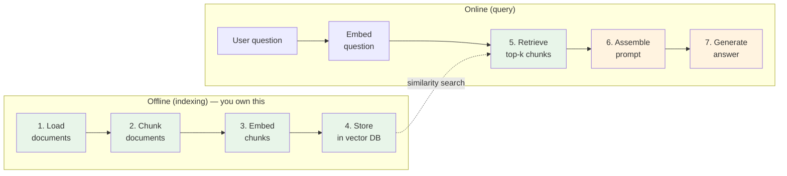

# Module 5: Retrieval for RAG

## 1. Learning Objectives

By the end of this lesson, you will be able to:

*   Draw the full **Retrieval-Augmented Generation (RAG)** pipeline and identify which stages this course covers in lab vs. which stages are left for independent exploration.
*   Explain **why RAG exists** in terms of LLM knowledge cutoffs, hallucination, private data, and context-window limits.
*   Compare **chunking strategies** — fixed-size, sentence, recursive character, semantic — and reason about when each is appropriate.
*   Define the core **retrieval tuning knobs**: top-k, similarity threshold, and MMR (Maximal Marginal Relevance).
*   Evaluate retrieval quality **independently of an LLM** using a gold set and **hit@k** metrics.

---

## 2. The "Why": Industry Context

L25 gave you a tool: `collection.query(query_texts=[...])` returns the k closest documents from a vector store. That's already useful for search. But the phrase you actually hear in industry is not *"semantic search"* — it's **RAG**: use retrieval to ground an LLM's answer in your own data.

> **Analogy — the open-book exam.**
> There are three ways to take a hard exam: (1) **memorize everything** beforehand — expensive, goes stale the moment the textbook is revised; (2) **bring no reference and guess** — fast, confident, frequently wrong; (3) **bring a well-organized reference and know how to look things up** — cheap, current, and the answer you give is the answer the book supports.
> Fine-tuning a model is (1). A raw chatbot hallucinating is (2). RAG is (3).

### Concrete Pain: "ChatGPT doesn't know our internal wiki"

Every company of any size has this conversation within a month of a ChatGPT-style product shipping:

*   *"Can we use the LLM on our internal policy documents?"*
*   *"Can it answer support questions from our KB?"*
*   *"Can it find precedent in our legal archive?"*

Fine-tuning on private data is expensive, brittle, and updates-hostile. Stuffing the whole corpus into the prompt breaks past a few thousand tokens and gets worse (not better) at much larger context windows. The industry's converged answer is **RAG**: keep the corpus in a vector store, retrieve the relevant chunks at query time, paste them into the prompt alongside the question, let the model summarize with citations.

This lesson builds the load-bearing half — retrieval. The other half (generation) is left for students to explore.

---

## 3. Core Concepts

### 3.1 The Full RAG Pipeline



**Read the colors.** Boxes 1–5 (green) are the scope of this course's labs — L25 covered load, embed, and store; L26 (today's lab) covers chunk and retrieve properly. Boxes 6–7 (orange) — prompt assembly and generation — are left for independent exploration.

Why stop at 5? Because **every shortcoming in generation is upstream of retrieval**. If the retrieval step hands the LLM the wrong chunks, no prompt engineering and no model upgrade can save the answer. Retrieval quality is load-bearing. Generation quality is capped by it.

**The generation half — a sketch.** Steps 6–7 translate to this seven-line algorithm; step 6 is the generation half, left for you to explore:

```
algorithm rag_answer(question):
    1. query_vector ← embed(question)
    2. chunks       ← retrieve(query_vector, k=5, threshold=0.3)   # today's lab
    3. if chunks = ∅ → return "No relevant information found."
    4. context      ← join(chunk["text"] for each chunk, sep="---")
    5. prompt       ← system_instruction + context + "Question: " + question
    6. answer       ← llm(prompt)                                   # generation half
    7. return answer
```

The LLM in step 6 can be anything — local (Ollama), API-based (Gemini, OpenAI, Claude), or open-weight via HuggingFace Inference API. The prompt in step 5 is where prompt engineering lives: instruct the model to answer *only* from the retrieved context, cite chunk indices, and admit ignorance when context is insufficient. Steps 1–5 are identical regardless of which LLM you choose, which is precisely why the retrieval contract (`retrieve(query) → list[dict]`) is designed as a clean handoff.

### 3.2 Why RAG Exists — Four Forcing Functions

| Problem | Why a raw LLM fails | How RAG fixes it |
| :--- | :--- | :--- |
| **Knowledge cutoff** | Model weights were frozen at training time — anything newer is invisible. | Vector store is updatable in seconds; add a doc, and retrieval finds it. |
| **Hallucination** | Without a source, models *produce* plausible-sounding text that is not necessarily true. | Retrieved chunks are passed as context; prompt instructs the model to answer *only* from them. |
| **Private data** | Company policy / KB / contracts were never in training data. | Your vector store holds them; the LLM sees them one chunk at a time. |
| **Context-window limits** | Even 1M-token windows are expensive and suffer the lost-in-the-middle effect. | Retrieve 3–10 relevant chunks instead of stuffing the whole corpus. |

### 3.3 Chunking — Why and How

L25 stored **one document per file** (21 files → 21 rows in Chroma). That's fine when documents are short and focused. It breaks in three ways as documents grow:

*   **Context-window limits.** A 20-page policy doc cannot be pasted into a prompt whole.
*   **Signal dilution.** If the relevant answer is in paragraph 7, the other 40 paragraphs dilute its embedding. The query vector will match the *average* topic of the document, not the *specific* paragraph.
*   **Mixed topics.** A concept file covering CAP theorem + document model + embed-vs-reference is three topics. Its embedding is an awkward average of all three.

Chunking splits long documents into passages and embeds each passage separately. The table compares the four strategies you will meet.

| Strategy | How it works | Pros | Cons | When to use |
| :--- | :--- | :--- | :--- | :--- |
| **Fixed-size** (chars or tokens) | Every N characters, new chunk. | Simple, predictable | Cuts sentences mid-word; destroys structure | Quick prototypes; short, homogeneous text |
| **Sentence / paragraph** | Split on `.` or `\n\n`. | Respects linguistic boundaries | Variable size; depends on punctuation quality | Well-structured prose |
| **Recursive character** | Hierarchical: try `\n\n`, then `\n`, then `. `, then `' '`, then chars — take the biggest split that fits the target size. | Great default; respects structure AND enforces size | More moving parts | **Production default** |
| **Semantic** | Embed candidate splits, glue adjacent passages with high similarity, cut where similarity drops. | Best topical coherence | Requires embedding *during* chunking; expensive | High-value corpora; final polish |

**Overlap.** Every strategy above benefits from a small overlap (50–100 characters) between consecutive chunks. If the answer straddles a chunk boundary, overlap ensures it lives complete in at least one chunk.

For the lab, you'll use `RecursiveCharacterTextSplitter` from the `langchain-text-splitters` package — the de-facto industry default.

### 3.4 Retrieval Tuning Knobs

#### Top-k

How many chunks to retrieve.

*   **Too small** (k = 1): if the first chunk is wrong, there is no backup.
*   **Too large** (k = 20): dilution — the prompt fills with irrelevant chunks, and the LLM gets confused. The "lost in the middle" paper (Liu et al., 2023) showed that models actually **ignore** chunks placed in the middle of very long contexts.

Practical starting range: **k = 3 to 5**.

#### Similarity threshold

Reject chunks whose similarity to the query falls below a cutoff. Without a threshold, `n_results=5` always returns 5 chunks, *even when none are relevant*. The LLM then invents an answer from irrelevant context — the classic RAG failure mode.

A threshold of `similarity >= 0.3` (i.e., distance ≤ 0.7) is a reasonable first guess on `all-MiniLM-L6-v2`. Calibrate by running queries you know should miss and checking they return zero results.

#### MMR — Maximal Marginal Relevance

Plain top-k returns the k nearest vectors. If three chunks of your corpus are near-duplicates, top-3 gives you three paraphrases of the same thing. **MMR** re-ranks with a penalty for redundancy:

$$
\text{MMR}(c) = \lambda \cdot \text{sim}(c,\, q) - (1-\lambda) \cdot \max_{c' \in S}\, \text{sim}(c,\, c')
$$

where $q$ is the query vector and $S$ is the set of already-selected chunks.

High λ (e.g., 0.9) ≈ pure relevance. Low λ (e.g., 0.3) ≈ pure diversity. A typical λ around 0.5 gives diverse but still-relevant results. Chroma supports this via the `n_results` + post-processing pattern; many wrapper libraries (LangChain, LlamaIndex) expose it as a parameter.

### 3.5 Evaluating Retrieval Without an LLM

**Do not skip this.** The single most common failure mode in production RAG is "we shipped without measuring retrieval, and now we can't tell whether the bad answers come from the retriever or the LLM."

The minimum viable evaluation: build a small **gold set** of `(question, expected_doc_id)` pairs. Typically 10–50 pairs, hand-authored by someone who knows the corpus. Then, for each question:

*   Run the retriever.
*   Record whether `expected_doc_id` appears in the top-1, top-3, top-5 results.

Aggregate:

*   **hit@1** — fraction of questions where the expected doc is the *first* result.
*   **hit@3** — fraction where it's among the top 3.
*   **hit@5** — fraction where it's among the top 5.

Now you have a number. Change the chunker, re-measure. Change the embedding model, re-measure. Change the k, re-measure. **This is the evaluation the industry skips and later regrets.** The lab builds this loop.

### 3.6 Why Stopping at Retrieval is Principled

Generation quality is *capped* by retrieval quality. Debug in this order:

1.  **Retrieval fails.** The LLM cannot possibly answer correctly if the right chunk wasn't retrieved. Fix retrieval first. (Chunking, embedding model, k, threshold.)
2.  **Retrieval succeeds, generation fails.** Now look at the prompt, the model, the temperature. This is the smaller problem — and the one the sketch above outlines for further exploration.

Reverse this order and you will spend weeks fiddling with prompt wording while your retriever silently hands the LLM irrelevant chunks. The industry stumbles here constantly.

---

## Deep Dive: Advanced Retrieval Techniques (Optional)

<details>
<summary>Click to expand: hybrid retrieval, re-ranking, query expansion</summary>

### Hybrid Retrieval (Dense + Sparse)

Semantic retrieval (dense vectors) misses exact-match signals that keyword retrieval (sparse / BM25) catches cheaply. Hybrid retrieval runs both and combines scores — usually as a weighted sum or a reciprocal-rank fusion. In benchmarks on QA datasets, hybrid retrieval typically outperforms either component alone by 5–15 percentage points on hit@k.

Tools: OpenSearch, Elastic, and Weaviate ship hybrid out of the box. In Chroma, you'd run BM25 externally (e.g., via `rank_bm25`) and fuse the rankings yourself.

### Cross-Encoder Re-Ranking

A **bi-encoder** (what we've been using) embeds query and document independently — fast, but the query never actually "sees" the document when scoring.

A **cross-encoder** takes `(query, document)` as a single input and produces a single relevance score. Much slower — cannot precompute — but dramatically more accurate on the top candidates.

The standard two-stage pattern: retrieve top-50 with a bi-encoder, then re-rank those 50 with a cross-encoder to produce a final top-5. Models to look up: `cross-encoder/ms-marco-MiniLM-L-6-v2`.

### Context Expansion and Dead-End Pruning

Re-ranking settles which chunk is most relevant. But relevant is not the same as *complete*.

Consider what a chunk is: a slice of a longer document, cut at an arbitrary boundary. The answer to a query might begin near the end of chunk `c_i` and finish at the start of `c_{i+1}`. The bi-encoder ranked `c_i` highly because the vocabulary matched — but half the answer is missing.

**Context expansion** addresses this by treating retrieval as a two-part question: *which chunk is the best entry point*, and *how far around that chunk should we read?* Once the cross-encoder has identified a winning chunk, you test whether its immediate neighbors add signal. Score `(query, c_{i-1} + c_i)` and `(query, c_i + c_{i+1})`. If a neighbor improves the score, absorb it and repeat — the chunk grows until the score stops improving.

The natural unit of expansion is a **sentence**, not a full adjacent chunk. Expanding sentence-by-sentence gives you a clean stopping criterion: the moment the next sentence fails to improve the score, you stop at that boundary. Absorbing a whole adjacent chunk at once is coarser — you take the good sentences and the irrelevant ones together, which dilutes the signal sent to the LLM.

**Dead-end pruning** applies this expansion logic to all top-k candidates, not just the winner. Some candidates will have no neighbor that improves their cross-encoder score. These fall into one of two categories:

*   **Self-contained** — the chunk is a definition, a formula, a table. The answer is fully present. Keep it.
*   **Dead end** — the cross-encoder score is low and neither neighbor rescues it. The chunk matched on surface vocabulary without semantic depth. Discard it.

The distinction matters because passing dead-end chunks to the LLM is not neutral — the LLM will attempt to use them and may fabricate a connection that isn't there.

The full pipeline then looks like:

```
bi-encoder retrieval  →  cross-encoder re-rank  →  context expansion  →  dead-end pruning  →  LLM
     (fast, approximate)     (slow, precise)          (sentence-level)      (score-gated)
```

Each stage is optional — you can stop after any one of them. But each stage moves the signal from *proxy* (cosine distance of independent embeddings) toward *judgment* (a model that has actually read both the query and the passage together). The tools — `sentence-transformers` ships cross-encoder models — are the same library you used in L25. What changes is the pipeline around them.

Whether this pipeline is worth the added latency depends entirely on your gold set. Measure hit@k before and after each stage. Some corpora see a large jump from re-ranking alone; others need expansion to close the remaining gap. There is no universal answer — only measurement.

### Query Expansion and HyDE

*"Authentication error"* and *"cannot log in"* are close in embedding space, but what about *"my mfa code isn't arriving"*? Sometimes the query is too short or too technical to retrieve well.

**Query expansion** rewrites the query with synonyms before retrieval. Classic IR technique.

**HyDE** (Hypothetical Document Embeddings) asks an LLM to *write a hypothetical answer* to the query, then embeds that answer and retrieves against it. Counter-intuitive, but empirically strong — the hypothetical answer is closer to real answers in embedding space than the original question is.

Both techniques tend to add 2–5 points to hit@k on hard queries. They are also prone to amplifying model biases — use with a gold set to measure, not just vibes.

</details>

---

## 5. FAQ / Industry Reality

### "Why not just put the whole document in the prompt?"

**Answer:** Works for tiny corpora (a single policy doc, maybe). Breaks everywhere else: cost (tokens are billed per-call), latency (longer prompts run slower), and quality (the "lost in the middle" effect means models actually underuse the middle of very long contexts). Retrieve the relevant 3–5 chunks; the prompt stays short and focused.

### "How big should chunks be?"

**Answer:** 200–500 tokens is a common starting point. The honest answer is **measure on your gold set**. This lab has you do exactly that — compare three chunkers and pick the winner. There is no universal best chunk size because it depends on document structure (dense technical text chunks differently from dialog) and on the question distribution.

### "Is RAG going away with 1M-token context windows?"

**Answer:** No. Three reasons: (1) **cost** — input tokens cost money per call, and a 1M-token prompt costs 100–1000× a 3k-token prompt; (2) **latency** — longer prompts take longer to process; (3) **lost in the middle** — models do not use very long contexts uniformly. Bigger context windows lower the penalty for *over-retrieving*, but they do not eliminate the need to retrieve.

### "Where does the LLM come in?"

**Answer:** At step 6 of the algorithm in section 3.1. The `retrieve(query) → list[dict]` function you build today is the handoff point. To complete the pipeline you would choose an LLM backend — Ollama locally, Gemini, OpenAI, the Claude API, or HuggingFace Inference API — and wrap `retrieve` into `rag_answer(question) → str`. Real teams pick LLMs based on cost, privacy, latency, and quality trade-offs; the retrieval contract stays the same regardless of which backend you choose.

---

## 6. Summary & Next Steps

Key takeaways:

*   **RAG** adds retrieval to generation: `retrieve → prompt → generate`. This lesson owns the retrieval side; generation is sketched in section 3.1 for further exploration.
*   **Chunking** trades document coherence for retrieval precision. `RecursiveCharacterTextSplitter` with overlap is the production default.
*   **Retrieval tuning** means setting top-k, applying a similarity threshold, and optionally using MMR to diversify.
*   **Evaluate retrieval independently of the LLM** with hit@k over a hand-authored gold set. This is the single highest-leverage practice in production RAG.
*   **Generation quality is capped by retrieval quality.** Fix retrieval first, always.

---

## 7. Further Reading

### Textbook

*   *Database Design — 2nd Edition* by Adrienne Watt **does not cover RAG or retrieval**. As with L25, Module 5 relies on vendor documentation and industry writing.

### Documentation

*   [LangChain — Text Splitters](https://python.langchain.com/docs/concepts/text_splitters/) — The reference on `RecursiveCharacterTextSplitter` and friends.
*   [ChromaDB Documentation](https://docs.trychroma.com/) — `where` filters, `n_results`, persistence. Re-read after the L25 lab.

### Articles & Research

*   [Anthropic — Contextual Retrieval](https://www.anthropic.com/news/contextual-retrieval) — State-of-the-art technique (2024) for improving chunk retrieval by prepending document-level context to each chunk.
*   [Lost in the Middle (Liu et al., 2023)](https://arxiv.org/abs/2307.03172) — Empirical demonstration that LLMs underuse the middle of long contexts. The motivation for retrieving few, precise chunks.
*   [Pinecone — RAG evaluation guide](https://www.pinecone.io/learn/series/vector-databases-in-production-for-busy-engineers/rag-evaluation/) — Practical introduction to hit@k, MRR, NDCG, and RAGAs-style evaluation.
